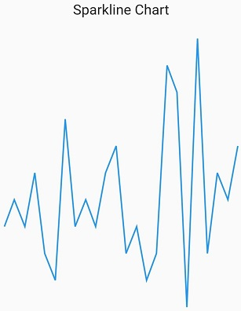
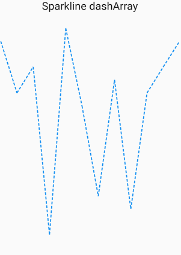
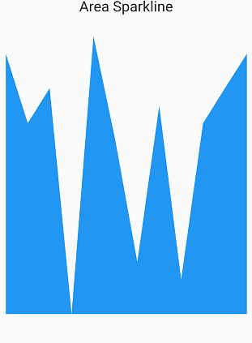
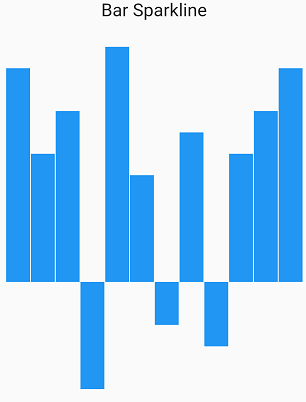
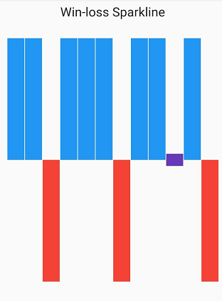

# Types in Flutter Sparkline Chart

## Line Sparkline chart

[`SfSparkLineChart`]() is used for identifying patterns and trends in the data such as seasonal effects, large changes and turning points over a period of time. 

The following properties are used to customize the appearance:

* [`color`]() - Specifies the spark line color.
* [`data`]()  - Create the spark line chart with custom data source.
* [`isInversed`]() - Specifies whether to inverse the spark line chart.
* [`highPointColor`]() - Specifies the high point color.
* [`lowPointColor`]() - Specifies the low point color.
* [`negativePointColor`]() - Specifies the negative point color.
* [`firstPointColor`]() - Specifies the first point color.
* [`lastPointColor`]() - Specifies the last point color.
* [`width`]() - Specifies the line series width.

 

    @override
    Widget build(BuildContext context) {
      return Scaffold(
        body: Center(
          child:  SfSparkLineChart(
                    highPointColor: Color.fromRGBO(20, 170, 33, 1),
            data: <double>[10,6,8,-5,11,5,-2,7,-3,6,8,10],
               )
             )
           );
         }

    class SalesData {
    SalesData(this.month, this.sales);
    final String month;
    final double sales;
    }



### Dashed line

The [`dashArray`]() property of [`SfSparkLineChart`]() is used to render line chart with dashes. Odd value is considered as rendering size and even value is considered as gap.

 

    @override
    Widget build(BuildContext context) {
      return Scaffold(
        body: Center(
          child:  SfSparkLineChart(
            data: <double>[10,6,8,-5,11,5,-2,7,-3,6,8,10],
            dashArray: <double>[2,2],
               )
             )
           );
         }

    class SalesData {
    SalesData(this.month, this.sales);
    final String month;
    final double sales;
    }



## Area Sparkline chart

[`SfSparkAreaChart`]() is used to emphasize a change in values. This is primarily used when the magnitude of the trend is to be communicated rather than individual data values.

The following properties are used to customize the appearance:

* [`color`]() - Specifies the spark line color.
* [`data`]()  - Create the spark line chart with custom data source.
* [`isInversed`]() - Specifies whether to inverse the spark line chart.
* [`highPointColor`]() - Specifies the high point color.
* [`lowPointColor`]() - Specifies the low point color.
* [`negativePointColor`]() - Specifies the negative point color.
* [`firstPointColor`]() - Specifies the first point color.
* [`lastPointColor`]() - Specifies the last point color.
* [`width`]() - Specifies the line series width.
* [`borderWidth`]() – Changes the stroke width of the series.
* [`borderColor`]() – Changes the stroke color of the series.

 

    @override
    Widget build(BuildContext context) {
      return Scaffold(
        body: Center(
          child:  SfSparkAreaChart(
            data: <double>[10,6,8,-5,11,5,-2,7,-3,6,8,10],
               )
             )
           );
         }

    class SalesData {
    SalesData(this.month, this.sales);
    final String month;
    final double sales;
    }



## Bar Sparkline chart

[`SfSparkBarChart`]() is used to render the sparkline series as Bar.The following properties are used to customize the appearance:

* [`color`]() - Specifies the spark line color.
* [`data`]()  - Create the spark line chart with custom data source.
* [`isInversed`]() - Specifies whether to inverse the spark line chart.
* [`highPointColor`]() - Specifies the high point color.
* [`lowPointColor`]() - Specifies the low point color.
* [`negativePointColor`]() - Specifies the negative point color.
* [`firstPointColor`]() - Specifies the first point color.
* [`lastPointColor`]() - Specifies the last point color.
* [`width`]() - Specifies the line series width.
* [`borderWidth`]() – Changes the stroke width of the series.
* [`borderColor`]() – Changes the stroke color of the series.

 

    @override
    Widget build(BuildContext context) {
      return Scaffold(
        body: Center(
          child:  SfSparkBarChart(
            data: <double>[10,6,8,-5,11,5,-2,7,-3,6,8,10],
               )
             )
           );
         }

    class SalesData {
    SalesData(this.month, this.sales);
    final String month;
    final double sales;
    }



## WinLoss Sparkline chart

[`SfSparkWinLossChart`]() is used to show whether each value is positive or negative visualizing a Win/Loss scenario. 

The following properties are used to customize the appearance:

* [`color`]() - Specifies the spark line color.
* [`data`]()  - Create the spark line chart with custom data source.
* [`isInversed`]() - Specifies whether to inverse the spark line chart.
* [`highPointColor`]() - Specifies the high point color.
* [`lowPointColor`]() - Specifies the low point color.
* [`negativePointColor`]() - Specifies the negative point color.
* [`firstPointColor`]() - Specifies the first point color.
* [`lastPointColor`]() - Specifies the last point color.
* [`width`]() - Specifies the line series width.
* [`borderWidth`]() – Changes the stroke width of the series.
* [`borderColor`]() – Changes the stroke color of the series.
* [`tiePointColor`]() - Specifies the spark win loss chart tie point color.

 

    @override
    Widget build(BuildContext context) {
      return Scaffold(
        body: Center(
          child:  SfSparkWinLossChart(
            data: <double>[10,6,8,-5,11,5,-2,7,-3,6,8,10],
               )
             )
           );
         }

    class SalesData {
    SalesData(this.month, this.sales);
    final String month;
    final double sales;
    }



