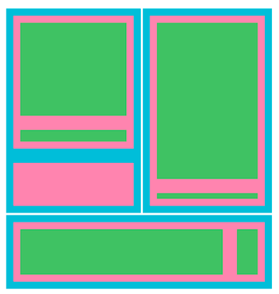
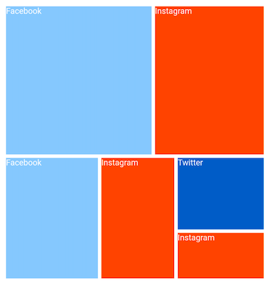
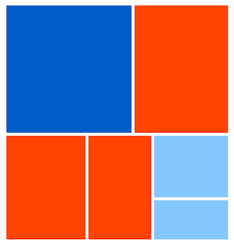

# Colors Customization in Flutter Treemap (SfTreemap)

This section explains about the customization of color for the tiles based on specific value or range of values.

## Level color

You can apply uniform color to the whole level using the [`TreemapLevel.color`](https://pub.dev/documentation/syncfusion_flutter_treemap/latest/treemap/TreemapLevel/color.html) property.




  late List<JobVacancyModel> _source;

  @override
  void initState() {
    _source = <JobVacancyModel>[
        JobVacancyModel(country: 'America', job: 'Sales', vacancy: 70),
        JobVacancyModel(
            country: 'America', job: 'Technical', group: 'Testers', vacancy: 35),
        JobVacancyModel(
            country: 'America',
            job: 'Technical',
            group: 'Developers',
            role: 'Windows',
            vacancy: 105),
        JobVacancyModel(
            country: 'America',
            job: 'Technical',
            group: 'Developers',
            role: 'Web',
            vacancy: 40),
        JobVacancyModel(
            country: 'India', job: 'Technical', group: 'Testers', vacancy: 25),
        JobVacancyModel(
            country: 'India',
            job: 'Technical',
            group: 'Developers',
            role: 'Windows',
            vacancy: 155),
        JobVacancyModel(
            country: 'India',
            job: 'Technical',
            group: 'Developers',
            role: 'Web',
            vacancy: 60),
        JobVacancyModel(
            country: 'Germany', job: 'Technical', group: 'Testers', vacancy: 25),
        JobVacancyModel(
            country: 'Germany',
            job: 'Technical',
            group: 'Developers',
            role: 'Windows',
            vacancy: 155),
    ];
    super.initState();
  }

  @override
    Widget build(BuildContext context) {
      return Scaffold(
        body: SfTreemap(
            dataCount: _source.length,
            weightValueMapper: (int index) {
              return _source[index].vacancy;
            },
            levels: [
              TreemapLevel(
                groupMapper: (int index) => _source[index].country,
                color: Colors.cyan,
                padding: EdgeInsets.all(1.5),
              ),
              TreemapLevel(
                groupMapper: (int index) => _source[index].job,
                color: Colors.pink[200],
                padding: EdgeInsets.all(10),
              ),
              TreemapLevel(
                groupMapper: (int index) => _source[index].group,
                color: Colors.green[400],
                padding: EdgeInsets.all(10),
              ),
            ],
        ),
    );
  }

class JobVacancyModel {
  const JobVacancyModel(
      {required this.country,
      required this.job,
      this.group,
      this.role,
      required this.vacancy});
  final String country;
  final String job;
  final String? group;
  final String? role;
  final double vacancy;
}




N>
* Refer to the [`TreemapColorMapper.value`](https://pub.dev/documentation/syncfusion_flutter_treemap/latest/treemap/TreemapColorMapper/TreemapColorMapper.value.html), for applying tile color based on a specific value.
* Refer to the [`TreemapColorMapper.range`](https://pub.dev/documentation/syncfusion_flutter_treemap/latest/treemap/TreemapColorMapper/TreemapColorMapper.range.html), for applying tile color based on a range of values.

## Equal color mapping

If you return a value of different type other than the color from the [`TreemapLevel.colorValueMapper`](https://pub.dev/documentation/syncfusion_flutter_treemap/latest/treemap/TreemapLevel/colorValueMapper.html), then you must set the [`colorMappers`](https://pub.dev/documentation/syncfusion_flutter_treemap/latest/treemap/SfTreemap/colorMappers.html) property which is a collection of [`TreemapColorMapper`](https://pub.dev/documentation/syncfusion_flutter_treemap/latest/treemap/TreemapColorMapper-class.html).

The value returned from the [`TreemapLevel.colorValueMapper`](https://pub.dev/documentation/syncfusion_flutter_treemap/latest/treemap/TreemapLevel/colorValueMapper.html) callback will be used for the comparison in the [`TreemapColorMapper.value`](https://pub.dev/documentation/syncfusion_flutter_treemap/latest/treemap/TreemapColorMapper/TreemapColorMapper.value.html). For the matched values, the [`TreemapColorMapper.color`](https://pub.dev/documentation/syncfusion_flutter_treemap/latest/treemap/TreemapColorMapper/color.html) will be applied to the respective tiles.

N> You can customize the legend icons color and texts using the [`TreemapColorMapper.color`](https://pub.dev/documentation/syncfusion_flutter_treemap/latest/treemap/TreemapColorMapper/color.html) and the [`TreemapColorMapper.value`](https://pub.dev/documentation/syncfusion_flutter_treemap/latest/treemap/TreemapColorMapper/TreemapColorMapper.value.html) properties respectively.




  late List<SocialMediaUsers> _source;
  late List<TreemapColorMapper> _colorMappers;

  @override
  void initState() {
    _source = <SocialMediaUsers>[
        SocialMediaUsers('India', 'Facebook', 25.4),
        SocialMediaUsers('USA', 'Instagram', 19.11),
        SocialMediaUsers('Japan', 'Facebook', 13.3),
        SocialMediaUsers('Germany', 'Instagram', 10.65),
        SocialMediaUsers('France', 'Twitter', 7.54),
        SocialMediaUsers('UK', 'Instagram', 4.93),
    ];

    _colorMappers = <TreemapColorMapper>[
        TreemapColorMapper.value(value: 'Facebook', color: Colors.blue[200]!),
        TreemapColorMapper.value(value: 'Instagram', color: Colors.deepOrange),
        TreemapColorMapper.value(value: 'Twitter', color: Colors.blue[800]!),
      ];
    super.initState();
  }

  @override
  Widget build(BuildContext context) {
    return Scaffold(
      body: SfTreemap(
          dataCount: _source.length,
          weightValueMapper: (int index) {
            return _source[index].usersInMillions;
          },
          levels: [
            TreemapLevel(
              padding: const EdgeInsets.all(2.5),
              groupMapper: (int index) {
                return _source[index].country;
              },
              labelBuilder: (BuildContext context, TreemapTile tile) {
                return Text(_source[tile.indices[0]].socialMedia);
              },
              colorValueMapper: (TreemapTile tile) {
                return _source[tile.indices[0]].socialMedia;
              },
            ),
          ],
          colorMappers: _colorMappers,
        ),
    );
  }

class SocialMediaUsers {
  const SocialMediaUsers(this.country, this.socialMedia, this.usersInMillions);

  final String country;
  final String socialMedia;
  final double usersInMillions;
}




N>
* Refer the [`TreemapColorMapper.range`](https://pub.dev/documentation/syncfusion_flutter_treemap/latest/treemap/TreemapColorMapper/TreemapColorMapper.range.html), for applying color based on range of values.

## Range color mapping

If you return a range value in the [`TreemapLevel.colorValueMapper`](https://pub.dev/documentation/syncfusion_flutter_treemap/latest/treemap/TreemapLevel/colorValueMapper.html), then you must set the [`colorMappers`](https://pub.dev/documentation/syncfusion_flutter_treemap/latest/treemap/SfTreemap/colorMappers.html) property.

The value returned from the [`TreemapLevel.colorValueMapper`](https://pub.dev/documentation/syncfusion_flutter_treemap/latest/treemap/TreemapLevel/colorValueMapper.html) callback will be checked whether it lies in the [`TreemapColorMapper.from`](https://pub.dev/documentation/syncfusion_flutter_treemap/latest/treemap/TreemapColorMapper/from.html) and [`TreemapColorMapper.to`](https://pub.dev/documentation/syncfusion_flutter_treemap/latest/treemap/TreemapColorMapper/to.html) range. For the matched values, the [`TreemapColorMapper.color`](https://pub.dev/documentation/syncfusion_flutter_treemap/latest/treemap/TreemapColorMapper/color.html) will be applied to the respective tiles.

* **MinSaturation and MaxSaturation** - The tiles with the lowest value which is [`from`](https://pub.dev/documentation/syncfusion_flutter_treemap/latest/treemap/TreemapColorMapper/from.html) will be applied a [`minSaturation`](https://pub.dev/documentation/syncfusion_flutter_treemap/latest/treemap/TreemapColorMapper/minSaturation.html) and the tiles with the highest value which is [`to`](https://pub.dev/documentation/syncfusion_flutter_treemap/latest/treemap/TreemapColorMapper/to.html) will be applied a [`maxSaturation`](https://pub.dev/documentation/syncfusion_flutter_treemap/latest/treemap/TreemapColorMapper/maxSaturation.html). The tiles with values in-between the range will get a saturation based on their respective value.

N> Customize the legend icons color and texts using the [`TreemapColorMapper.color`](https://pub.dev/documentation/syncfusion_flutter_treemap/latest/treemap/TreemapColorMapper/color.html) and the [`TreemapColorMapper.from`](https://pub.dev/documentation/syncfusion_flutter_treemap/latest/treemap/TreemapColorMapper/from.html) and [`TreemapColorMapper.to`](https://pub.dev/documentation/syncfusion_flutter_treemap/latest/treemap/TreemapColorMapper/to.html) properties.




  late List<SocialMediaUsers> _source;
  late List<TreemapColorMapper> _colorMappers;

  @override
  void initState() {
    _source = <SocialMediaUsers>[
        SocialMediaUsers('India', 'Facebook', 25.4),
        SocialMediaUsers('USA', 'Instagram', 19.11),
        SocialMediaUsers('Japan', 'Facebook', 13.3),
        SocialMediaUsers('Germany', 'Instagram', 10.65),
        SocialMediaUsers('France', 'Twitter', 7.54),
        SocialMediaUsers('UK', 'Instagram', 4.93),
    ];

    _colorMappers = <TreemapColorMapper>[
        TreemapColorMapper.range(
            from: 0,
            to: 10,
            minSaturation: 0.5,
            maxSaturation: 1,
            color: Colors.blue[200]!),
        TreemapColorMapper.range(
            from: 10,
            to: 20,
            minSaturation: 0.5,
            maxSaturation: 1,
            color: Colors.deepOrange),
        TreemapColorMapper.range(
            from: 20,
            to: 30,
            minSaturation: 0.5,
            maxSaturation: 1,
            color: Colors.blue[800]!),
    ];
    super.initState();
  }

  @override
  Widget build(BuildContext context) {
    return Scaffold(
        body: Center(
          child: Container(
            height: 400,
            width: 400,
            child: SfTreemap(
              dataCount: _source.length,
              weightValueMapper: (int index) {
                return _source[index].usersInMillions;
              },
              levels: [
                TreemapLevel(
                  groupMapper: (int index) {
                    return _source[index].country;
                  },
                  colorValueMapper: (TreemapTile tile) {
                    return tile.weight;
                  },
                ),
              ],
              colorMappers: _colorMappers,
            ),
          ),
        ),
    );
  }

class SocialMediaUsers {
  SocialMediaUsers(this.country, this.socialMedia, this.usersInMillions);

  final String country;
  final String socialMedia;
  final double usersInMillions;
}




N>
* Refer the [`TreemapColorMapper.value`](https://pub.dev/documentation/syncfusion_flutter_treemap/latest/treemap/TreemapColorMapper/TreemapColorMapper.value.html), for applying color to the tiles based on the specific value.
