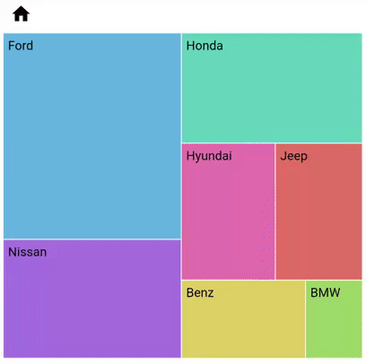

# Drilldown in Flutter Treemap (SfTreemap)

The drilldown feature provides better visualization of larger set of hierarchical level data.

To learn more about how to deep dive into the drill down feature in Flutter Treemap, you can watch this video.

<iframe id='flutterTreemapVideoTutorial' src='https://www.youtube.com/embed/tLAPEDlhfS4'></iframe>

## Enable drilldown

You can drill down the tiles by setting the [`enableDrilldown`](https://pub.dev/documentation/syncfusion_flutter_treemap/latest/treemap/SfTreemap/enableDrilldown.html) property to `true`. In the UI, you can only see one level tiles at a time. When you tap a tile, it expands to the size of the viewport and loads its descendant tiles with smoother animation.

The widget returned by the [`TreemapBreadcrumbs.builder`](https://pub.dev/documentation/syncfusion_flutter_treemap/latest/treemap/TreemapBreadcrumbs/builder.html) will be added to the breadcrumbs item. While drilling down the tiles, it is called with the tapped tile details.

Selection for touch and mouse enabled devices, and tooltip for touch devices will work only for the tiles which don’t have descendants.




  late List<CarSale> _source;
  late Map<String, Color> _colors;

  @override
  void initState() {
    _source = <CarSale>[
        CarSale(carName: 'Hyundai', model: 'Elantra', totalScale: 198210),
        CarSale(carName: 'Hyundai', model: 'Sonata', totalScale: 131803),
        CarSale(carName: 'Hyundai', model: 'Tucson', totalScale: 114735),
        CarSale(carName: 'Hyundai', model: 'Santa Fe', totalScale: 133171),
        CarSale(carName: 'Hyundai', model: 'Accent', totalScale: 58955),
        CarSale(carName: 'Hyundai', model: 'Veloster', totalScale: 12658),
        CarSale(carName: 'Hyundai', model: 'loniq', totalScale: 11197),
        CarSale(carName: 'Hyundai', model: 'Azera', totalScale: 3060),
        CarSale(carName: 'Hyundai', model: 'Elantra', totalScale: 198210),
        CarSale(carName: 'Benz', model: 'C-Class', totalScale: 77447),
        CarSale(carName: 'Benz', model: 'GLE-Class', totalScale: 54595),
        CarSale(carName: 'Benz', model: 'E/ CLS-CLass', totalScale: 51312),
        CarSale(carName: 'Benz', model: 'GLC-Class', totalScale: 48643),
        CarSale(carName: 'Benz', model: 'GLS-Class', totalScale: 322548),
        CarSale(carName: 'Benz', model: 'Sprinter', totalScale: 27415),
        CarSale(carName: 'Benz', model: 'CLA-Class', totalScale: 20669),
        CarSale(carName: 'Benz', model: 'GLA-Class', totalScale: 24104),
        CarSale(carName: 'Benz', model: 'S-Class', totalScale: 15888),
        CarSale(carName: 'Benz', model: 'Metris', totalScale: 7579),
        CarSale(carName: 'BMW', model: '3-Series', totalScale: 59449),
        CarSale(carName: 'BMW', model: 'X5', totalScale: 50815),
        CarSale(carName: 'BMW', model: 'X3', totalScale: 40691),
        CarSale(carName: 'BMW', model: '5-Series', totalScale: 40658),
        CarSale(carName: 'BMW', model: '4-Series', totalScale: 39634),
        CarSale(carName: 'BMW', model: '2-Series', totalScale: 11737),
        CarSale(carName: 'BMW', model: '7-Series', totalScale: 9276),
        CarSale(carName: 'BMW', model: 'X1', totalScale: 30826),
        CarSale(carName: 'BMW', model: 'X6', totalScale: 6780),
        CarSale(carName: 'BMW', model: 'X4', totalScale: 5198),
        CarSale(carName: 'BMW', model: '6-Series', totalScale: 3355),
        CarSale(carName: 'Jeep', model: 'Grand cherokee', totalScale: 240696),
        CarSale(carName: 'Jeep', model: 'Cherokee', totalScale: 169822),
        CarSale(carName: 'Jeep', model: 'Renegada', totalScale: 103434),
        CarSale(carName: 'Jeep', model: 'Wrangler', totalScale: 190522),
        CarSale(carName: 'Jeep', model: 'Compass', totalScale: 83523),
        CarSale(carName: 'Jeep', model: 'Patriot', totalScale: 10735),
        CarSale(carName: 'Nissan', model: 'Rogue', totalScale: 403465),
        CarSale(carName: 'Nissan', model: 'Sentra', totalScale: 218451),
        CarSale(carName: 'Nissan', model: 'Murano', totalScale: 76732),
        CarSale(carName: 'Nissan', model: 'Frontier', totalScale: 74360),
        CarSale(carName: 'Nissan', model: 'Altima', totalScale: 254996),
        CarSale(carName: 'Nissan', model: 'Versa', totalScale: 106772),
        CarSale(carName: 'Nissan', model: 'Pathfinder', totalScale: 81065),
        CarSale(carName: 'Nissan', model: 'Maxima', totalScale: 67627),
        CarSale(carName: 'Nissan', model: 'Titan', totalScale: 52924),
        CarSale(carName: 'Nissan', model: 'Armada', totalScale: 35667),
        CarSale(carName: 'Nissan', model: 'NV', totalScale: 17858),
        CarSale(carName: 'Nissan', model: 'NV200', totalScale: 18602),
        CarSale(carName: 'Nissan', model: 'Duke', totalScale: 10157),
        CarSale(carName: 'Honda', model: 'Rogue', totalScale: 403465),
        CarSale(carName: 'Honda', model: 'Sentra', totalScale: 218451),
        CarSale(carName: 'Honda', model: 'Murano', totalScale: 76732),
        CarSale(carName: 'Honda', model: 'Frontier', totalScale: 74360),
        CarSale(carName: 'Honda', model: 'Altima', totalScale: 254996),
        CarSale(carName: 'Honda', model: 'Versa', totalScale: 106772),
        CarSale(carName: 'Honda', model: 'Maxima', totalScale: 67627),
        CarSale(carName: 'Honda', model: 'Titan', totalScale: 52924),
        CarSale(carName: 'Honda', model: 'Armada', totalScale: 35667),
        CarSale(carName: 'Honda', model: 'NV', totalScale: 17858),
        CarSale(carName: 'Honda', model: 'NV200', totalScale: 18602),
        CarSale(carName: 'Honda', model: 'Duke', totalScale: 10157),
        CarSale(carName: 'Ford', model: 'F-series', totalScale: 896764),
        CarSale(carName: 'Ford', model: 'Explorer', totalScale: 271134),
        CarSale(carName: 'Ford', model: 'Fusion', totalScale: 209623),
        CarSale(carName: 'Ford', model: 'Focus', totalScale: 158385),
        CarSale(carName: 'Ford', model: 'Edge', totalScale: 142603),
        CarSale(carName: 'Ford', model: 'Transit', totalScale: 127340),
        CarSale(carName: 'Ford', model: 'Mustang', totalScale: 81866),
        CarSale(carName: 'Ford', model: 'Escape', totalScale: 308286),
        CarSale(carName: 'Ford', model: 'E-series', totalScale: 53304),
        CarSale(carName: 'Ford', model: 'Expedition', totalScale: 51833),
        CarSale(carName: 'Ford', model: 'Fiesta', totalScale: 46249),
        CarSale(carName: 'Ford', model: 'Taurus', totalScale: 41326),
        CarSale(carName: 'Ford', model: 'Flex', totalScale: 22389),
        CarSale(carName: 'Ford', model: 'Transit connect', totalScale: 34473),
        CarSale(carName: 'Ford', model: 'Transit', totalScale: 18390),
    ];
    _colors = <String, Color>{
        'Hyundai': const Color.fromRGBO(220, 103, 171, 1.0),
        'BMW': const Color.fromRGBO(160, 220, 103, 1.0),
        'Benz': const Color.fromRGBO(220, 210, 103, 1.0),
        'Nissan': const Color.fromRGBO(163, 103, 220, 1.0),
        'Jeep': const Color.fromRGBO(220, 105, 103, 1.0),
        'Ford': const Color.fromRGBO(103, 183, 220, 1.0),
        'Honda': const Color.fromRGBO(103, 220, 187, 1.0),
    };
    super.initState();
  }

  @override
  void dispose() {
    _source.clear();
    super.dispose();
  }

  @override
  Widget build(BuildContext context) {
    return Scaffold(
        body: Center(
          child: Container(
            height: 400,
            width: 400,
            child: SfTreemap(
              dataCount: _source.length,
              weightValueMapper: (int index) {
                return _source[index].totalScale!;
              },
              enableDrilldown: true,
              breadcrumbs: TreemapBreadcrumbs(
                builder:
                    (BuildContext context, TreemapTile tile, bool isCurrent) {
                  return Text(tile.group, style: TextStyle(color: Colors.black));
                },
              ),
              levels: [
                TreemapLevel(
                  groupMapper: (int index) => _source[index].carName,
                  labelBuilder: (BuildContext context, TreemapTile tile) {
                    return Padding(
                      padding: const EdgeInsets.only(left: 5.0, top: 5.0),
                      child: Text(
                        tile.group,
                        style: TextStyle(color: Colors.black),
                        overflow: TextOverflow.ellipsis,
                      ),
                    );
                  },
                  colorValueMapper: (TreemapTile tile) {
                    return _colors[_source[tile.indices[0]].carName];
                  },
                ),
                TreemapLevel(
                  groupMapper: (int index) {
                    return _source[index].model;
                  },
                  colorValueMapper: (TreemapTile tile) {
                    return _colors[_source[tile.indices[0]].carName];
                  },
                  labelBuilder: (BuildContext context, TreemapTile tile) {
                    return Padding(
                      padding: const EdgeInsets.only(left: 5.0, top: 5.0),
                      child: Text(
                        tile.group,
                        style: TextStyle(color: Colors.black),
                        overflow: TextOverflow.ellipsis,
                      ),
                    );
                  },
                ),
              ],
            ),
          ),
        ),
    );
  }

class CarSale {
  const CarSale(
        {required this.carName,
        this.model,
        this.version,
        this.versionNumber,
        this.totalScale});
  final String carName;
  final String? model;
  final String? version;
  final String? versionNumber;
  final double? totalScale;
}




## Breadcrumb customization

The breadcrumb is used to display information about the drilled item and provides option to navigate back to previous level. You can customize the breadcrumb items using the following properties:

* **Position** - Positions the breadcrumbs either top or bottom of the treemap. The default value of the [`position`](https://pub.dev/documentation/syncfusion_flutter_treemap/latest/treemap/TreemapBreadcrumbs/position.html) is [` TreemapBreadcrumbPosition.top`](https://pub.dev/documentation/syncfusion_flutter_treemap/latest/treemap/TreemapBreadcrumbPosition.html#top).
* **Divider** - Used to add a separator between two breadcrumbs.




  late List<CarSale> _source;
  late Map<String, Color> _colors;

  @override
  void initState() {
    _source = <CarSale>[
        CarSale(carName: 'Hyundai', model: 'Elantra', totalScale: 198210),
        CarSale(carName: 'Hyundai', model: 'Sonata', totalScale: 131803),
        CarSale(carName: 'Hyundai', model: 'Tucson', totalScale: 114735),
        CarSale(carName: 'Hyundai', model: 'Santa Fe', totalScale: 133171),
        CarSale(carName: 'Hyundai', model: 'Accent', totalScale: 58955),
        CarSale(carName: 'Hyundai', model: 'Veloster', totalScale: 12658),
        CarSale(carName: 'Hyundai', model: 'loniq', totalScale: 11197),
        CarSale(carName: 'Hyundai', model: 'Azera', totalScale: 3060),
        CarSale(carName: 'Hyundai', model: 'Elantra', totalScale: 198210),
        CarSale(carName: 'Benz', model: 'C-Class', totalScale: 77447),
        CarSale(carName: 'Benz', model: 'GLE-Class', totalScale: 54595),
        CarSale(carName: 'Benz', model: 'E/ CLS-CLass', totalScale: 51312),
        CarSale(carName: 'Benz', model: 'GLC-Class', totalScale: 48643),
        CarSale(carName: 'Benz', model: 'GLS-Class', totalScale: 322548),
        CarSale(carName: 'Benz', model: 'Sprinter', totalScale: 27415),
        CarSale(carName: 'Benz', model: 'CLA-Class', totalScale: 20669),
        CarSale(carName: 'Benz', model: 'GLA-Class', totalScale: 24104),
        CarSale(carName: 'Benz', model: 'S-Class', totalScale: 15888),
        CarSale(carName: 'Benz', model: 'Metris', totalScale: 7579),
        CarSale(carName: 'BMW', model: '3-Series', totalScale: 59449),
        CarSale(carName: 'BMW', model: 'X5', totalScale: 50815),
        CarSale(carName: 'BMW', model: 'X3', totalScale: 40691),
        CarSale(carName: 'BMW', model: '5-Series', totalScale: 40658),
        CarSale(carName: 'BMW', model: '4-Series', totalScale: 39634),
        CarSale(carName: 'BMW', model: '2-Series', totalScale: 11737),
        CarSale(carName: 'BMW', model: '7-Series', totalScale: 9276),
        CarSale(carName: 'BMW', model: 'X1', totalScale: 30826),
        CarSale(carName: 'BMW', model: 'X6', totalScale: 6780),
        CarSale(carName: 'BMW', model: 'X4', totalScale: 5198),
        CarSale(carName: 'BMW', model: '6-Series', totalScale: 3355),
        CarSale(carName: 'Jeep', model: 'Grand cherokee', totalScale: 240696),
        CarSale(carName: 'Jeep', model: 'Cherokee', totalScale: 169822),
        CarSale(carName: 'Jeep', model: 'Renegada', totalScale: 103434),
        CarSale(carName: 'Jeep', model: 'Wrangler', totalScale: 190522),
        CarSale(carName: 'Jeep', model: 'Compass', totalScale: 83523),
        CarSale(carName: 'Jeep', model: 'Patriot', totalScale: 10735),
        CarSale(carName: 'Nissan', model: 'Rogue', totalScale: 403465),
        CarSale(carName: 'Nissan', model: 'Sentra', totalScale: 218451),
        CarSale(carName: 'Nissan', model: 'Murano', totalScale: 76732),
        CarSale(carName: 'Nissan', model: 'Frontier', totalScale: 74360),
        CarSale(carName: 'Nissan', model: 'Altima', totalScale: 254996),
        CarSale(carName: 'Nissan', model: 'Versa', totalScale: 106772),
        CarSale(carName: 'Nissan', model: 'Pathfinder', totalScale: 81065),
        CarSale(carName: 'Nissan', model: 'Maxima', totalScale: 67627),
        CarSale(carName: 'Nissan', model: 'Titan', totalScale: 52924),
        CarSale(carName: 'Nissan', model: 'Armada', totalScale: 35667),
        CarSale(carName: 'Nissan', model: 'NV', totalScale: 17858),
        CarSale(carName: 'Nissan', model: 'NV200', totalScale: 18602),
        CarSale(carName: 'Nissan', model: 'Duke', totalScale: 10157),
        CarSale(carName: 'Honda', model: 'Rogue', totalScale: 403465),
        CarSale(carName: 'Honda', model: 'Sentra', totalScale: 218451),
        CarSale(carName: 'Honda', model: 'Murano', totalScale: 76732),
        CarSale(carName: 'Honda', model: 'Frontier', totalScale: 74360),
        CarSale(carName: 'Honda', model: 'Altima', totalScale: 254996),
        CarSale(carName: 'Honda', model: 'Versa', totalScale: 106772),
        CarSale(carName: 'Honda', model: 'Maxima', totalScale: 67627),
        CarSale(carName: 'Honda', model: 'Titan', totalScale: 52924),
        CarSale(carName: 'Honda', model: 'Armada', totalScale: 35667),
        CarSale(carName: 'Honda', model: 'NV', totalScale: 17858),
        CarSale(carName: 'Honda', model: 'NV200', totalScale: 18602),
        CarSale(carName: 'Honda', model: 'Duke', totalScale: 10157),
        CarSale(carName: 'Ford', model: 'F-series', totalScale: 896764),
        CarSale(carName: 'Ford', model: 'Explorer', totalScale: 271134),
        CarSale(carName: 'Ford', model: 'Fusion', totalScale: 209623),
        CarSale(carName: 'Ford', model: 'Focus', totalScale: 158385),
        CarSale(carName: 'Ford', model: 'Edge', totalScale: 142603),
        CarSale(carName: 'Ford', model: 'Transit', totalScale: 127340),
        CarSale(carName: 'Ford', model: 'Mustang', totalScale: 81866),
        CarSale(carName: 'Ford', model: 'Escape', totalScale: 308286),
        CarSale(carName: 'Ford', model: 'E-series', totalScale: 53304),
        CarSale(carName: 'Ford', model: 'Expedition', totalScale: 51833),
        CarSale(carName: 'Ford', model: 'Fiesta', totalScale: 46249),
        CarSale(carName: 'Ford', model: 'Taurus', totalScale: 41326),
        CarSale(carName: 'Ford', model: 'Flex', totalScale: 22389),
        CarSale(carName: 'Ford', model: 'Transit connect', totalScale: 34473),
        CarSale(carName: 'Ford', model: 'Transit', totalScale: 18390),
    ];
    _colors = <String, Color>{
        'Hyundai': const Color.fromRGBO(220, 103, 171, 1.0),
        'BMW': const Color.fromRGBO(160, 220, 103, 1.0),
        'Benz': const Color.fromRGBO(220, 210, 103, 1.0),
        'Nissan': const Color.fromRGBO(163, 103, 220, 1.0),
        'Jeep': const Color.fromRGBO(220, 105, 103, 1.0),
        'Ford': const Color.fromRGBO(103, 183, 220, 1.0),
        'Honda': const Color.fromRGBO(103, 220, 187, 1.0),
    };
    super.initState();
  }

  @override
  void dispose() {
    _source.clear();
    super.dispose();
  }

  @override
  Widget build(BuildContext context) {
    return Scaffold(
        body: Center(
          child: Container(
            height: 400,
            width: 400,
            child: SfTreemap(
              dataCount: _source.length,
              weightValueMapper: (int index) {
                return _source[index].totalScale!;
              },
              enableDrilldown: true,
              breadcrumbs: TreemapBreadcrumbs(
                builder:
                    (BuildContext context, TreemapTile tile, bool isCurrent) {
                  if (tile.group == 'Home') {
                    return Icon(Icons.home, color: Colors.black);
                  } else {
                    return Text(tile.group,
                        style: TextStyle(color: Colors.black));
                  }
                },
                divider: Icon(Icons.chevron_right, color: Colors.black),
                position: TreemapBreadcrumbPosition.top,
              ),
              levels: [
                TreemapLevel(
                  groupMapper: (int index) => _source[index].carName,
                  labelBuilder: (BuildContext context, TreemapTile tile) {
                    return Padding(
                      padding: const EdgeInsets.only(left: 5.0, top: 5.0),
                      child: Text(
                        tile.group,
                        style: TextStyle(color: Colors.black),
                        overflow: TextOverflow.ellipsis,
                      ),
                    );
                  },
                  colorValueMapper: (TreemapTile tile) {
                    return _colors[_source[tile.indices[0]].carName];
                  },
                ),
                TreemapLevel(
                  groupMapper: (int index) {
                    return _source[index].model;
                  },
                  colorValueMapper: (TreemapTile tile) {
                    return _colors[_source[tile.indices[0]].carName];
                  },
                  labelBuilder: (BuildContext context, TreemapTile tile) {
                    return Padding(
                      padding: const EdgeInsets.only(left: 5.0, top: 5.0),
                      child: Text(
                        tile.group,
                        style: TextStyle(color: Colors.black),
                        overflow: TextOverflow.ellipsis,
                      ),
                    );
                  },
                ),
              ],
            ),
          ),
        ),
    );
  }

class CarSale {
  const CarSale(
        {required this.carName,
        this.model,
        this.version,
        this.versionNumber,
        this.totalScale});
    final String carName;
    final String? model;
    final String? version;
    final String? versionNumber;
    final double? totalScale;
}




