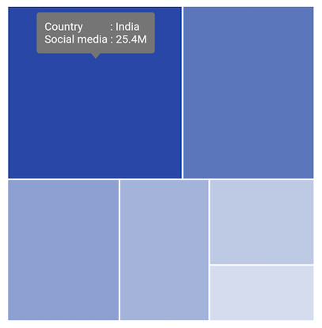
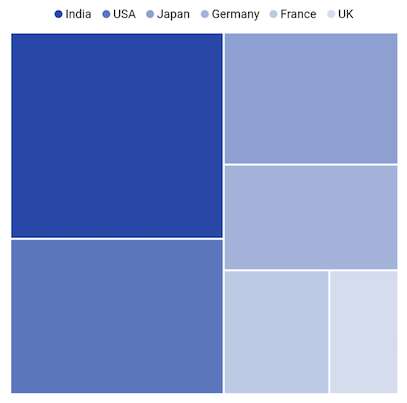

# Getting Started with Flutter Treemap (SfTreemap)

This section explains the steps required to add the treemap widget and enable its features such as labels, tooltip, assigning colors based on region, and legends. This section covers only basic features needed to know to get started with Syncfusion treemap.

## Add Flutter treemap to an application

Create a simple project using the instructions given in the [Getting Started with your first Flutter app](https://flutter.dev/docs/get-started/test-drive?tab=vscode#create-app) documentation.

**Add dependency**

Add the Syncfusion Flutter Treemap dependency to your pubspec.yaml file.



dependencies:

syncfusion_flutter_treemap: ^xx.x.xx



N> Here **xx.x.xx** denotes the current version of [`Syncfusion Flutter Treemap`](https://pub.dev/packages/syncfusion_flutter_treemap/versions) package.

**Get packages**

Run the following command to get the required packages.



$ flutter pub get



**Import package**

Import the following package in your Dart code.




import 'package:syncfusion_flutter_treemap/treemap.dart';




## Initialize treemap and populate data source

After importing the package, initialize the treemap widget as a child of any widget.

To populate the data source, set its count to the `dataCount` property of the treemap. The data will be grouped based on the values returned from the `TreemapLevel.groupMapper` callback. You can have more than one TreemapLevel in the `levels` collection to form a hierarchical treemap. The quantitative value of the underlying data has to be returned from the `weightValueMapper` callback. Based on this value, every tile (rectangle) will have its size.




late List<SocialMediaUsers> _source;

@override
void initState() {
   _source = <SocialMediaUsers>[
      SocialMediaUsers(
          country: 'India', socialMedia: 'Facebook', usersInMillions: 25.4),
      SocialMediaUsers(
          country: 'USA', socialMedia: 'Instagram', usersInMillions: 19.11),
      SocialMediaUsers(
          country: 'Japan', socialMedia: 'Facebook', usersInMillions: 13.3),
      SocialMediaUsers(
          country: 'Germany', socialMedia: 'Instagram', usersInMillions: 10.65),
      SocialMediaUsers(
          country: 'France', socialMedia: 'Twitter', usersInMillions: 7.54),
      SocialMediaUsers(
          country: 'UK', socialMedia: 'Instagram', usersInMillions: 4.93),
   ];
   super.initState();
}

@override
Widget build(BuildContext context) {
  return Scaffold(
     body: Center(
        child: Padding(
          padding: EdgeInsets.all(10),
          child: SfTreemap(
            dataCount: _source.length,
            weightValueMapper: (int index) {
              return _source[index].usersInMillions;
            },
            levels: [
              TreemapLevel(
                groupMapper: (int index) {
                  return _source[index].country;
                },
              ),
            ],
          ),
        ),
      ),
   );
}

class SocialMediaUsers {
  const SocialMediaUsers({
    required this.country,
    required this.socialMedia,
    required this.usersInMillions,
  });

  final String country;
  final String socialMedia;
  final double usersInMillions;
}




N>
* Refer the [`SfTreemap.levels`], for adding flat or hierarchical structured treemap.
* Refer the [`SfTreemap.colorMappers`], for customizing the tiles color.

## Add labels

You can add any type of custom widgets to the tiles as labels based on the index using the `TreemapLevel.labelBuilder` property.




late List<SocialMediaUsers> _source;

@override
void initState() {
   _source = <SocialMediaUsers>[
      SocialMediaUsers(
          country: 'India', socialMedia: 'Facebook', usersInMillions: 25.4),
      SocialMediaUsers(
          country: 'USA', socialMedia: 'Instagram', usersInMillions: 19.11),
      SocialMediaUsers(
          country: 'Japan', socialMedia: 'Facebook', usersInMillions: 13.3),
      SocialMediaUsers(
          country: 'Germany', socialMedia: 'Instagram', usersInMillions: 10.65),
      SocialMediaUsers(
          country: 'France', socialMedia: 'Twitter', usersInMillions: 7.54),
      SocialMediaUsers(
          country: 'UK', socialMedia: 'Instagram', usersInMillions: 4.93),
   ];
   super.initState();
}

@override
Widget build(BuildContext context) {
  return Scaffold(
     body: Center(
        child: Padding(
          padding: EdgeInsets.all(10),
          child: SfTreemap(
            dataCount: _source.length,
            weightValueMapper: (int index) {
              return _source[index].usersInMillions;
            },
            levels: [
              TreemapLevel(
                groupMapper: (int index) {
                  return _source[index].country;
                },
                labelBuilder: (BuildContext context, TreemapTile tile) {
                  return Padding(
                    padding: EdgeInsets.only(left: 2.5, right: 2.4, top: 1),
                    child: Text(tile.group),
                  );
                },
              ),
            ],
          ),
        ),
      ),
   );
}

class SocialMediaUsers {
   const SocialMediaUsers({
     required this.country,
     required this.socialMedia,
     required this.usersInMillions,
   });

   final String country;
   final String socialMedia;
   final double usersInMillions;
}




## Add tooltip

You can enable tooltip for any tile in the treemap and able to return the completely customized widget using the `tooltipBuilder` property.




late List<SocialMediaUsers> _source;

@override
void initState() {
    _source = <SocialMediaUsers>[
      SocialMediaUsers(
          country: 'India', socialMedia: 'Facebook', usersInMillions: 25.4),
      SocialMediaUsers(
          country: 'USA', socialMedia: 'Instagram', usersInMillions: 19.11),
      SocialMediaUsers(
          country: 'Japan', socialMedia: 'Facebook', usersInMillions: 13.3),
      SocialMediaUsers(
          country: 'Germany', socialMedia: 'Instagram', usersInMillions: 10.65),
      SocialMediaUsers(
          country: 'France', socialMedia: 'Twitter', usersInMillions: 7.54),
      SocialMediaUsers(
          country: 'UK', socialMedia: 'Instagram', usersInMillions: 4.93),
    ];
    super.initState();
}

@override
Widget build(BuildContext context) {
  return Scaffold(
     body: Center(
        child: Padding(
          padding: EdgeInsets.all(10),
          child: SfTreemap(
            dataCount: _source.length,
            weightValueMapper: (int index) {
              return _source[index].usersInMillions;
            },
            tooltipSettings: TreemapTooltipSettings(color: Colors.black),
            levels: [
              TreemapLevel(
                groupMapper: (int index) {
                  return _source[index].country;
                },
                labelBuilder: (BuildContext context, TreemapTile tile) {
                  return Padding(
                    padding: EdgeInsets.only(left: 2.5, right: 2.4, top: 1),
                    child: Text(tile.group),
                  );
                },
                tooltipBuilder: (BuildContext context, TreemapTile tile) {
                  return Padding(
                    padding: const EdgeInsets.only(
                         left: 5, right: 5, top: 2, bottom: 3),
                    child: Text(
                        'Country          : ${tile.group}\nSocial media : ${tile.weight}M',
                        style: TextStyle(color: Colors.white)),
                  );
                },
              ),
            ],
          ),
        ),
      ),
   );
}

class SocialMediaUsers {
  const SocialMediaUsers({
    required this.country,
    required this.socialMedia,
    required this.usersInMillions,
  });

  final String country;
  final String socialMedia;
  final double usersInMillions;
}




## Add legend

You can show legend by initializing the `legend` property in the `SfTreemap`. It is possible to customize the legend item's color and text using the `SfTreemap.colorMappers` property.




late List<SocialMediaUsers> _source;

@override
void initState() {
    _source = <SocialMediaUsers>[
      SocialMediaUsers(
          country: 'India', socialMedia: 'Facebook', usersInMillions: 25.4),
      SocialMediaUsers(
          country: 'USA', socialMedia: 'Instagram', usersInMillions: 19.11),
      SocialMediaUsers(
          country: 'Japan', socialMedia: 'Facebook', usersInMillions: 13.3),
      SocialMediaUsers(
          country: 'Germany', socialMedia: 'Instagram', usersInMillions: 10.65),
      SocialMediaUsers(
          country: 'France', socialMedia: 'Twitter', usersInMillions: 7.54),
      SocialMediaUsers(
          country: 'UK', socialMedia: 'Instagram', usersInMillions: 4.93),
    ];
    super.initState();
}

@override
Widget build(BuildContext context) {
  return Scaffold(
     body: Center(
        child: Padding(
          padding: EdgeInsets.all(10),
          child: SfTreemap(
            dataCount: _source.length,
            weightValueMapper: (int index) {
              return _source[index].usersInMillions;
            },
            tooltipSettings: TreemapTooltipSettings(color: Colors.black),
            levels: [
              TreemapLevel(
                groupMapper: (int index) {
                  return _source[index].country;
                },
                labelBuilder: (BuildContext context, TreemapTile tile) {
                  return Padding(
                    padding: EdgeInsets.only(left: 2.5, right: 2.4, top: 1),
                    child: Text(tile.group),
                  );
                },
                tooltipBuilder: (BuildContext context, TreemapTile tile) {
                  return Padding(
                    padding: const EdgeInsets.only(
                         left: 5, right: 5, top: 2, bottom: 3),
                    child: Text(
                        'Country          : ${tile.group}\nSocial media : ${tile.weight}M',
                        style: TextStyle(color: Colors.white)),
                  );
                },
              ),
            ],
            legend: TreemapLegend(),
          ),
        ),
      ),
   );
}

class SocialMediaUsers {
  const SocialMediaUsers({
    required this.country,
    required this.socialMedia,
    required this.usersInMillions,
  });

  final String country;
  final String socialMedia;
  final double usersInMillions;
}




