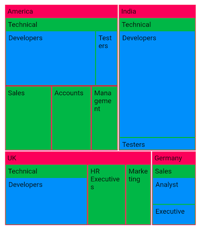
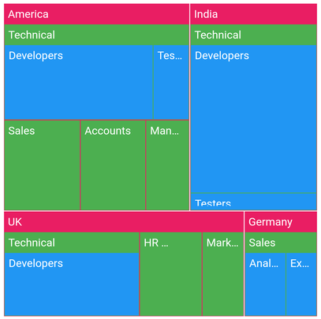
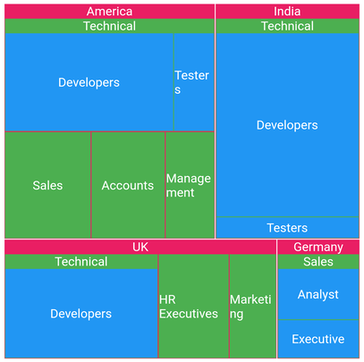

# Labels in Flutter Treemap (SfTreemap)

You can add any type of widgets like text widget to improve the readability of the individual tiles by providing brief descriptions on labels.

## Add labels

You can add labels on the tiles using the [`TreemapLevel.labelBuilder`](https://pub.dev/documentation/syncfusion_flutter_treemap/latest/treemap/TreemapLevel/labelBuilder.html) callback which is available in the [`SfTreemap.levels`](https://pub.dev/documentation/syncfusion_flutter_treemap/latest/treemap/SfTreemap/levels.html) collection.




  late List<JobVacancyModel> _source;

  @override
  void initState() {
    _source = <JobVacancyModel>[
        JobVacancyModel(country: 'America', job: 'Sales', vacancy: 70),
        JobVacancyModel(
            country: 'America', job: 'Technical', group: 'Testers', vacancy: 35),
        JobVacancyModel(
            country: 'America',
            job: 'Technical',
            group: 'Developers',
            role: 'Windows',
            vacancy: 105),
        JobVacancyModel(
            country: 'America',
            job: 'Technical',
            group: 'Developers',
            role: 'Web',
            vacancy: 40),
        JobVacancyModel(country: 'America', job: 'Management', vacancy: 40),
        JobVacancyModel(country: 'America', job: 'Accounts', vacancy: 60),
        JobVacancyModel(
            country: 'India', job: 'Technical', group: 'Testers', vacancy: 25),
        JobVacancyModel(
            country: 'India',
            job: 'Technical',
            group: 'Developers',
            role: 'Windows',
            vacancy: 155),
        JobVacancyModel(
            country: 'India',
            job: 'Technical',
            group: 'Developers',
            role: 'Web',
            vacancy: 60),
        JobVacancyModel(
            country: 'Germany', job: 'Sales', group: 'Executive', vacancy: 30),
        JobVacancyModel(
            country: 'Germany', job: 'Sales', group: 'Analyst', vacancy: 40),
        JobVacancyModel(
            country: 'UK',
            job: 'Technical',
            group: 'Developers',
            role: 'Windows',
            vacancy: 100),
        JobVacancyModel(
            country: 'UK',
            job: 'Technical',
            group: 'Developers',
            role: 'Web',
            vacancy: 30),
        JobVacancyModel(country: 'UK', job: 'HR Executives', vacancy: 60),
        JobVacancyModel(country: 'UK', job: 'Marketing', vacancy: 40),
    ];
    super.initState();
  }

  @override
  Widget build(BuildContext context) {
    return Scaffold(
      body: Center(
          child: Container(
            height: 400,
            width: 400,
            child: SfTreemap(
              dataCount: _source.length,
              weightValueMapper: (int index) {
                return _source[index].vacancy;
              },
              levels: [
                TreemapLevel(
                  groupMapper: (int index) => _source[index].country,
                  color: Colors.pink,
                  labelBuilder: (BuildContext context, TreemapTile tile) {
                    return Padding(
                      padding: EdgeInsets.all(5),
                      child: Text(tile.group),
                    );
                  },
                ),
                TreemapLevel(
                  groupMapper: (int index) => _source[index].job,
                  color: Colors.green,
                  labelBuilder: (BuildContext context, TreemapTile tile) {
                    return Padding(
                      padding: EdgeInsets.all(5),
                      child: Text(tile.group),
                    );
                  },
                ),
                TreemapLevel(
                  groupMapper: (int index) => _source[index].group,
                  color: Colors.blue,
                  labelBuilder: (BuildContext context, TreemapTile tile) {
                    return Padding(
                      padding: EdgeInsets.all(5),
                      child: Text(tile.group),
                    );
                  },
                ),
              ],
            ),
          ),
        ),
    );
  }

class JobVacancyModel {
  const JobVacancyModel(
      {required this.country,
      required this.job,
      this.group,
      this.role,
      required this.vacancy});
  final String country;
  final String job;
  final String? group;
  final String? role;
  final double vacancy;
}




## Overflow mode

You can trim or fade the label when it is overflowed from the tile using the [`Text.overflow`](https://api.flutter.dev/flutter/widgets/Text/overflow.html) property. The possible values are [`visible`](https://api.flutter.dev/flutter/painting/TextOverflow.html#visible), [`ellipsis`](https://api.flutter.dev/flutter/painting/TextOverflow.html#ellipsis), [`clip`](https://api.flutter.dev/flutter/painting/TextOverflow.html#clip) and [`fade`](https://api.flutter.dev/flutter/painting/TextOverflow.html#fade). The default value of the [`Text.overflow`](https://api.flutter.dev/flutter/widgets/Text/overflow.html)property is [`TextOverflow.visible`](https://api.flutter.dev/flutter/painting/TextOverflow.html#visible).

By default, the labels will render even if it overflows from the tile.




  late List<JobVacancyModel> _source;

  @override
  void initState() {
    _source = <JobVacancyModel>[
        JobVacancyModel(country: 'America', job: 'Sales', vacancy: 70),
        JobVacancyModel(
            country: 'America', job: 'Technical', group: 'Testers', vacancy: 35),
        JobVacancyModel(
            country: 'America',
            job: 'Technical',
            group: 'Developers',
            role: 'Windows',
            vacancy: 105),
        JobVacancyModel(
            country: 'America',
            job: 'Technical',
            group: 'Developers',
            role: 'Web',
            vacancy: 40),
        JobVacancyModel(country: 'America', job: 'Management', vacancy: 40),
        JobVacancyModel(country: 'America', job: 'Accounts', vacancy: 60),
        JobVacancyModel(
            country: 'India', job: 'Technical', group: 'Testers', vacancy: 25),
        JobVacancyModel(
            country: 'India',
            job: 'Technical',
            group: 'Developers',
            role: 'Windows',
            vacancy: 155),
        JobVacancyModel(
            country: 'India',
            job: 'Technical',
            group: 'Developers',
            role: 'Web',
            vacancy: 60),
        JobVacancyModel(
            country: 'Germany', job: 'Sales', group: 'Executive', vacancy: 30),
        JobVacancyModel(
            country: 'Germany', job: 'Sales', group: 'Analyst', vacancy: 40),
        JobVacancyModel(
            country: 'UK',
            job: 'Technical',
            group: 'Developers',
            role: 'Windows',
            vacancy: 100),
        JobVacancyModel(
            country: 'UK',
            job: 'Technical',
            group: 'Developers',
            role: 'Web',
            vacancy: 30),
        JobVacancyModel(country: 'UK', job: 'HR Executives', vacancy: 60),
        JobVacancyModel(country: 'UK', job: 'Marketing', vacancy: 40),
    ];
    super.initState();
  }

  @override
  Widget build(BuildContext context) {
    return Scaffold(
        body: Center(
          child: Container(
            height: 400,
            width: 400,
            child: SfTreemap(
              dataCount: _source.length,
              weightValueMapper: (int index) {
                return _source[index].vacancy;
              },
              levels: [
                TreemapLevel(
                  groupMapper: (int index) => _source[index].country,
                  color: Colors.pink,
                  labelBuilder: (BuildContext context, TreemapTile tile) {
                    return Padding(
                      padding: EdgeInsets.all(5),
                      child: Text(
                        tile.group,
                        overflow: TextOverflow.ellipsis,
                      ),
                    );
                  },
                ),
                TreemapLevel(
                  groupMapper: (int index) => _source[index].job,
                  color: Colors.green,
                  labelBuilder: (BuildContext context, TreemapTile tile) {
                    return Padding(
                      padding: EdgeInsets.all(5),
                      child: Text(
                        tile.group,
                        overflow: TextOverflow.ellipsis,
                      ),
                    );
                  },
                ),
                TreemapLevel(
                  groupMapper: (int index) => _source[index].group,
                  color: Colors.blue,
                  labelBuilder: (BuildContext context, TreemapTile tile) {
                    return Padding(
                      padding: EdgeInsets.all(5),
                      child: Text(
                        tile.group,
                        overflow: TextOverflow.ellipsis,
                      ),
                    );
                  },
                ),
              ],
            ),
          ),
        ),
    );
  }

class JobVacancyModel {
  const JobVacancyModel(
      {required this.country,
      required this.job,
      this.group,
      this.role,
      required this.vacancy});
  final String country;
  final String job;
  final String? group;
  final String? role;
  final double vacancy;
}




## Alignment

You can change the labels alignment by wrapping the text widget in the [`Align`](https://api.flutter.dev/flutter/widgets/Align-class.html) widget and setting the [`alignment`](https://api.flutter.dev/flutter/widgets/Align/alignment.html) property.




  late List<JobVacancyModel> _source;

  @override
  void initState() {
    _source = <JobVacancyModel>[
        JobVacancyModel(country: 'America', job: 'Sales', vacancy: 70),
        JobVacancyModel(
            country: 'America', job: 'Technical', group: 'Testers', vacancy: 35),
        JobVacancyModel(
            country: 'America',
            job: 'Technical',
            group: 'Developers',
            role: 'Windows',
            vacancy: 105),
        JobVacancyModel(
            country: 'America',
            job: 'Technical',
            group: 'Developers',
            role: 'Web',
            vacancy: 40),
        JobVacancyModel(country: 'America', job: 'Management', vacancy: 40),
        JobVacancyModel(country: 'America', job: 'Accounts', vacancy: 60),
        JobVacancyModel(
            country: 'India', job: 'Technical', group: 'Testers', vacancy: 25),
        JobVacancyModel(
            country: 'India',
            job: 'Technical',
            group: 'Developers',
            role: 'Windows',
            vacancy: 155),
        JobVacancyModel(
            country: 'India',
            job: 'Technical',
            group: 'Developers',
            role: 'Web',
            vacancy: 60),
        JobVacancyModel(
            country: 'Germany', job: 'Sales', group: 'Executive', vacancy: 30),
        JobVacancyModel(
            country: 'Germany', job: 'Sales', group: 'Analyst', vacancy: 40),
        JobVacancyModel(
            country: 'UK',
            job: 'Technical',
            group: 'Developers',
            role: 'Windows',
            vacancy: 100),
        JobVacancyModel(
            country: 'UK',
            job: 'Technical',
            group: 'Developers',
            role: 'Web',
            vacancy: 30),
        JobVacancyModel(country: 'UK', job: 'HR Executives', vacancy: 60),
        JobVacancyModel(country: 'UK', job: 'Marketing', vacancy: 40),
    ];
    super.initState();
  }

  @override
  Widget build(BuildContext context) {
    return Scaffold(
      body: Center(
          child: Container(
            height: 400,
            width: 400,
            child: SfTreemap(
              dataCount: _source.length,
              weightValueMapper: (int index) {
                return _source[index].vacancy;
              },
              levels: [
                TreemapLevel(
                  groupMapper: (int index) => _source[index].country,
                  color: Colors.pink,
                  labelBuilder: (BuildContext context, TreemapTile tile) {
                    return Align(
                      alignment: Alignment.center,
                      child: Text(tile.group),
                    );
                  },
                ),
                TreemapLevel(
                  groupMapper: (int index) => _source[index].job,
                  color: Colors.green,
                  labelBuilder: (BuildContext context, TreemapTile tile) {
                    return Align(
                      alignment: Alignment.center,
                      child: Text(tile.group),
                    );
                  },
                ),
                TreemapLevel(
                  groupMapper: (int index) => _source[index].group,
                  color: Colors.blue,
                  labelBuilder: (BuildContext context, TreemapTile tile) {
                    return Align(
                      alignment: Alignment.center,
                      child: Text(tile.group),
                    );
                  },
                ),
              ],
            ),
          ),
        ),
    );
  }

class JobVacancyModel {
  const JobVacancyModel(
      {required this.country,
      required this.job,
      this.group,
      this.role,
      required this.vacancy});
  final String country;
  final String job;
  final String? group;
  final String? role;
  final double vacancy;
}




