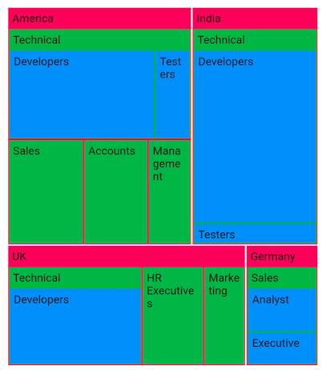
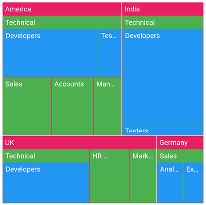
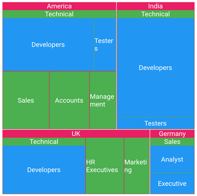

# Labels in Flutter Treemap (SfTreemap)

You can add any type of widget, like a text widget, to improve the readability of the individual tiles by providing brief descriptions on labels.

## Add labels

You can add labels on the tiles using the [`TreemapLevel.labelBuilder`](https://pub.dev/documentation/syncfusion_flutter_treemap/latest/treemap/TreemapLevel/labelBuilder.html) callback which is available in the [`SfTreemap.levels`](https://pub.dev/documentation/syncfusion_flutter_treemap/latest/treemap/SfTreemap/levels.html) collection.

The examples below use the same job vacancy data source and differ only in how the labels are rendered.




import 'package:flutter/material.dart';
import 'package:syncfusion_flutter_treemap/treemap.dart';

class LabelsExample extends StatefulWidget {
  const LabelsExample({super.key});

  @override
  State<LabelsExample> createState() => _LabelsExampleState();
}

class _LabelsExampleState extends State<LabelsExample> {
  late List<JobVacancyModel> _source;

  @override
  void initState() {
    _source = <JobVacancyModel>[
      const JobVacancyModel(country: 'America', job: 'Sales', vacancy: 70),
      const JobVacancyModel(
        country: 'America',
        job: 'Technical',
        group: 'Testers',
        vacancy: 35,
      ),
      const JobVacancyModel(
        country: 'America',
        job: 'Technical',
        group: 'Developers',
        role: 'Windows',
        vacancy: 105,
      ),
      const JobVacancyModel(
        country: 'America',
        job: 'Technical',
        group: 'Developers',
        role: 'Web',
        vacancy: 40,
      ),
      const JobVacancyModel(
        country: 'America',
        job: 'Management',
        vacancy: 40,
      ),
      const JobVacancyModel(
        country: 'America',
        job: 'Accounts',
        vacancy: 60,
      ),
      const JobVacancyModel(
        country: 'India',
        job: 'Technical',
        group: 'Testers',
        vacancy: 25,
      ),
      const JobVacancyModel(
        country: 'India',
        job: 'Technical',
        group: 'Developers',
        role: 'Windows',
        vacancy: 155,
      ),
      const JobVacancyModel(
        country: 'India',
        job: 'Technical',
        group: 'Developers',
        role: 'Web',
        vacancy: 60,
      ),
      const JobVacancyModel(
        country: 'Germany',
        job: 'Sales',
        group: 'Executive',
        vacancy: 30,
      ),
      const JobVacancyModel(
        country: 'Germany',
        job: 'Sales',
        group: 'Analyst',
        vacancy: 40,
      ),
      const JobVacancyModel(
        country: 'UK',
        job: 'Technical',
        group: 'Developers',
        role: 'Windows',
        vacancy: 100,
      ),
      const JobVacancyModel(
        country: 'UK',
        job: 'Technical',
        group: 'Developers',
        role: 'Web',
        vacancy: 30,
      ),
      const JobVacancyModel(
        country: 'UK',
        job: 'HR Executives',
        vacancy: 60,
      ),
      const JobVacancyModel(
        country: 'UK',
        job: 'Marketing',
        vacancy: 40,
      ),
    ];
    super.initState();
  }

  @override
  Widget build(BuildContext context) {
    return Scaffold(
      body: Center(
        child: SizedBox(
          height: 400,
          width: 400,
          child: SfTreemap(
            dataCount: _source.length,
            weightValueMapper: (int index) {
              return _source[index].vacancy;
            },
            levels: [
              TreemapLevel(
                groupMapper: (int index) => _source[index].country,
                color: Colors.pink,
                labelBuilder: (BuildContext context, TreemapTile tile) {
                  return Padding(
                    padding: const EdgeInsets.all(5),
                    child: Text(tile.group),
                  );
                },
              ),
              TreemapLevel(
                groupMapper: (int index) => _source[index].job,
                color: Colors.green,
                labelBuilder: (BuildContext context, TreemapTile tile) {
                  return Padding(
                    padding: const EdgeInsets.all(5),
                    child: Text(tile.group),
                  );
                },
              ),
              TreemapLevel(
                groupMapper: (int index) => _source[index].group,
                color: Colors.blue,
                labelBuilder: (BuildContext context, TreemapTile tile) {
                  return Padding(
                    padding: const EdgeInsets.all(5),
                    child: Text(tile.group),
                  );
                },
              ),
            ],
          ),
        ),
      ),
    );
  }
}

class JobVacancyModel {
  const JobVacancyModel({
    required this.country,
    required this.job,
    this.group,
    this.role,
    required this.vacancy,
  });

  final String country;
  final String job;
  final String? group;
  final String? role;
  final double vacancy;
}




## Overflow mode

You can trim or fade a label when it overflows the tile bounds by using the Flutter framework's [`Text.overflow`](https://api.flutter.dev/flutter/widgets/Text/overflow.html) property inside the label builder. The possible values are [`visible`](https://api.flutter.dev/flutter/painting/TextOverflow.html#visible), [`ellipsis`](https://api.flutter.dev/flutter/painting/TextOverflow.html#ellipsis), [`clip`](https://api.flutter.dev/flutter/painting/TextOverflow.html#clip), and [`fade`](https://api.flutter.dev/flutter/painting/TextOverflow.html#fade). The default value of [`Text.overflow`](https://api.flutter.dev/flutter/widgets/Text/overflow.html) is [`TextOverflow.visible`](https://api.flutter.dev/flutter/painting/TextOverflow.html#visible).

By default, the labels render even if they overflow from the tile.




import 'package:flutter/material.dart';
import 'package:syncfusion_flutter_treemap/treemap.dart';

class LabelsOverflowExample extends StatefulWidget {
  const LabelsOverflowExample({super.key});

  @override
  State<LabelsOverflowExample> createState() => _LabelsOverflowExampleState();
}

class _LabelsOverflowExampleState extends State<LabelsOverflowExample> {
  late List<JobVacancyModel> _source;

  @override
  void initState() {
    _source = <JobVacancyModel>[
      const JobVacancyModel(country: 'America', job: 'Sales', vacancy: 70),
      const JobVacancyModel(
        country: 'America',
        job: 'Technical',
        group: 'Testers',
        vacancy: 35,
      ),
      const JobVacancyModel(
        country: 'America',
        job: 'Technical',
        group: 'Developers',
        role: 'Windows',
        vacancy: 105,
      ),
      const JobVacancyModel(
        country: 'America',
        job: 'Technical',
        group: 'Developers',
        role: 'Web',
        vacancy: 40,
      ),
      const JobVacancyModel(
        country: 'America',
        job: 'Management',
        vacancy: 40,
      ),
      const JobVacancyModel(
        country: 'America',
        job: 'Accounts',
        vacancy: 60,
      ),
      const JobVacancyModel(
        country: 'India',
        job: 'Technical',
        group: 'Testers',
        vacancy: 25,
      ),
      const JobVacancyModel(
        country: 'India',
        job: 'Technical',
        group: 'Developers',
        role: 'Windows',
        vacancy: 155,
      ),
      const JobVacancyModel(
        country: 'India',
        job: 'Technical',
        group: 'Developers',
        role: 'Web',
        vacancy: 60,
      ),
      const JobVacancyModel(
        country: 'Germany',
        job: 'Sales',
        group: 'Executive',
        vacancy: 30,
      ),
      const JobVacancyModel(
        country: 'Germany',
        job: 'Sales',
        group: 'Analyst',
        vacancy: 40,
      ),
      const JobVacancyModel(
        country: 'UK',
        job: 'Technical',
        group: 'Developers',
        role: 'Windows',
        vacancy: 100,
      ),
      const JobVacancyModel(
        country: 'UK',
        job: 'Technical',
        group: 'Developers',
        role: 'Web',
        vacancy: 30,
      ),
      const JobVacancyModel(
        country: 'UK',
        job: 'HR Executives',
        vacancy: 60,
      ),
      const JobVacancyModel(
        country: 'UK',
        job: 'Marketing',
        vacancy: 40,
      ),
    ];
    super.initState();
  }

  @override
  Widget build(BuildContext context) {
    return Scaffold(
      body: Center(
        child: SizedBox(
          height: 400,
          width: 400,
          child: SfTreemap(
            dataCount: _source.length,
            weightValueMapper: (int index) {
              return _source[index].vacancy;
            },
            levels: [
              TreemapLevel(
                groupMapper: (int index) => _source[index].country,
                color: Colors.pink,
                labelBuilder: (BuildContext context, TreemapTile tile) {
                  return Padding(
                    padding: const EdgeInsets.all(5),
                    child: Text(
                      tile.group,
                      overflow: TextOverflow.ellipsis,
                    ),
                  );
                },
              ),
              TreemapLevel(
                groupMapper: (int index) => _source[index].job,
                color: Colors.green,
                labelBuilder: (BuildContext context, TreemapTile tile) {
                  return Padding(
                    padding: const EdgeInsets.all(5),
                    child: Text(
                      tile.group,
                      overflow: TextOverflow.ellipsis,
                    ),
                  );
                },
              ),
              TreemapLevel(
                groupMapper: (int index) => _source[index].group,
                color: Colors.blue,
                labelBuilder: (BuildContext context, TreemapTile tile) {
                  return Padding(
                    padding: const EdgeInsets.all(5),
                    child: Text(
                      tile.group,
                      overflow: TextOverflow.ellipsis,
                    ),
                  );
                },
              ),
            ],
          ),
        ),
      ),
    );
  }
}

class JobVacancyModel {
  const JobVacancyModel({
    required this.country,
    required this.job,
    this.group,
    this.role,
    required this.vacancy,
  });

  final String country;
  final String job;
  final String? group;
  final String? role;
  final double vacancy;
}




## Alignment

You can change the label alignment by wrapping the text widget in the [`Align`](https://api.flutter.dev/flutter/widgets/Align-class.html) widget and setting the [`alignment`](https://api.flutter.dev/flutter/widgets/Align/alignment.html) property.




import 'package:flutter/material.dart';
import 'package:syncfusion_flutter_treemap/treemap.dart';

class LabelsAlignmentExample extends StatefulWidget {
  const LabelsAlignmentExample({super.key});

  @override
  State<LabelsAlignmentExample> createState() => _LabelsAlignmentExampleState();
}

class _LabelsAlignmentExampleState extends State<LabelsAlignmentExample> {
  late List<JobVacancyModel> _source;

  @override
  void initState() {
    _source = <JobVacancyModel>[
      const JobVacancyModel(country: 'America', job: 'Sales', vacancy: 70),
      const JobVacancyModel(
        country: 'America',
        job: 'Technical',
        group: 'Testers',
        vacancy: 35,
      ),
      const JobVacancyModel(
        country: 'America',
        job: 'Technical',
        group: 'Developers',
        role: 'Windows',
        vacancy: 105,
      ),
      const JobVacancyModel(
        country: 'America',
        job: 'Technical',
        group: 'Developers',
        role: 'Web',
        vacancy: 40,
      ),
      const JobVacancyModel(
        country: 'America',
        job: 'Management',
        vacancy: 40,
      ),
      const JobVacancyModel(
        country: 'America',
        job: 'Accounts',
        vacancy: 60,
      ),
      const JobVacancyModel(
        country: 'India',
        job: 'Technical',
        group: 'Testers',
        vacancy: 25,
      ),
      const JobVacancyModel(
        country: 'India',
        job: 'Technical',
        group: 'Developers',
        role: 'Windows',
        vacancy: 155,
      ),
      const JobVacancyModel(
        country: 'India',
        job: 'Technical',
        group: 'Developers',
        role: 'Web',
        vacancy: 60,
      ),
      const JobVacancyModel(
        country: 'Germany',
        job: 'Sales',
        group: 'Executive',
        vacancy: 30,
      ),
      const JobVacancyModel(
        country: 'Germany',
        job: 'Sales',
        group: 'Analyst',
        vacancy: 40,
      ),
      const JobVacancyModel(
        country: 'UK',
        job: 'Technical',
        group: 'Developers',
        role: 'Windows',
        vacancy: 100,
      ),
      const JobVacancyModel(
        country: 'UK',
        job: 'Technical',
        group: 'Developers',
        role: 'Web',
        vacancy: 30,
      ),
      const JobVacancyModel(
        country: 'UK',
        job: 'HR Executives',
        vacancy: 60,
      ),
      const JobVacancyModel(
        country: 'UK',
        job: 'Marketing',
        vacancy: 40,
      ),
    ];
    super.initState();
  }

  @override
  Widget build(BuildContext context) {
    return Scaffold(
      body: Center(
        child: SizedBox(
          height: 400,
          width: 400,
          child: SfTreemap(
            dataCount: _source.length,
            weightValueMapper: (int index) {
              return _source[index].vacancy;
            },
            levels: [
              TreemapLevel(
                groupMapper: (int index) => _source[index].country,
                color: Colors.pink,
                labelBuilder: (BuildContext context, TreemapTile tile) {
                  return Align(
                    alignment: Alignment.center,
                    child: Text(tile.group),
                  );
                },
              ),
              TreemapLevel(
                groupMapper: (int index) => _source[index].job,
                color: Colors.green,
                labelBuilder: (BuildContext context, TreemapTile tile) {
                  return Align(
                    alignment: Alignment.center,
                    child: Text(tile.group),
                  );
                },
              ),
              TreemapLevel(
                groupMapper: (int index) => _source[index].group,
                color: Colors.blue,
                labelBuilder: (BuildContext context, TreemapTile tile) {
                  return Align(
                    alignment: Alignment.center,
                    child: Text(tile.group),
                  );
                },
              ),
            ],
          ),
        ),
      ),
    );
  }
}

class JobVacancyModel {
  const JobVacancyModel({
    required this.country,
    required this.job,
    this.group,
    this.role,
    required this.vacancy,
  });

  final String country;
  final String job;
  final String? group;
  final String? role;
  final double vacancy;
}




