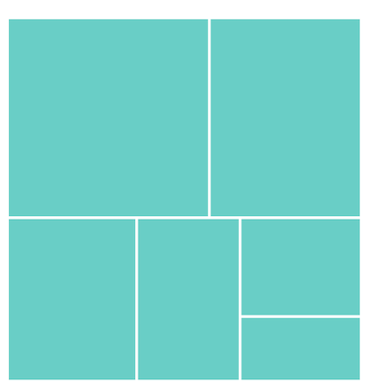
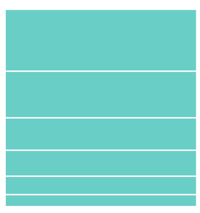
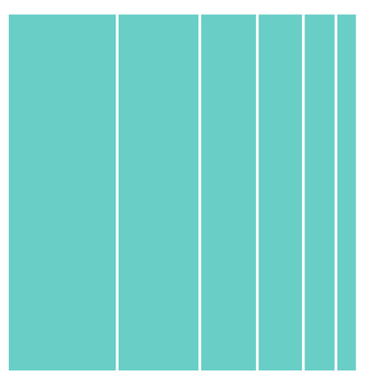

# Layouts in Flutter Treemap (SfTreemap)

This section explains the different layouts in the treemap widget. The available layouts are,

* Squarified
* Slice
* Dice

## Squarified

The [`squarified`](https://pub.dev/documentation/syncfusion_flutter_treemap/latest/treemap/SfTreemap/SfTreemap.html) layout will arrange the rectangles in a row and wrap them to the next row according to the available size. The size of the particular rectangle is based on the value returned from [`weightValueMapper`](https://pub.dev/documentation/syncfusion_flutter_treemap/latest/treemap/SfTreemap/weightValueMapper.html) callback. By default, squarified layout is used.




late List<PopulationModel> _dataSource;

@override
void initState() {
   _dataSource = <PopulationModel>[
      PopulationModel(continent: 'Asia', populationInMillions: 25.4),
      PopulationModel(continent: 'South America', populationInMillions: 19.11),
      PopulationModel(continent: 'North America', populationInMillions: 13.3),
      PopulationModel(continent: 'Europe', populationInMillions: 10.65),
      PopulationModel(continent: 'Africa', populationInMillions: 7.54),
      PopulationModel(continent: 'Australia', populationInMillions: 4.93),
   ];
   super.initState();
}

@override
Widget build(BuildContext context) {
  return Scaffold(
     body: SfTreemap(
        dataCount: _dataSource.length,
        weightValueMapper: (int index) {
          return _dataSource[index].populationInMillions;
        },
        levels: [
          TreemapLevel(
            groupMapper: (int index) {
              return _dataSource[index].continent;
            },
            color: Colors.teal[200],
            padding: const EdgeInsets.all(1.5),
          ),
        ],
      ),
   );
}

class PopulationModel {
  const PopulationModel({
    required this.continent,
    required this.populationInMillions,
  });

  final String continent;
  final double populationInMillions;
}




## Slice

The [`slice`](https://pub.dev/documentation/syncfusion_flutter_treemap/latest/treemap/SfTreemap/SfTreemap.slice.html) layout will start to arrange each rectangle in a horizontal direction and the size of the rectangle will be based on the value returned from [`weightValueMapper`](https://pub.dev/documentation/syncfusion_flutter_treemap/latest/treemap/SfTreemap/weightValueMapper.html) callback and the available height.




late List<PopulationModel> _dataSource;

@override
void initState() {
   _dataSource = <PopulationModel>[
      PopulationModel(continent: 'Asia', populationInMillions: 25.4),
      PopulationModel(continent: 'South America', populationInMillions: 19.11),
      PopulationModel(continent: 'North America', populationInMillions: 13.3),
      PopulationModel(continent: 'Europe', populationInMillions: 10.65),
      PopulationModel(continent: 'Africa', populationInMillions: 7.54),
      PopulationModel(continent: 'Australia', populationInMillions: 4.93),
   ];
   super.initState();
}

@override
Widget build(BuildContext context) {
  return Scaffold(
     body: SfTreemap.slice(
        dataCount: _dataSource.length,
        weightValueMapper: (int index) {
          return _dataSource[index].populationInMillions;
        },
        levels: [
          TreemapLevel(
            groupMapper: (int index) {
              return _dataSource[index].continent;
            },
            color: Colors.teal[200],
            padding: const EdgeInsets.all(1.5),
          ),
        ],
      ),
   );
}

class PopulationModel {
  const PopulationModel({
    required this.continent,
    required this.populationInMillions,
  });

  final String continent;
  final double populationInMillions;
}




## Dice

The [`dice`](https://pub.dev/documentation/syncfusion_flutter_treemap/latest/treemap/SfTreemap/SfTreemap.dice.html) structure will start to arrange each rectangle in the vertical direction and the size of the rectangle will be based on the value returned from the [`weightValueMapper`](https://pub.dev/documentation/syncfusion_flutter_treemap/latest/treemap/SfTreemap/weightValueMapper.html) callback and the available width.




late List<PopulationModel> _dataSource;

@override
void initState() {
   _dataSource = <PopulationModel>[
      PopulationModel(continent: 'Asia', populationInMillions: 25.4),
      PopulationModel(continent: 'South America', populationInMillions: 19.11),
      PopulationModel(continent: 'North America', populationInMillions: 13.3),
      PopulationModel(continent: 'Europe', populationInMillions: 10.65),
      PopulationModel(continent: 'Africa', populationInMillions: 7.54),
      PopulationModel(continent: 'Australia', populationInMillions: 4.93),
   ];
   super.initState();
}

@override
Widget build(BuildContext context) {
  return Scaffold(
     body: SfTreemap.dice(
        dataCount: _dataSource.length,
        weightValueMapper: (int index) {
          return _dataSource[index].populationInMillions;
        },
        levels: [
          TreemapLevel(
            groupMapper: (int index) {
              return _dataSource[index].continent;
            },
            color: Colors.teal[200],
            padding: const EdgeInsets.all(1.5),
          ),
        ],
      ),
   );
}

class PopulationModel {
  const PopulationModel({
    required this.continent,
    required this.populationInMillions,
  });

  final String continent;
  final double populationInMillions;
}




