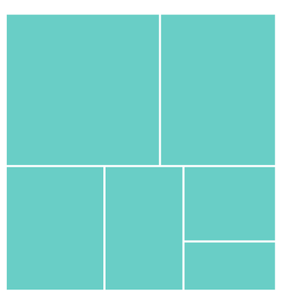
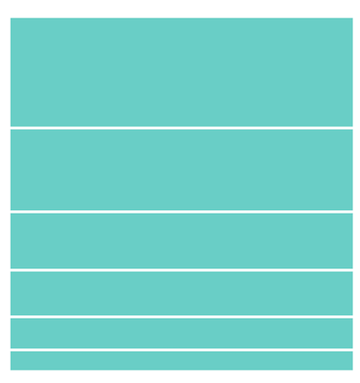
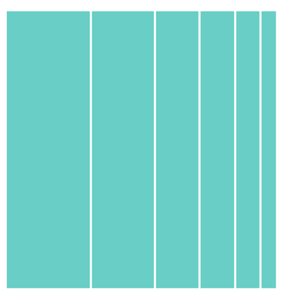
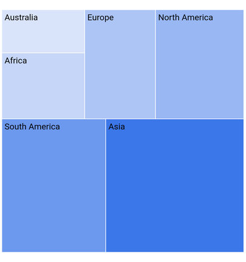
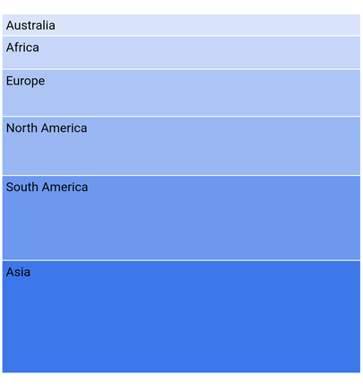

# Layouts in Flutter Treemap (SfTreemap)

This section explains the different layouts in the Treemap widget. The available layouts are:

* Squarified
* Slice
* Dice

## Squarified

The [`squarified`](https://pub.dev/documentation/syncfusion_flutter_treemap/latest/treemap/SfTreemap/SfTreemap.html) layout arranges the rectangles in a row and wraps them to the next row according to the available size. The size of each rectangle is based on the value returned from the [`weightValueMapper`](https://pub.dev/documentation/syncfusion_flutter_treemap/latest/treemap/SfTreemap/weightValueMapper.html) callback. By default, the squarified layout is used.




import 'package:flutter/material.dart';
import 'package:syncfusion_flutter_treemap/treemap.dart';

class SquarifiedLayoutExample extends StatefulWidget {
  const SquarifiedLayoutExample({super.key});

  @override
  State<SquarifiedLayoutExample> createState() =>
      _SquarifiedLayoutExampleState();
}

class _SquarifiedLayoutExampleState extends State<SquarifiedLayoutExample> {
  late List<PopulationModel> _dataSource;

  @override
  void initState() {
    _dataSource = <PopulationModel>[
      const PopulationModel(continent: 'Asia', populationInMillions: 25.4),
      const PopulationModel(
        continent: 'South America',
        populationInMillions: 19.11,
      ),
      const PopulationModel(
        continent: 'North America',
        populationInMillions: 13.3,
      ),
      const PopulationModel(continent: 'Europe', populationInMillions: 10.65),
      const PopulationModel(continent: 'Africa', populationInMillions: 7.54),
      const PopulationModel(continent: 'Australia', populationInMillions: 4.93),
    ];
    super.initState();
  }

  @override
  Widget build(BuildContext context) {
    return Scaffold(
      body: Center(
        child: SizedBox(
          height: 400,
          width: 400,
          child: SfTreemap(
            dataCount: _dataSource.length,
            weightValueMapper: (int index) {
              return _dataSource[index].populationInMillions;
            },
            levels: [
              TreemapLevel(
                groupMapper: (int index) {
                  return _dataSource[index].continent;
                },
                color: Colors.teal[200],
                padding: const EdgeInsets.all(1.5),
              ),
            ],
          ),
        ),
      ),
    );
  }
}

class PopulationModel {
  const PopulationModel({
    required this.continent,
    required this.populationInMillions,
  });

  final String continent;
  final double populationInMillions;
}




## Slice

The [`slice`](https://pub.dev/documentation/syncfusion_flutter_treemap/latest/treemap/SfTreemap/SfTreemap.slice.html) layout arranges each rectangle in a horizontal direction. The size of each rectangle is based on the value returned from the [`weightValueMapper`](https://pub.dev/documentation/syncfusion_flutter_treemap/latest/treemap/SfTreemap/weightValueMapper.html) callback and the available height.




import 'package:flutter/material.dart';
import 'package:syncfusion_flutter_treemap/treemap.dart';

class SliceLayoutExample extends StatefulWidget {
  const SliceLayoutExample({super.key});

  @override
  State<SliceLayoutExample> createState() => _SliceLayoutExampleState();
}

class _SliceLayoutExampleState extends State<SliceLayoutExample> {
  late List<PopulationModel> _dataSource;

  @override
  void initState() {
    _dataSource = <PopulationModel>[
      const PopulationModel(continent: 'Asia', populationInMillions: 25.4),
      const PopulationModel(
        continent: 'South America',
        populationInMillions: 19.11,
      ),
      const PopulationModel(
        continent: 'North America',
        populationInMillions: 13.3,
      ),
      const PopulationModel(continent: 'Europe', populationInMillions: 10.65),
      const PopulationModel(continent: 'Africa', populationInMillions: 7.54),
      const PopulationModel(continent: 'Australia', populationInMillions: 4.93),
    ];
    super.initState();
  }

  @override
  Widget build(BuildContext context) {
    return Scaffold(
      body: Center(
        child: SizedBox(
          height: 400,
          width: 400,
          child: SfTreemap.slice(
            dataCount: _dataSource.length,
            weightValueMapper: (int index) {
              return _dataSource[index].populationInMillions;
            },
            levels: [
              TreemapLevel(
                groupMapper: (int index) {
                  return _dataSource[index].continent;
                },
                color: Colors.teal[200],
                padding: const EdgeInsets.all(1.5),
              ),
            ],
          ),
        ),
      ),
    );
  }
}

class PopulationModel {
  const PopulationModel({
    required this.continent,
    required this.populationInMillions,
  });

  final String continent;
  final double populationInMillions;
}




## Dice

The [`dice`](https://pub.dev/documentation/syncfusion_flutter_treemap/latest/treemap/SfTreemap/SfTreemap.dice.html) layout arranges each rectangle in the vertical direction. The size of each rectangle is based on the value returned from the [`weightValueMapper`](https://pub.dev/documentation/syncfusion_flutter_treemap/latest/treemap/SfTreemap/weightValueMapper.html) callback and the available width.




import 'package:flutter/material.dart';
import 'package:syncfusion_flutter_treemap/treemap.dart';

class DiceLayoutExample extends StatefulWidget {
  const DiceLayoutExample({super.key});

  @override
  State<DiceLayoutExample> createState() => _DiceLayoutExampleState();
}

class _DiceLayoutExampleState extends State<DiceLayoutExample> {
  late List<PopulationModel> _dataSource;

  @override
  void initState() {
    _dataSource = <PopulationModel>[
      const PopulationModel(continent: 'Asia', populationInMillions: 25.4),
      const PopulationModel(
        continent: 'South America',
        populationInMillions: 19.11,
      ),
      const PopulationModel(
        continent: 'North America',
        populationInMillions: 13.3,
      ),
      const PopulationModel(continent: 'Europe', populationInMillions: 10.65),
      const PopulationModel(continent: 'Africa', populationInMillions: 7.54),
      const PopulationModel(continent: 'Australia', populationInMillions: 4.93),
    ];
    super.initState();
  }

  @override
  Widget build(BuildContext context) {
    return Scaffold(
      body: Center(
        child: SizedBox(
          height: 400,
          width: 400,
          child: SfTreemap.dice(
            dataCount: _dataSource.length,
            weightValueMapper: (int index) {
              return _dataSource[index].populationInMillions;
            },
            levels: [
              TreemapLevel(
                groupMapper: (int index) {
                  return _dataSource[index].continent;
                },
                color: Colors.teal[200],
                padding: const EdgeInsets.all(1.5),
              ),
            ],
          ),
        ),
      ),
    );
  }
}

class PopulationModel {
  const PopulationModel({
    required this.continent,
    required this.populationInMillions,
  });

  final String continent;
  final double populationInMillions;
}




## Layout direction

Tiles start to layout from the top-left to the bottom-right of the rectangle by default. The [`layoutDirection`](https://pub.dev/documentation/syncfusion_flutter_treemap/latest/treemap/SfTreemap/layoutDirection.html) property allows you to start the layout from any corner of the rectangle. The possible [`layoutDirection`](https://pub.dev/documentation/syncfusion_flutter_treemap/latest/treemap/SfTreemap/layoutDirection.html) values are [`topLeft`](https://pub.dev/documentation/syncfusion_flutter_treemap/latest/treemap/TreemapLayoutDirection.html#topLeft), [`topRight`](https://pub.dev/documentation/syncfusion_flutter_treemap/latest/treemap/TreemapLayoutDirection.html#topRight), [`bottomLeft`](https://pub.dev/documentation/syncfusion_flutter_treemap/latest/treemap/TreemapLayoutDirection.html#bottomLeft), and [`bottomRight`](https://pub.dev/documentation/syncfusion_flutter_treemap/latest/treemap/TreemapLayoutDirection.html#bottomRight).

N> It is applicable for squarified treemap.




import 'package:flutter/material.dart';
import 'package:syncfusion_flutter_treemap/treemap.dart';

class LayoutDirectionExample extends StatefulWidget {
  const LayoutDirectionExample({super.key});

  @override
  State<LayoutDirectionExample> createState() => _LayoutDirectionExampleState();
}

class _LayoutDirectionExampleState extends State<LayoutDirectionExample> {
  late List<PopulationModel> _dataSource;

  @override
  void initState() {
    _dataSource = <PopulationModel>[
      const PopulationModel(continent: 'Asia', populationInMillions: 25.4),
      const PopulationModel(
        continent: 'South America',
        populationInMillions: 19.11,
      ),
      const PopulationModel(
        continent: 'North America',
        populationInMillions: 13.3,
      ),
      const PopulationModel(continent: 'Europe', populationInMillions: 10.65),
      const PopulationModel(continent: 'Africa', populationInMillions: 7.54),
      const PopulationModel(continent: 'Australia', populationInMillions: 4.93),
    ];
    super.initState();
  }

  @override
  Widget build(BuildContext context) {
    return Scaffold(
      body: Center(
        child: SizedBox(
          height: 400,
          width: 400,
          child: SfTreemap(
            dataCount: _dataSource.length,
            weightValueMapper: (int index) {
              return _dataSource[index].populationInMillions;
            },
            layoutDirection: TreemapLayoutDirection.bottomRight,
            levels: [
              TreemapLevel(
                groupMapper: (int index) {
                  return _dataSource[index].continent;
                },
                labelBuilder: (BuildContext context, TreemapTile tile) {
                  return Padding(
                    padding: const EdgeInsets.all(4.0),
                    child: Text(
                      tile.group,
                      style: const TextStyle(color: Colors.black),
                    ),
                  );
                },
              ),
            ],
          ),
        ),
      ),
    );
  }
}

class PopulationModel {
  const PopulationModel({
    required this.continent,
    required this.populationInMillions,
  });

  final String continent;
  final double populationInMillions;
}




## Sorting

You can sort the tiles either in ascending or descending order based on the [`sortAscending`](https://pub.dev/documentation/syncfusion_flutter_treemap/latest/treemap/SfTreemap/sortAscending.html) property. The default value of the [`sortAscending`](https://pub.dev/documentation/syncfusion_flutter_treemap/latest/treemap/SfTreemap/sortAscending.html) property is `false`.

N> It is applicable for slice and dice treemap.




import 'package:flutter/material.dart';
import 'package:syncfusion_flutter_treemap/treemap.dart';

class SortingExample extends StatefulWidget {
  const SortingExample({super.key});

  @override
  State<SortingExample> createState() => _SortingExampleState();
}

class _SortingExampleState extends State<SortingExample> {
  late List<PopulationModel> _dataSource;

  @override
  void initState() {
    _dataSource = <PopulationModel>[
      const PopulationModel(continent: 'Asia', populationInMillions: 25.4),
      const PopulationModel(
        continent: 'South America',
        populationInMillions: 19.11,
      ),
      const PopulationModel(
        continent: 'North America',
        populationInMillions: 13.3,
      ),
      const PopulationModel(continent: 'Europe', populationInMillions: 10.65),
      const PopulationModel(continent: 'Africa', populationInMillions: 7.54),
      const PopulationModel(continent: 'Australia', populationInMillions: 4.93),
    ];
    super.initState();
  }

  @override
  Widget build(BuildContext context) {
    return Scaffold(
      body: Center(
        child: SizedBox(
          height: 400,
          width: 400,
          child: SfTreemap.slice(
            dataCount: _dataSource.length,
            weightValueMapper: (int index) {
              return _dataSource[index].populationInMillions;
            },
            sortAscending: true,
            levels: [
              TreemapLevel(
                groupMapper: (int index) {
                  return _dataSource[index].continent;
                },
                labelBuilder: (BuildContext context, TreemapTile tile) {
                  return Padding(
                    padding: const EdgeInsets.all(4.0),
                    child: Text(
                      tile.group,
                      style: const TextStyle(color: Colors.black),
                    ),
                  );
                },
              ),
            ],
          ),
        ),
      ),
    );
  }
}

class PopulationModel {
  const PopulationModel({
    required this.continent,
    required this.populationInMillions,
  });

  final String continent;
  final double populationInMillions;
}




