# Legend in Flutter Treemap (SfTreemap)

The legend provides clarity about the data plotted on the treemap.

## Enable default legend

To display a legend, initialize the [`SfTreemap.legend`](https://pub.dev/documentation/syncfusion_flutter_treemap/latest/treemap/SfTreemap/legend.html) property. By default, the legend item's text is rendered based on the value of [`TreemapLevel.groupMapper`](https://pub.dev/documentation/syncfusion_flutter_treemap/latest/treemap/TreemapLevel/groupMapper.html) property. The default value of the [`legend`](https://pub.dev/documentation/syncfusion_flutter_treemap/latest/treemap/SfTreemap/legend.html) property is `null`.




  late List<SocialMediaUsers> _source;

  @override
  void initState() {
    _source = <SocialMediaUsers>[
        SocialMediaUsers('India', 'Facebook', 25.4),
        SocialMediaUsers('USA', 'Instagram', 19.11),
        SocialMediaUsers('Japan', 'Facebook', 13.3),
        SocialMediaUsers('Germany', 'Instagram', 10.65),
        SocialMediaUsers('France', 'Twitter', 7.54),
        SocialMediaUsers('UK', 'Instagram', 4.93),
    ];
    super.initState();
  }

  @override
  Widget build(BuildContext context) {
    return Scaffold(
      body: Center(
          child: Container(
            height: 400,
            width: 400,
            child: SfTreemap(
              dataCount: _source.length,
              weightValueMapper: (int index) {
                return _source[index].usersInMillions;
              },
              levels: [
                TreemapLevel(
                  groupMapper: (int index) {
                    return _source[index].country;
                  },
                ),
              ],
              legend: TreemapLegend(),
            ),
          ),
        ),
    );
  }

class SocialMediaUsers {
  const SocialMediaUsers(this.country, this.socialMedia, this.usersInMillions);

  final String country;
  final String socialMedia;
  final double usersInMillions;
}




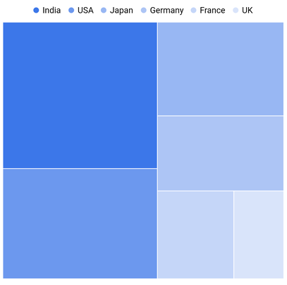

N>
* Refer the [`TreemapLegend.bar`](https://pub.dev/documentation/syncfusion_flutter_treemap/latest/treemap/TreemapLegend/TreemapLegend.bar.html), to display a bar-shaped legend.

## Bar shape legend

You can show bar shape legend by initializing the [`SfTreemap.legend`](https://pub.dev/documentation/syncfusion_flutter_treemap/latest/treemap/SfTreemap/legend.html) property as [`TreemapLegend.bar`](https://pub.dev/documentation/syncfusion_flutter_treemap/latest/treemap/TreemapLegend/TreemapLegend.bar.html). By default, the legend item's text is rendered based on the value of [`TreemapLevel.groupMapper`](https://pub.dev/documentation/syncfusion_flutter_treemap/latest/treemap/TreemapLevel/groupMapper.html) property.




  late List<SocialMediaUsers> _source;

  @override
  void initState() {
    _source = <SocialMediaUsers>[
        SocialMediaUsers('India', 'Facebook', 25.4),
        SocialMediaUsers('USA', 'Instagram', 19.11),
        SocialMediaUsers('Japan', 'Facebook', 13.3),
        SocialMediaUsers('Germany', 'Instagram', 10.65),
        SocialMediaUsers('France', 'Twitter', 7.54),
        SocialMediaUsers('UK', 'Instagram', 4.93),
    ];
    super.initState();
  }

  @override
  Widget build(BuildContext context) {
    return Scaffold(
      body: Center(
          child: Container(
            height: 400,
            width: 400,
            child: SfTreemap(
              dataCount: _source.length,
              weightValueMapper: (int index) {
                return _source[index].usersInMillions;
              },
              levels: [
                TreemapLevel(
                  groupMapper: (int index) {
                    return _source[index].country;
                  },
                ),
              ],
              legend: TreemapLegend.bar(),
            ),
          ),
        ),
    );
  }

class SocialMediaUsers {
  const SocialMediaUsers(this.country, this.socialMedia, this.usersInMillions);

  final String country;
  final String socialMedia;
  final double usersInMillions;
}




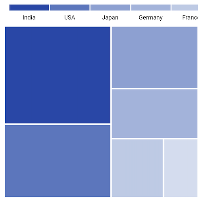

N>
* Refer the [`TreemapLegend`](https://pub.dev/documentation/syncfusion_flutter_treemap/latest/treemap/TreemapLegend/TreemapLegend.html), for the default legend display options.

## Icon and text customization

Customize legend icons and text based on the  [`TreemapLevel.color`](https://pub.dev/documentation/syncfusion_flutter_treemap/latest/treemap/TreemapLevel/color.html) and [`TreemapLevel.groupMapper`](https://pub.dev/documentation/syncfusion_flutter_treemap/latest/treemap/TreemapLevel/groupMapper.html) properties respectively by default. It is possible to customize the legend icons color and texts using the [`TreemapColorMapper.color`](https://pub.dev/documentation/syncfusion_flutter_treemap/latest/treemap/TreemapColorMapper/color.html) based on the [`TreemapColorMapper.value`](https://pub.dev/documentation/syncfusion_flutter_treemap/latest/treemap/TreemapColorMapper/value.html) or [`TreemapColorMapper.from`](https://pub.dev/documentation/syncfusion_flutter_treemap/latest/treemap/TreemapColorMapper/from.html) and [`TreemapColorMapper.to`](https://pub.dev/documentation/syncfusion_flutter_treemap/latest/treemap/TreemapColorMapper/to.html) properties. You can also customize the legend item's text using the [`TreemapColorMapper.name`](https://pub.dev/documentation/syncfusion_flutter_treemap/latest/treemap/TreemapColorMapper/name.html) when setting the [`TreemapColorMapper.range`](https://pub.dev/documentation/syncfusion_flutter_treemap/latest/treemap/TreemapColorMapper/TreemapColorMapper.range.html) color mapper constructor.




  late List<SocialMediaUsers> _source;
  late List<TreemapColorMapper> _colorMappers;

  @override
  void initState() {
    _source = <SocialMediaUsers>[
        SocialMediaUsers('India', 'Facebook', 25.4),
        SocialMediaUsers('USA', 'Instagram', 19.11),
        SocialMediaUsers('Japan', 'Facebook', 13.3),
        SocialMediaUsers('Germany', 'Instagram', 10.65),
        SocialMediaUsers('France', 'Twitter', 7.54),
        SocialMediaUsers('UK', 'Instagram', 4.93),
    ];

    _colorMappers = <TreemapColorMapper>[
        TreemapColorMapper.range(from: 0, to: 10, color: Colors.blue[200]!),
        TreemapColorMapper.range(from: 10, to: 20, color: Colors.deepOrange),
        TreemapColorMapper.range(from: 20, to: 30, color: Colors.blue[800]!),
      ];
    super.initState();
  }

  @override
  Widget build(BuildContext context) {
    return Scaffold(
      body: SfTreemap(
          dataCount: _source.length,
          weightValueMapper: (int index) {
            return _source[index].usersInMillions;
          },
          levels: [
            TreemapLevel(
              padding: const EdgeInsets.all(1.5),
              groupMapper: (int index) {
                return _source[index].country;
              },
              colorValueMapper: (TreemapTile tile) {
                return tile.weight;
              },
            ),
          ],
          colorMappers: _colorMappers,
          legend: TreemapLegend.bar(),
      ),
    );
  }

class SocialMediaUsers {
  const SocialMediaUsers(this.country, this.socialMedia, this.usersInMillions);

  final String country;
  final String socialMedia;
  final double usersInMillions;
}




## First segment label customization

You can customize the first segment label of the legend using the [`TreemapColorMapper.name`](https://pub.dev/documentation/syncfusion_flutter_treemap/latest/treemap/TreemapColorMapper/name.html) property with curly braces. The first curly brace value will be applied as segment start label and the next curly brace value will be applied as segment end label. By default, the [`TreemapColorMapper.from`](https://pub.dev/documentation/syncfusion_flutter_treemap/latest/treemap/TreemapColorMapper/from.html) value is placed at the starting position of first segment and the [`TreemapColorMapper.to`](https://pub.dev/documentation/syncfusion_flutter_treemap/latest/treemap/TreemapColorMapper/to.html) value is placed at the ending position of the first segment.




  late List<SocialMediaUsers> _source;
  late List<TreemapColorMapper> _colorMappers;

  @override
  void initState() {
    _source = <SocialMediaUsers>[
      SocialMediaUsers('India', 'Facebook', 25.4),
      SocialMediaUsers('USA', 'Instagram', 19.11),
      SocialMediaUsers('Japan', 'Facebook', 13.3),
      SocialMediaUsers('Germany', 'Instagram', 10.65),
      SocialMediaUsers('France', 'Twitter', 7.54),
      SocialMediaUsers('UK', 'Instagram', 4.93),
    ];

    _colorMappers = <TreemapColorMapper>[
      TreemapColorMapper.range(
          from: 0, to: 10, color: Colors.blue[200]!, name: '{0M},{10M}'),
      TreemapColorMapper.range(
          from: 10, to: 20, color: Colors.deepOrange, name: '20M'),
      TreemapColorMapper.range(
          from: 20, to: 30, color: Colors.blue[800]!, name: '30M'),
    ];
    super.initState();
  }

  @override
  Widget build(BuildContext context) {
    return Scaffold(
      body: SfTreemap(
        dataCount: _source.length,
        weightValueMapper: (int index) {
          return _source[index].usersInMillions;
        },
        levels: [
          TreemapLevel(
            padding: const EdgeInsets.all(1.5),
            groupMapper: (int index) {
              return _source[index].country;
            },
            colorValueMapper: (TreemapTile tile) {
              return tile.weight;
            },
          ),
        ],
        colorMappers: _colorMappers,
        legend: TreemapLegend.bar(),
      ),
    );
  }

class SocialMediaUsers {
  const SocialMediaUsers(this.country, this.socialMedia, this.usersInMillions);

  final String country;
  final String socialMedia;
  final double usersInMillions;
}




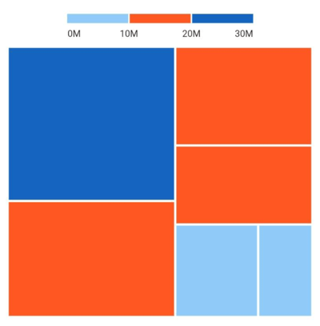

## Should always show scrollbar

You can control the visibility of the scrollbar in the treemap using the [`shouldAlwaysShowScrollbar`](https://pub.dev/documentation/syncfusion_flutter_treemap/latest/treemap/TreemapLegend/shouldAlwaysShowScrollbar.html) property. When set to true, the scrollbar will always be visible, allowing easy navigation through the treemap content even when content is fully within view. The default value is `false`, meaning the scrollbar will only appear when the content is scrollable.




  late List<SocialMediaUsers> _source;

  @override
  void initState() {
    _source = <SocialMediaUsers>[
        SocialMediaUsers('India', 'Facebook', 25.4),
        SocialMediaUsers('USA', 'Instagram', 19.11),
        SocialMediaUsers('Japan', 'Facebook', 13.3),
        SocialMediaUsers('Germany', 'Instagram', 10.65),
        SocialMediaUsers('France', 'Twitter', 7.54),
        SocialMediaUsers('UK', 'Instagram', 4.93),
    ];
    super.initState();
  }

  @override
  Widget build(BuildContext context) {
    return Scaffold(
      body: Center(
          child: Container(
            height: 400,
            width: 400,
            child: SfTreemap(
              dataCount: _source.length,
              weightValueMapper: (int index) {
                return _source[index].usersInMillions;
              },
              levels: [
                TreemapLevel(
                  groupMapper: (int index) {
                    return _source[index].country;
                  },
                ),
              ],
              legend: TreemapLegend(
                shouldAlwaysShowScrollbar: true,
                overflowMode: TreemapLegendOverflowMode.scroll,
              ),
            ),
          ),
        ),
    );
  }

class SocialMediaUsers {
  const SocialMediaUsers(this.country, this.socialMedia, this.usersInMillions);

  final String country;
  final String socialMedia;
  final double usersInMillions;
}




## Title

You can set a title for the treemap using the [`title`](https://pub.dev/documentation/syncfusion_flutter_treemap/latest/treemap/TreemapLegend/title.html) property. This property allows you to provide a descriptive title that helps users understand the context or main focus of the treemap. By default, the [`title`](https://pub.dev/documentation/syncfusion_flutter_treemap/latest/treemap/TreemapLegend/title.html) is `null`, indicating that no title is displayed unless specified explicitly.




  late List<SocialMediaUsers> _source;

  @override
  void initState() {
    _source = <SocialMediaUsers>[
        SocialMediaUsers('India', 'Facebook', 25.4),
        SocialMediaUsers('USA', 'Instagram', 19.11),
        SocialMediaUsers('Japan', 'Facebook', 13.3),
        SocialMediaUsers('Germany', 'Instagram', 10.65),
        SocialMediaUsers('France', 'Twitter', 7.54),
        SocialMediaUsers('UK', 'Instagram', 4.93),
    ];
    super.initState();
  }

  @override
  Widget build(BuildContext context) {
    return Scaffold(
      body: Center(
          child: Container(
            height: 400,
            width: 400,
            child: SfTreemap(
              dataCount: _source.length,
              weightValueMapper: (int index) {
                return _source[index].usersInMillions;
              },
              levels: [
                TreemapLevel(
                  groupMapper: (int index) {
                    return _source[index].country;
                  },
                ),
              ],
              legend: TreemapLegend(
                title: Text('Social media users'),
              ),
            ),
          ),
        ),
    );
  }

class SocialMediaUsers {
  const SocialMediaUsers(this.country, this.socialMedia, this.usersInMillions);

  final String country;
  final String socialMedia;
  final double usersInMillions;
}




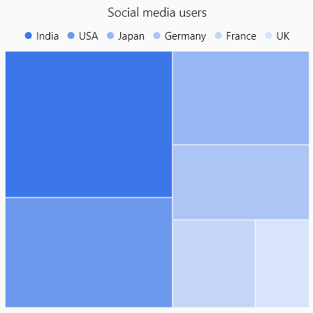

## Position

You can position the legend items in different directions using the [`TreemapLegend.position`](https://pub.dev/documentation/syncfusion_flutter_treemap/latest/treemap/TreemapLegend/position.html) property. The default value of the [position`](https://pub.dev/documentation/syncfusion_flutter_treemap/latest/treemap/TreemapLegend/position.html) property is [`TreemapLegendPosition.top`](https://pub.dev/documentation/syncfusion_flutter_treemap/latest/treemap/TreemapLegendPosition.html). The possible values are [`left`](https://pub.dev/documentation/syncfusion_flutter_treemap/latest/treemap/TreemapLegendPosition.html#left), [`right`](https://pub.dev/documentation/syncfusion_flutter_treemap/latest/treemap/TreemapLegendPosition.html#right), [`top`](https://pub.dev/documentation/syncfusion_flutter_treemap/latest/treemap/TreemapLegendPosition.html#top), and [`bottom`](https://pub.dev/documentation/syncfusion_flutter_treemap/latest/treemap/TreemapLegendPosition.html#bottom).




  late List<SocialMediaUsers> _source;

  @override
  void initState() {
    _source = <SocialMediaUsers>[
        SocialMediaUsers('India', 'Facebook', 25.4),
        SocialMediaUsers('USA', 'Instagram', 19.11),
        SocialMediaUsers('Japan', 'Facebook', 13.3),
        SocialMediaUsers('Germany', 'Instagram', 10.65),
        SocialMediaUsers('France', 'Twitter', 7.54),
        SocialMediaUsers('UK', 'Instagram', 4.93),
    ];
    super.initState();
  }

  @override
  Widget build(BuildContext context) {
    return Scaffold(
      body: Center(
          child: Container(
            height: 400,
            width: 400,
            child: SfTreemap(
              dataCount: _source.length,
              weightValueMapper: (int index) {
                return _source[index].usersInMillions;
              },
              levels: [
                TreemapLevel(
                  groupMapper: (int index) {
                    return _source[index].country;
                  },
                ),
              ],
              legend: TreemapLegend(
                position: TreemapLegendPosition.bottom,
              ),
            ),
          ),
        ),
    );
  }

class SocialMediaUsers {
  const SocialMediaUsers(this.country, this.socialMedia, this.usersInMillions);

  final String country;
  final String socialMedia;
  final double usersInMillions;
}




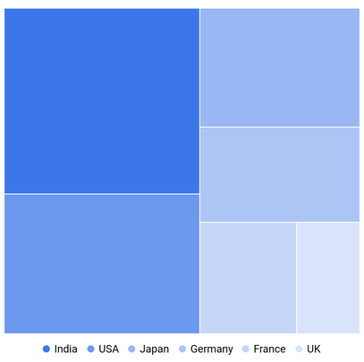

N>
* Refer the [`offset`](https://pub.dev/documentation/syncfusion_flutter_treemap/latest/treemap/TreemapLegend/offset.html), for placing the legend in custom position.

## Offset

You can place the legend in custom position using the [`TreemapLegend.offset`](https://pub.dev/documentation/syncfusion_flutter_treemap/latest/treemap/TreemapLegend/offset.html) property. The default value of the [`offset`](https://pub.dev/documentation/syncfusion_flutter_treemap/latest/treemap/TreemapLegend/offset.html) property is `null`.

If the property [`TreemapLegend.offset`](https://pub.dev/documentation/syncfusion_flutter_treemap/latest/treemap/TreemapLegend/offset.html) has been set with the property [`TreemapLegend.position`](https://pub.dev/documentation/syncfusion_flutter_treemap/latest/treemap/TreemapLegend/position.html) as top, then the legend will be placed in top but with absolute position, i.e. legend will not take dedicated position for it and will be drawn at the top of the map.




  late List<SocialMediaUsers> _source;

  @override
  void initState() {
    _source = <SocialMediaUsers>[
        SocialMediaUsers('India', 'Facebook', 25.4),
        SocialMediaUsers('USA', 'Instagram', 19.11),
        SocialMediaUsers('Japan', 'Facebook', 13.3),
        SocialMediaUsers('Germany', 'Instagram', 10.65),
        SocialMediaUsers('France', 'Twitter', 7.54),
        SocialMediaUsers('UK', 'Instagram', 4.93),
    ];
    super.initState();
  }

  @override
  Widget build(BuildContext context) {
    return Scaffold(
      body: Center(
          child: Container(
            height: 400,
            width: 400,
            child: SfTreemap(
              dataCount: _source.length,
              weightValueMapper: (int index) {
                return _source[index].usersInMillions;
              },
              levels: [
                TreemapLevel(
                  groupMapper: (int index) {
                    return _source[index].country;
                  },
                ),
              ],
              legend: TreemapLegend(
                offset: Offset(70, 250),
              ),
            ),
          ),
        ),
    );
  }

class SocialMediaUsers {
  const SocialMediaUsers(this.country, this.socialMedia, this.usersInMillions);

  final String country;
  final String socialMedia;
  final double usersInMillions;
}




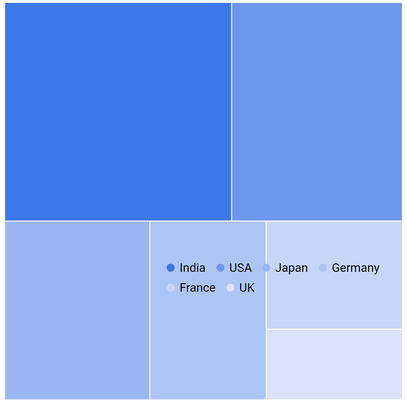

## Overflow mode

<b>For default legend</b>

You can wrap or scroll the legend items using the [`TreemapLegend.overflowMode`](https://pub.dev/documentation/syncfusion_flutter_treemap/latest/treemap/TreemapLegend/overflowMode.html) property. The default value of the [`overflowMode`](https://pub.dev/documentation/syncfusion_flutter_treemap/latest/treemap/TreemapLegend/overflowMode.html) property is [`TreemapLegendOverflowMode.wrap`](https://pub.dev/documentation/syncfusion_flutter_treemap/latest/treemap/TreemapLegendOverflowMode.html). The possible values are [`scroll`](https://pub.dev/documentation/syncfusion_flutter_treemap/latest/treemap/TreemapLegendOverflowMode.html#scroll) and [`wrap`](https://pub.dev/documentation/syncfusion_flutter_treemap/latest/treemap/TreemapLegendOverflowMode.html#wrap).

If the legend position is `left` or `right`, then the default scroll direction is `vertical`.

If the legend position is `top` or `bottom`, then the default scroll direction is `horizontal`.




  late List<SocialMediaUsers> _source;

  @override
  void initState() {
    _source = <SocialMediaUsers>[
        SocialMediaUsers('India', 'Facebook', 25.4),
        SocialMediaUsers('USA', 'Instagram', 19.11),
        SocialMediaUsers('Japan', 'Facebook', 13.3),
        SocialMediaUsers('China', 'Facebook', 12.3),
        SocialMediaUsers('Germany', 'Instagram', 10.65),
        SocialMediaUsers('France', 'Twitter', 7.54),
        SocialMediaUsers('South America', 'Twitter', 5.54),
        SocialMediaUsers('United Kingdom', 'Instagram', 4.93),
    ];
    super.initState();
  }

  @override
  Widget build(BuildContext context) {
    return Scaffold(
      body: Center(
          child: Container(
            height: 400,
            width: 400,
            child: SfTreemap(
              dataCount: _source.length,
              weightValueMapper: (int index) {
                return _source[index].usersInMillions;
              },
              levels: [
                TreemapLevel(
                  groupMapper: (int index) {
                    return _source[index].country;
                  },
                ),
              ],
              legend: TreemapLegend(
                overflowMode: TreemapLegendOverflowMode.scroll,
              ),
            ),
          ),
        ),
    );
  }

class SocialMediaUsers {
  const SocialMediaUsers(this.country, this.socialMedia, this.usersInMillions);

  final String country;
  final String socialMedia;
  final double usersInMillions;
}




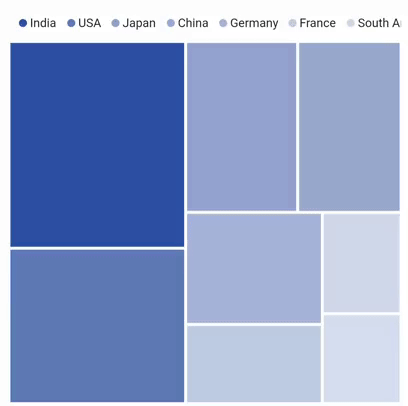

<b>For bar legend</b>

You can wrap or scroll the bar legend items using the [`TreemapLegend.overflowMode`](https://pub.dev/documentation/syncfusion_flutter_treemap/latest/treemap/TreemapLegend/overflowMode.html) property. The default value of the `overflowMode` property is [`TreemapLegendOverflowMode.scroll`](https://pub.dev/documentation/syncfusion_flutter_treemap/latest/treemap/TreemapLegendOverflowMode.html). The possible values are `scroll` and `wrap`.

If the legend position is `left` or `right`, then the default scroll direction is `vertical`.

If the legend position is `top` or `bottom`, then the default scroll direction is `horizontal`.




  late List<SocialMediaUsers> _source;

  @override
  void initState() {
    _source = <SocialMediaUsers>[
        SocialMediaUsers('India', 'Facebook', 25.4),
        SocialMediaUsers('USA', 'Instagram', 19.11),
        SocialMediaUsers('Japan', 'Facebook', 13.3),
        SocialMediaUsers('Germany', 'Instagram', 10.65),
        SocialMediaUsers('France', 'Twitter', 7.54),
        SocialMediaUsers('UK', 'Instagram', 4.93),
    ];
    super.initState();
  }

  @override
  Widget build(BuildContext context) {
    return Scaffold(
      body: Center(
          child: Container(
            height: 400,
            width: 400,
            child: SfTreemap(
              dataCount: _source.length,
              weightValueMapper: (int index) {
                return _source[index].usersInMillions;
              },
              levels: [
                TreemapLevel(
                  groupMapper: (int index) {
                    return _source[index].country;
                  },
                ),
              ],
              legend: TreemapLegend.bar(
                overflowMode: TreemapLegendOverflowMode.scroll,
              ),
            ),
          ),
        ),
    );
  }

class SocialMediaUsers {
  const SocialMediaUsers(this.country, this.socialMedia, this.usersInMillions);

  final String country;
  final String socialMedia;
  final double usersInMillions;
}




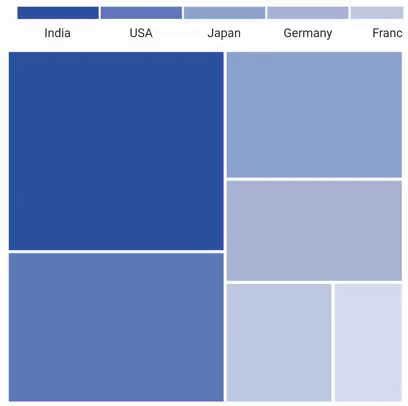

N>
* Refer the [`iconSize`](https://pub.dev/documentation/syncfusion_flutter_treemap/latest/treemap/TreemapLegend/TreemapLegend.html), for changing the size of the icon.

## Text style

You can customize the legend item's text style using the [`TreemapLegend.textStyle`](https://pub.dev/documentation/syncfusion_flutter_treemap/latest/treemap/TreemapLegend/textStyle.html) property.




  late List<SocialMediaUsers> _source;

  @override
  void initState() {
    _source = <SocialMediaUsers>[
        SocialMediaUsers('India', 'Facebook', 25.4),
        SocialMediaUsers('USA', 'Instagram', 19.11),
        SocialMediaUsers('Japan', 'Facebook', 13.3),
        SocialMediaUsers('Germany', 'Instagram', 10.65),
        SocialMediaUsers('France', 'Twitter', 7.54),
        SocialMediaUsers('UK', 'Instagram', 4.93),
    ];
    super.initState();
  }

  @override
  Widget build(BuildContext context) {
    return Scaffold(
      body: Center(
          child: Container(
            height: 400,
            width: 400,
            child: SfTreemap(
              dataCount: _source.length,
              weightValueMapper: (int index) {
                return _source[index].usersInMillions;
              },
              levels: [
                TreemapLevel(
                  groupMapper: (int index) {
                    return _source[index].country;
                  },
                ),
              ],
              legend: TreemapLegend(
                textStyle: TextStyle(
                  color: Colors.red,
                  fontSize: 14,
                  fontWeight: FontWeight.bold,
                  fontStyle: FontStyle.italic,
                ),
              ),
            ),
          ),
        ),
    );
  }

class SocialMediaUsers {
  const SocialMediaUsers(this.country, this.socialMedia, this.usersInMillions);

  final String country;
  final String socialMedia;
  final double usersInMillions;
}




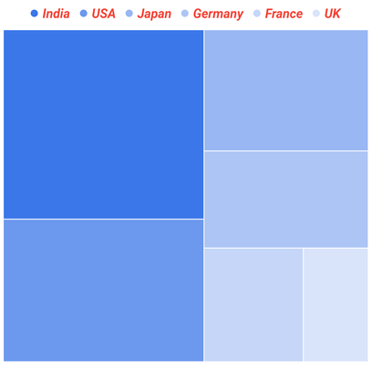

## Default legend appearance customization

You can customize the legend items using the following properties.

* **iconType** - Used to change the icon shape. The default value of the [`iconType`](https://pub.dev/documentation/syncfusion_flutter_treemap/latest/treemap/TreemapLegend/TreemapLegend.html) argument in the constructor is [`TreemapIconType.circle`](https://pub.dev/documentation/syncfusion_flutter_treemap/latest/treemap/TreemapIconType.html#circle). The possible values are [`circle`](https://pub.dev/documentation/syncfusion_flutter_treemap/latest/treemap/TreemapIconType.html#circle), [`rectangle`](https://pub.dev/documentation/syncfusion_flutter_treemap/latest/treemap/TreemapIconType.html#rectangle), [`triangle`](https://pub.dev/documentation/syncfusion_flutter_treemap/latest/treemap/TreemapIconType.html#triangle), and [`diamond`](https://pub.dev/documentation/syncfusion_flutter_treemap/latest/treemap/TreemapIconType.html#diamond).
* **iconSize** - Used to change the size of the icon. The default value of [`iconSize`](https://pub.dev/documentation/syncfusion_flutter_treemap/latest/treemap/TreemapLegend/TreemapLegend.html) argument in the constructor is `Size(8.0, 8.0)`.
* **spacing** - Used to provide space between the each legend items. The default value of the [`spacing`](https://pub.dev/documentation/syncfusion_flutter_treemap/latest/treemap/TreemapLegend/spacing.html) argument in the constructor is `10.0`.
* **direction** - Used to arrange the legend items in either horizontal or vertical direction. The default value of [`direction`](https://pub.dev/documentation/syncfusion_flutter_treemap/latest/treemap/TreemapLegend/direction.html) property is `horizontal`, if the value of the [`position`](https://pub.dev/documentation/syncfusion_flutter_treemap/latest/treemap/TreemapLegend/position.html) property is [`top`](https://pub.dev/documentation/syncfusion_flutter_treemap/latest/treemap/TreemapLegendPosition.html#top), [`bottom`](https://pub.dev/documentation/syncfusion_flutter_treemap/latest/treemap/TreemapLegendPosition.html#bottom) and defaults to `vertical`, if the value of the [`position`] property is [`left`](https://pub.dev/documentation/syncfusion_flutter_treemap/latest/treemap/TreemapLegendPosition.html#left) or [`right`](https://pub.dev/documentation/syncfusion_flutter_treemap/latest/treemap/TreemapLegendPosition.html#right).
* **padding** - Used to set padding around the legend. The default value of the [`padding`](https://pub.dev/documentation/syncfusion_flutter_treemap/latest/treemap/TreemapLegend/padding.html) property is `EdgeInsets.all(10.0)`.




  late List<SocialMediaUsers> _source;

  @override
  void initState() {
    _source = <SocialMediaUsers>[
        SocialMediaUsers('India', 'Facebook', 25.4),
        SocialMediaUsers('USA', 'Instagram', 19.11),
        SocialMediaUsers('Japan', 'Facebook', 13.3),
        SocialMediaUsers('Germany', 'Instagram', 10.65),
        SocialMediaUsers('France', 'Twitter', 7.54),
        SocialMediaUsers('UK', 'Instagram', 4.93),
    ];
    super.initState();
  }

  @override
  Widget build(BuildContext context) {
    return Scaffold(
      body: Center(
          child: Container(
            height: 400,
            width: 400,
            child: SfTreemap(
              dataCount: _source.length,
              weightValueMapper: (int index) {
                return _source[index].usersInMillions;
              },
              levels: [
                TreemapLevel(
                  groupMapper: (int index) {
                    return _source[index].country;
                  },
                ),
              ],
              legend: TreemapLegend(
                iconType: TreemapIconType.triangle,
                iconSize: Size(12.0, 12.0),
                spacing: 15,
                padding: EdgeInsets.all(12.0),
                direction: Axis.vertical,
              ),
            ),
          ),
        ),
    );
  }

class SocialMediaUsers {
  const SocialMediaUsers(this.country, this.socialMedia, this.usersInMillions);

  final String country;
  final String socialMedia;
  final double usersInMillions;
}




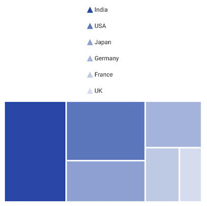

N>
* Refer the `position`, for setting the position of the legend.

## Bar legend segment painting style

### Solid

You can set solid color for the bar by using the [`TreemapLegendPaintingStyle.solid`](https://pub.dev/documentation/syncfusion_flutter_treemap/latest/treemap/TreemapLegendPaintingStyle.html#solid). By defaults [`TreemapLegendPaintingStyle`](https://pub.dev/documentation/syncfusion_flutter_treemap/latest/treemap/TreemapLegendPaintingStyle.html) will be [`solid`](https://pub.dev/documentation/syncfusion_flutter_treemap/latest/treemap/TreemapLegendPaintingStyle.html#solid).




  late List<SocialMediaUsers> _source;
  late List<TreemapColorMapper> _colorMappers;

  @override
  void initState() {
    _source = <SocialMediaUsers>[
        SocialMediaUsers('India', 'Facebook', 25.4),
        SocialMediaUsers('USA', 'Instagram', 19.11),
        SocialMediaUsers('Japan', 'Facebook', 13.3),
        SocialMediaUsers('Germany', 'Instagram', 10.65),
        SocialMediaUsers('France', 'Twitter', 7.54),
        SocialMediaUsers('UK', 'Instagram', 4.93),
    ];

    _colorMappers = <TreemapColorMapper>[
        TreemapColorMapper.range(from: 0, to: 10, color: Colors.blue[200]!),
        TreemapColorMapper.range(from: 10, to: 20, color: Colors.deepOrange),
        TreemapColorMapper.range(from: 20, to: 30, color: Colors.blue[800]!),
      ];
    super.initState();
  }

  @override
  Widget build(BuildContext context) {
    return Scaffold(
      body: SfTreemap(
          dataCount: _source.length,
          weightValueMapper: (int index) {
            return _source[index].usersInMillions;
          },
          levels: [
            TreemapLevel(
              padding: const EdgeInsets.all(1.5),
              groupMapper: (int index) {
                return _source[index].country;
              },
              colorValueMapper: (TreemapTile tile) {
                return tile.weight;
              },
            ),
          ],
          colorMappers: _colorMappers,
          legend: TreemapLegend.bar(
            segmentPaintingStyle: TreemapLegendPaintingStyle.solid,
          ),
        ),
    );
  }

class SocialMediaUsers {
  const SocialMediaUsers(this.country, this.socialMedia, this.usersInMillions);

  final String country;
  final String socialMedia;
  final double usersInMillions;
}




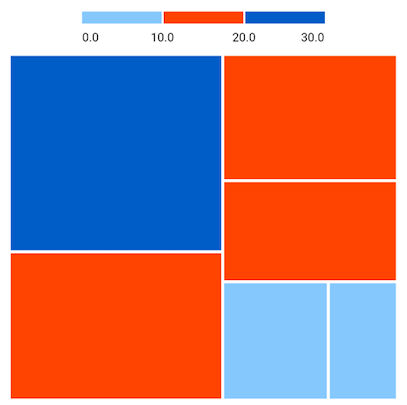

### Gradient

You can set gradient color for the bar by using the [`TreemapLegendPaintingStyle.gradient`](https://pub.dev/documentation/syncfusion_flutter_treemap/latest/treemap/TreemapLegendPaintingStyle.html#gradient).




  late List<SocialMediaUsers> _source;
  late List<TreemapColorMapper> _colorMappers;

  @override
  void initState() {
    _source = <SocialMediaUsers>[
        SocialMediaUsers('India', 'Facebook', 25.4),
        SocialMediaUsers('USA', 'Instagram', 19.11),
        SocialMediaUsers('Japan', 'Facebook', 13.3),
        SocialMediaUsers('Germany', 'Instagram', 10.65),
        SocialMediaUsers('France', 'Twitter', 7.54),
        SocialMediaUsers('UK', 'Instagram', 4.93),
    ];

    _colorMappers = <TreemapColorMapper>[
        TreemapColorMapper.range(from: 0, to: 10, color: Colors.blue[200]!),
        TreemapColorMapper.range(from: 10, to: 20, color: Colors.deepOrange),
        TreemapColorMapper.range(from: 20, to: 30, color: Colors.blue[800]!),
      ];
    super.initState();
  }

  @override
  Widget build(BuildContext context) {
    return Scaffold(
      body: SfTreemap(
          dataCount: _source.length,
          weightValueMapper: (int index) {
            return _source[index].usersInMillions;
          },
          levels: [
            TreemapLevel(
              padding: const EdgeInsets.all(1.5),
              groupMapper: (int index) {
                return _source[index].country;
              },
              colorValueMapper: (TreemapTile tile) {
                return tile.weight;
              },
            ),
          ],
          colorMappers: _colorMappers,
          legend: TreemapLegend.bar(
            segmentPaintingStyle: TreemapLegendPaintingStyle.gradient,
          ),
        ),
    );
  }

class SocialMediaUsers {
  const SocialMediaUsers(this.country, this.socialMedia, this.usersInMillions);

  final String country;
  final String socialMedia;
  final double usersInMillions;
}




## Bar legend appearance customization

You can customize the legend items using the following properties.

* **segmentSize** - Used to change the size of individual bar segments. When gradient paint style is applied, [`segmentSize`](https://pub.dev/documentation/syncfusion_flutter_treemap/latest/treemap/TreemapLegend/TreemapLegend.bar.html) argument in the constructor will update the whole bar. The default value of the [`segmentSize`](https://pub.dev/documentation/syncfusion_flutter_treemap/latest/treemap/TreemapLegend/TreemapLegend.bar.html) property is `Size(80.0, 12.0)`.
* **labelOverflow** - Used to remove or trim the legend labels based on the bar legend size.The default value of the [`labelOverflow`](https://pub.dev/documentation/syncfusion_flutter_treemap/latest/treemap/TreemapLegend/TreemapLegend.bar.html) argument in the constructor will be `TreemapLabelOverflow.visible`.
* **edgeLabelsPlacement** - Used to place the edge labels either inside or outside of the bar legend. The default value of the [`edgeLabelsPlacement`](https://pub.dev/documentation/syncfusion_flutter_treemap/latest/treemap/TreemapLegend/TreemapLegend.bar.html) argument in the constructor will be `TreemapLegendEdgeLabelsPlacement.inside`.
* **spacing** - Used to provide space between the each legend items. The default value of the [`spacing`](https://pub.dev/documentation/syncfusion_flutter_treemap/latest/treemap/TreemapLegend/TreemapLegend.bar.html) is `2.0`. This is not applicable for gradient legend.
* **direction** - Used to arrange the legend items in either horizontal or vertical direction. The default value of [`direction`](https://pub.dev/documentation/syncfusion_flutter_treemap/latest/treemap/TreemapLegend/TreemapLegend.bar.html) property is `horizontal`, if the value of the `position` property is `top`, `bottom` and defaults to `vertical`, if the value of the [`position`](https://pub.dev/documentation/syncfusion_flutter_treemap/latest/treemap/TreemapLegend/TreemapLegend.bar.html) property is `left` or `right`.
* **padding** - Used to set padding around the legend. The default value of the [`padding`](https://pub.dev/documentation/syncfusion_flutter_treemap/latest/treemap/TreemapLegend/TreemapLegend.bar.html) property is `EdgeInsets.all(10.0)`.




  late List<SocialMediaUsers> _source;

  @override
  void initState() {
    _source = <SocialMediaUsers>[
        SocialMediaUsers('India', 'Facebook', 25.4),
        SocialMediaUsers('USA', 'Instagram', 19.11),
        SocialMediaUsers('Japan', 'Facebook', 13.3),
        SocialMediaUsers('Germany', 'Instagram', 10.65),
        SocialMediaUsers('United Kingdom', 'Instagram', 4.93),
        SocialMediaUsers('France', 'Twitter', 7.54),
    ];
    super.initState();
  }

  @override
  Widget build(BuildContext context) {
    return Scaffold(
      body: Center(
          child: Container(
            height: 400,
            width: 400,
            child: SfTreemap(
              dataCount: _source.length,
              weightValueMapper: (int index) {
                return _source[index].usersInMillions;
              },
              levels: [
                TreemapLevel(
                  groupMapper: (int index) {
                    return _source[index].country;
                  },
                ),
              ],
              legend: TreemapLegend.bar(
                segmentSize: Size(60, 12),
                labelOverflow: TreemapLabelOverflow.ellipsis,
                edgeLabelsPlacement: TreemapLegendEdgeLabelsPlacement.center,
                padding: EdgeInsets.all(12),
                direction: Axis.horizontal,
                spacing: 5,
              ),
            ),
          ),
        ),
    );
  }

class SocialMediaUsers {
  const SocialMediaUsers(this.country, this.socialMedia, this.usersInMillions);

  final String country;
  final String socialMedia;
  final double usersInMillions;
}




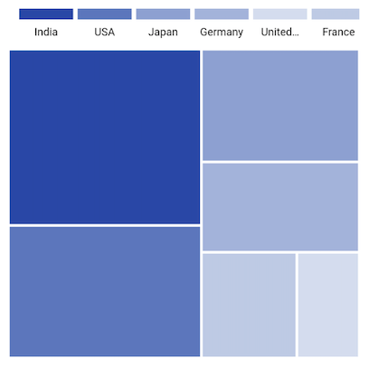

## Bar legend labels placement

You can place the labels either between the segments or on the segments using the [`labelsPlacement`](https://pub.dev/documentation/syncfusion_flutter_treemap/latest/treemap/TreemapLegend/TreemapLegend.bar.html) property.

<b>Labels placement for range color mapper</b>

The labels are positioned between the segments when setting range color mapper without setting color mapper [`TreemapColorMapper.name`](https://pub.dev/documentation/syncfusion_flutter_treemap/latest/treemap/TreemapColorMapper/name.html) property. The [`TreemapColorMapper.from`](https://pub.dev/documentation/syncfusion_flutter_treemap/latest/treemap/TreemapColorMapper/from.html) value of the first item is positioned at starting point of the first segment and the [`TreemapColorMapper.to`](https://pub.dev/documentation/syncfusion_flutter_treemap/latest/treemap/TreemapColorMapper/to.html) value of the first item is placed at the first segment end position. For other segments, the values of [`TreemapColorMapper.to`](https://pub.dev/documentation/syncfusion_flutter_treemap/latest/treemap/TreemapColorMapper/to.html) is positioned as label between the other segments.




  late List<SocialMediaUsers> _source;
  late List<TreemapColorMapper> _colorMappers;

  @override
  void initState() {
    _source = <SocialMediaUsers>[
        SocialMediaUsers('India', 'Facebook', 25.4),
        SocialMediaUsers('USA', 'Instagram', 19.11),
        SocialMediaUsers('Japan', 'Facebook', 13.3),
        SocialMediaUsers('Germany', 'Instagram', 10.65),
        SocialMediaUsers('France', 'Twitter', 7.54),
        SocialMediaUsers('UK', 'Instagram', 4.93),
    ];

    _colorMappers = <TreemapColorMapper>[
        TreemapColorMapper.range(from: 0, to: 10, color: Colors.blue[200]!),
        TreemapColorMapper.range(from: 10, to: 20, color: Colors.deepOrange),
        TreemapColorMapper.range(from: 20, to: 30, color: Colors.blue[800]!),
      ];
    super.initState();
  }

  @override
  Widget build(BuildContext context) {
    return Scaffold(
      body: SfTreemap(
          dataCount: _source.length,
          weightValueMapper: (int index) {
            return _source[index].usersInMillions;
          },
          levels: [
            TreemapLevel(
              padding: const EdgeInsets.all(1.5),
              groupMapper: (int index) {
                return _source[index].country;
              },
              colorValueMapper: (TreemapTile tile) {
                return tile.weight;
              },
            ),
          ],
          colorMappers: _colorMappers,
          legend: TreemapLegend.bar(
            labelsPlacement: TreemapLegendLabelsPlacement.betweenItems,
            segmentPaintingStyle: TreemapLegendPaintingStyle.gradient,
          ),
        ),
    );
  }

class SocialMediaUsers {
  const SocialMediaUsers(this.country, this.socialMedia, this.usersInMillions);

  final String country;
  final String socialMedia;
  final double usersInMillions;
}




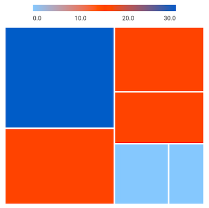

The labels are positioned between the segments when setting range color mapper along with setting color mapper [`TreemapColorMapper.name`](https://pub.dev/documentation/syncfusion_flutter_treemap/latest/treemap/TreemapColorMapper/name.html) property. The [`TreemapColorMapper.from`](https://pub.dev/documentation/syncfusion_flutter_treemap/latest/treemap/TreemapColorMapper/from.html) value of the first item is positioned at starting point of the first segment and the [`TreemapColorMapper.name`](https://pub.dev/documentation/syncfusion_flutter_treemap/latest/treemap/TreemapColorMapper/name.html) value of the first item is placed at the first segment end position. For Other segments, the value of [`TreemapColorMapper.name`](https://pub.dev/documentation/syncfusion_flutter_treemap/latest/treemap/TreemapColorMapper/name.html) is positioned as label between the segments.




  late List<SocialMediaUsers> _source;
  late List<TreemapColorMapper> _colorMappers;

  @override
  void initState() {
    _source = <SocialMediaUsers>[
        SocialMediaUsers('India', 'Facebook', 25.4),
        SocialMediaUsers('USA', 'Instagram', 19.11),
        SocialMediaUsers('Japan', 'Facebook', 13.3),
        SocialMediaUsers('Germany', 'Instagram', 10.65),
        SocialMediaUsers('France', 'Twitter', 7.54),
        SocialMediaUsers('UK', 'Instagram', 4.93),
    ];

    _colorMappers = <TreemapColorMapper>[
        TreemapColorMapper.range(
            from: 0, to: 10, color: Colors.blue[200]!, name: '<10'),
        TreemapColorMapper.range(
            from: 10, to: 20, color: Colors.deepOrange, name: '10 - 20'),
        TreemapColorMapper.range(
            from: 20, to: 30, color: Colors.blue[800]!, name: '20 - 30'),
      ];
    super.initState();
  }

  @override
  Widget build(BuildContext context) {
    return Scaffold(
      body: SfTreemap(
          dataCount: _source.length,
          weightValueMapper: (int index) {
            return _source[index].usersInMillions;
          },
          levels: [
            TreemapLevel(
              padding: const EdgeInsets.all(1.5),
              groupMapper: (int index) {
                return _source[index].country;
              },
              colorValueMapper: (TreemapTile tile) {
                return tile.weight;
              },
            ),
          ],
          colorMappers: _colorMappers,
          legend: TreemapLegend.bar(
            labelsPlacement: TreemapLegendLabelsPlacement.betweenItems,
            segmentPaintingStyle: TreemapLegendPaintingStyle.gradient,
          ),
        ),
    );
  }

class SocialMediaUsers {
  const SocialMediaUsers(this.country, this.socialMedia, this.usersInMillions);

  final String country;
  final String socialMedia;
  final double usersInMillions;
}




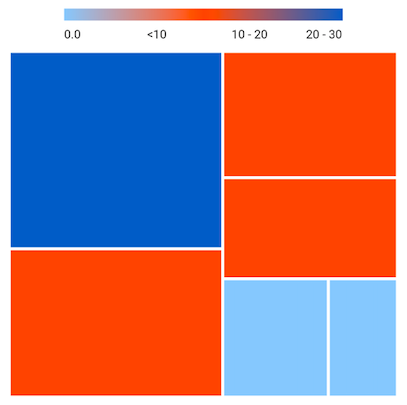

The labels are positioned at the center of the segments when setting the [`labelsPlacement`](https://pub.dev/documentation/syncfusion_flutter_treemap/latest/treemap/TreemapLegend/TreemapLegend.bar.html) property to [`TreemapLegendLabelsPlacement.onItem`](https://pub.dev/documentation/syncfusion_flutter_treemap/latest/treemap/TreemapLegendLabelsPlacement.html#onItem). The labels will based on the value of [`TreemapColorMapper.name`](https://pub.dev/documentation/syncfusion_flutter_treemap/latest/treemap/TreemapColorMapper/name.html) property. If the value of [`TreemapColorMapper.name`](https://pub.dev/documentation/syncfusion_flutter_treemap/latest/treemap/TreemapColorMapper/name.html) property is null, labels will be based on the values of [`TreemapColorMapper.from`](https://pub.dev/documentation/syncfusion_flutter_treemap/latest/treemap/TreemapColorMapper/from.html) and [`TreemapColorMapper.to`](https://pub.dev/documentation/syncfusion_flutter_treemap/latest/treemap/TreemapColorMapper/to.html) properties.




  late List<SocialMediaUsers> _source;
  late List<TreemapColorMapper> _colorMappers;

  @override
  void initState() {
    _source = <SocialMediaUsers>[
        SocialMediaUsers('India', 'Facebook', 25.4),
        SocialMediaUsers('USA', 'Instagram', 19.11),
        SocialMediaUsers('Japan', 'Facebook', 13.3),
        SocialMediaUsers('Germany', 'Instagram', 10.65),
        SocialMediaUsers('France', 'Twitter', 7.54),
        SocialMediaUsers('UK', 'Instagram', 4.93),
    ];

    _colorMappers = <TreemapColorMapper>[
        TreemapColorMapper.range(
            from: 0, to: 10, color: Colors.blue[200]!, name: '<10'),
        TreemapColorMapper.range(
            from: 10, to: 20, color: Colors.deepOrange, name: '10 - 20'),
        TreemapColorMapper.range(
            from: 20, to: 30, color: Colors.blue[800]!, name: '20 - 30'),
      ];
    super.initState();
  }

  @override
  Widget build(BuildContext context) {
    return Scaffold(
      body: SfTreemap(
          dataCount: _source.length,
          weightValueMapper: (int index) {
            return _source[index].usersInMillions;
          },
          levels: [
            TreemapLevel(
              padding: const EdgeInsets.all(1.5),
              groupMapper: (int index) {
                return _source[index].country;
              },
              colorValueMapper: (TreemapTile tile) {
                return tile.weight;
              },
            ),
          ],
          colorMappers: _colorMappers,
          legend: TreemapLegend.bar(
            labelsPlacement: TreemapLegendLabelsPlacement.onItem,
            edgeLabelsPlacement: TreemapLegendEdgeLabelsPlacement.center,
            segmentPaintingStyle: TreemapLegendPaintingStyle.gradient,
          ),
        ),
    );
  }

class SocialMediaUsers {
  const SocialMediaUsers(this.country, this.socialMedia, this.usersInMillions);

  final String country;
  final String socialMedia;
  final double usersInMillions;
}




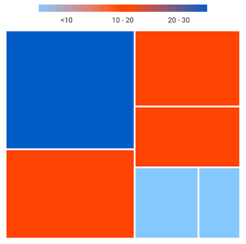

<b>Labels placement for equal color mapper</b>

The [`labelsPlacement`](https://pub.dev/documentation/syncfusion_flutter_treemap/latest/treemap/TreemapLegend/labelsPlacement.html) option is not applicable for the legend label applied with equal color mapper. By default, the labels are positioned at center of the segment.




  late List<SocialMediaUsers> _source;
  late List<TreemapColorMapper> _colorMappers;

  @override
  void initState() {
    _source = <SocialMediaUsers>[
        SocialMediaUsers('India', 'Facebook', 25.4),
        SocialMediaUsers('USA', 'Instagram', 19.11),
        SocialMediaUsers('Japan', 'Facebook', 13.3),
        SocialMediaUsers('Germany', 'Instagram', 10.65),
        SocialMediaUsers('France', 'Twitter', 7.54),
        SocialMediaUsers('UK', 'Instagram', 4.93),
    ];

    _colorMappers = <TreemapColorMapper>[
        TreemapColorMapper.value(value: 'Facebook', color: Colors.blue[200]!),
        TreemapColorMapper.value(value: 'Instagram', color: Colors.deepOrange),
        TreemapColorMapper.value(value: 'Twitter', color: Colors.blue[800]!),
      ];
    super.initState();
  }

  @override
  Widget build(BuildContext context) {
    return Scaffold(
      body: SfTreemap(
          dataCount: _source.length,
          weightValueMapper: (int index) {
            return _source[index].usersInMillions;
          },
          levels: [
            TreemapLevel(
              padding: const EdgeInsets.all(2.5),
              groupMapper: (int index) {
                return _source[index].country;
              },
              labelBuilder: (BuildContext context, TreemapTile tile) {
                return Text(_source[tile.indices[0]].socialMedia);
              },
              colorValueMapper: (TreemapTile tile) {
                return _source[tile.indices[0]].socialMedia;
              },
            ),
          ],
          colorMappers: _colorMappers,
          legend: TreemapLegend.bar(
            edgeLabelsPlacement: TreemapLegendEdgeLabelsPlacement.center,
            segmentPaintingStyle: TreemapLegendPaintingStyle.gradient,
          ),
        ),
    );
  }

class SocialMediaUsers {
  const SocialMediaUsers(this.country, this.socialMedia, this.usersInMillions);

  final String country;
  final String socialMedia;
  final double usersInMillions;
}




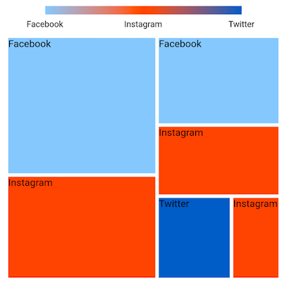

## Show pointer

You may show a pointer on the solid or gradient bar legend while hovering over a tile using the [`showPointerOnHover`](https://pub.dev/documentation/syncfusion_flutter_treemap/latest/treemap/TreemapLegend/showPointerOnHover.html) property. The default value of the [`showPointerOnHover`](https://pub.dev/documentation/syncfusion_flutter_treemap/latest/treemap/TreemapLegend/showPointerOnHover.html) property is `false`.




  late List<IndianPopulation> _population;
  late List<TreemapColorMapper> _colorMappers;

  @override
  void initState() {
    _population = <IndianPopulation>[
        IndianPopulation('Gujarat', 54612),
        IndianPopulation('Bangalore', 473069),
        IndianPopulation('Chennai', 210312),
        IndianPopulation('Andra', 95419),
        IndianPopulation('Kashmir', 80599),
        IndianPopulation('Delhi', 39000),
        IndianPopulation('Mumbai', 122897),
        IndianPopulation('Kolkatta', 184135),
    ];

    _colorMappers = <TreemapColorMapper>[
        TreemapColorMapper.range(from: 0, to: 10, color: Colors.blueGrey),
        TreemapColorMapper.range(from: 10, to: 20, color: Colors.green),
        TreemapColorMapper.range(from: 20, to: 30, color: Colors.lime),
        TreemapColorMapper.range(from: 30, to: 50, color: Colors.teal),
    ];
    super.initState();
  }

  @override
  Widget build(BuildContext context) {
    return MaterialApp(
      home: Scaffold(
        body: Center(
          child: Container(
              height: 400,
              width: 400,
              child: SfTreemap(
                dataCount: _population.length,
                weightValueMapper: (int index) =>
                    _population[index].population.toDouble(),
                colorMappers: _colorMappers,
                legend: TreemapLegend.bar(
                  segmentPaintingStyle: TreemapLegendPaintingStyle.gradient,
                  showPointerOnHover: true,
                ),
                levels: [
                  TreemapLevel(
                    groupMapper: (int index) {
                      return _population[index].state;
                    },
                    colorValueMapper: (TreemapTile tile) {
                      return _population[tile.indices[0]].population / 10000;
                    },
                  )
                ],
              ),
            ),
          ),
        ),
    );
  }

class IndianPopulation {
  const IndianPopulation(this.state, this.population);

  final String state;
  final int population;
}




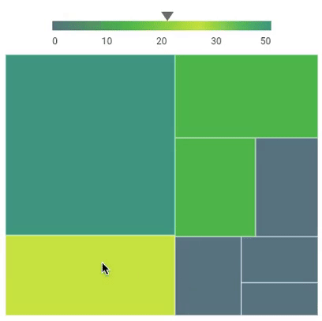

## Pointer builder

It returns a widget for the given value.

The pointer is used to indicate the exact color of the hovering tile on the legend segment.

The [`pointerBuilder`](https://pub.dev/documentation/syncfusion_flutter_treemap/latest/treemap/TreemapLegend/pointerBuilder.html) will be called when the user interacts with the tiles i.e., while tapping in touch devices and hovering in the mouse enabled devices.




  late List<IndianPopulation> _population;
  late List<TreemapColorMapper> _colorMappers;

  @override
  void initState() {
    _population = <IndianPopulation>[
        IndianPopulation('Gujarat', 54612),
        IndianPopulation('Bangalore', 473069),
        IndianPopulation('Chennai', 210312),
        IndianPopulation('Andra', 95419),
        IndianPopulation('Kashmir', 80599),
        IndianPopulation('Delhi', 39000),
        IndianPopulation('Mumbai', 122897),
        IndianPopulation('Kolkatta', 184135),
    ];

    _colorMappers = <TreemapColorMapper>[
        TreemapColorMapper.range(from: 0, to: 10, color: Colors.blueGrey),
        TreemapColorMapper.range(from: 10, to: 20, color: Colors.green),
        TreemapColorMapper.range(from: 20, to: 30, color: Colors.lime),
        TreemapColorMapper.range(from: 30, to: 50, color: Colors.teal),
    ];
    super.initState();
  }

  @override
  Widget build(BuildContext context) {
    return MaterialApp(
        home: Scaffold(
          body: Center(
            child: Container(
              height: 400,
              width: 400,
              child: SfTreemap(
                dataCount: _population.length,
                weightValueMapper: (int index) =>
                    _population[index].population.toDouble(),
                colorMappers: _colorMappers,
                legend: TreemapLegend.bar(
                  segmentPaintingStyle: TreemapLegendPaintingStyle.gradient,
                  showPointerOnHover: true,
                  pointerBuilder: (BuildContext context, dynamic value) {
                    return Icon(Icons.arrow_downward, size: 15);
                  },
                ),
                levels: [
                  TreemapLevel(
                    groupMapper: (int index) {
                      return _population[index].state;
                    },
                    colorValueMapper: (TreemapTile tile) {
                      return _population[tile.indices[0]].population / 10000;
                    },
                  )
                ],
              ),
            ),
          ),
        ),
    );
  }

class IndianPopulation {
  const IndianPopulation(this.state, this.population);

  final String state;
  final int population;
}




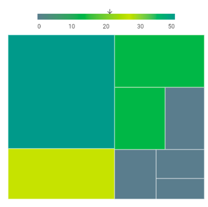

## Pointer customization

You can customize the size and color of the pointer using the [`pointerSize`](https://pub.dev/documentation/syncfusion_flutter_treemap/latest/treemap/TreemapLegend/pointerSize.html) and [`pointerColor`](https://pub.dev/documentation/syncfusion_flutter_treemap/latest/treemap/TreemapLegend/pointerColor.html) properties. The default value of the [`pointerSize`](https://pub.dev/documentation/syncfusion_flutter_treemap/latest/treemap/TreemapLegend/pointerSize.html) property is `Size(16, 12)`.




  late List<IndianPopulation> _population;
  late List<TreemapColorMapper> _colorMappers;

  @override
  void initState() {
    _population = <IndianPopulation>[
        IndianPopulation('Gujarat', 54612),
        IndianPopulation('Bangalore', 473069),
        IndianPopulation('Chennai', 210312),
        IndianPopulation('Andra', 95419),
        IndianPopulation('Kashmir', 80599),
        IndianPopulation('Delhi', 39000),
        IndianPopulation('Mumbai', 122897),
        IndianPopulation('Kolkatta', 184135),
    ];

    _colorMappers = <TreemapColorMapper>[
        TreemapColorMapper.range(from: 0, to: 10, color: Colors.blueGrey),
        TreemapColorMapper.range(from: 10, to: 20, color: Colors.green),
        TreemapColorMapper.range(from: 20, to: 30, color: Colors.lime),
        TreemapColorMapper.range(from: 30, to: 50, color: Colors.teal),
    ];
    super.initState();
  }

  @override
  Widget build(BuildContext context) {
    return MaterialApp(
      home: Scaffold(
          body: Center(
            child: Container(
              height: 400,
              width: 400,
              child: SfTreemap(
                dataCount: _population.length,
                weightValueMapper: (int index) =>
                    _population[index].population.toDouble(),
                colorMappers: _colorMappers,
                legend: TreemapLegend.bar(
                  segmentPaintingStyle: TreemapLegendPaintingStyle.gradient,
                  showPointerOnHover: true,
                  pointerSize: Size(20, 20),
                  pointerColor: Colors.deepPurple,
                ),
                levels: [
                  TreemapLevel(
                    groupMapper: (int index) {
                      return _population[index].state;
                    },
                    colorValueMapper: (TreemapTile tile) {
                      return _population[tile.indices[0]].population / 10000;
                    },
                  )
                ],
              ),
            ),
          ),
        ),
    );
  }

class IndianPopulation {
  const IndianPopulation(this.state, this.population);

  final String state;
  final int population;
}




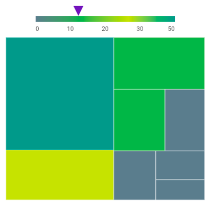
