# Legend in Flutter Treemap (SfTreemap)

The legend provides clarity about the data plotted on the treemap.

## Enable default legend

To display a legend, initialize the [`SfTreemap.legend`](https://pub.dev/documentation/syncfusion_flutter_treemap/latest/treemap/SfTreemap/legend.html) property. By default, the legend item's text is rendered based on the value of [`TreemapLevel.groupMapper`](https://pub.dev/documentation/syncfusion_flutter_treemap/latest/treemap/TreemapLevel/groupMapper.html) property. The default value of the [`legend`](https://pub.dev/documentation/syncfusion_flutter_treemap/latest/treemap/SfTreemap/legend.html) property is `null`.

The examples in this section use the same data source and differ only in the legend constructor.




import 'package:flutter/material.dart';
import 'package:syncfusion_flutter_treemap/treemap.dart';

class DefaultLegendExample extends StatefulWidget {
  const DefaultLegendExample({super.key});

  @override
  State<DefaultLegendExample> createState() => _DefaultLegendExampleState();
}

class _DefaultLegendExampleState extends State<DefaultLegendExample> {
  late List<SocialMediaUsers> _source;

  @override
  void initState() {
    _source = <SocialMediaUsers>[
        SocialMediaUsers('India', 'Facebook', 25.4),
        SocialMediaUsers('USA', 'Instagram', 19.11),
        SocialMediaUsers('Japan', 'Facebook', 13.3),
        SocialMediaUsers('Germany', 'Instagram', 10.65),
        SocialMediaUsers('France', 'Twitter', 7.54),
        SocialMediaUsers('UK', 'Instagram', 4.93),
    ];
    super.initState();
  }

  @override
  Widget build(BuildContext context) {
    return Scaffold(
      body: Center(
          child: SizedBox(
            height: 400,
            width: 400,
            child: SfTreemap(
              dataCount: _source.length,
              weightValueMapper: (int index) {
                return _source[index].usersInMillions;
              },
              levels: [
                TreemapLevel(
                  groupMapper: (int index) {
                    return _source[index].country;
                  },
                ),
              ],
              legend: TreemapLegend(),
            ),
          ),
        ),
    );
  }
}

class SocialMediaUsers {
  const SocialMediaUsers(this.country, this.socialMedia, this.usersInMillions);

  final String country;
  final String socialMedia;
  final double usersInMillions;
}




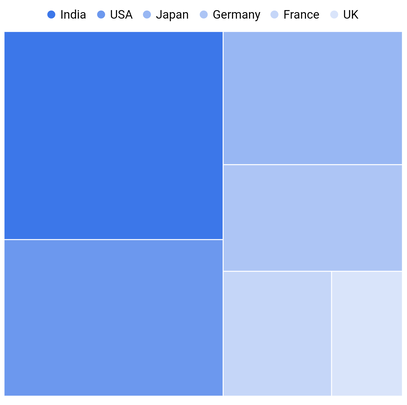

N>
* Refer the [`TreemapLegend.bar`](https://pub.dev/documentation/syncfusion_flutter_treemap/latest/treemap/TreemapLegend/TreemapLegend.bar.html), to display a bar-shaped legend.

## Bar shape legend

You can show bar shape legend by initializing the [`SfTreemap.legend`](https://pub.dev/documentation/syncfusion_flutter_treemap/latest/treemap/SfTreemap/legend.html) property as [`TreemapLegend.bar`](https://pub.dev/documentation/syncfusion_flutter_treemap/latest/treemap/TreemapLegend/TreemapLegend.bar.html). By default, the legend item's text is rendered based on the value of [`TreemapLevel.groupMapper`](https://pub.dev/documentation/syncfusion_flutter_treemap/latest/treemap/TreemapLevel/groupMapper.html) property.




import 'package:flutter/material.dart';
import 'package:syncfusion_flutter_treemap/treemap.dart';

class BarLegendExample extends StatefulWidget {
  const BarLegendExample({super.key});

  @override
  State<BarLegendExample> createState() => _BarLegendExampleState();
}

class _BarLegendExampleState extends State<BarLegendExample> {
  late List<SocialMediaUsers> _source;

  @override
  void initState() {
    _source = <SocialMediaUsers>[
        SocialMediaUsers('India', 'Facebook', 25.4),
        SocialMediaUsers('USA', 'Instagram', 19.11),
        SocialMediaUsers('Japan', 'Facebook', 13.3),
        SocialMediaUsers('Germany', 'Instagram', 10.65),
        SocialMediaUsers('France', 'Twitter', 7.54),
        SocialMediaUsers('UK', 'Instagram', 4.93),
    ];
    super.initState();
  }

  @override
  Widget build(BuildContext context) {
    return Scaffold(
      body: Center(
          child: SizedBox(
            height: 400,
            width: 400,
            child: SfTreemap(
              dataCount: _source.length,
              weightValueMapper: (int index) {
                return _source[index].usersInMillions;
              },
              levels: [
                TreemapLevel(
                  groupMapper: (int index) {
                    return _source[index].country;
                  },
                ),
              ],
              legend: TreemapLegend.bar(),
            ),
          ),
        ),
    );
  }
}

class SocialMediaUsers {
  const SocialMediaUsers(this.country, this.socialMedia, this.usersInMillions);

  final String country;
  final String socialMedia;
  final double usersInMillions;
}




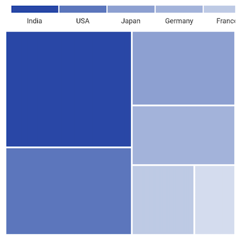

N>
* Refer the [`TreemapLegend`](https://pub.dev/documentation/syncfusion_flutter_treemap/latest/treemap/TreemapLegend/TreemapLegend.html), for the default legend display options.

## Icon and text customization

Legend icons and text are customized based on the [`TreemapLevel.color`](https://pub.dev/documentation/syncfusion_flutter_treemap/latest/treemap/TreemapLevel/color.html) and [`TreemapLevel.groupMapper`](https://pub.dev/documentation/syncfusion_flutter_treemap/latest/treemap/TreemapLevel/groupMapper.html) properties by default. It is possible to customize the legend icon colors and texts using the [`TreemapColorMapper.color`](https://pub.dev/documentation/syncfusion_flutter_treemap/latest/treemap/TreemapColorMapper/color.html) based on the [`TreemapColorMapper.value`](https://pub.dev/documentation/syncfusion_flutter_treemap/latest/treemap/TreemapColorMapper/value.html) or [`TreemapColorMapper.from`](https://pub.dev/documentation/syncfusion_flutter_treemap/latest/treemap/TreemapColorMapper/from.html) and [`TreemapColorMapper.to`](https://pub.dev/documentation/syncfusion_flutter_treemap/latest/treemap/TreemapColorMapper/to.html) properties. You can also customize the legend item's text using the [`TreemapColorMapper.name`](https://pub.dev/documentation/syncfusion_flutter_treemap/latest/treemap/TreemapColorMapper/name.html) when setting the [`TreemapColorMapper.range`](https://pub.dev/documentation/syncfusion_flutter_treemap/latest/treemap/TreemapColorMapper/TreemapColorMapper.range.html) color mapper constructor.




import 'package:flutter/material.dart';
import 'package:syncfusion_flutter_treemap/treemap.dart';

class IconTextCustomizationExample extends StatefulWidget {
  const IconTextCustomizationExample({super.key});

  @override
  State<IconTextCustomizationExample> createState() =>
      _IconTextCustomizationExampleState();
}

class _IconTextCustomizationExampleState extends State<IconTextCustomizationExample> {
  late List<SocialMediaUsers> _source;
  late List<TreemapColorMapper> _colorMappers;

  @override
  void initState() {
    _source = <SocialMediaUsers>[
        SocialMediaUsers('India', 'Facebook', 25.4),
        SocialMediaUsers('USA', 'Instagram', 19.11),
        SocialMediaUsers('Japan', 'Facebook', 13.3),
        SocialMediaUsers('Germany', 'Instagram', 10.65),
        SocialMediaUsers('France', 'Twitter', 7.54),
        SocialMediaUsers('UK', 'Instagram', 4.93),
    ];

    _colorMappers = <TreemapColorMapper>[
        TreemapColorMapper.range(from: 0, to: 10, color: Colors.blue[200]!),
        TreemapColorMapper.range(from: 10, to: 20, color: Colors.deepOrange),
        TreemapColorMapper.range(from: 20, to: 30, color: Colors.blue[800]!),
      ];
    super.initState();
  }

  @override
  Widget build(BuildContext context) {
    return Scaffold(
      body: SfTreemap(
          dataCount: _source.length,
          weightValueMapper: (int index) {
            return _source[index].usersInMillions;
          },
          levels: [
            TreemapLevel(
              padding: const EdgeInsets.all(1.5),
              groupMapper: (int index) {
                return _source[index].country;
              },
              colorValueMapper: (TreemapTile tile) {
                return tile.weight;
              },
            ),
          ],
          colorMappers: _colorMappers,
          legend: TreemapLegend.bar(),
      ),
    );
  }
}

class SocialMediaUsers {
  const SocialMediaUsers(this.country, this.socialMedia, this.usersInMillions);

  final String country;
  final String socialMedia;
  final double usersInMillions;
}




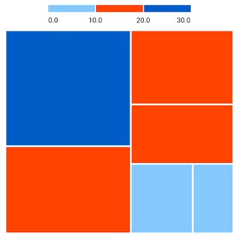

## First segment label customization

You can customize the first segment label of the legend by using the [`TreemapColorMapper.name`](https://pub.dev/documentation/syncfusion_flutter_treemap/latest/treemap/TreemapColorMapper/name.html) property with curly braces. The value inside the first pair of curly braces will be used as the start label for the segment, and the value inside the second pair will be used as the end label.

By default, the [`TreemapColorMapper.from`](https://pub.dev/documentation/syncfusion_flutter_treemap/latest/treemap/TreemapColorMapper/from.html) value appears at the start of the first segment, and the [`TreemapColorMapper.to`](https://pub.dev/documentation/syncfusion_flutter_treemap/latest/treemap/TreemapColorMapper/to.html) value appears at the end.




import 'package:flutter/material.dart';
import 'package:syncfusion_flutter_treemap/treemap.dart';

class FirstSegmentLabelExample extends StatefulWidget {
  const FirstSegmentLabelExample({super.key});

  @override
  State<FirstSegmentLabelExample> createState() =>
      _FirstSegmentLabelExampleState();
}

class _FirstSegmentLabelExampleState extends State<FirstSegmentLabelExample> {
  late List<SocialMediaUsers> _source;
  late List<TreemapColorMapper> _colorMappers;

  @override
  void initState() {
    _source = <SocialMediaUsers>[
      SocialMediaUsers('India', 'Facebook', 25.4),
      SocialMediaUsers('USA', 'Instagram', 19.11),
      SocialMediaUsers('Japan', 'Facebook', 13.3),
      SocialMediaUsers('Germany', 'Instagram', 10.65),
      SocialMediaUsers('France', 'Twitter', 7.54),
      SocialMediaUsers('UK', 'Instagram', 4.93),
    ];

    _colorMappers = <TreemapColorMapper>[
      TreemapColorMapper.range(
          from: 0, to: 10, color: Colors.blue[200]!, name: '{0M},{10M}'),
      TreemapColorMapper.range(
          from: 10, to: 20, color: Colors.deepOrange, name: '20M'),
      TreemapColorMapper.range(
          from: 20, to: 30, color: Colors.blue[800]!, name: '30M'),
    ];
    super.initState();
  }

  @override
  Widget build(BuildContext context) {
    return Scaffold(
      body: SfTreemap(
        dataCount: _source.length,
        weightValueMapper: (int index) {
          return _source[index].usersInMillions;
        },
        levels: [
          TreemapLevel(
            padding: const EdgeInsets.all(1.5),
            groupMapper: (int index) {
              return _source[index].country;
            },
            colorValueMapper: (TreemapTile tile) {
              return tile.weight;
            },
          ),
        ],
        colorMappers: _colorMappers,
        legend: TreemapLegend.bar(),
      ),
    );
  }
}

class SocialMediaUsers {
  const SocialMediaUsers(this.country, this.socialMedia, this.usersInMillions);

  final String country;
  final String socialMedia;
  final double usersInMillions;
}




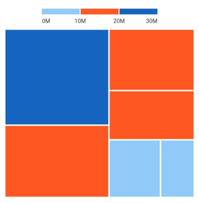

## Scrollbar visibility

You can control the visibility of the scrollbar in the treemap legend using the [`shouldAlwaysShowScrollbar`](https://pub.dev/documentation/syncfusion_flutter_treemap/latest/treemap/TreemapLegend/shouldAlwaysShowScrollbar.html) property. When set to `true`, the scrollbar for the legend will always be visible, making it easier to see and navigate through legend items, even if all items fit within the available space.

The default value is `false`, so the scrollbar appears in legend only when the legend items exceed the available space and scrolling is needed.




import 'package:flutter/material.dart';
import 'package:syncfusion_flutter_treemap/treemap.dart';

class ScrollbarVisibilityExample extends StatefulWidget {
  const ScrollbarVisibilityExample({super.key});

  @override
  State<ScrollbarVisibilityExample> createState() =>
      _ScrollbarVisibilityExampleState();
}

class _ScrollbarVisibilityExampleState extends State<ScrollbarVisibilityExample> {
  late List<SocialMediaUsers> _source;

  @override
  void initState() {
    _source = <SocialMediaUsers>[
        SocialMediaUsers('India', 'Facebook', 25.4),
        SocialMediaUsers('USA', 'Instagram', 19.11),
        SocialMediaUsers('Japan', 'Facebook', 13.3),
        SocialMediaUsers('Germany', 'Instagram', 10.65),
        SocialMediaUsers('France', 'Twitter', 7.54),
        SocialMediaUsers('UK', 'Instagram', 4.93),
    ];
    super.initState();
  }

  @override
  Widget build(BuildContext context) {
    return Scaffold(
      body: Center(
          child: SizedBox(
            height: 400,
            width: 400,
            child: SfTreemap(
              dataCount: _source.length,
              weightValueMapper: (int index) {
                return _source[index].usersInMillions;
              },
              levels: [
                TreemapLevel(
                  groupMapper: (int index) {
                    return _source[index].country;
                  },
                ),
              ],
              legend: TreemapLegend(
                shouldAlwaysShowScrollbar: true,
                overflowMode: TreemapLegendOverflowMode.scroll,
              ),
            ),
          ),
        ),
    );
  }
}

class SocialMediaUsers {
  const SocialMediaUsers(this.country, this.socialMedia, this.usersInMillions);

  final String country;
  final String socialMedia;
  final double usersInMillions;
}




## Title

You can set a title specifically for the legend in the treemap by using the [`title`](https://pub.dev/documentation/syncfusion_flutter_treemap/latest/treemap/TreemapLegend/title.html) property. This property lets you display a descriptive heading for the legend, helping users understand what the legend represents within the treemap.

By default, the value of the legend's [`title`](https://pub.dev/documentation/syncfusion_flutter_treemap/latest/treemap/TreemapLegend/title.html) property is `null`, indicating that no title is displayed for the legend, unless it is specified explicitly.




import 'package:flutter/material.dart';
import 'package:syncfusion_flutter_treemap/treemap.dart';

class LegendTitleExample extends StatefulWidget {
  const LegendTitleExample({super.key});

  @override
  State<LegendTitleExample> createState() => _LegendTitleExampleState();
}

class _LegendTitleExampleState extends State<LegendTitleExample> {
  late List<SocialMediaUsers> _source;

  @override
  void initState() {
    _source = <SocialMediaUsers>[
        SocialMediaUsers('India', 'Facebook', 25.4),
        SocialMediaUsers('USA', 'Instagram', 19.11),
        SocialMediaUsers('Japan', 'Facebook', 13.3),
        SocialMediaUsers('Germany', 'Instagram', 10.65),
        SocialMediaUsers('France', 'Twitter', 7.54),
        SocialMediaUsers('UK', 'Instagram', 4.93),
    ];
    super.initState();
  }

  @override
  Widget build(BuildContext context) {
    return Scaffold(
      body: Center(
          child: SizedBox(
            height: 400,
            width: 400,
            child: SfTreemap(
              dataCount: _source.length,
              weightValueMapper: (int index) {
                return _source[index].usersInMillions;
              },
              levels: [
                TreemapLevel(
                  groupMapper: (int index) {
                    return _source[index].country;
                  },
                ),
              ],
              legend: TreemapLegend(
                title: Text('Social media users'),
              ),
            ),
          ),
        ),
    );
  }
}

class SocialMediaUsers {
  const SocialMediaUsers(this.country, this.socialMedia, this.usersInMillions);

  final String country;
  final String socialMedia;
  final double usersInMillions;
}




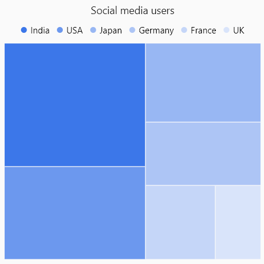

## Position

You can position the legend items in different directions using the [`TreemapLegend.position`](https://pub.dev/documentation/syncfusion_flutter_treemap/latest/treemap/TreemapLegend/position.html) property. The default value of the [position`](https://pub.dev/documentation/syncfusion_flutter_treemap/latest/treemap/TreemapLegend/position.html) property is [`TreemapLegendPosition.top`](https://pub.dev/documentation/syncfusion_flutter_treemap/latest/treemap/TreemapLegendPosition.html). The possible values are [`left`](https://pub.dev/documentation/syncfusion_flutter_treemap/latest/treemap/TreemapLegendPosition.html#left), [`right`](https://pub.dev/documentation/syncfusion_flutter_treemap/latest/treemap/TreemapLegendPosition.html#right), [`top`](https://pub.dev/documentation/syncfusion_flutter_treemap/latest/treemap/TreemapLegendPosition.html#top), and [`bottom`](https://pub.dev/documentation/syncfusion_flutter_treemap/latest/treemap/TreemapLegendPosition.html#bottom).




import 'package:flutter/material.dart';
import 'package:syncfusion_flutter_treemap/treemap.dart';

class LegendPositionExample extends StatefulWidget {
  const LegendPositionExample({super.key});

  @override
  State<LegendPositionExample> createState() => _LegendPositionExampleState();
}

class _LegendPositionExampleState extends State<LegendPositionExample> {
  late List<SocialMediaUsers> _source;

  @override
  void initState() {
    _source = <SocialMediaUsers>[
        SocialMediaUsers('India', 'Facebook', 25.4),
        SocialMediaUsers('USA', 'Instagram', 19.11),
        SocialMediaUsers('Japan', 'Facebook', 13.3),
        SocialMediaUsers('Germany', 'Instagram', 10.65),
        SocialMediaUsers('France', 'Twitter', 7.54),
        SocialMediaUsers('UK', 'Instagram', 4.93),
    ];
    super.initState();
  }

  @override
  Widget build(BuildContext context) {
    return Scaffold(
      body: Center(
          child: SizedBox(
            height: 400,
            width: 400,
            child: SfTreemap(
              dataCount: _source.length,
              weightValueMapper: (int index) {
                return _source[index].usersInMillions;
              },
              levels: [
                TreemapLevel(
                  groupMapper: (int index) {
                    return _source[index].country;
                  },
                ),
              ],
              legend: TreemapLegend(
                position: TreemapLegendPosition.bottom,
              ),
            ),
          ),
        ),
    );
  }
}

class SocialMediaUsers {
  const SocialMediaUsers(this.country, this.socialMedia, this.usersInMillions);

  final String country;
  final String socialMedia;
  final double usersInMillions;
}




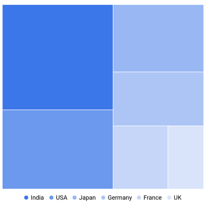

N>
* Refer the [`offset`](https://pub.dev/documentation/syncfusion_flutter_treemap/latest/treemap/TreemapLegend/offset.html), for placing the legend in custom position.

## Offset

You can place the legend in a custom position using the [`TreemapLegend.offset`](https://pub.dev/documentation/syncfusion_flutter_treemap/latest/treemap/TreemapLegend/offset.html) property. The default value of the [`offset`](https://pub.dev/documentation/syncfusion_flutter_treemap/latest/treemap/TreemapLegend/offset.html) property is `null`.

If the property [`TreemapLegend.offset`](https://pub.dev/documentation/syncfusion_flutter_treemap/latest/treemap/TreemapLegend/offset.html) has been set with the property [`TreemapLegend.position`](https://pub.dev/documentation/syncfusion_flutter_treemap/latest/treemap/TreemapLegend/position.html) as top, then the legend will be placed at the top but with an absolute position, meaning it will not take a dedicated position and will be drawn at the top of the map.




import 'package:flutter/material.dart';
import 'package:syncfusion_flutter_treemap/treemap.dart';

class LegendOffsetExample extends StatefulWidget {
  const LegendOffsetExample({super.key});

  @override
  State<LegendOffsetExample> createState() => _LegendOffsetExampleState();
}

class _LegendOffsetExampleState extends State<LegendOffsetExample> {
  late List<SocialMediaUsers> _source;

  @override
  void initState() {
    _source = <SocialMediaUsers>[
        SocialMediaUsers('India', 'Facebook', 25.4),
        SocialMediaUsers('USA', 'Instagram', 19.11),
        SocialMediaUsers('Japan', 'Facebook', 13.3),
        SocialMediaUsers('Germany', 'Instagram', 10.65),
        SocialMediaUsers('France', 'Twitter', 7.54),
        SocialMediaUsers('UK', 'Instagram', 4.93),
    ];
    super.initState();
  }

  @override
  Widget build(BuildContext context) {
    return Scaffold(
      body: Center(
          child: SizedBox(
            height: 400,
            width: 400,
            child: SfTreemap(
              dataCount: _source.length,
              weightValueMapper: (int index) {
                return _source[index].usersInMillions;
              },
              levels: [
                TreemapLevel(
                  groupMapper: (int index) {
                    return _source[index].country;
                  },
                ),
              ],
              legend: TreemapLegend(
                offset: const Offset(70, 250),
              ),
            ),
          ),
        ),
    );
  }
}

class SocialMediaUsers {
  const SocialMediaUsers(this.country, this.socialMedia, this.usersInMillions);

  final String country;
  final String socialMedia;
  final double usersInMillions;
}




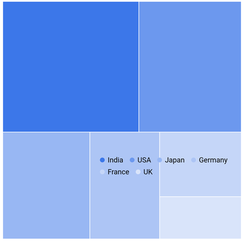

## Overflow mode

<b>For default legend</b>

You can wrap or scroll the legend items using the [`TreemapLegend.overflowMode`](https://pub.dev/documentation/syncfusion_flutter_treemap/latest/treemap/TreemapLegend/overflowMode.html) property. The default value of the [`overflowMode`](https://pub.dev/documentation/syncfusion_flutter_treemap/latest/treemap/TreemapLegend/overflowMode.html) property is [`TreemapLegendOverflowMode.wrap`](https://pub.dev/documentation/syncfusion_flutter_treemap/latest/treemap/TreemapLegendOverflowMode.html). The possible values are [`scroll`](https://pub.dev/documentation/syncfusion_flutter_treemap/latest/treemap/TreemapLegendOverflowMode.html#scroll) and [`wrap`](https://pub.dev/documentation/syncfusion_flutter_treemap/latest/treemap/TreemapLegendOverflowMode.html#wrap).

If the legend position is `left` or `right`, then the default scroll direction is `vertical`.

If the legend position is `top` or `bottom`, then the default scroll direction is `horizontal`.




import 'package:flutter/material.dart';
import 'package:syncfusion_flutter_treemap/treemap.dart';

class OverflowModeExample extends StatefulWidget {
  const OverflowModeExample({super.key});

  @override
  State<OverflowModeExample> createState() => _OverflowModeExampleState();
}

class _OverflowModeExampleState extends State<OverflowModeExample> {
  late List<SocialMediaUsers> _source;

  @override
  void initState() {
    _source = <SocialMediaUsers>[
        SocialMediaUsers('India', 'Facebook', 25.4),
        SocialMediaUsers('USA', 'Instagram', 19.11),
        SocialMediaUsers('Japan', 'Facebook', 13.3),
        SocialMediaUsers('China', 'Facebook', 12.3),
        SocialMediaUsers('Germany', 'Instagram', 10.65),
        SocialMediaUsers('France', 'Twitter', 7.54),
        SocialMediaUsers('South America', 'Twitter', 5.54),
        SocialMediaUsers('United Kingdom', 'Instagram', 4.93),
    ];
    super.initState();
  }

  @override
  Widget build(BuildContext context) {
    return Scaffold(
      body: Center(
        child: SizedBox(
          height: 400,
          width: 400,
          child: SfTreemap(
            dataCount: _source.length,
            weightValueMapper: (int index) {
              return _source[index].usersInMillions;
            },
            levels: [
              TreemapLevel(
                groupMapper: (int index) {
                  return _source[index].country;
                },
              ),
            ],
            legend: TreemapLegend(
              overflowMode: TreemapLegendOverflowMode.scroll,
            ),
          ),
        ),
      ),
    );
  }
}

class SocialMediaUsers {
  const SocialMediaUsers(this.country, this.socialMedia, this.usersInMillions);

  final String country;
  final String socialMedia;
  final double usersInMillions;
}




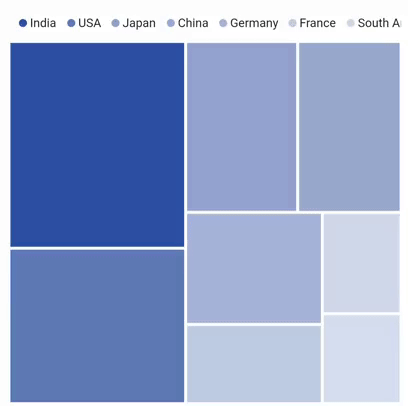

<b>For bar legend</b>

You can wrap or scroll the bar legend items using the [`TreemapLegend.overflowMode`](https://pub.dev/documentation/syncfusion_flutter_treemap/latest/treemap/TreemapLegend/overflowMode.html) property. The default value of the `overflowMode` property is [`TreemapLegendOverflowMode.scroll`](https://pub.dev/documentation/syncfusion_flutter_treemap/latest/treemap/TreemapLegendOverflowMode.html). The possible values are `scroll` and `wrap`.

If the legend position is `left` or `right`, then the default scroll direction is `vertical`.

If the legend position is `top` or `bottom`, then the default scroll direction is `horizontal`.




import 'package:flutter/material.dart';
import 'package:syncfusion_flutter_treemap/treemap.dart';

class BarOverflowModeExample extends StatefulWidget {
  const BarOverflowModeExample({super.key});

  @override
  State<BarOverflowModeExample> createState() => _BarOverflowModeExampleState();
}

class _BarOverflowModeExampleState extends State<BarOverflowModeExample> {
  late List<SocialMediaUsers> _source;

  @override
  void initState() {
    _source = <SocialMediaUsers>[
        SocialMediaUsers('India', 'Facebook', 25.4),
        SocialMediaUsers('USA', 'Instagram', 19.11),
        SocialMediaUsers('Japan', 'Facebook', 13.3),
        SocialMediaUsers('Germany', 'Instagram', 10.65),
        SocialMediaUsers('France', 'Twitter', 7.54),
        SocialMediaUsers('UK', 'Instagram', 4.93),
    ];
    super.initState();
  }

  @override
  Widget build(BuildContext context) {
    return Scaffold(
      body: Center(
        child: SizedBox(
          height: 400,
          width: 400,
          child: SfTreemap(
            dataCount: _source.length,
            weightValueMapper: (int index) {
              return _source[index].usersInMillions;
            },
            levels: [
              TreemapLevel(
                groupMapper: (int index) {
                  return _source[index].country;
                },
              ),
            ],
            legend: TreemapLegend.bar(
              overflowMode: TreemapLegendOverflowMode.scroll,
            ),
          ),
        ),
      ),
    );
  }
}

class SocialMediaUsers {
  const SocialMediaUsers(this.country, this.socialMedia, this.usersInMillions);

  final String country;
  final String socialMedia;
  final double usersInMillions;
}




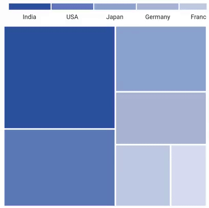

N>
* Refer the [`iconSize`](https://pub.dev/documentation/syncfusion_flutter_treemap/latest/treemap/TreemapLegend/TreemapLegend.html), for changing the size of the icon.

## Text style

You can customize the legend item's text style using the [`TreemapLegend.textStyle`](https://pub.dev/documentation/syncfusion_flutter_treemap/latest/treemap/TreemapLegend/textStyle.html) property.




import 'package:flutter/material.dart';
import 'package:syncfusion_flutter_treemap/treemap.dart';

class TextStyleExample extends StatefulWidget {
  const TextStyleExample({super.key});

  @override
  State<TextStyleExample> createState() => _TextStyleExampleState();
}

class _TextStyleExampleState extends State<TextStyleExample> {
  late List<SocialMediaUsers> _source;

  @override
  void initState() {
    _source = <SocialMediaUsers>[
      SocialMediaUsers('India', 'Facebook', 25.4),
      SocialMediaUsers('USA', 'Instagram', 19.11),
      SocialMediaUsers('Japan', 'Facebook', 13.3),
      SocialMediaUsers('Germany', 'Instagram', 10.65),
      SocialMediaUsers('France', 'Twitter', 7.54),
      SocialMediaUsers('UK', 'Instagram', 4.93),
    ];
    super.initState();
  }

  @override
  Widget build(BuildContext context) {
    return Scaffold(
      body: Center(
        child: SizedBox(
          height: 400,
          width: 400,
          child: SfTreemap(
            dataCount: _source.length,
            weightValueMapper: (int index) {
              return _source[index].usersInMillions;
            },
            levels: [
              TreemapLevel(
                groupMapper: (int index) {
                  return _source[index].country;
                },
              ),
            ],
            legend: TreemapLegend(
              textStyle: const TextStyle(
                color: Colors.red,
                fontSize: 14,
                fontWeight: FontWeight.bold,
                fontStyle: FontStyle.italic,
              ),
            ),
          ),
        ),
      ),
    );
  }
}

class SocialMediaUsers {
  const SocialMediaUsers(this.country, this.socialMedia, this.usersInMillions);

  final String country;
  final String socialMedia;
  final double usersInMillions;
}




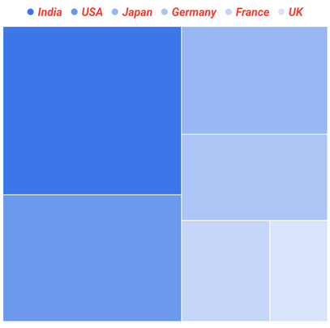

## Default legend appearance customization

You can customize the legend items using the following properties.

* **iconType** - Used to change the icon shape. The default value of the [`iconType`](https://pub.dev/documentation/syncfusion_flutter_treemap/latest/treemap/TreemapLegend/TreemapLegend.html) argument in the constructor is [`TreemapIconType.circle`](https://pub.dev/documentation/syncfusion_flutter_treemap/latest/treemap/TreemapIconType.html#circle). The possible values are [`circle`](https://pub.dev/documentation/syncfusion_flutter_treemap/latest/treemap/TreemapIconType.html#circle), [`rectangle`](https://pub.dev/documentation/syncfusion_flutter_treemap/latest/treemap/TreemapIconType.html#rectangle), [`triangle`](https://pub.dev/documentation/syncfusion_flutter_treemap/latest/treemap/TreemapIconType.html#triangle), and [`diamond`](https://pub.dev/documentation/syncfusion_flutter_treemap/latest/treemap/TreemapIconType.html#diamond).
* **iconSize** - Used to change the size of the icon. The default value of [`iconSize`](https://pub.dev/documentation/syncfusion_flutter_treemap/latest/treemap/TreemapLegend/TreemapLegend.html) argument in the constructor is `Size(8.0, 8.0)`.
* **spacing** - Used to provide space between the each legend items. The default value of the [`spacing`](https://pub.dev/documentation/syncfusion_flutter_treemap/latest/treemap/TreemapLegend/spacing.html) argument in the constructor is `10.0`.
* **direction** - Used to arrange the legend items in either horizontal or vertical direction. The default value of [`direction`](https://pub.dev/documentation/syncfusion_flutter_treemap/latest/treemap/TreemapLegend/direction.html) property is `horizontal`, if the value of the [`position`](https://pub.dev/documentation/syncfusion_flutter_treemap/latest/treemap/TreemapLegend/position.html) property is [`top`](https://pub.dev/documentation/syncfusion_flutter_treemap/latest/treemap/TreemapLegendPosition.html#top), [`bottom`](https://pub.dev/documentation/syncfusion_flutter_treemap/latest/treemap/TreemapLegendPosition.html#bottom) and defaults to `vertical`, if the value of the [`position`] property is [`left`](https://pub.dev/documentation/syncfusion_flutter_treemap/latest/treemap/TreemapLegendPosition.html#left) or [`right`](https://pub.dev/documentation/syncfusion_flutter_treemap/latest/treemap/TreemapLegendPosition.html#right).
* **padding** - Used to set padding around the legend. The default value of the [`padding`](https://pub.dev/documentation/syncfusion_flutter_treemap/latest/treemap/TreemapLegend/padding.html) property is `EdgeInsets.all(10.0)`.




import 'package:flutter/material.dart';
import 'package:syncfusion_flutter_treemap/treemap.dart';

class LegendAppearanceExample extends StatefulWidget {
  const LegendAppearanceExample({super.key});

  @override
  State<LegendAppearanceExample> createState() =>
      _LegendAppearanceExampleState();
}

class _LegendAppearanceExampleState extends State<LegendAppearanceExample> {
  late List<SocialMediaUsers> _source;

  @override
  void initState() {
    _source = <SocialMediaUsers>[
      SocialMediaUsers('India', 'Facebook', 25.4),
      SocialMediaUsers('USA', 'Instagram', 19.11),
      SocialMediaUsers('Japan', 'Facebook', 13.3),
      SocialMediaUsers('Germany', 'Instagram', 10.65),
      SocialMediaUsers('France', 'Twitter', 7.54),
      SocialMediaUsers('UK', 'Instagram', 4.93),
    ];
    super.initState();
  }

  @override
  Widget build(BuildContext context) {
    return Scaffold(
      body: Center(
        child: SizedBox(
          height: 400,
          width: 400,
          child: SfTreemap(
            dataCount: _source.length,
            weightValueMapper: (int index) {
              return _source[index].usersInMillions;
            },
            levels: [
              TreemapLevel(
                groupMapper: (int index) {
                  return _source[index].country;
                },
              ),
            ],
            legend: TreemapLegend(
              iconType: TreemapIconType.triangle,
              iconSize: const Size(12.0, 12.0),
              spacing: 15,
              padding: const EdgeInsets.all(12.0),
              direction: Axis.vertical,
            ),
          ),
        ),
      ),
    );
  }
}

class SocialMediaUsers {
  const SocialMediaUsers(this.country, this.socialMedia, this.usersInMillions);

  final String country;
  final String socialMedia;
  final double usersInMillions;
}




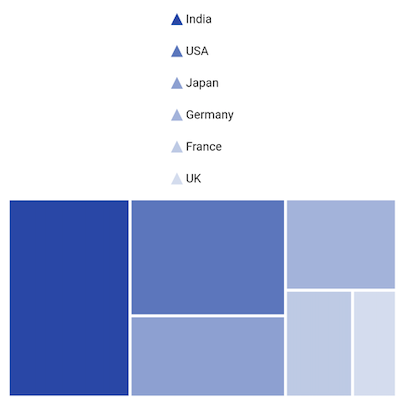

N>
* Refer the `position`, for setting the position of the legend.

## Bar legend segment painting style

### Solid

You can set solid color for the legend bar by using the [`TreemapLegendPaintingStyle.solid`](https://pub.dev/documentation/syncfusion_flutter_treemap/latest/treemap/TreemapLegendPaintingStyle.html#solid). By defaults [`TreemapLegendPaintingStyle`](https://pub.dev/documentation/syncfusion_flutter_treemap/latest/treemap/TreemapLegendPaintingStyle.html) will be [`solid`](https://pub.dev/documentation/syncfusion_flutter_treemap/latest/treemap/TreemapLegendPaintingStyle.html#solid).




import 'package:flutter/material.dart';
import 'package:syncfusion_flutter_treemap/treemap.dart';

class SolidBarLegendExample extends StatefulWidget {
  const SolidBarLegendExample({super.key});

  @override
  State<SolidBarLegendExample> createState() => _SolidBarLegendExampleState();
}

class _SolidBarLegendExampleState extends State<SolidBarLegendExample> {
  late List<SocialMediaUsers> _source;
  late List<TreemapColorMapper> _colorMappers;

  @override
  void initState() {
    _source = <SocialMediaUsers>[
      SocialMediaUsers('India', 'Facebook', 25.4),
      SocialMediaUsers('USA', 'Instagram', 19.11),
      SocialMediaUsers('Japan', 'Facebook', 13.3),
      SocialMediaUsers('Germany', 'Instagram', 10.65),
      SocialMediaUsers('France', 'Twitter', 7.54),
      SocialMediaUsers('UK', 'Instagram', 4.93),
    ];

    _colorMappers = <TreemapColorMapper>[
      TreemapColorMapper.range(from: 0, to: 10, color: Colors.blue[200]!),
      TreemapColorMapper.range(from: 10, to: 20, color: Colors.deepOrange),
      TreemapColorMapper.range(from: 20, to: 30, color: Colors.blue[800]!),
    ];
    super.initState();
  }

  @override
  Widget build(BuildContext context) {
    return Scaffold(
      body: SfTreemap(
        dataCount: _source.length,
        weightValueMapper: (int index) {
          return _source[index].usersInMillions;
        },
        levels: [
          TreemapLevel(
            padding: const EdgeInsets.all(1.5),
            groupMapper: (int index) {
              return _source[index].country;
            },
            colorValueMapper: (TreemapTile tile) {
              return tile.weight;
            },
          ),
        ],
        colorMappers: _colorMappers,
        legend: TreemapLegend.bar(
          segmentPaintingStyle: TreemapLegendPaintingStyle.solid,
        ),
      ),
    );
  }
}

class SocialMediaUsers {
  const SocialMediaUsers(this.country, this.socialMedia, this.usersInMillions);

  final String country;
  final String socialMedia;
  final double usersInMillions;
}




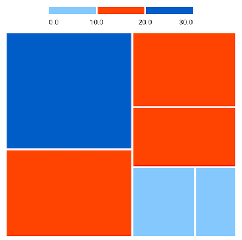

### Gradient

You can set gradient color for the legend bar by using the [`TreemapLegendPaintingStyle.gradient`](https://pub.dev/documentation/syncfusion_flutter_treemap/latest/treemap/TreemapLegendPaintingStyle.html#gradient).




import 'package:flutter/material.dart';
import 'package:syncfusion_flutter_treemap/treemap.dart';

class GradientBarLegendExample extends StatefulWidget {
  const GradientBarLegendExample({super.key});

  @override
  State<GradientBarLegendExample> createState() =>
      _GradientBarLegendExampleState();
}

class _GradientBarLegendExampleState extends State<GradientBarLegendExample> {
  late List<SocialMediaUsers> _source;
  late List<TreemapColorMapper> _colorMappers;

  @override
  void initState() {
    _source = <SocialMediaUsers>[
      SocialMediaUsers('India', 'Facebook', 25.4),
      SocialMediaUsers('USA', 'Instagram', 19.11),
      SocialMediaUsers('Japan', 'Facebook', 13.3),
      SocialMediaUsers('Germany', 'Instagram', 10.65),
      SocialMediaUsers('France', 'Twitter', 7.54),
      SocialMediaUsers('UK', 'Instagram', 4.93),
    ];

    _colorMappers = <TreemapColorMapper>[
      TreemapColorMapper.range(from: 0, to: 10, color: Colors.blue[200]!),
      TreemapColorMapper.range(from: 10, to: 20, color: Colors.deepOrange),
      TreemapColorMapper.range(from: 20, to: 30, color: Colors.blue[800]!),
    ];
    super.initState();
  }

  @override
  Widget build(BuildContext context) {
    return Scaffold(
      body: SfTreemap(
        dataCount: _source.length,
        weightValueMapper: (int index) {
          return _source[index].usersInMillions;
        },
        levels: [
          TreemapLevel(
            padding: const EdgeInsets.all(1.5),
            groupMapper: (int index) {
              return _source[index].country;
            },
            colorValueMapper: (TreemapTile tile) {
              return tile.weight;
            },
          ),
        ],
        colorMappers: _colorMappers,
        legend: TreemapLegend.bar(
          segmentPaintingStyle: TreemapLegendPaintingStyle.gradient,
        ),
      ),
    );
  }
}

class SocialMediaUsers {
  const SocialMediaUsers(this.country, this.socialMedia, this.usersInMillions);

  final String country;
  final String socialMedia;
  final double usersInMillions;
}




## Bar legend appearance customization

You can customize the legend items using the following properties.

* **segmentSize** - Used to change the size of individual legend bar segments. When gradient paint style is applied, [`segmentSize`](https://pub.dev/documentation/syncfusion_flutter_treemap/latest/treemap/TreemapLegend/TreemapLegend.bar.html) argument in the constructor will update the whole legend bar. The default value of the [`segmentSize`](https://pub.dev/documentation/syncfusion_flutter_treemap/latest/treemap/TreemapLegend/TreemapLegend.bar.html) property is `Size(80.0, 12.0)`.
* **labelOverflow** - Used to remove or trim the legend labels based on the bar legend size.The default value of the [`labelOverflow`](https://pub.dev/documentation/syncfusion_flutter_treemap/latest/treemap/TreemapLegend/TreemapLegend.bar.html) argument in the constructor will be `TreemapLabelOverflow.visible`.
* **edgeLabelsPlacement** - Used to place the edge labels either inside or outside of the bar legend. The default value of the [`edgeLabelsPlacement`](https://pub.dev/documentation/syncfusion_flutter_treemap/latest/treemap/TreemapLegend/TreemapLegend.bar.html) argument in the constructor will be `TreemapLegendEdgeLabelsPlacement.inside`.
* **spacing** - Used to provide space between the each legend items. The default value of the [`spacing`](https://pub.dev/documentation/syncfusion_flutter_treemap/latest/treemap/TreemapLegend/TreemapLegend.bar.html) is `2.0`. This is not applicable for gradient legend.
* **direction** - Used to arrange the legend items in either horizontal or vertical direction. The default value of [`direction`](https://pub.dev/documentation/syncfusion_flutter_treemap/latest/treemap/TreemapLegend/TreemapLegend.bar.html) property is `horizontal`, if the value of the `position` property is `top`, `bottom` and defaults to `vertical`, if the value of the [`position`](https://pub.dev/documentation/syncfusion_flutter_treemap/latest/treemap/TreemapLegend/TreemapLegend.bar.html) property is `left` or `right`.
* **padding** - Used to set padding around the legend. The default value of the [`padding`](https://pub.dev/documentation/syncfusion_flutter_treemap/latest/treemap/TreemapLegend/TreemapLegend.bar.html) property is `EdgeInsets.all(10.0)`.




import 'package:flutter/material.dart';
import 'package:syncfusion_flutter_treemap/treemap.dart';

class BarLegendAppearanceExample extends StatefulWidget {
  const BarLegendAppearanceExample({super.key});

  @override
  State<BarLegendAppearanceExample> createState() =>
      _BarLegendAppearanceExampleState();
}

class _BarLegendAppearanceExampleState extends State<BarLegendAppearanceExample> {
  late List<SocialMediaUsers> _source;

  @override
  void initState() {
    _source = <SocialMediaUsers>[
      SocialMediaUsers('India', 'Facebook', 25.4),
      SocialMediaUsers('USA', 'Instagram', 19.11),
      SocialMediaUsers('Japan', 'Facebook', 13.3),
      SocialMediaUsers('Germany', 'Instagram', 10.65),
      SocialMediaUsers('United Kingdom', 'Instagram', 4.93),
      SocialMediaUsers('France', 'Twitter', 7.54),
    ];
    super.initState();
  }

  @override
  Widget build(BuildContext context) {
    return Scaffold(
      body: Center(
        child: SizedBox(
          height: 400,
          width: 400,
          child: SfTreemap(
            dataCount: _source.length,
            weightValueMapper: (int index) {
              return _source[index].usersInMillions;
            },
            levels: [
              TreemapLevel(
                groupMapper: (int index) {
                  return _source[index].country;
                },
              ),
            ],
            legend: TreemapLegend.bar(
              segmentSize: const Size(60, 12),
              labelOverflow: TreemapLabelOverflow.ellipsis,
              edgeLabelsPlacement: TreemapLegendEdgeLabelsPlacement.center,
              padding: const EdgeInsets.all(12),
              direction: Axis.horizontal,
              spacing: 5,
            ),
          ),
        ),
      ),
    );
  }
}

class SocialMediaUsers {
  const SocialMediaUsers(this.country, this.socialMedia, this.usersInMillions);

  final String country;
  final String socialMedia;
  final double usersInMillions;
}




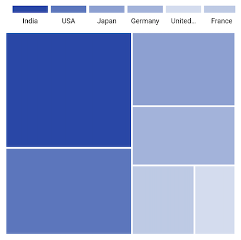

## Bar legend labels placement

You can place the labels either between the segments or on the segments using the [`labelsPlacement`](https://pub.dev/documentation/syncfusion_flutter_treemap/latest/treemap/TreemapLegend/TreemapLegend.bar.html) property.

<b>Labels placement for range color mapper</b>

The labels are positioned between the segments when setting range color mapper without setting color mapper [`TreemapColorMapper.name`](https://pub.dev/documentation/syncfusion_flutter_treemap/latest/treemap/TreemapColorMapper/name.html) property. The [`TreemapColorMapper.from`](https://pub.dev/documentation/syncfusion_flutter_treemap/latest/treemap/TreemapColorMapper/from.html) value of the first item is positioned at starting point of the first segment and the [`TreemapColorMapper.to`](https://pub.dev/documentation/syncfusion_flutter_treemap/latest/treemap/TreemapColorMapper/to.html) value of the first item is placed at the first segment end position. For other segments, the values of [`TreemapColorMapper.to`](https://pub.dev/documentation/syncfusion_flutter_treemap/latest/treemap/TreemapColorMapper/to.html) is positioned as label between the other segments.




import 'package:flutter/material.dart';
import 'package:syncfusion_flutter_treemap/treemap.dart';

class LabelPlacementRangeColorMapperExample extends StatefulWidget {
  const LabelPlacementRangeColorMapperExample({super.key});

  @override
  State<LabelPlacementRangeColorMapperExample> createState() =>
      _LabelPlacementRangeColorMapperExampleState();
}

class _LabelPlacementRangeColorMapperExampleState extends State<LabelPlacementRangeColorMapperExample> {
  late List<SocialMediaUsers> _source;
  late List<TreemapColorMapper> _colorMappers;

  @override
  void initState() {
    _source = <SocialMediaUsers>[
      SocialMediaUsers('India', 'Facebook', 25.4),
      SocialMediaUsers('USA', 'Instagram', 19.11),
      SocialMediaUsers('Japan', 'Facebook', 13.3),
      SocialMediaUsers('Germany', 'Instagram', 10.65),
      SocialMediaUsers('France', 'Twitter', 7.54),
      SocialMediaUsers('UK', 'Instagram', 4.93),
    ];

    _colorMappers = <TreemapColorMapper>[
      TreemapColorMapper.range(from: 0, to: 10, color: Colors.blue[200]!),
      TreemapColorMapper.range(from: 10, to: 20, color: Colors.deepOrange),
      TreemapColorMapper.range(from: 20, to: 30, color: Colors.blue[800]!),
    ];
    super.initState();
  }

  @override
  Widget build(BuildContext context) {
    return Scaffold(
      body: SfTreemap(
        dataCount: _source.length,
        weightValueMapper: (int index) {
          return _source[index].usersInMillions;
        },
        levels: [
          TreemapLevel(
            padding: const EdgeInsets.all(1.5),
            groupMapper: (int index) {
              return _source[index].country;
            },
            colorValueMapper: (TreemapTile tile) {
              return tile.weight;
            },
          ),
        ],
        colorMappers: _colorMappers,
        legend: TreemapLegend.bar(
          labelsPlacement: TreemapLegendLabelsPlacement.betweenItems,
          segmentPaintingStyle: TreemapLegendPaintingStyle.gradient,
        ),
      ),
    );
  }
}

class SocialMediaUsers {
  const SocialMediaUsers(this.country, this.socialMedia, this.usersInMillions);

  final String country;
  final String socialMedia;
  final double usersInMillions;
}




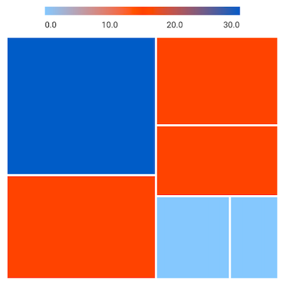

The labels are positioned between the segments when setting range color mapper along with setting color mapper [`TreemapColorMapper.name`](https://pub.dev/documentation/syncfusion_flutter_treemap/latest/treemap/TreemapColorMapper/name.html) property. The [`TreemapColorMapper.from`](https://pub.dev/documentation/syncfusion_flutter_treemap/latest/treemap/TreemapColorMapper/from.html) value of the first item is positioned at starting point of the first segment and the [`TreemapColorMapper.name`](https://pub.dev/documentation/syncfusion_flutter_treemap/latest/treemap/TreemapColorMapper/name.html) value of the first item is placed at the first segment end position. For Other segments, the value of [`TreemapColorMapper.name`](https://pub.dev/documentation/syncfusion_flutter_treemap/latest/treemap/TreemapColorMapper/name.html) is positioned as label between the segments.




import 'package:flutter/material.dart';
import 'package:syncfusion_flutter_treemap/treemap.dart';

class NamedRangeColorMapperExample extends StatefulWidget {
  const NamedRangeColorMapperExample({super.key});

  @override
  State<NamedRangeColorMapperExample> createState() =>
      _NamedRangeColorMapperExampleState();
}

class _NamedRangeColorMapperExampleState extends State<NamedRangeColorMapperExample> {
  late List<SocialMediaUsers> _source;
  late List<TreemapColorMapper> _colorMappers;

  @override
  void initState() {
    _source = <SocialMediaUsers>[
      SocialMediaUsers('India', 'Facebook', 25.4),
      SocialMediaUsers('USA', 'Instagram', 19.11),
      SocialMediaUsers('Japan', 'Facebook', 13.3),
      SocialMediaUsers('Germany', 'Instagram', 10.65),
      SocialMediaUsers('France', 'Twitter', 7.54),
      SocialMediaUsers('UK', 'Instagram', 4.93),
    ];

    _colorMappers = <TreemapColorMapper>[
      TreemapColorMapper.range(
          from: 0, to: 10, color: Colors.blue[200]!, name: '<10'),
      TreemapColorMapper.range(
          from: 10, to: 20, color: Colors.deepOrange, name: '10 - 20'),
      TreemapColorMapper.range(
          from: 20, to: 30, color: Colors.blue[800]!, name: '20 - 30'),
    ];
    super.initState();
  }

  @override
  Widget build(BuildContext context) {
    return Scaffold(
      body: SfTreemap(
        dataCount: _source.length,
        weightValueMapper: (int index) {
          return _source[index].usersInMillions;
        },
        levels: [
          TreemapLevel(
            padding: const EdgeInsets.all(1.5),
            groupMapper: (int index) {
              return _source[index].country;
            },
            colorValueMapper: (TreemapTile tile) {
              return tile.weight;
            },
          ),
        ],
        colorMappers: _colorMappers,
        legend: TreemapLegend.bar(
          labelsPlacement: TreemapLegendLabelsPlacement.betweenItems,
          segmentPaintingStyle: TreemapLegendPaintingStyle.gradient,
        ),
      ),
    );
  }
}

class SocialMediaUsers {
  const SocialMediaUsers(this.country, this.socialMedia, this.usersInMillions);

  final String country;
  final String socialMedia;
  final double usersInMillions;
}




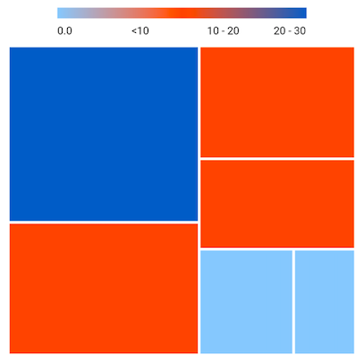

The labels are positioned at the center of the segments when setting the [`labelsPlacement`](https://pub.dev/documentation/syncfusion_flutter_treemap/latest/treemap/TreemapLegend/TreemapLegend.bar.html) property to [`TreemapLegendLabelsPlacement.onItem`](https://pub.dev/documentation/syncfusion_flutter_treemap/latest/treemap/TreemapLegendLabelsPlacement.html#onItem). The labels will based on the value of [`TreemapColorMapper.name`](https://pub.dev/documentation/syncfusion_flutter_treemap/latest/treemap/TreemapColorMapper/name.html) property. If the value of [`TreemapColorMapper.name`](https://pub.dev/documentation/syncfusion_flutter_treemap/latest/treemap/TreemapColorMapper/name.html) property is null, labels will be based on the values of [`TreemapColorMapper.from`](https://pub.dev/documentation/syncfusion_flutter_treemap/latest/treemap/TreemapColorMapper/from.html) and [`TreemapColorMapper.to`](https://pub.dev/documentation/syncfusion_flutter_treemap/latest/treemap/TreemapColorMapper/to.html) properties.




import 'package:flutter/material.dart';
import 'package:syncfusion_flutter_treemap/treemap.dart';

class BarLegendLabelPlacementExample extends StatefulWidget {
  const BarLegendLabelPlacementExample({super.key});

  @override
  State<BarLegendLabelPlacementExample> createState() =>
      _BarLegendLabelPlacementExampleState();
}

class _BarLegendLabelPlacementExampleState extends State<BarLegendLabelPlacementExample> {

  late List<SocialMediaUsers> _source;
  late List<TreemapColorMapper> _colorMappers;

  @override
  void initState() {
    _source = <SocialMediaUsers>[
        SocialMediaUsers('India', 'Facebook', 25.4),
        SocialMediaUsers('USA', 'Instagram', 19.11),
        SocialMediaUsers('Japan', 'Facebook', 13.3),
        SocialMediaUsers('Germany', 'Instagram', 10.65),
        SocialMediaUsers('France', 'Twitter', 7.54),
        SocialMediaUsers('UK', 'Instagram', 4.93),
    ];

    _colorMappers = <TreemapColorMapper>[
        TreemapColorMapper.range(
            from: 0, to: 10, color: Colors.blue[200]!, name: '<10'),
        TreemapColorMapper.range(
            from: 10, to: 20, color: Colors.deepOrange, name: '10 - 20'),
        TreemapColorMapper.range(
            from: 20, to: 30, color: Colors.blue[800]!, name: '20 - 30'),
      ];
    super.initState();
  }

  @override
  Widget build(BuildContext context) {
    return Scaffold(
      body: SfTreemap(
          dataCount: _source.length,
          weightValueMapper: (int index) {
            return _source[index].usersInMillions;
          },
          levels: [
            TreemapLevel(
              padding: const EdgeInsets.all(1.5),
              groupMapper: (int index) {
                return _source[index].country;
              },
              colorValueMapper: (TreemapTile tile) {
                return tile.weight;
              },
            ),
          ],
          colorMappers: _colorMappers,
          legend: TreemapLegend.bar(
            labelsPlacement: TreemapLegendLabelsPlacement.onItem,
            edgeLabelsPlacement: TreemapLegendEdgeLabelsPlacement.center,
            segmentPaintingStyle: TreemapLegendPaintingStyle.gradient,
          ),
        ),
    );
  }
}

class SocialMediaUsers {
  const SocialMediaUsers(this.country, this.socialMedia, this.usersInMillions);

  final String country;
  final String socialMedia;
  final double usersInMillions;
}




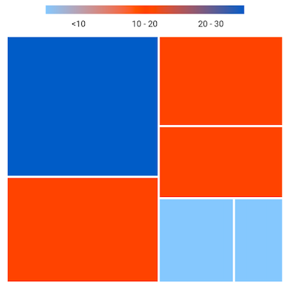

<b>Labels placement for equal color mapper</b>

The [`labelsPlacement`](https://pub.dev/documentation/syncfusion_flutter_treemap/latest/treemap/TreemapLegend/labelsPlacement.html) option is not applicable for the legend label applied with equal color mapper. By default, the labels are positioned at center of the segment.




import 'package:flutter/material.dart';
import 'package:syncfusion_flutter_treemap/treemap.dart';

class PointerCustomizationExample extends StatefulWidget {
  const PointerCustomizationExample({super.key});

  @override
  State<PointerCustomizationExample> createState() =>
      _PointerCustomizationExampleState();
}

class _PointerCustomizationExampleState extends State<PointerCustomizationExample> {

  late List<SocialMediaUsers> _source;
  late List<TreemapColorMapper> _colorMappers;

  @override
  void initState() {
    _source = <SocialMediaUsers>[
        SocialMediaUsers('India', 'Facebook', 25.4),
        SocialMediaUsers('USA', 'Instagram', 19.11),
        SocialMediaUsers('Japan', 'Facebook', 13.3),
        SocialMediaUsers('Germany', 'Instagram', 10.65),
        SocialMediaUsers('France', 'Twitter', 7.54),
        SocialMediaUsers('UK', 'Instagram', 4.93),
    ];

    _colorMappers = <TreemapColorMapper>[
        TreemapColorMapper.value(value: 'Facebook', color: Colors.blue[200]!),
        TreemapColorMapper.value(value: 'Instagram', color: Colors.deepOrange),
        TreemapColorMapper.value(value: 'Twitter', color: Colors.blue[800]!),
      ];
    super.initState();
  }

  @override
  Widget build(BuildContext context) {
    return Scaffold(
      body: SfTreemap(
          dataCount: _source.length,
          weightValueMapper: (int index) {
            return _source[index].usersInMillions;
          },
          levels: [
            TreemapLevel(
              padding: const EdgeInsets.all(2.5),
              groupMapper: (int index) {
                return _source[index].country;
              },
              labelBuilder: (BuildContext context, TreemapTile tile) {
                return Text(_source[tile.indices[0]].socialMedia);
              },
              colorValueMapper: (TreemapTile tile) {
                return _source[tile.indices[0]].socialMedia;
              },
            ),
          ],
          colorMappers: _colorMappers,
          legend: TreemapLegend.bar(
            edgeLabelsPlacement: TreemapLegendEdgeLabelsPlacement.center,
            segmentPaintingStyle: TreemapLegendPaintingStyle.gradient,
          ),
        ),
    );
  }
}

class SocialMediaUsers {
  const SocialMediaUsers(this.country, this.socialMedia, this.usersInMillions);

  final String country;
  final String socialMedia;
  final double usersInMillions;
}




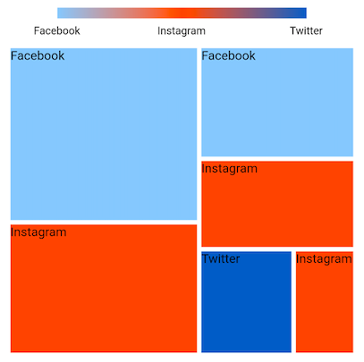

## Show pointer

You may show a pointer on the solid or gradient bar legend while hovering over a tile using the [`showPointerOnHover`](https://pub.dev/documentation/syncfusion_flutter_treemap/latest/treemap/TreemapLegend/showPointerOnHover.html) property. The default value of the [`showPointerOnHover`](https://pub.dev/documentation/syncfusion_flutter_treemap/latest/treemap/TreemapLegend/showPointerOnHover.html) property is `false`.




import 'package:flutter/material.dart';
import 'package:syncfusion_flutter_treemap/treemap.dart';

class ShowPointerExample extends StatefulWidget {
  const ShowPointerExample({super.key});

  @override
  State<ShowPointerExample> createState() => _ShowPointerExampleState();
}

class _ShowPointerExampleState extends State<ShowPointerExample> {
  late List<IndianPopulation> _population;
  late List<TreemapColorMapper> _colorMappers;

  @override
  void initState() {
    _population = <IndianPopulation>[
        IndianPopulation('Gujarat', 54612),
        IndianPopulation('Bangalore', 473069),
        IndianPopulation('Chennai', 210312),
        IndianPopulation('Andra', 95419),
        IndianPopulation('Kashmir', 80599),
        IndianPopulation('Delhi', 39000),
        IndianPopulation('Mumbai', 122897),
        IndianPopulation('Kolkatta', 184135),
    ];

    _colorMappers = <TreemapColorMapper>[
        TreemapColorMapper.range(from: 0, to: 10, color: Colors.blueGrey),
        TreemapColorMapper.range(from: 10, to: 20, color: Colors.green),
        TreemapColorMapper.range(from: 20, to: 30, color: Colors.lime),
        TreemapColorMapper.range(from: 30, to: 50, color: Colors.teal),
    ];
    super.initState();
  }

  @override
  Widget build(BuildContext context) {
    return Scaffold(
      body: Center(
        child: SizedBox(
          height: 400,
          width: 400,
          child: SfTreemap(
            dataCount: _population.length,
            weightValueMapper: (int index) =>
                _population[index].population.toDouble(),
            colorMappers: _colorMappers,
            legend: TreemapLegend.bar(
              segmentPaintingStyle: TreemapLegendPaintingStyle.gradient,
              showPointerOnHover: true,
            ),
            levels: [
              TreemapLevel(
                groupMapper: (int index) {
                  return _population[index].state;
                },
                colorValueMapper: (TreemapTile tile) {
                  return _population[tile.indices[0]].population / 10000;
                },
              )
            ],
          ),
        ),
      ),
    );
  }
}

class IndianPopulation {
  const IndianPopulation(this.state, this.population);

  final String state;
  final int population;
}




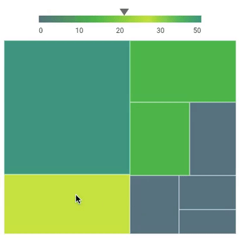

## Pointer builder

It returns a widget for the given value.

The pointer is used to indicate the exact color of the hovering tile on the legend segment.

The [`pointerBuilder`](https://pub.dev/documentation/syncfusion_flutter_treemap/latest/treemap/TreemapLegend/pointerBuilder.html) will be called when the user interacts with the tiles i.e., while tapping in touch devices and hovering in the mouse enabled devices.




import 'package:flutter/material.dart';
import 'package:syncfusion_flutter_treemap/treemap.dart';

class PointerBuilderExample extends StatefulWidget {
  const PointerBuilderExample({super.key});

  @override
  State<PointerBuilderExample> createState() => _PointerBuilderExampleState();
}

class _PointerBuilderExampleState extends State<PointerBuilderExample> {
  late List<IndianPopulation> _population;
  late List<TreemapColorMapper> _colorMappers;

  @override
  void initState() {
    _population = <IndianPopulation>[
        IndianPopulation('Gujarat', 54612),
        IndianPopulation('Bangalore', 473069),
        IndianPopulation('Chennai', 210312),
        IndianPopulation('Andra', 95419),
        IndianPopulation('Kashmir', 80599),
        IndianPopulation('Delhi', 39000),
        IndianPopulation('Mumbai', 122897),
        IndianPopulation('Kolkatta', 184135),
    ];

    _colorMappers = <TreemapColorMapper>[
        TreemapColorMapper.range(from: 0, to: 10, color: Colors.blueGrey),
        TreemapColorMapper.range(from: 10, to: 20, color: Colors.green),
        TreemapColorMapper.range(from: 20, to: 30, color: Colors.lime),
        TreemapColorMapper.range(from: 30, to: 50, color: Colors.teal),
    ];
    super.initState();
  }

  @override
  Widget build(BuildContext context) {
    return Scaffold(
      body: Center(
        child: SizedBox(
          height: 400,
          width: 400,
          child: SfTreemap(
            dataCount: _population.length,
            weightValueMapper: (int index) =>
                _population[index].population.toDouble(),
            colorMappers: _colorMappers,
            legend: TreemapLegend.bar(
              segmentPaintingStyle: TreemapLegendPaintingStyle.gradient,
              showPointerOnHover: true,
              pointerBuilder: (BuildContext context, dynamic value) {
                return const Icon(Icons.arrow_downward, size: 15);
              },
            ),
            levels: [
              TreemapLevel(
                groupMapper: (int index) {
                  return _population[index].state;
                },
                colorValueMapper: (TreemapTile tile) {
                  return _population[tile.indices[0]].population / 10000;
                },
              )
            ],
          ),
        ),
      ),
    );
  }
}

class IndianPopulation {
  const IndianPopulation(this.state, this.population);

  final String state;
  final int population;
}




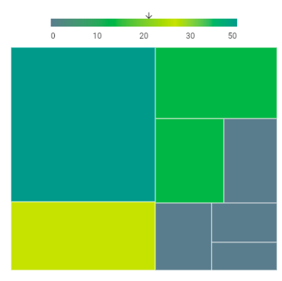

## Pointer customization

You can customize the size and color of the pointer using the [`pointerSize`](https://pub.dev/documentation/syncfusion_flutter_treemap/latest/treemap/TreemapLegend/pointerSize.html) and [`pointerColor`](https://pub.dev/documentation/syncfusion_flutter_treemap/latest/treemap/TreemapLegend/pointerColor.html) properties. The default value of the [`pointerSize`](https://pub.dev/documentation/syncfusion_flutter_treemap/latest/treemap/TreemapLegend/pointerSize.html) property is `Size(16, 12)`.




import 'package:flutter/material.dart';
import 'package:syncfusion_flutter_treemap/treemap.dart';

class PointerCustomizationExample extends StatefulWidget {
  const PointerCustomizationExample({super.key});

  @override
  State<PointerCustomizationExample> createState() =>
      _PointerCustomizationExampleState();
}

class _PointerCustomizationExampleState extends State<PointerCustomizationExample> {
  late List<IndianPopulation> _population;
  late List<TreemapColorMapper> _colorMappers;

  @override
  void initState() {
    _population = <IndianPopulation>[
        IndianPopulation('Gujarat', 54612),
        IndianPopulation('Bangalore', 473069),
        IndianPopulation('Chennai', 210312),
        IndianPopulation('Andra', 95419),
        IndianPopulation('Kashmir', 80599),
        IndianPopulation('Delhi', 39000),
        IndianPopulation('Mumbai', 122897),
        IndianPopulation('Kolkatta', 184135),
    ];

    _colorMappers = <TreemapColorMapper>[
        TreemapColorMapper.range(from: 0, to: 10, color: Colors.blueGrey),
        TreemapColorMapper.range(from: 10, to: 20, color: Colors.green),
        TreemapColorMapper.range(from: 20, to: 30, color: Colors.lime),
        TreemapColorMapper.range(from: 30, to: 50, color: Colors.teal),
    ];
    super.initState();
  }

  @override
  Widget build(BuildContext context) {
    return Scaffold(
      body: Center(
        child: SizedBox(
          height: 400,
          width: 400,
          child: SfTreemap(
            dataCount: _population.length,
            weightValueMapper: (int index) =>
                _population[index].population.toDouble(),
            colorMappers: _colorMappers,
            legend: TreemapLegend.bar(
              segmentPaintingStyle: TreemapLegendPaintingStyle.gradient,
              showPointerOnHover: true,
              pointerSize: const Size(20, 20),
              pointerColor: Colors.deepPurple,
            ),
            levels: [
              TreemapLevel(
                groupMapper: (int index) {
                  return _population[index].state;
                },
                colorValueMapper: (TreemapTile tile) {
                  return _population[tile.indices[0]].population / 10000;
                },
              )
            ],
          ),
        ),
      ),
    );
  }
}

class IndianPopulation {
  const IndianPopulation(this.state, this.population);

  final String state;
  final int population;
}




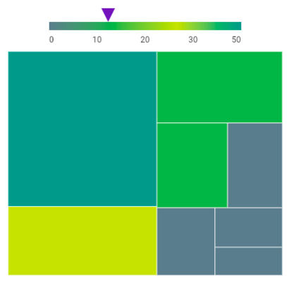
