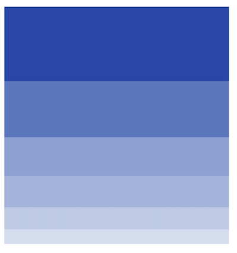
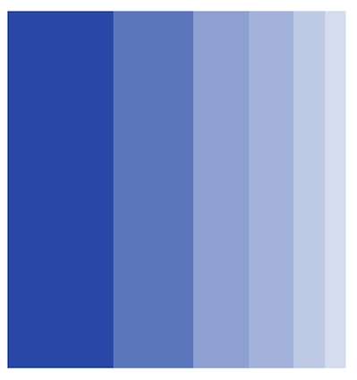
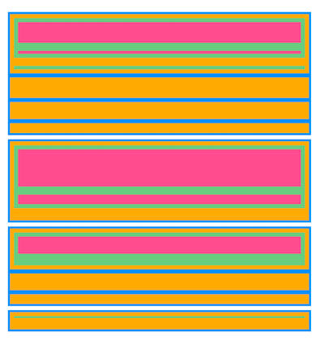
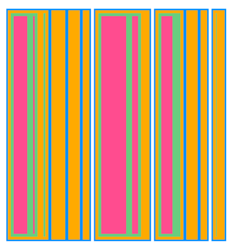

# Levels in Flutter Treemap

The levels of the tree map can be categorized into the following two types,

* Flat level.
* Hierarchical level.

## Flat level

You can group the underlying data based on the value of the `TreemapLevel.groupMapper` property which is added to the `levels` collection property of `SfTreemap`.

### Squarify




List<PopulationModel> _source;

@override
void initState() {
   _source = <PopulationModel>[
      PopulationModel('Asia', 25.4),
      PopulationModel('South America', 19.11),
      PopulationModel('North America', 13.3),
      PopulationModel('Europe', 10.65),
      PopulationModel('Africa', 7.54),
      PopulationModel('Australia', 4.93),
   ];
   super.initState();
}

@override
Widget build(BuildContext context) {
   return Scaffold(
      body: SfTreemap(
        dataCount: _source.length,
        weightValueMapper: (int index) {
          return _source[index].populationInMillions;
        },
        levels: [
          TreemapLevel(
            groupMapper: (int index) {
              return _source[index].continent;
            },
          ),
        ],
      ),
   );
}

class PopulationModel {
  const PopulationModel(this.continent, this.populationInMillions);

  final String continent;
  final double populationInMillions;
}




N>
* Refer the `TreemapLevel.colorMapper`, for customizing the tile color.
* Refer the `TreemapLevel.tooltipBuilder`, for adding and customizing the tooltip on the treemap.
* Refer the `TreemapLevel.labelBuilder`, for adding and customizing the label on the tile.
* Refer the `TreemapLevel.itemBuilder`, for adding and customizing the custom widget on the treemap.

### Slice




List<PopulationModel> _source;

@override
void initState() {
   _source = <PopulationModel>[
      PopulationModel('Asia', 25.4),
      PopulationModel('South America', 19.11),
      PopulationModel('North America', 13.3),
      PopulationModel('Europe', 10.65),
      PopulationModel('Africa', 7.54),
      PopulationModel('Australia', 4.93),
   ];
   super.initState();
}

@override
Widget build(BuildContext context) {
   return Scaffold(
      body: SfTreemap.slice(
        dataCount: _source.length,
        weightValueMapper: (int index) {
          return _source[index].populationInMillions;
        },
        levels: [
          TreemapLevel(
            groupMapper: (int index) {
              return _source[index].continent;
            },
          ),
        ],
      ),
   );
}

class PopulationModel {
  const PopulationModel(this.continent, this.populationInMillions);

  final String continent;
  final double populationInMillions;
}




N>
* Refer the `TreemapLevel.colorMapper`, for customizing the tile color.
* Refer the `TreemapLevel.tooltipBuilder`, for adding and customizing the tooltip on the treemap.
* Refer the `TreemapLevel.labelBuilder`, for adding and customizing the label on the tile.
* Refer the `TreemapLevel.itemBuilder`, for adding and customizing the custom widget on the treemap.

### Dice




List<PopulationModel> _source;

@override
void initState() {
   _source = <PopulationModel>[
      PopulationModel('Asia', 25.4),
      PopulationModel('South America', 19.11),
      PopulationModel('North America', 13.3),
      PopulationModel('Europe', 10.65),
      PopulationModel('Africa', 7.54),
      PopulationModel('Australia', 4.93),
   ];
   super.initState();
}

@override
Widget build(BuildContext context) {
   return Scaffold(
      body: SfTreemap.dice(
        dataCount: _source.length,
        weightValueMapper: (int index) {
          return _source[index].populationInMillions;
        },
        levels: [
          TreemapLevel(
            groupMapper: (int index) {
              return _source[index].continent;
            },
          ),
        ],
      ),
   );
}

class PopulationModel {
  const PopulationModel(this.continent, this.populationInMillions);

  final String continent;
  final double populationInMillions;
}




N>
* Refer the `TreemapLevel.colorMapper`, for customizing the tile color.
* Refer the `TreemapLevel.tooltipBuilder`, for adding and customizing the tooltip on the treemap.
* Refer the `TreemapLevel.labelBuilder`, for adding and customizing the label on the tile.
* Refer the `TreemapLevel.itemBuilder`, for adding and customizing the custom widget on the treemap.

## Hierarchical level

Hierarchical level arrange the tiles in the nested type. Each tile of the treemap is a rectangle which is filled with smaller rectangles representing sub-data.

You can customize the levels based on the following properties:

* **Padding** - To specify the gap between the groups using the `TreemapLevel.padding` property. The default value of the [`padding`] property is `EdgeInsets.zero`.

* **Color** - To specify the background color for the group using the `TreemapLevel.color` property.

* **Border** - To specify the border color, border width and border radius for the group using the `TreemapLevel.border` property.

### Squarified




List<JobVacancyModel> _source;

@override
void initState() {
   _source = <JobVacancyModel>[
      JobVacancyModel(country: 'America', job: 'Sales', vacancy: 70),
      JobVacancyModel(
          country: 'America', job: 'Technical', group: 'Testers', vacancy: 35),
      JobVacancyModel(
          country: 'America',
          job: 'Technical',
          group: 'Developers',
          role: 'Windows',
          vacancy: 105),
      JobVacancyModel(
          country: 'America',
          job: 'Technical',
          group: 'Developers',
          role: 'Web',
          vacancy: 40),
      JobVacancyModel(country: 'America', job: 'Management', vacancy: 40),
      JobVacancyModel(country: 'America', job: 'Accounts', vacancy: 60),
      JobVacancyModel(
          country: 'India', job: 'Technical', group: 'Testers', vacancy: 25),
      JobVacancyModel(
          country: 'India',
          job: 'Technical',
          group: 'Developers',
          role: 'Windows',
          vacancy: 155),
      JobVacancyModel(
          country: 'India',
          job: 'Technical',
          group: 'Developers',
          role: 'Web',
          vacancy: 60),
      JobVacancyModel(
          country: 'Germany', job: 'Sales', group: 'Executive', vacancy: 30),
      JobVacancyModel(
          country: 'Germany', job: 'Sales', group: 'Analyst', vacancy: 40),
      JobVacancyModel(
          country: 'UK',
          job: 'Technical',
          group: 'Developers',
          role: 'Windows',
          vacancy: 100),
      JobVacancyModel(
          country: 'UK',
          job: 'Technical',
          group: 'Developers',
          role: 'Web',
          vacancy: 30),
      JobVacancyModel(country: 'UK', job: 'HR Executives', vacancy: 60),
      JobVacancyModel(country: 'UK', job: 'Marketing', vacancy: 40),
   ];
   super.initState();
}

@override
Widget build(BuildContext context) {
   return Scaffold(
      body: SfTreemap(
        dataCount: _source.length,
        weightValueMapper: (int index) {
          return _source[index].vacancy;
        },
        levels: [
          TreemapLevel(
            groupMapper: (int index) => _source[index].country,
            color: Colors.blue,
            padding: EdgeInsets.all(2.5),
          ),
          TreemapLevel(
            groupMapper: (int index) => _source[index].job,
            color: Colors.orangeAccent,
            padding: EdgeInsets.all(2.5),
          ),
          TreemapLevel(
            groupMapper: (int index) => _source[index].group,
            color: Colors.green[300],
            padding: EdgeInsets.all(5),
          ),
          TreemapLevel(
            groupMapper: (int index) => _source[index].role,
            color: Colors.pink[300],
            padding: EdgeInsets.all(5),
          ),
        ],
      ),
   );
}




N>
* Refer the `TreemapLevel.colorMapper`, for customizing the tile color.
* Refer the `TreemapLevel.tooltipBuilder`, for adding and customizing the tooltip on the treemap.
* Refer the `TreemapLevel.labelBuilder`, for adding and customizing the label on the tile.
* Refer the `TreemapLevel.itemBuilder`, for adding and customizing the custom widget on the treemap.

### Slice

List<JobVacancyModel> _source;

@override
void initState() {
   _source = <JobVacancyModel>[
      JobVacancyModel(country: 'America', job: 'Sales', vacancy: 70),
      JobVacancyModel(
          country: 'America', job: 'Technical', group: 'Testers', vacancy: 35),
      JobVacancyModel(
          country: 'America',
          job: 'Technical',
          group: 'Developers',
          role: 'Windows',
          vacancy: 105),
      JobVacancyModel(
          country: 'America',
          job: 'Technical',
          group: 'Developers',
          role: 'Web',
          vacancy: 40),
      JobVacancyModel(country: 'America', job: 'Management', vacancy: 40),
      JobVacancyModel(country: 'America', job: 'Accounts', vacancy: 60),
      JobVacancyModel(
          country: 'India', job: 'Technical', group: 'Testers', vacancy: 25),
      JobVacancyModel(
          country: 'India',
          job: 'Technical',
          group: 'Developers',
          role: 'Windows',
          vacancy: 155),
      JobVacancyModel(
          country: 'India',
          job: 'Technical',
          group: 'Developers',
          role: 'Web',
          vacancy: 60),
      JobVacancyModel(
          country: 'Germany', job: 'Sales', group: 'Executive', vacancy: 30),
      JobVacancyModel(
          country: 'Germany', job: 'Sales', group: 'Analyst', vacancy: 40),
      JobVacancyModel(
          country: 'UK',
          job: 'Technical',
          group: 'Developers',
          role: 'Windows',
          vacancy: 100),
      JobVacancyModel(
          country: 'UK',
          job: 'Technical',
          group: 'Developers',
          role: 'Web',
          vacancy: 30),
      JobVacancyModel(country: 'UK', job: 'HR Executives', vacancy: 60),
      JobVacancyModel(country: 'UK', job: 'Marketing', vacancy: 40),
   ];
   super.initState();
}

@override
Widget build(BuildContext context) {
   return Scaffold(
      body: SfTreemap.slice(
        dataCount: _source.length,
        weightValueMapper: (int index) {
          return _source[index].vacancy;
        },
        levels: [
          TreemapLevel(
            groupMapper: (int index) => _source[index].country,
            color: Colors.blue,
            padding: EdgeInsets.all(2.5),
          ),
          TreemapLevel(
            groupMapper: (int index) => _source[index].job,
            color: Colors.orangeAccent,
            padding: EdgeInsets.all(2.5),
          ),
          TreemapLevel(
            groupMapper: (int index) => _source[index].group,
            color: Colors.green[300],
            padding: EdgeInsets.all(5),
          ),
          TreemapLevel(
            groupMapper: (int index) => _source[index].role,
            color: Colors.pink[300],
            padding: EdgeInsets.all(5),
          ),
        ],
      ),
   );
}




N>
* Refer the `TreemapLevel.colorMapper`, for customizing the tile color.
* Refer the `TreemapLevel.tooltipBuilder`, for adding and customizing the tooltip on the treemap.
* Refer the `TreemapLevel.labelBuilder`, for adding and customizing the label on the tile.
* Refer the `TreemapLevel.itemBuilder`, for adding and customizing the custom widget on the treemap.

### Dice

List<JobVacancyModel> _source;

@override
void initState() {
   _source = <JobVacancyModel>[
      JobVacancyModel(country: 'America', job: 'Sales', vacancy: 70),
      JobVacancyModel(
          country: 'America', job: 'Technical', group: 'Testers', vacancy: 35),
      JobVacancyModel(
          country: 'America',
          job: 'Technical',
          group: 'Developers',
          role: 'Windows',
          vacancy: 105),
      JobVacancyModel(
          country: 'America',
          job: 'Technical',
          group: 'Developers',
          role: 'Web',
          vacancy: 40),
      JobVacancyModel(country: 'America', job: 'Management', vacancy: 40),
      JobVacancyModel(country: 'America', job: 'Accounts', vacancy: 60),
      JobVacancyModel(
          country: 'India', job: 'Technical', group: 'Testers', vacancy: 25),
      JobVacancyModel(
          country: 'India',
          job: 'Technical',
          group: 'Developers',
          role: 'Windows',
          vacancy: 155),
      JobVacancyModel(
          country: 'India',
          job: 'Technical',
          group: 'Developers',
          role: 'Web',
          vacancy: 60),
      JobVacancyModel(
          country: 'Germany', job: 'Sales', group: 'Executive', vacancy: 30),
      JobVacancyModel(
          country: 'Germany', job: 'Sales', group: 'Analyst', vacancy: 40),
      JobVacancyModel(
          country: 'UK',
          job: 'Technical',
          group: 'Developers',
          role: 'Windows',
          vacancy: 100),
      JobVacancyModel(
          country: 'UK',
          job: 'Technical',
          group: 'Developers',
          role: 'Web',
          vacancy: 30),
      JobVacancyModel(country: 'UK', job: 'HR Executives', vacancy: 60),
      JobVacancyModel(country: 'UK', job: 'Marketing', vacancy: 40),
   ];
   super.initState();
}

@override
Widget build(BuildContext context) {
   return Scaffold(
      body: SfTreemap.dice(
        dataCount: _source.length,
        weightValueMapper: (int index) {
          return _source[index].vacancy;
        },
        levels: [
          TreemapLevel(
            groupMapper: (int index) => _source[index].country,
            color: Colors.blue,
            padding: EdgeInsets.all(2.5),
          ),
          TreemapLevel(
            groupMapper: (int index) => _source[index].job,
            color: Colors.orangeAccent,
            padding: EdgeInsets.all(2.5),
          ),
          TreemapLevel(
            groupMapper: (int index) => _source[index].group,
            color: Colors.green[300],
            padding: EdgeInsets.all(5),
          ),
          TreemapLevel(
            groupMapper: (int index) => _source[index].role,
            color: Colors.pink[300],
            padding: EdgeInsets.all(5),
          ),
        ],
      ),
   );
}




N>
* Refer the `TreemapLevel.colorMapper`, for customizing the tile color.
* Refer the `TreemapLevel.tooltipBuilder`, for adding and customizing the tooltip on the treemap.
* Refer the `TreemapLevel.labelBuilder`, for adding and customizing the label on the tile.
* Refer the `TreemapLevel.itemBuilder`, for adding and customizing the custom widget on the treemap.
