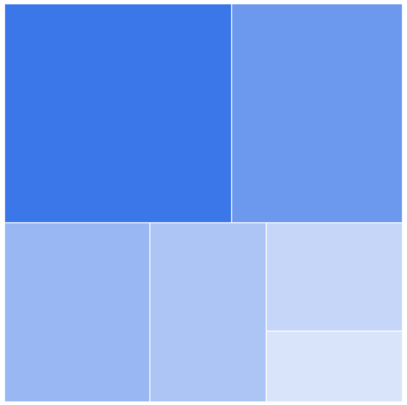
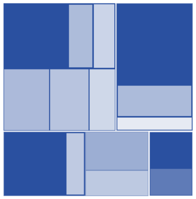
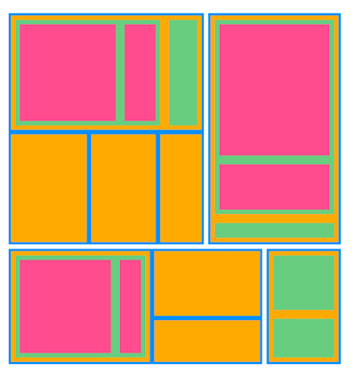

# Flat and Hierarchical Levels in Flutter Treemap (SfTreemap)

The levels of the treemap can be categorized into the following two types,

* Flat level.
* Hierarchical level.

## Flat level

There will be a tile for each unique value returned in the [`TreemapLevel.groupMapper`](https://pub.dev/documentation/syncfusion_flutter_treemap/latest/treemap/TreemapLevel/groupMapper.html) callback which is added to the [`levels`](https://pub.dev/documentation/syncfusion_flutter_treemap/latest/treemap/SfTreemap/levels.html) collection property of [`SfTreemap`](https://pub.dev/documentation/syncfusion_flutter_treemap/latest/treemap/SfTreemap-class.html).

### Squarified




  late List<PopulationModel> _source;

  @override
  void initState() {
    _source = <PopulationModel>[
        PopulationModel('Asia', 25.4),
        PopulationModel('South America', 19.11),
        PopulationModel('North America', 13.3),
        PopulationModel('Europe', 10.65),
        PopulationModel('Africa', 7.54),
        PopulationModel('Australia', 4.93),
    ];
    super.initState();
  }

  @override
  Widget build(BuildContext context) {
    return Scaffold(
      body: Center(
          child: Container(
            height: 400,
            width: 400,
            child: SfTreemap(
              dataCount: _source.length,
              weightValueMapper: (int index) {
                return _source[index].populationInMillions;
              },
              levels: [
                TreemapLevel(
                  groupMapper: (int index) {
                    return _source[index].continent;
                  },
                ),
              ],
            ),
          ),
        ),
    );
  }

class PopulationModel {
  const PopulationModel(this.continent, this.populationInMillions);

  final String continent;
  final double populationInMillions;
}




N>
* Refer the [`TreemapLevel.colorValueMapper`](https://pub.dev/documentation/syncfusion_flutter_treemap/latest/treemap/TreemapLevel/colorValueMapper.html), for customizing the tile color.
* Refer the [`TreemapLevel.tooltipBuilder`](https://pub.dev/documentation/syncfusion_flutter_treemap/latest/treemap/TreemapLevel/tooltipBuilder.html), for adding and customizing the tooltip on the treemap.
* Refer the [`TreemapLevel.labelBuilder`](https://pub.dev/documentation/syncfusion_flutter_treemap/latest/treemap/TreemapLevel/labelBuilder.html), for adding and customizing the label on the tile.
* Refer the [`TreemapLevel.itemBuilder`](https://pub.dev/documentation/syncfusion_flutter_treemap/latest/treemap/TreemapLevel/itemBuilder.html), for adding and customizing the custom widget on the treemap.

## Hierarchical level

Hierarchical level arrange the tiles in the form of nested rectangles. Each tile of the treemap is a rectangle which is filled with smaller rectangles representing sub-data. You can have more than one [`TreemapLevel`](https://pub.dev/documentation/syncfusion_flutter_treemap/latest/treemap/TreemapLevel-class.html) in the [`levels`](https://pub.dev/documentation/syncfusion_flutter_treemap/latest/treemap/SfTreemap/levels.html) collection to form a hierarchical treemap.

The first level will work similarly to the flat level. From the next level in the [`levels`](https://pub.dev/documentation/syncfusion_flutter_treemap/latest/treemap/SfTreemap/levels.html) collection, the items returned from the [`TreemapLevel.groupMapper`](https://pub.dev/documentation/syncfusion_flutter_treemap/latest/treemap/TreemapLevel/groupMapper.html) for the indices, will be placed inside the rectangle for the same indices returned from the [`TreemapLevel.groupMapper`](https://pub.dev/documentation/syncfusion_flutter_treemap/latest/treemap/TreemapLevel/groupMapper.html) in the previous level. This will go on until the last level in the [`levels`](https://pub.dev/documentation/syncfusion_flutter_treemap/latest/treemap/SfTreemap/levels.html) collection.

### Squarified




  late List<JobVacancyModel> _source;

  @override
  void initState() {
    _source = <JobVacancyModel>[
        JobVacancyModel(country: 'America', job: 'Sales', vacancy: 70),
        JobVacancyModel(
            country: 'America', job: 'Technical', group: 'Testers', vacancy: 35),
        JobVacancyModel(
            country: 'America',
            job: 'Technical',
            group: 'Developers',
            role: 'Windows',
            vacancy: 105),
        JobVacancyModel(
            country: 'America',
            job: 'Technical',
            group: 'Developers',
            role: 'Web',
            vacancy: 40),
        JobVacancyModel(country: 'America', job: 'Management', vacancy: 40),
        JobVacancyModel(country: 'America', job: 'Accounts', vacancy: 60),
        JobVacancyModel(
            country: 'India', job: 'Technical', group: 'Testers', vacancy: 25),
        JobVacancyModel(
            country: 'India',
            job: 'Technical',
            group: 'Developers',
            role: 'Windows',
            vacancy: 155),
        JobVacancyModel(
            country: 'India',
            job: 'Technical',
            group: 'Developers',
            role: 'Web',
            vacancy: 60),
        JobVacancyModel(
            country: 'Germany', job: 'Sales', group: 'Executive', vacancy: 30),
        JobVacancyModel(
            country: 'Germany', job: 'Sales', group: 'Analyst', vacancy: 40),
        JobVacancyModel(
            country: 'UK',
            job: 'Technical',
            group: 'Developers',
            role: 'Windows',
            vacancy: 100),
        JobVacancyModel(
            country: 'UK',
            job: 'Technical',
            group: 'Developers',
            role: 'Web',
            vacancy: 30),
        JobVacancyModel(country: 'UK', job: 'HR Executives', vacancy: 60),
        JobVacancyModel(country: 'UK', job: 'Marketing', vacancy: 40),
    ];
    super.initState();
  }

  @override
  Widget build(BuildContext context) {
    return Scaffold(
      body: Center(
          child: Container(
            height: 400,
            width: 400,
            child: SfTreemap(
              dataCount: _source.length,
              weightValueMapper: (int index) {
                return _source[index].vacancy;
              },
              levels: [
                TreemapLevel(groupMapper: (int index) => _source[index].country),
                TreemapLevel(groupMapper: (int index) => _source[index].job),
                TreemapLevel(groupMapper: (int index) => _source[index].group),
                TreemapLevel(groupMapper: (int index) => _source[index].role),
              ],
            ),
          ),
        ),
    );
  }

class JobVacancyModel {
  const JobVacancyModel(
      {required this.country,
      required this.job,
      this.group,
      this.role,
      required this.vacancy});
  final String country;
  final String job;
  final String? group;
  final String? role;
  final double vacancy;
}




N>
* Refer the [`TreemapLevel.colorValueMapper`](https://pub.dev/documentation/syncfusion_flutter_treemap/latest/treemap/TreemapLevel/colorValueMapper.html), for customizing the tile color.
* Refer the [`TreemapLevel.tooltipBuilder`](https://pub.dev/documentation/syncfusion_flutter_treemap/latest/treemap/TreemapLevel/tooltipBuilder.html), for adding and customizing the tooltip on the treemap.
* Refer the [`TreemapLevel.labelBuilder`](https://pub.dev/documentation/syncfusion_flutter_treemap/latest/treemap/TreemapLevel/labelBuilder.html), for adding and customizing the label on the tile.
* Refer the [`TreemapLevel.itemBuilder`](https://pub.dev/documentation/syncfusion_flutter_treemap/latest/treemap/TreemapLevel/itemBuilder.html), for adding and customizing the custom widget on the treemap.

## Appearance customization

You can customize the levels using the following properties:

* **Padding** - Specifies the gap between the groups. The default value of the [`TreemapLevel.padding`](https://pub.dev/documentation/syncfusion_flutter_treemap/latest/treemap/TreemapLevel/padding.html) property is `EdgeInsets.all(0.5)`.

* **Color** - Specifies the background color for the group using the [`TreemapLevel.color`](https://pub.dev/documentation/syncfusion_flutter_treemap/latest/treemap/TreemapLevel/color.html) property.

* **Border** - Specifies the border color, border width and border radius for the group using the [`TreemapLevel.border`](https://pub.dev/documentation/syncfusion_flutter_treemap/latest/treemap/TreemapLevel/border.html) property.

### Squarified




  late List<JobVacancyModel> _source;

  @override
  void initState() {
    _source = <JobVacancyModel>[
        JobVacancyModel(country: 'America', job: 'Sales', vacancy: 70),
        JobVacancyModel(
            country: 'America', job: 'Technical', group: 'Testers', vacancy: 35),
        JobVacancyModel(
            country: 'America',
            job: 'Technical',
            group: 'Developers',
            role: 'Windows',
            vacancy: 105),
        JobVacancyModel(
            country: 'America',
            job: 'Technical',
            group: 'Developers',
            role: 'Web',
            vacancy: 40),
        JobVacancyModel(country: 'America', job: 'Management', vacancy: 40),
        JobVacancyModel(country: 'America', job: 'Accounts', vacancy: 60),
        JobVacancyModel(
            country: 'India', job: 'Technical', group: 'Testers', vacancy: 25),
        JobVacancyModel(
            country: 'India',
            job: 'Technical',
            group: 'Developers',
            role: 'Windows',
            vacancy: 155),
        JobVacancyModel(
            country: 'India',
            job: 'Technical',
            group: 'Developers',
            role: 'Web',
            vacancy: 60),
        JobVacancyModel(
            country: 'Germany', job: 'Sales', group: 'Executive', vacancy: 30),
        JobVacancyModel(
            country: 'Germany', job: 'Sales', group: 'Analyst', vacancy: 40),
        JobVacancyModel(
            country: 'UK',
            job: 'Technical',
            group: 'Developers',
            role: 'Windows',
            vacancy: 100),
        JobVacancyModel(
            country: 'UK',
            job: 'Technical',
            group: 'Developers',
            role: 'Web',
            vacancy: 30),
        JobVacancyModel(country: 'UK', job: 'HR Executives', vacancy: 60),
        JobVacancyModel(country: 'UK', job: 'Marketing', vacancy: 40),
    ];
    super.initState();
  }

  @override
  Widget build(BuildContext context) {
    return Scaffold(
        body: SfTreemap(
          dataCount: _source.length,
          weightValueMapper: (int index) {
            return _source[index].vacancy;
          },
          levels: [
            TreemapLevel(
              groupMapper: (int index) => _source[index].country,
              color: Colors.blue,
              border: RoundedRectangleBorder(
                side: BorderSide(
                  color: Colors.blue,
                  width: 1,
                ),
              ),
              padding: EdgeInsets.all(2.5),
            ),
            TreemapLevel(
              groupMapper: (int index) => _source[index].job,
              color: Colors.orangeAccent,
              border: RoundedRectangleBorder(
                side: BorderSide(
                  color: Colors.orangeAccent,
                  width: 1,
                ),
              ),
              padding: EdgeInsets.all(2.5),
            ),
            TreemapLevel(
              groupMapper: (int index) => _source[index].group,
              color: Colors.green[300],
              border: RoundedRectangleBorder(
                side: BorderSide(
                  color: Colors.green,
                  width: 1,
                ),
              ),
              padding: EdgeInsets.all(5),
            ),
            TreemapLevel(
              groupMapper: (int index) => _source[index].role,
              color: Colors.pink[300],
              border: RoundedRectangleBorder(
                side: BorderSide(
                  color: Colors.pink,
                  width: 1,
                ),
              ),
              padding: EdgeInsets.all(5),
            ),
          ],
        ),
    );
  }

class JobVacancyModel {
  const JobVacancyModel(
      {required this.country,
      required this.job,
      this.group,
      this.role,
      required this.vacancy});
  final String country;
  final String job;
  final String? group;
  final String? role;
  final double vacancy;
}




N>
* Refer the [`TreemapLevel.colorValueMapper`](https://pub.dev/documentation/syncfusion_flutter_treemap/latest/treemap/TreemapLevel/colorValueMapper.html), for customizing the tile color.
* Refer the [`TreemapLevel.tooltipBuilder`](https://pub.dev/documentation/syncfusion_flutter_treemap/latest/treemap/TreemapLevel/tooltipBuilder.html), for adding and customizing the tooltip on the treemap.
* Refer the [`TreemapLevel.labelBuilder`](https://pub.dev/documentation/syncfusion_flutter_treemap/latest/treemap/TreemapLevel/labelBuilder.html), for adding and customizing the label on the tile.
* Refer the [`TreemapLevel.itemBuilder`](https://pub.dev/documentation/syncfusion_flutter_treemap/latest/treemap/TreemapLevel/itemBuilder.html), for adding and customizing the custom widget on the treemap.