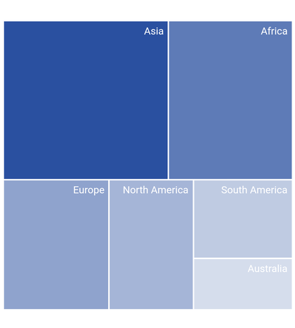
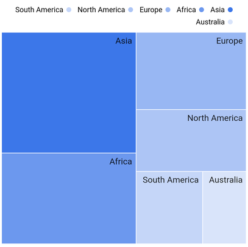
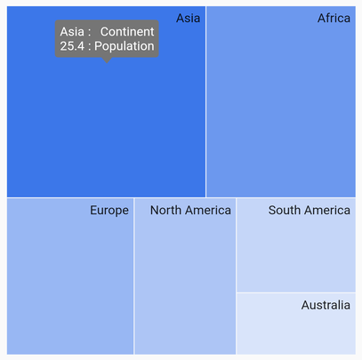

# Right to Left (RTL) in Flutter Treemap (SfTreemap)

## RTL rendering ways

Right to left rendering can be achieved in the following ways:

### Wrapping the SfTreemap with Directionality widget

The treemap can be wrapped inside the [`Directionality`](https://api.flutter.dev/flutter/widgets/Directionality-class.html) widget and you can set the [`textDirection`](https://api.flutter.dev/flutter/widgets/Directionality/textDirection.html) property to [`rtl`](https://api.flutter.dev/flutter/package-intl_intl/TextDirection/RTL-constant.html).




  late List<PopulationModel> _source;

  @override
  void initState() {
    _source = <PopulationModel>[
        PopulationModel('Asia', 25.4),
        PopulationModel('Africa', 19.11),
        PopulationModel('Europe', 13.3),
        PopulationModel('North America', 10.65),
        PopulationModel('South America', 7.54),
        PopulationModel('Australia', 4.93),
    ];
    super.initState();
  }

  @override
  Widget build(BuildContext context) {
    return Scaffold(
      body: Column(
          children: [
            Expanded(
              child: Directionality(
                textDirection: TextDirection.rtl,
                child: SfTreemap(
                  dataCount: _source.length,
                  weightValueMapper: (int index) {
                    return _source[index].populationInMillions;
                  },
                  levels: [
                    TreemapLevel(
                      groupMapper: (int index) {
                        return _source[index].continent;
                      },
                      labelBuilder: (BuildContext context, TreemapTile tile) {
                        return Padding(
                          padding: const EdgeInsets.all(5.0),
                          child: Text(tile.group),
                        );
                      },
                    ),
                  ],
                ),
              ),
            ),
          ],
        ),
    );
  }

class PopulationModel {
  const PopulationModel(this.continent, this.populationInMillions);

  final String continent;
  final double populationInMillions;
}




### Changing the locale to RTL languages

The treemap elements will render in right to left direction if the locale belongs to RTL languages such as (Arabic ,Persian ,Hebrew, Pashto, Urdu). It can be achieved by specifying the MaterialApp properties such as [`localizationsDelegates`](https://api.flutter.dev/flutter/material/MaterialApp/localizationsDelegates.html), [`supportedLocales`](https://api.flutter.dev/flutter/material/MaterialApp/supportedLocales.html), [`locale`](https://api.flutter.dev/flutter/material/MaterialApp/locale.html) and adding the flutter_localizations package to your pubspec.yaml file.




dependencies:
  flutter_localizations:
    sdk: flutter







  late List<PopulationModel> _source;

  @override
  void initState() {
    _source = <PopulationModel>[
        PopulationModel('Asia', 25.4),
        PopulationModel('Africa', 19.11),
        PopulationModel('Europe', 13.3),
        PopulationModel('North America', 10.65),
        PopulationModel('South America', 7.54),
        PopulationModel('Australia', 4.93),
    ];
    super.initState();
  }

  @override
  Widget build(BuildContext context) {
    return MaterialApp(
        localizationsDelegates: [
          GlobalMaterialLocalizations.delegate,
          GlobalWidgetsLocalizations.delegate,
        ],
        supportedLocales: [
          Locale("fa", "IR"),
        ],
        locale: Locale("fa", "IR"),
        home: Scaffold(
          backgroundColor: Colors.white,
          body: SfTreemap(
            dataCount: _source.length,
            weightValueMapper: (int index) {
              return _source[index].populationInMillions;
            },
            levels: [
              TreemapLevel(
                groupMapper: (int index) {
                  return _source[index].continent;
                },
                labelBuilder: (BuildContext context, TreemapTile tile) {
                  return Padding(
                    padding: const EdgeInsets.all(5.0),
                    child: Text(tile.group),
                  );
                },
              ),
            ],
          ),
        ),
    );
  }

class PopulationModel {
  const PopulationModel(this.continent, this.populationInMillions);

  final String continent;
  final double populationInMillions;
}




## RTL supported treemap elements

### Labels

Labels will be rendered from right to left direction.




  late List<PopulationModel> _source;

  @override
  void initState() {
    _source = <PopulationModel>[
        PopulationModel('Asia', 25.4),
        PopulationModel('Africa', 19.11),
        PopulationModel('Europe', 13.3),
        PopulationModel('North America', 10.65),
        PopulationModel('South America', 7.54),
        PopulationModel('Australia', 4.93),
    ];
    super.initState();
  }

  @override
  Widget build(BuildContext context) {
    return Scaffold(
      body: Center(
          child: Container(
            height: 400,
            width: 400,
            child: Column(
              children: [
                Expanded(
                  child: Directionality(
                    textDirection: TextDirection.rtl,
                    child: SfTreemap(
                      dataCount: _source.length,
                      weightValueMapper: (int index) {
                        return _source[index].populationInMillions;
                      },
                      levels: [
                        TreemapLevel(
                          groupMapper: (int index) {
                            return _source[index].continent;
                          },
                          labelBuilder: (BuildContext context, TreemapTile tile) {
                            return Padding(
                              padding: const EdgeInsets.all(5.0),
                              child: Text(tile.group),
                            );
                          },
                        ),
                      ],
                    ),
                  ),
                ),
              ],
            ),
          ),
        ),
    );
  }

class PopulationModel {
  const PopulationModel(this.continent, this.populationInMillions);

  final String continent;
  final double populationInMillions;
}




### Legend

Legend items will be rendered from right to left direction. It is applicable for both solid and bar type legend.




  late List<PopulationModel> _source;

  @override
  void initState() {
    _source = <PopulationModel>[
        PopulationModel('Asia', 25.4),
        PopulationModel('Africa', 19.11),
        PopulationModel('Europe', 13.3),
        PopulationModel('North America', 10.65),
        PopulationModel('South America', 7.54),
        PopulationModel('Australia', 4.93),
    ];
    super.initState();
  }

  @override
  Widget build(BuildContext context) {
    return Scaffold(
      body: Center(
          child: Container(
            height: 400,
            width: 400,
            child: Column(
              children: [
                Expanded(
                  child: Directionality(
                    textDirection: TextDirection.rtl,
                    child: SfTreemap(
                      dataCount: _source.length,
                      weightValueMapper: (int index) {
                        return _source[index].populationInMillions;
                      },
                      levels: [
                        TreemapLevel(
                          groupMapper: (int index) {
                            return _source[index].continent;
                          },
                          labelBuilder: (BuildContext context, TreemapTile tile) {
                            return Padding(
                              padding: const EdgeInsets.all(5.0),
                              child: Text(tile.group),
                            );
                          },
                        ),
                      ],
                      legend: TreemapLegend(),
                    ),
                  ),
                ),
              ],
            ),
          ),
        ),
    );
  }

class PopulationModel {
  const PopulationModel(this.continent, this.populationInMillions);

  final String continent;
  final double populationInMillions;
}




### Tooltip

Tooltip text will be rendered from right to left direction.




  late List<PopulationModel> _source;

  @override
  void initState() {
    _source = <PopulationModel>[
        PopulationModel('Asia', 25.4),
        PopulationModel('Africa', 19.11),
        PopulationModel('Europe', 13.3),
        PopulationModel('North America', 10.65),
        PopulationModel('South America', 7.54),
        PopulationModel('Australia', 4.93),
    ];
    super.initState();
  }

  @override
  Widget build(BuildContext context) {
    return Scaffold(
      body: Center(
          child: Container(
            height: 400,
            width: 400,
            padding: const EdgeInsets.all(5.0),
            child: Column(
              children: [
                Expanded(
                  child: Directionality(
                    textDirection: TextDirection.rtl,
                    child: SfTreemap(
                      dataCount: _source.length,
                      weightValueMapper: (int index) {
                        return _source[index].populationInMillions;
                      },
                      levels: [
                        TreemapLevel(
                          groupMapper: (int index) {
                            return _source[index].continent;
                          },
                          labelBuilder: (BuildContext context, TreemapTile tile) {
                            return Padding(
                              padding: const EdgeInsets.all(5.0),
                              child: Text(tile.group),
                            );
                          },
                          tooltipBuilder:
                              (BuildContext context, TreemapTile tile) {
                            return Padding(
                              padding: EdgeInsets.all(5),
                              child: Column(
                                mainAxisSize: MainAxisSize.min,
                                mainAxisAlignment: MainAxisAlignment.start,
                                crossAxisAlignment: CrossAxisAlignment.start,
                                children: [
                                  Row(
                                    mainAxisSize: MainAxisSize.min,
                                    mainAxisAlignment: MainAxisAlignment.start,
                                    crossAxisAlignment: CrossAxisAlignment.start,
                                    children: [
                                      Text('Continent   : ',
                                          style: TextStyle(color: Colors.white)),
                                      Text(tile.group,
                                          style: TextStyle(color: Colors.white)),
                                    ],
                                  ),
                                  Row(
                                    mainAxisSize: MainAxisSize.min,
                                    mainAxisAlignment: MainAxisAlignment.start,
                                    crossAxisAlignment: CrossAxisAlignment.start,
                                    children: [
                                      Text('Population : ',
                                          style: TextStyle(color: Colors.white)),
                                      Text(tile.weight.toString(),
                                          style: TextStyle(color: Colors.white)),
                                    ],
                                  ),
                                ],
                              ),
                            );
                          },
                        ),
                      ],
                    ),
                  ),
                ),
              ],
            ),
          ),
      ),
    );
  }

class PopulationModel {
  const PopulationModel(this.continent, this.populationInMillions);

  final String continent;
  final double populationInMillions;
}




