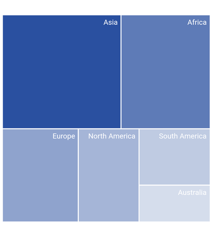
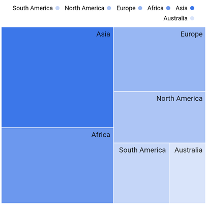
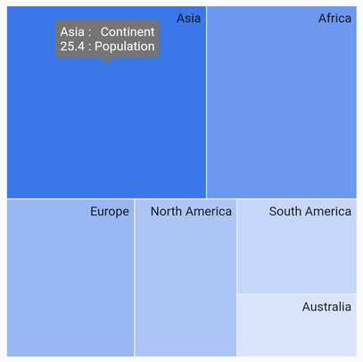

# Right to Left (RTL) in Flutter Treemap (SfTreemap)

## Enable RTL rendering

Right-to-left rendering can be achieved in the following ways:

### Wrapping the SfTreemap with the Directionality widget

The treemap can be wrapped inside the [`Directionality`](https://api.flutter.dev/flutter/widgets/Directionality-class.html) widget, and you can set the [`textDirection`](https://api.flutter.dev/flutter/widgets/Directionality/textDirection.html) property to [`rtl`](https://api.flutter.dev/flutter/dart-ui/TextDirection.html#rtl).




import 'package:flutter/material.dart';
import 'package:syncfusion_flutter_treemap/treemap.dart';

void main() {
  runApp(const RTLExample());
}

class RTLExample extends StatefulWidget {
  const RTLExample({super.key});

  @override
  State<RTLExample> createState() => _RTLExampleState();
}

class _RTLExampleState extends State<RTLExample> {
  late List<PopulationModel> _source;

  @override
  void initState() {
    _source = <PopulationModel>[
      PopulationModel('Asia', 25.4),
      PopulationModel('Africa', 19.11),
      PopulationModel('Europe', 13.3),
      PopulationModel('North America', 10.65),
      PopulationModel('South America', 7.54),
      PopulationModel('Australia', 4.93),
    ];
    super.initState();
  }

  @override
  Widget build(BuildContext context) {
    return MaterialApp(
      home: Scaffold(
        body: Column(
          children: [
            Expanded(
              child: Directionality(
                textDirection: TextDirection.rtl,
                child: SfTreemap(
                  dataCount: _source.length,
                  weightValueMapper: (int index) {
                    return _source[index].populationInMillions;
                  },
                  levels: [
                    TreemapLevel(
                      groupMapper: (int index) {
                        return _source[index].continent;
                      },
                      labelBuilder: (BuildContext context, TreemapTile tile) {
                        return Padding(
                          padding: const EdgeInsets.all(5.0),
                          child: Text(tile.group),
                        );
                      },
                    ),
                  ],
                ),
              ),
            ),
          ],
        ),
      ),
    );
  }
}

class PopulationModel {
  const PopulationModel(this.continent, this.populationInMillions);

  final String continent;
  final double populationInMillions;
}




### Changing the locale to RTL languages

The treemap elements will render in the right-to-left direction if the locale belongs to RTL languages such as Arabic, Persian, Hebrew, Pashto, or Urdu. You can achieve this by specifying the MaterialApp properties such as [`localizationsDelegates`](https://api.flutter.dev/flutter/material/MaterialApp/localizationsDelegates.html), [`supportedLocales`](https://api.flutter.dev/flutter/material/MaterialApp/supportedLocales.html), [`locale`](https://api.flutter.dev/flutter/material/MaterialApp/locale.html), and adding the flutter_localizations package to your pubspec.yaml file.




dependencies:
  flutter_localizations:
    sdk: flutter







import 'package:flutter/material.dart';
import 'package:flutter_localizations/flutter_localizations.dart';
import 'package:syncfusion_flutter_treemap/treemap.dart';

void main() {
  runApp(const RTLLocaleExample());
}

class RTLLocaleExample extends StatefulWidget {
  const RTLLocaleExample({super.key});

  @override
  State<RTLLocaleExample> createState() => _RTLLocaleExampleState();
}

class _RTLLocaleExampleState extends State<RTLLocaleExample> {
  late List<PopulationModel> _source;

  @override
  void initState() {
    _source = <PopulationModel>[
      PopulationModel('Asia', 25.4),
      PopulationModel('Africa', 19.11),
      PopulationModel('Europe', 13.3),
      PopulationModel('North America', 10.65),
      PopulationModel('South America', 7.54),
      PopulationModel('Australia', 4.93),
    ];
    super.initState();
  }

  @override
  Widget build(BuildContext context) {
    return MaterialApp(
      localizationsDelegates: const [
        GlobalMaterialLocalizations.delegate,
        GlobalWidgetsLocalizations.delegate,
      ],
      supportedLocales: const [Locale('fa', 'IR')],
      locale: const Locale('fa', 'IR'),
      home: Scaffold(
        backgroundColor: Colors.white,
        body: SfTreemap(
          dataCount: _source.length,
          weightValueMapper: (int index) {
            return _source[index].populationInMillions;
          },
          levels: [
            TreemapLevel(
              groupMapper: (int index) {
                return _source[index].continent;
              },
              labelBuilder: (BuildContext context, TreemapTile tile) {
                return Padding(
                  padding: const EdgeInsets.all(5.0),
                  child: Text(tile.group),
                );
              },
            ),
          ],
        ),
      ),
    );
  }
}

class PopulationModel {
  const PopulationModel(this.continent, this.populationInMillions);

  final String continent;
  final double populationInMillions;
}




## RTL supported treemap elements

### Labels

Labels will be rendered from right to left direction.




import 'package:flutter/material.dart';
import 'package:syncfusion_flutter_treemap/treemap.dart';

void main() {
  runApp(const RTLLabelsExample());
}

class RTLLabelsExample extends StatefulWidget {
  const RTLLabelsExample({super.key});

  @override
  State<RTLLabelsExample> createState() => _RTLLabelsExampleState();
}

class _RTLLabelsExampleState extends State<RTLLabelsExample> {
  late List<PopulationModel> _source;

  @override
  void initState() {
    _source = <PopulationModel>[
      PopulationModel('Asia', 25.4),
      PopulationModel('Africa', 19.11),
      PopulationModel('Europe', 13.3),
      PopulationModel('North America', 10.65),
      PopulationModel('South America', 7.54),
      PopulationModel('Australia', 4.93),
    ];
    super.initState();
  }

  @override
  Widget build(BuildContext context) {
    return MaterialApp(
      home: Scaffold(
        body: Center(
          child: SizedBox(
            height: 400,
            width: 400,
            child: Directionality(
              textDirection: TextDirection.rtl,
              child: SfTreemap(
                dataCount: _source.length,
                weightValueMapper: (int index) {
                  return _source[index].populationInMillions;
                },
                levels: [
                  TreemapLevel(
                    groupMapper: (int index) {
                      return _source[index].continent;
                    },
                    labelBuilder: (BuildContext context, TreemapTile tile) {
                      return Padding(
                        padding: const EdgeInsets.all(5.0),
                        child: Text(tile.group),
                      );
                    },
                  ),
                ],
              ),
            ),
          ),
        ),
      ),
    );
  }
}

class PopulationModel {
  const PopulationModel(this.continent, this.populationInMillions);

  final String continent;
  final double populationInMillions;
}




### Legend

Legend items will be rendered from right to left direction. It is applicable for both solid and bar type legend.




import 'package:flutter/material.dart';
import 'package:syncfusion_flutter_treemap/treemap.dart';

void main() {
  runApp(const RTLLegendExample());
}

class RTLLegendExample extends StatefulWidget {
  const RTLLegendExample({super.key});

  @override
  State<RTLLegendExample> createState() => _RTLLegendExampleState();
}

class _RTLLegendExampleState extends State<RTLLegendExample> {
  late List<PopulationModel> _source;

  @override
  void initState() {
    _source = <PopulationModel>[
      PopulationModel('Asia', 25.4),
      PopulationModel('Africa', 19.11),
      PopulationModel('Europe', 13.3),
      PopulationModel('North America', 10.65),
      PopulationModel('South America', 7.54),
      PopulationModel('Australia', 4.93),
    ];
    super.initState();
  }

  @override
  Widget build(BuildContext context) {
    return MaterialApp(
      home: Scaffold(
        body: Center(
          child: SizedBox(
            height: 400,
            width: 400,
            child: Directionality(
              textDirection: TextDirection.rtl,
              child: SfTreemap(
                dataCount: _source.length,
                weightValueMapper: (int index) {
                  return _source[index].populationInMillions;
                },
                levels: [
                  TreemapLevel(
                    groupMapper: (int index) {
                      return _source[index].continent;
                    },
                    labelBuilder: (BuildContext context, TreemapTile tile) {
                      return Padding(
                        padding: const EdgeInsets.all(5.0),
                        child: Text(tile.group),
                      );
                    },
                  ),
                ],
                legend: TreemapLegend(),
              ),
            ),
          ),
        ),
      ),
    );
  }
}

class PopulationModel {
  const PopulationModel(this.continent, this.populationInMillions);

  final String continent;
  final double populationInMillions;
}




### Tooltip

Tooltip text will be rendered from right to left direction.




import 'package:flutter/material.dart';
import 'package:syncfusion_flutter_treemap/treemap.dart';

void main() {
  runApp(const RTLTooltipExample());
}

class RTLTooltipExample extends StatefulWidget {
  const RTLTooltipExample({super.key});

  @override
  State<RTLTooltipExample> createState() => _RTLTooltipExampleState();
}

class _RTLTooltipExampleState extends State<RTLTooltipExample> {
  late List<PopulationModel> _source;

  @override
  void initState() {
    _source = <PopulationModel>[
      PopulationModel('Asia', 25.4),
      PopulationModel('Africa', 19.11),
      PopulationModel('Europe', 13.3),
      PopulationModel('North America', 10.65),
      PopulationModel('South America', 7.54),
      PopulationModel('Australia', 4.93),
    ];
    super.initState();
  }

  @override
  Widget build(BuildContext context) {
    return MaterialApp(
      home: Scaffold(
        body: Center(
          child: SizedBox(
            height: 400,
            width: 400,
            child: Directionality(
              textDirection: TextDirection.rtl,
              child: SfTreemap(
                dataCount: _source.length,
                weightValueMapper: (int index) {
                  return _source[index].populationInMillions;
                },
                levels: [
                  TreemapLevel(
                    groupMapper: (int index) {
                      return _source[index].continent;
                    },
                    labelBuilder: (BuildContext context, TreemapTile tile) {
                      return Padding(
                        padding: const EdgeInsets.all(5.0),
                        child: Text(tile.group),
                      );
                    },
                    tooltipBuilder: (BuildContext context, TreemapTile tile) {
                      return Padding(
                        padding: const EdgeInsets.all(5),
                        child: Column(
                          mainAxisSize: MainAxisSize.min,
                          mainAxisAlignment: MainAxisAlignment.start,
                          crossAxisAlignment: CrossAxisAlignment.start,
                          children: [
                            Row(
                              mainAxisSize: MainAxisSize.min,
                              mainAxisAlignment: MainAxisAlignment.start,
                              crossAxisAlignment: CrossAxisAlignment.start,
                              children: [
                                const Text(
                                  'Continent   : ',
                                  style: TextStyle(color: Colors.white),
                                ),
                                Text(
                                  tile.group,
                                  style: const TextStyle(color: Colors.white),
                                ),
                              ],
                            ),
                            Row(
                              mainAxisSize: MainAxisSize.min,
                              mainAxisAlignment: MainAxisAlignment.start,
                              crossAxisAlignment: CrossAxisAlignment.start,
                              children: [
                                const Text(
                                  'Population : ',
                                  style: TextStyle(color: Colors.white),
                                ),
                                Text(
                                  tile.weight.toString(),
                                  style: const TextStyle(color: Colors.white),
                                ),
                              ],
                            ),
                          ],
                        ),
                      );
                    },
                  ),
                ],
              ),
            ),
          ),
        ),
      ),
    );
  }
}

class PopulationModel {
  const PopulationModel(this.continent, this.populationInMillions);

  final String continent;
  final double populationInMillions;
}




