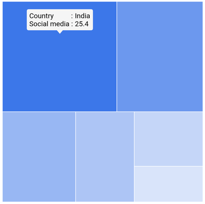
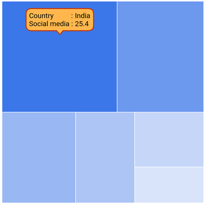

# Tooltip in Flutter Treemap (SfTreemap)

Tooltip is used to provide information about the tile during the tap, or click interaction. This section helps to learn about how to show tooltip on a tile and customize them.

## Tooltip for the tiles

It is used to clearly indicate the tile information on the tap or click. To show tooltip for the tile, return a widget in [`TreemapLevel.tooltipBuilder`](https://pub.dev/documentation/syncfusion_flutter_treemap/latest/treemap/TreemapLevel/tooltipBuilder.html). This widget will then be wrapped in the builtin shape which comes with the nose at the bottom.

The [`TreemapLevel.tooltipBuilder`](https://pub.dev/documentation/syncfusion_flutter_treemap/latest/treemap/TreemapLevel/tooltipBuilder.html) will be called with the corresponding tile details every time you interact with the tile i.e., while tapping in touch devices and hover enter in the mouse enabled devices.




  late List<SocialMediaUsers> _source;

  @override
  void initState() {
    _source = <SocialMediaUsers>[
        SocialMediaUsers('India', 'Facebook', 25.4),
        SocialMediaUsers('USA', 'Instagram', 19.11),
        SocialMediaUsers('Japan', 'Facebook', 13.3),
        SocialMediaUsers('Germany', 'Instagram', 10.65),
        SocialMediaUsers('France', 'Twitter', 7.54),
        SocialMediaUsers('UK', 'Instagram', 4.93),
    ];
    super.initState();
  }

  @override
  Widget build(BuildContext context) {
    return Scaffold(
      body: Center(
          child: Container(
            height: 400,
            width: 400,
            child: SfTreemap(
              dataCount: _source.length,
              weightValueMapper: (int index) {
                return _source[index].usersInMillions;
              },
              levels: [
                TreemapLevel(
                  groupMapper: (int index) {
                    return _source[index].country;
                  },
                  tooltipBuilder: (BuildContext context, TreemapTile tile) {
                    return Padding(
                      padding: EdgeInsets.all(5),
                      child: Column(
                        mainAxisSize: MainAxisSize.min,
                        mainAxisAlignment: MainAxisAlignment.start,
                        crossAxisAlignment: CrossAxisAlignment.start,
                        children: [
                          Row(
                            mainAxisSize: MainAxisSize.min,
                            mainAxisAlignment: MainAxisAlignment.start,
                            crossAxisAlignment: CrossAxisAlignment.start,
                            children: [
                              Text('Country          : ',
                                  style: TextStyle(color: Colors.black)),
                              Text(tile.group,
                                  style: TextStyle(color: Colors.black)),
                            ],
                          ),
                          Row(
                            mainAxisSize: MainAxisSize.min,
                            mainAxisAlignment: MainAxisAlignment.start,
                            crossAxisAlignment: CrossAxisAlignment.start,
                            children: [
                              Text('Social media : ',
                                  style: TextStyle(color: Colors.black)),
                              Text(tile.weight.toString(),
                                  style: TextStyle(color: Colors.black)),
                            ],
                          ),
                        ],
                      ),
                    );
                  },
                ),
              ],
            ),
          ),
        ),
    );
  }

class SocialMediaUsers {
  const SocialMediaUsers(this.country, this.socialMedia, this.usersInMillions);

  final String country;
  final String socialMedia;
  final double usersInMillions;
}




N>
* Refer the [`TreemapTooltipSettings`](https://pub.dev/documentation/syncfusion_flutter_treemap/latest/treemap/TreemapTooltipSettings/TreemapTooltipSettings.html), for customizing the tooltip shape.

## Appearance customization

You can customize the appearance of the tooltip.

* **Background color** - Change the background color of the tooltip using the  [`TreemapTooltipSettings.color`](https://pub.dev/documentation/syncfusion_flutter_treemap/latest/treemap/TreemapTooltipSettings/color.html) property.
* **Border color** - Change the border color of the tooltip in the treemap using the [`TreemapTooltipSettings.borderColor`](https://pub.dev/documentation/syncfusion_flutter_treemap/latest/treemap/TreemapTooltipSettings/borderColor.html) property.
* **Border width** - Change the border width of the tooltip in the treemap using the [`TreemapTooltipSettings.borderWidth`](https://pub.dev/documentation/syncfusion_flutter_treemap/latest/treemap/TreemapTooltipSettings/borderWidth.html) property.
* **Border radius** - Change the border radius of the tooltip in the treemap using the [`TreemapTooltipSettings.borderRadius`](https://pub.dev/documentation/syncfusion_flutter_treemap/latest/treemap/TreemapTooltipSettings/borderRadius.html) property.
* **Visibility** - Change the duration of the tooltip visibility using the [`hideDelay`](https://pub.dev/documentation/syncfusion_flutter_treemap/latest/treemap/TreemapTooltipSettings/hideDelay.html) property. The default value of the [`hideDelay`](https://pub.dev/documentation/syncfusion_flutter_treemap/latest/treemap/TreemapTooltipSettings/hideDelay.html) property is 3. By default, tooltip will hide automatically after 3 seconds of inactivity for mobile platforms. Also, you can increase or decrease the tooltip duration or show tooltip always by setting double.infinity to the [`hideDelay`](https://pub.dev/documentation/syncfusion_flutter_treemap/latest/treemap/TreemapTooltipSettings/hideDelay.html) property.




  late List<SocialMediaUsers> _source;

  @override
  void initState() {
    _source = <SocialMediaUsers>[
        SocialMediaUsers('India', 'Facebook', 25.4),
        SocialMediaUsers('USA', 'Instagram', 19.11),
        SocialMediaUsers('Japan', 'Facebook', 13.3),
        SocialMediaUsers('Germany', 'Instagram', 10.65),
        SocialMediaUsers('France', 'Twitter', 7.54),
        SocialMediaUsers('UK', 'Instagram', 4.93),
    ];
    super.initState();
  }

  @override
  Widget build(BuildContext context) {
    return Scaffold(
      body: Center(
          child: Container(
            height: 400,
            width: 400,
            child: SfTreemap(
              dataCount: _source.length,
              weightValueMapper: (int index) {
                return _source[index].usersInMillions;
              },
              levels: [
                TreemapLevel(
                  groupMapper: (int index) {
                    return _source[index].country;
                  },
                  tooltipBuilder: (BuildContext context, TreemapTile tile) {
                    return Padding(
                      padding: EdgeInsets.all(5),
                      child: Column(
                        mainAxisSize: MainAxisSize.min,
                        mainAxisAlignment: MainAxisAlignment.start,
                        crossAxisAlignment: CrossAxisAlignment.start,
                        children: [
                          Row(
                            mainAxisSize: MainAxisSize.min,
                            mainAxisAlignment: MainAxisAlignment.start,
                            crossAxisAlignment: CrossAxisAlignment.start,
                            children: [
                              Text('Country          : ',
                                  style: TextStyle(color: Colors.black)),
                              Text(tile.group,
                                  style: TextStyle(color: Colors.black)),
                            ],
                          ),
                          Row(
                            mainAxisSize: MainAxisSize.min,
                            mainAxisAlignment: MainAxisAlignment.start,
                            crossAxisAlignment: CrossAxisAlignment.start,
                            children: [
                              Text('Social media : ',
                                  style: TextStyle(color: Colors.black)),
                              Text(tile.weight.toString(),
                                  style: TextStyle(color: Colors.black)),
                            ],
                          ),
                        ],
                      ),
                    );
                  },
                ),
              ],
              tooltipSettings: TreemapTooltipSettings(
                color: Colors.orange[300],
                borderColor: Colors.deepOrange[900],
                borderWidth: 2,
                borderRadius: BorderRadius.circular(10),
                hideDelay: 6,
              ),
            ),
          ),
        ),
    );
  }

class SocialMediaUsers {
  const SocialMediaUsers(this.country, this.socialMedia, this.usersInMillions);

  final String country;
  final String socialMedia;
  final double usersInMillions;
}




N>
* Refer the [`TreemapLevel.tooltipBuilder`](https://pub.dev/documentation/syncfusion_flutter_treemap/latest/treemap/TreemapLevel/tooltipBuilder.html), for enabling tooltip for the tile.
