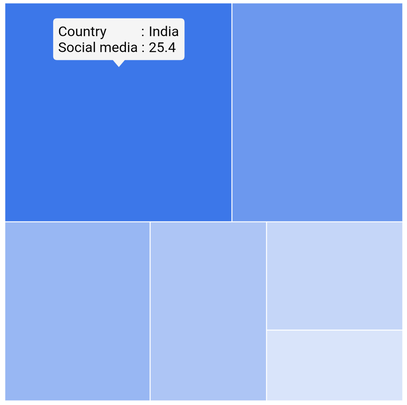
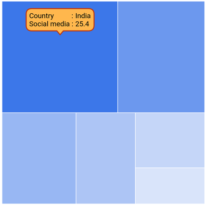

# Tooltip in Flutter Treemap (SfTreemap)

Tooltip is used to provide information about a tile during tap or click interaction. This section helps you learn how to show a tooltip on a tile and customize it.

## Tooltip for the tiles

Tooltips are used to clearly indicate tile information on tap or click. To show a tooltip for the tile, return a widget in [`TreemapLevel.tooltipBuilder`](https://pub.dev/documentation/syncfusion_flutter_treemap/latest/treemap/TreemapLevel/tooltipBuilder.html). This widget is then wrapped in the built-in shape with the nose at the bottom.

The [`TreemapLevel.tooltipBuilder`](https://pub.dev/documentation/syncfusion_flutter_treemap/latest/treemap/TreemapLevel/tooltipBuilder.html) callback is called with the corresponding tile details every time you interact with the tile, while tapping on touch devices and hover-enter on mouse-enabled devices.




import 'package:flutter/material.dart';
import 'package:syncfusion_flutter_treemap/treemap.dart';

class TooltipExample extends StatefulWidget {
  const TooltipExample({super.key});

  @override
  State<TooltipExample> createState() => _TooltipExampleState();
}

class _TooltipExampleState extends State<TooltipExample> {
  late List<SocialMediaUsers> _source;

  @override
  void initState() {
    _source = <SocialMediaUsers>[
      SocialMediaUsers('India', 'Facebook', 25.4),
      SocialMediaUsers('USA', 'Instagram', 19.11),
      SocialMediaUsers('Japan', 'Facebook', 13.3),
      SocialMediaUsers('Germany', 'Instagram', 10.65),
      SocialMediaUsers('France', 'Twitter', 7.54),
      SocialMediaUsers('UK', 'Instagram', 4.93),
    ];
    super.initState();
  }

  @override
  Widget build(BuildContext context) {
    return Scaffold(
      body: Center(
        child: SizedBox(
          height: 400,
          width: 400,
          child: SfTreemap(
            dataCount: _source.length,
            weightValueMapper: (int index) {
              return _source[index].usersInMillions;
            },
            levels: [
              TreemapLevel(
                groupMapper: (int index) {
                  return _source[index].country;
                },
                tooltipBuilder: (BuildContext context, TreemapTile tile) {
                  return Padding(
                    padding: const EdgeInsets.all(5),
                    child: Column(
                      mainAxisSize: MainAxisSize.min,
                      mainAxisAlignment: MainAxisAlignment.start,
                      crossAxisAlignment: CrossAxisAlignment.start,
                      children: [
                        Row(
                          mainAxisSize: MainAxisSize.min,
                          mainAxisAlignment: MainAxisAlignment.start,
                          crossAxisAlignment: CrossAxisAlignment.start,
                          children: [
                            const Text('Country          : ',
                                style: TextStyle(color: Colors.black)),
                            Text(tile.group,
                                style: const TextStyle(color: Colors.black)),
                          ],
                        ),
                        Row(
                          mainAxisSize: MainAxisSize.min,
                          mainAxisAlignment: MainAxisAlignment.start,
                          crossAxisAlignment: CrossAxisAlignment.start,
                          children: [
                            const Text('Social media : ',
                                style: TextStyle(color: Colors.black)),
                            Text(tile.weight.toString(),
                                style: const TextStyle(color: Colors.black)),
                          ],
                        ),
                      ],
                    ),
                  );
                },
              ),
            ],
          ),
        ),
      ),
    );
  }
}

class SocialMediaUsers {
  const SocialMediaUsers(this.country, this.socialMedia, this.usersInMillions);

  final String country;
  final String socialMedia;
  final double usersInMillions;
}




N>
* Refer the [`TreemapTooltipSettings`](https://pub.dev/documentation/syncfusion_flutter_treemap/latest/treemap/TreemapTooltipSettings/TreemapTooltipSettings.html), for customizing the tooltip shape.

## Appearance customization

You can customize the appearance of the tooltip.

* **Background color** - Change the background color of the tooltip using the  [`TreemapTooltipSettings.color`](https://pub.dev/documentation/syncfusion_flutter_treemap/latest/treemap/TreemapTooltipSettings/color.html) property.
* **Border color** - Change the border color of the tooltip in the treemap using the [`TreemapTooltipSettings.borderColor`](https://pub.dev/documentation/syncfusion_flutter_treemap/latest/treemap/TreemapTooltipSettings/borderColor.html) property.
* **Border width** - Change the border width of the tooltip in the treemap using the [`TreemapTooltipSettings.borderWidth`](https://pub.dev/documentation/syncfusion_flutter_treemap/latest/treemap/TreemapTooltipSettings/borderWidth.html) property.
* **Border radius** - Change the border radius of the tooltip in the treemap using the [`TreemapTooltipSettings.borderRadius`](https://pub.dev/documentation/syncfusion_flutter_treemap/latest/treemap/TreemapTooltipSettings/borderRadius.html) property.
* **Visibility** - Change the duration of the tooltip visibility using the [`hideDelay`](https://pub.dev/documentation/syncfusion_flutter_treemap/latest/treemap/TreemapTooltipSettings/hideDelay.html) property. The default value of the [`hideDelay`](https://pub.dev/documentation/syncfusion_flutter_treemap/latest/treemap/TreemapTooltipSettings/hideDelay.html) property is 3. By default, tooltip will hide automatically after 3 seconds of inactivity for mobile platforms. Also, you can increase or decrease the tooltip duration or show tooltip always by setting double.infinity to the [`hideDelay`](https://pub.dev/documentation/syncfusion_flutter_treemap/latest/treemap/TreemapTooltipSettings/hideDelay.html) property.




import 'package:flutter/material.dart';
import 'package:syncfusion_flutter_treemap/treemap.dart';

class TooltipAppearanceExample extends StatefulWidget {
  const TooltipAppearanceExample({super.key});

  @override
  State<TooltipAppearanceExample> createState() =>
      _TooltipAppearanceExampleState();
}

class _TooltipAppearanceExampleState extends State<TooltipAppearanceExample> {
  late List<SocialMediaUsers> _source;

  @override
  void initState() {
    _source = <SocialMediaUsers>[
      SocialMediaUsers('India', 'Facebook', 25.4),
      SocialMediaUsers('USA', 'Instagram', 19.11),
      SocialMediaUsers('Japan', 'Facebook', 13.3),
      SocialMediaUsers('Germany', 'Instagram', 10.65),
      SocialMediaUsers('France', 'Twitter', 7.54),
      SocialMediaUsers('UK', 'Instagram', 4.93),
    ];
    super.initState();
  }

  @override
  Widget build(BuildContext context) {
    return Scaffold(
      body: Center(
        child: SizedBox(
          height: 400,
          width: 400,
          child: SfTreemap(
            dataCount: _source.length,
            weightValueMapper: (int index) {
              return _source[index].usersInMillions;
            },
            levels: [
              TreemapLevel(
                groupMapper: (int index) {
                  return _source[index].country;
                },
                tooltipBuilder: (BuildContext context, TreemapTile tile) {
                  return Padding(
                    padding: const EdgeInsets.all(5),
                    child: Column(
                      mainAxisSize: MainAxisSize.min,
                      mainAxisAlignment: MainAxisAlignment.start,
                      crossAxisAlignment: CrossAxisAlignment.start,
                      children: [
                        Row(
                          mainAxisSize: MainAxisSize.min,
                          mainAxisAlignment: MainAxisAlignment.start,
                          crossAxisAlignment: CrossAxisAlignment.start,
                          children: [
                            const Text('Country          : ',
                                style: TextStyle(color: Colors.black)),
                            Text(tile.group,
                                style: const TextStyle(color: Colors.black)),
                          ],
                        ),
                        Row(
                          mainAxisSize: MainAxisSize.min,
                          mainAxisAlignment: MainAxisAlignment.start,
                          crossAxisAlignment: CrossAxisAlignment.start,
                          children: [
                            const Text('Social media : ',
                                style: TextStyle(color: Colors.black)),
                            Text(tile.weight.toString(),
                                style: const TextStyle(color: Colors.black)),
                          ],
                        ),
                      ],
                    ),
                  );
                },
              ),
            ],
            tooltipSettings: TreemapTooltipSettings(
              color: Colors.orange[300],
              borderColor: Colors.deepOrange[900],
              borderWidth: 2,
              borderRadius: BorderRadius.circular(10),
              hideDelay: 6,
            ),
          ),
        ),
      ),
    );
  }
}

class SocialMediaUsers {
  const SocialMediaUsers(this.country, this.socialMedia, this.usersInMillions);

  final String country;
  final String socialMedia;
  final double usersInMillions;
}




N>
* Refer the [`TreemapLevel.tooltipBuilder`](https://pub.dev/documentation/syncfusion_flutter_treemap/latest/treemap/TreemapLevel/tooltipBuilder.html), for enabling tooltip for the tile.