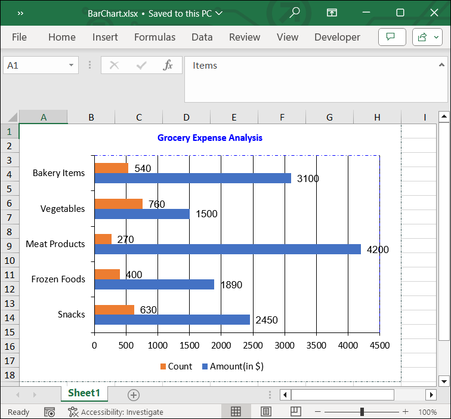

# Adding Bar Chart to Excel worksheet

A bar chart is a chart type that presents categorical data with rectangular bars with heights or lengths proportional to the data values in Excel worksheet.

The following code snippet illustrate how to add bar chart to Excel worksheet using Flutter XlsIO.



// Create a new Excel document.
final Workbook workbook = Workbook();

// Accessing worksheet via index.
final Worksheet sheet = workbook.worksheets[0];

// Setting value in the cell.
sheet.getRangeByName('A1').setText('Items');
sheet.getRangeByName('B1').setText('Amount(in \$)');
sheet.getRangeByName('C1').setText('Count');
sheet.getRangeByName('A2').setText('Beverages');
sheet.getRangeByName('A3').setText('Condiments');
sheet.getRangeByName('A4').setText('Confections');
sheet.getRangeByName('A5').setText('Dairy Products');
sheet.getRangeByName('A6').setText('Grains / Cereals');
sheet.getRangeByName('B2').setNumber(2776);
sheet.getRangeByName('B3').setNumber(1077);
sheet.getRangeByName('B4').setNumber(2287);
sheet.getRangeByName('B5').setNumber(1368);
sheet.getRangeByName('B6').setNumber(3325);
sheet.getRangeByName('C2').setNumber(925);
sheet.getRangeByName('C3').setNumber(378);
sheet.getRangeByName('C4').setNumber(880);
sheet.getRangeByName('C5').setNumber(581);
sheet.getRangeByName('C6').setNumber(189);

// Create an instances of chart collection.
final ChartCollection charts = ChartCollection(sheet);

// Add the chart.
final Chart chart1 = charts.add();

// Set Chart Type.
chart1.chartType = ExcelChartType.bar;

// Set data range in the worksheet.
chart1.dataRange = sheet.getRangeByName('A1:C6');

chart1.isSeriesInRows = false;

// set charts to worksheet.
sheet.charts = charts;

// save and dispose the workbook.
final List<int> bytes = workbook.saveSync();
workbook.dispose();

File('BarChart.xlsx').writeAsBytes(bytes);



## Customizing Bar Chart in Excel

The following code illustrates how to customize various elements of a bar chart in Excel using Flutter XlsIO.



// Create a new Excel document.
final Workbook workbook = Workbook();

// Accessing worksheet via index.
final Worksheet sheet = workbook.worksheets[0];

// Setting value in the cell.
sheet.getRangeByName('A1').setText('Items');
sheet.getRangeByName('B1').setText('Amount(in \$)');
sheet.getRangeByName('C1').setText('Count');
sheet.getRangeByName('A2').setText('Snacks');
sheet.getRangeByName('A3').setText('Frozen Foods');
sheet.getRangeByName('A4').setText('Meat Products');
sheet.getRangeByName('A5').setText('Vegetables');
sheet.getRangeByName('A6').setText('Bakery Items');
sheet.getRangeByName('B2').setNumber(2450);
sheet.getRangeByName('B3').setNumber(1890);
sheet.getRangeByName('B4').setNumber(4200);
sheet.getRangeByName('B5').setNumber(1500);
sheet.getRangeByName('B6').setNumber(3100);
sheet.getRangeByName('C2').setNumber(630);
sheet.getRangeByName('C3').setNumber(400);
sheet.getRangeByName('C4').setNumber(270);
sheet.getRangeByName('C5').setNumber(760);
sheet.getRangeByName('C6').setNumber(540);

// Create an instances of chart collection
final ChartCollection charts = ChartCollection(sheet);

// Add the chart
final Chart chart = charts.add();

// Set Chart Type
chart.chartType = ExcelChartType.bar;

// Set data range in the worksheet
chart.dataRange = sheet.getRangeByName('A1:C6');
chart.isSeriesInRows = false;

// Set chart title
chart.chartTitle = "Grocery Expense Analysis";
chart.chartTitleArea.bold = true;
chart.chartTitleArea.size = 10;
chart.chartTitleArea.color = "#0000FF";

// Set data labels
final ChartSerie serie1 = chart.series[0];
serie1.dataLabels.isValue = true;
serie1.dataLabels.textArea.bold = false;
serie1.dataLabels.textArea.size = 10;
serie1.dataLabels.textArea.fontName = 'Arial';

final ChartSerie serie2 = chart.series[1];
serie2.dataLabels.isValue = true;
serie2.dataLabels.textArea.bold = false;
serie2.dataLabels.textArea.size = 10;
serie2.dataLabels.textArea.fontName = 'Arial';

// Set legend position
chart.legend!.position = ExcelLegendPosition.bottom;

// Set line pattern for chart border
chart.linePattern = ExcelChartLinePattern.dashDot;
chart.linePatternColor = "#2F4F4F";

// Set line pattern for plot area
chart.plotArea.linePattern = ExcelChartLinePattern.dashDot;
chart.plotArea.linePatternColor = '#0000FF';

// Set charts to worksheet.
sheet.charts = charts;

// save and dispose the workbook.
final List<int> bytes = workbook.saveSync();
workbook.dispose();

File('BarChart.xlsx').writeAsBytes(bytes);



By executing the above code snippet, you will get the Excel document as follows.
