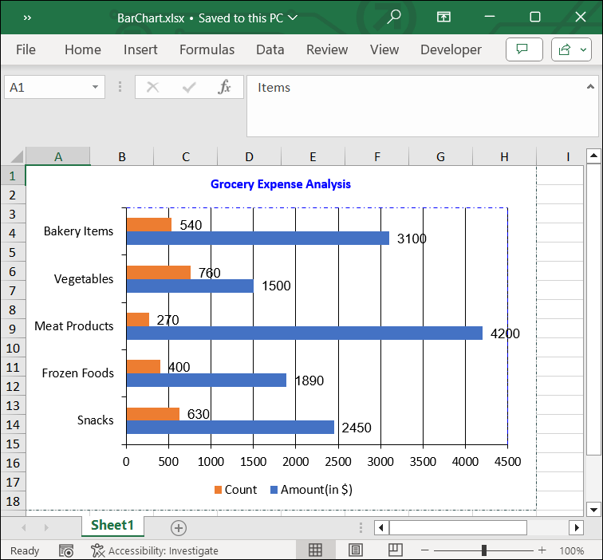

# Adding a Bar Chart to an Excel Worksheet

A bar chart displays categorical data with horizontal rectangular bars whose lengths are proportional to the data values. It is most effective when you want to compare values across categories and the category labels are long. If the categories are short and you want vertical bars, use a column chart instead.

For prerequisites and installation steps, see the [Flutter XlsIO Overview](https://help.syncfusion.com/document-processing/excel/excel-library/flutter/overview). For background on charts and the chart package, see [Working with Excel Charts](https://help.syncfusion.com/document-processing/excel/excel-library/flutter/working-with-charts).

N> The code samples in this document use `await workbook.save()`. Always call `workbook.dispose()` after saving to release the XlsIO DOM memory, ideally inside a `try/finally` block.

## Create a bar chart

A bar chart is created in three steps: build the data, add a `Chart` to the worksheet's `ChartCollection`, and set the `chartType` and `dataRange`. The first column of the data range supplies the category labels, and each remaining column supplies a series of values.


import 'package:syncfusion_flutter_xlsio/xlsio.dart';
import 'package:syncfusion_officechart/officechart.dart';

Future<void> createBarChart() async {
  final Workbook workbook = Workbook();
  final Worksheet sheet = workbook.worksheets[0];

  // Sample data: a list of grocery categories and two value series.
  sheet.getRangeByName('A1').setText('Items');
  sheet.getRangeByName('B1').setText(r'Amount (in $)');
  sheet.getRangeByName('C1').setText('Count');
  sheet.getRangeByName('A2').setText('Beverages');
  sheet.getRangeByName('A3').setText('Condiments');
  sheet.getRangeByName('A4').setText('Confections');
  sheet.getRangeByName('A5').setText('Dairy Products');
  sheet.getRangeByName('A6').setText('Grains / Cereals');
  sheet.getRangeByName('B2').setNumber(2776);
  sheet.getRangeByName('B3').setNumber(1077);
  sheet.getRangeByName('B4').setNumber(2287);
  sheet.getRangeByName('B5').setNumber(1368);
  sheet.getRangeByName('B6').setNumber(3325);
  sheet.getRangeByName('C2').setNumber(925);
  sheet.getRangeByName('C3').setNumber(378);
  sheet.getRangeByName('C4').setNumber(880);
  sheet.getRangeByName('C5').setNumber(581);
  sheet.getRangeByName('C6').setNumber(189);

  // Create a chart collection and add a bar chart.
  final ChartCollection charts = ChartCollection(sheet);
  final Chart chart = charts.add();
  chart.chartType = ExcelChartType.bar;
  chart.dataRange = sheet.getRangeByName('A1:C6');
  chart.isSeriesInRows = false;

  // Bind the chart collection to the worksheet.
  sheet.charts = charts;

  final List<int> bytes = await workbook.save();
  workbook.dispose();
}


## Customize a bar chart

The `Chart` class exposes properties for the most common chart elements: chart title, data labels, legend, and line patterns. The samples below build on the same data setup.

### Sample data setup


import 'package:syncfusion_flutter_xlsio/xlsio.dart';
import 'package:syncfusion_officechart/officechart.dart';

void populateBarChartData(Worksheet sheet) {
  sheet.getRangeByName('A1').setText('Items');
  sheet.getRangeByName('B1').setText(r'Amount (in $)');
  sheet.getRangeByName('C1').setText('Count');
  sheet.getRangeByName('A2').setText('Snacks');
  sheet.getRangeByName('A3').setText('Frozen Foods');
  sheet.getRangeByName('A4').setText('Meat Products');
  sheet.getRangeByName('A5').setText('Vegetables');
  sheet.getRangeByName('A6').setText('Bakery Items');
  sheet.getRangeByName('B2').setNumber(2450);
  sheet.getRangeByName('B3').setNumber(1890);
  sheet.getRangeByName('B4').setNumber(4200);
  sheet.getRangeByName('B5').setNumber(1500);
  sheet.getRangeByName('B6').setNumber(3100);
  sheet.getRangeByName('C2').setNumber(630);
  sheet.getRangeByName('C3').setNumber(400);
  sheet.getRangeByName('C4').setNumber(270);
  sheet.getRangeByName('C5').setNumber(760);
  sheet.getRangeByName('C6').setNumber(540);
}


### Chart title


Future<void> configureBarChartTitle() async {
  final Workbook workbook = Workbook();
  final Worksheet sheet = workbook.worksheets[0];

  populateBarChartData(sheet);

  final ChartCollection charts = ChartCollection(sheet);
  final Chart chart = charts.add();
  chart.chartType = ExcelChartType.bar;
  chart.dataRange = sheet.getRangeByName('A1:C6');
  chart.isSeriesInRows = false;

  // Set the chart title with formatting.
  chart.chartTitle = 'Grocery Expense Analysis';
  chart.chartTitleArea.bold = true;
  chart.chartTitleArea.size = 10;
  chart.chartTitleArea.color = '#0000FF';

  sheet.charts = charts;

  final List<int> bytes = await workbook.save();
  workbook.dispose();
}


### Data labels


Future<void> configureBarChartDataLabels() async {
  final Workbook workbook = Workbook();
  final Worksheet sheet = workbook.worksheets[0];

  populateBarChartData(sheet);

  final ChartCollection charts = ChartCollection(sheet);
  final Chart chart = charts.add();
  chart.chartType = ExcelChartType.bar;
  chart.dataRange = sheet.getRangeByName('A1:C6');
  chart.isSeriesInRows = false;

  // Configure data labels on every series.
  for (final ChartSerie serie in chart.series) {
    serie.dataLabels.isValue = true;
    serie.dataLabels.textArea.bold = false;
    serie.dataLabels.textArea.size = 10;
    serie.dataLabels.textArea.fontName = 'Arial';
  }

  sheet.charts = charts;

  final List<int> bytes = await workbook.save();
  workbook.dispose();
}


The `dataLabels` flags control which parts of a data point are displayed:

| Flag | Description |
|------|-------------|
| `isValue` | Display the numeric value of the bar. |
| `isCategoryName` | Display the category name. |
| `isSeriesName` | Display the name of the series. |

### Legend and line patterns


Future<void> configureBarChartLegendAndBorders() async {
  final Workbook workbook = Workbook();
  final Worksheet sheet = workbook.worksheets[0];

  populateBarChartData(sheet);

  final ChartCollection charts = ChartCollection(sheet);
  final Chart chart = charts.add();
  chart.chartType = ExcelChartType.bar;
  chart.dataRange = sheet.getRangeByName('A1:C6');
  chart.isSeriesInRows = false;

  // Set the legend position. The `legend` property is nullable; it is null
  // until a legend is first accessed, after which it is created automatically.
  chart.legend!.position = ExcelLegendPosition.bottom;

  // Set the chart border (the line around the entire chart).
  chart.linePattern = ExcelChartLinePattern.dashDot;
  chart.linePatternColor = '#2F4F4F';

  // Set the plot area border (the line around the plot area only).
  chart.plotArea.linePattern = ExcelChartLinePattern.dashDot;
  chart.plotArea.linePatternColor = '#0000FF';

  sheet.charts = charts;

  final List<int> bytes = await workbook.save();
  workbook.dispose();
}


The following Excel document is generated by combining the samples above:

## See also

* [Flutter XlsIO Overview](https://help.syncfusion.com/document-processing/excel/excel-library/flutter/overview)
* [Working with Excel Charts](https://help.syncfusion.com/document-processing/excel/excel-library/flutter/working-with-charts)
* [Add a column chart](https://help.syncfusion.com/document-processing/excel/excel-library/flutter/add-column-chart)
* [Add a pie chart](https://help.syncfusion.com/document-processing/excel/excel-library/flutter/add-pie-chart)
* [Add a line chart](https://help.syncfusion.com/document-processing/excel/excel-library/flutter/add-line-chart)
* [Chart API reference](https://pub.dev/documentation/syncfusion_officechart/latest/officechart/Chart-class.html)
* [Release notes](https://help.syncfusion.com/document-processing/excel/excel-library/flutter/release-notes)
