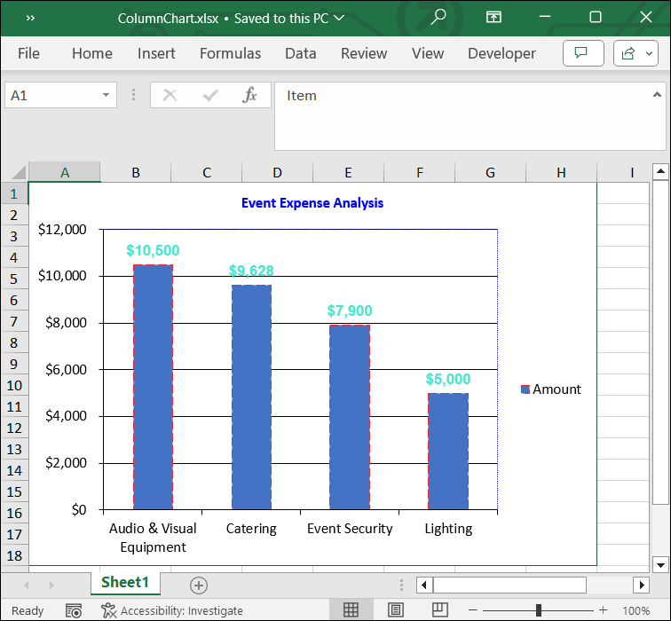

# Adding Column Chart to Excel worksheet

A column chart is a graphic representation of data in the Excel worksheet. Column charts display vertical bars going across the chart horizontally, with the values axis being displayed on the left side of the chart.

The following code snippet illustrate how to add Column chart to Excel worksheet using Flutter XlsIO.



// Create a new Excel document.
final Workbook workbook = Workbook();

// Accessing worksheet via index.
final Worksheet sheet = workbook.worksheets[0];

// Setting value in the cell.
sheet.getRangeByName('A11').setText('Venue');
sheet.getRangeByName('A12').setText('Seating & Decor');
sheet.getRangeByName('A13').setText('Technical Team');
sheet.getRangeByName('A14').setText('performers');
sheet.getRangeByName('A15').setText('performer\'s Transport');
sheet.getRangeByName('B11:B15').numberFormat = '\$#,##0_)';
sheet.getRangeByName('B11').setNumber(17500);
sheet.getRangeByName('B12').setNumber(1828);
sheet.getRangeByName('B13').setNumber(800);
sheet.getRangeByName('B14').setNumber(14000);
sheet.getRangeByName('B15').setNumber(2600);

// Create an instances of chart collection.
final ChartCollection charts = ChartCollection(sheet);

// Add the chart.
final Chart chart1 = charts.add();

// Set Chart Type.
chart1.chartType = ExcelChartType.column;

// Set data range in the worksheet.
chart1.dataRange = sheet.getRangeByName('A11:B15');
chart1.isSeriesInRows = false;

// set charts to worksheet.
sheet.charts = charts;

// save and dispose the workbook.
final List<int> bytes = workbook.saveSync();
workbook.dispose();

File('ExcelColumnChart.xlsx').writeAsBytes(bytes);



## Customizing Column Chart in Excel

The following code illustrates how to customize various elements of a column chart in Excel using Flutter XlsIO.



// Create a new Excel document.
final Workbook workbook = Workbook();

// Accessing worksheet via index.
final Worksheet sheet = workbook.worksheets[0];

// Setting value in the cell.
sheet.getRangeByName('A1').setText('Item');
sheet.getRangeByName('A2').setText('Audio & Visual Equipment');
sheet.getRangeByName('A3').setText('Catering');
sheet.getRangeByName('A4').setText('Event Security');
sheet.getRangeByName('A5').setText('Lighting');
sheet.getRangeByName('A6').setText('Stage Setup');
sheet.getRangeByName('B2:B6').numberFormat = '\$#,##0_)';
sheet.getRangeByName('B1').setText('Amount');
sheet.getRangeByName('B2').setNumber(10500);
sheet.getRangeByName('B3').setNumber(9628);
sheet.getRangeByName('B4').setNumber(7900);
sheet.getRangeByName('B5').setNumber(5000);
sheet.getRangeByName('B6').setNumber(4600);

// Create an instances of chart collection.
final ChartCollection charts = ChartCollection(sheet);

// Add the chart.
final Chart chart = charts.add();

// Set Chart Type.
chart.chartType = ExcelChartType.column;

// Set data range in the worksheet.
chart.dataRange = sheet.getRangeByName('A1:B5');
chart.isSeriesInRows = false;

// Set chart title
chart.chartTitle = "Event Expense Analysis";
chart.chartTitleArea.bold = true;
chart.chartTitleArea.size = 10;
chart.chartTitleArea.color = "#0000FF";

// Set data labels
final ChartSerie serie = chart.series[0];
serie.dataLabels.isValue = true;
serie.dataLabels.textArea.bold = true;
serie.dataLabels.textArea.size = 10;
serie.dataLabels.textArea.fontName = 'Arial';
serie.dataLabels.textArea.color = '#48E7D1';
serie.linePattern = ExcelChartLinePattern.longDash;
serie.linePatternColor = '#EE2828';

// Set legend position
chart.legend!.position = ExcelLegendPosition.right;

// Set line pattern for chart border
chart.linePattern = ExcelChartLinePattern.solid;
chart.linePatternColor = "#2F4F4F";

// Set line pattern for plot area
chart.plotArea.linePattern = ExcelChartLinePattern.roundDot;
chart.plotArea.linePatternColor = '#0000FF';

// Set charts to worksheet.
sheet.charts = charts;

// save and dispose the workbook.
final List<int> bytes = workbook.saveSync();
workbook.dispose();

File('ColumnChart.xlsx').writeAsBytes(bytes);



By executing the above code snippet, you will get the Excel document as follows.
