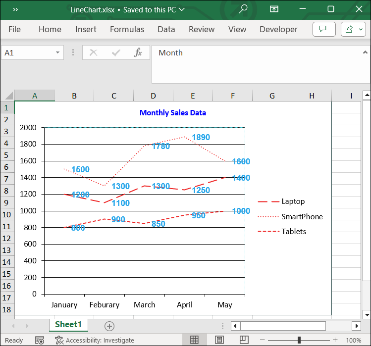

# Adding Line Chart to Excel worksheet

A line chart is a type of chart which displays information as a series of data points called 'markers' connected by straight line segments.

The following code snippet illustrate how to add Line chart to Excel worksheet using Flutter XlsIO.



// Create a new Excel document.
final Workbook workbook = Workbook();

// Accessing worksheet via index.
final Worksheet sheet = workbook.worksheets[0];

// Setting value in the cell.
sheet.getRangeByName('A1').setText('City Name');
sheet.getRangeByName('A2').setText('Chennai');
sheet.getRangeByName('A3').setText('Mumbai');
sheet.getRangeByName('A4').setText('Delhi');
sheet.getRangeByName('A5').setText('Hyderabad');
sheet.getRangeByName('A6').setText('Kolkata');
sheet.getRangeByName('B1').setText('Temp in C');
sheet.getRangeByName('B2').setNumber(34);
sheet.getRangeByName('B3').setNumber(40);
sheet.getRangeByName('B4').setNumber(47);
sheet.getRangeByName('B5').setNumber(20);
sheet.getRangeByName('B6').setNumber(66);

// Create an instances of chart collection.
final ChartCollection charts = ChartCollection(sheet);

// Add the chart.
final Chart chart = charts.add();

//Set Chart Type.
chart.chartType = ExcelChartType.line;

//Set data range in the worksheet.
chart.dataRange = sheet.getRangeByName('A1:B6');
chart.isSeriesInRows = false;

// set charts to worksheet.
sheet.charts = charts;

//save and dispose workbook.
final List<int> bytes = workbook.saveSync();
workbook.dispose();

File('LineChart.xlsx').writeAsBytes(bytes);



## Customizing Line Chart in Excel

The following code illustrates how to customize various elements of a line chart in Excel using Flutter XlsIO.


// Create a new Excel document.
final Workbook workbook = Workbook();

// Accessing worksheet via index.
final Worksheet sheet = workbook.worksheets[0];

// Setting value in the cell.
sheet.getRangeByName('A1').setText('Month');
sheet.getRangeByName('A2').setText('January');
sheet.getRangeByName('A3').setText('Feburary');
sheet.getRangeByName('A4').setText('March');
sheet.getRangeByName('A5').setText('April');
sheet.getRangeByName('A6').setText('May');
sheet.getRangeByName('B1').setText('Laptop');
sheet.getRangeByName('B2').setNumber(1200);
sheet.getRangeByName('B3').setNumber(1100);
sheet.getRangeByName('B4').setNumber(1300);
sheet.getRangeByName('B5').setNumber(1250);
sheet.getRangeByName('B6').setNumber(1400);
sheet.getRangeByName('C1').setText('SmartPhone');
sheet.getRangeByName('C2').setNumber(1500);
sheet.getRangeByName('C3').setNumber(1300);
sheet.getRangeByName('C4').setNumber(1780);
sheet.getRangeByName('C5').setNumber(1890);
sheet.getRangeByName('C6').setNumber(1600);
sheet.getRangeByName('D1').setText('Tablets');
sheet.getRangeByName('D2').setNumber(800);
sheet.getRangeByName('D3').setNumber(900);
sheet.getRangeByName('D4').setNumber(850);
sheet.getRangeByName('D5').setNumber(950);
sheet.getRangeByName('D6').setNumber(1000);

// Create an instances of chart collection.
final ChartCollection charts = ChartCollection(sheet);

// Add the chart.
final Chart chart = charts.add();

//Set Chart Type.
chart.chartType = ExcelChartType.line;

//Set data range in the worksheet.
chart.dataRange = sheet.getRangeByName('A1:D6');
chart.isSeriesInRows = false;

// Set chart title
chart.chartTitle = "Monthly Sales Data";
chart.chartTitleArea.bold = true;
chart.chartTitleArea.size = 10;
chart.chartTitleArea.color = "#0000FF";

// Set data labels
final ChartSerie serie1 = chart.series[0];
serie1.dataLabels.isValue = true;
serie1.dataLabels.textArea.bold = true;
serie1.dataLabels.textArea.size = 10;
serie1.dataLabels.textArea.fontName = 'Arial';
serie1.dataLabels.textArea.color = '#27A6EA';
serie1.linePattern = ExcelChartLinePattern.longDash;
serie1.linePatternColor = '#EE2828';

final ChartSerie serie2 = chart.series[1];
serie2.dataLabels.isValue = true;
serie2.dataLabels.textArea.bold = true;
serie2.dataLabels.textArea.size = 10;
serie2.dataLabels.textArea.fontName = 'Arial';
serie2.dataLabels.textArea.color = '#27A6EA';
serie2.linePattern = ExcelChartLinePattern.roundDot;
serie2.linePatternColor = '#EE2828';

final ChartSerie serie3 = chart.series[2];
serie3.dataLabels.isValue = true;
serie3.dataLabels.textArea.bold = true;
serie3.dataLabels.textArea.size = 10;
serie3.dataLabels.textArea.fontName = 'Arial';
serie3.dataLabels.textArea.color = '#27A6EA';
serie3.linePattern = ExcelChartLinePattern.squareDot;
serie3.linePatternColor = '#EE2828';

// Set legend position
chart.legend!.position = ExcelLegendPosition.right;

// Set line pattern for chart border
chart.linePattern = ExcelChartLinePattern.solid;
chart.linePatternColor = "#2F4F4F";

// Set line pattern for plot area
chart.plotArea.linePattern = ExcelChartLinePattern.roundDot;
chart.plotArea.linePatternColor = '#36DCE9';

// Set charts to worksheet.
sheet.charts = charts;

// save and dispose the workbook.
final List<int> bytes = workbook.saveSync();
workbook.dispose();

File('LineChart.xlsx').writeAsBytes(bytes);



By executing the above code snippet, you will get the Excel document as follows.
