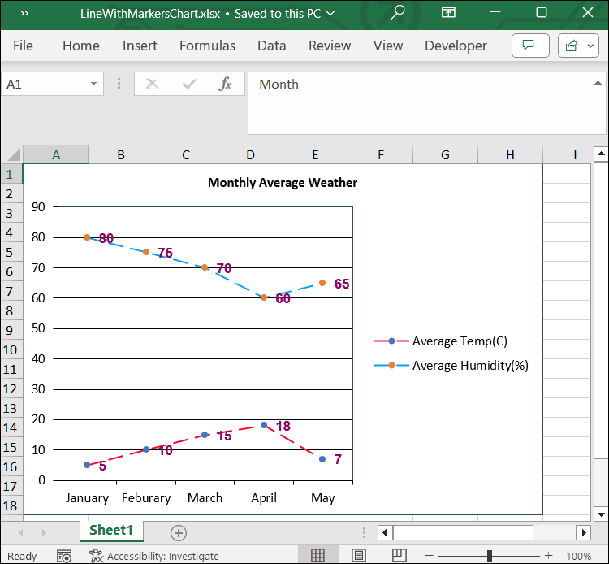

# Adding Stacked line Chart to Excel worksheet

Line marker is a line that is drawn on chart plot and bound to some value on an axis. It may be used to show a trend or mark an important value.

The following code snippet illustrate how to add Line with Markers chart to Excel worksheet using Flutter XlsIO.


// Create a new Excel document.
final Workbook workbook = Workbook();

// Accessing worksheet via index.
final Worksheet sheet = workbook.worksheets[0];

// Setting value in the cell.
sheet.getRangeByName('A1').setText('City Name');
sheet.getRangeByName('A2').setText('Chennai');
sheet.getRangeByName('A3').setText('Mumbai');
sheet.getRangeByName('A4').setText('Delhi');
sheet.getRangeByName('A5').setText('Hyderabad');
sheet.getRangeByName('A6').setText('Kolkata');
sheet.getRangeByName('B1').setText('Temp in C');
sheet.getRangeByName('B2').setNumber(34);
sheet.getRangeByName('B3').setNumber(40);
sheet.getRangeByName('B4').setNumber(47);
sheet.getRangeByName('B5').setNumber(20);
sheet.getRangeByName('B6').setNumber(66);
sheet.getRangeByName('C1').setText('Temp in F');
sheet.getRangeByName('C2').setNumber(93);
sheet.getRangeByName('C3').setNumber(104);
sheet.getRangeByName('C4').setNumber(120);
sheet.getRangeByName('C5').setNumber(80);
sheet.getRangeByName('C6').setNumber(140);

//Create an instances of chart collection.
final ChartCollection charts = ChartCollection(sheet);

// Add the chart.
final Chart chart1 = charts.add();

// Set Chart Type.
chart1.chartType = ExcelChartType.lineMarkers;

// Set data range in the worksheet.
chart1.dataRange = sheet.getRangeByName('A1:C6');
chart1.isSeriesInRows = false;

// set charts to worksheet.
sheet.charts = charts;

//save and dispose workbook.
final List<int> bytes = workbook.saveSync();
workbook.dispose();
File('LineWithMarkersChart.xlsx').writeAsBytes(bytes);


## Customizing Line with Markers Chart in Excel

The following code illustrates how to customize various elements of a line with markers chart in Excel using Flutter XlsIO.


// Create a new Excel document.
final Workbook workbook = Workbook();

// Accessing worksheet via index.
final Worksheet sheet = workbook.worksheets[0];

// Setting value in the cell.
sheet.getRangeByName('A1').setText('Month');
sheet.getRangeByName('A2').setText('January');
sheet.getRangeByName('A3').setText('Feburary');
sheet.getRangeByName('A4').setText('March');
sheet.getRangeByName('A5').setText('April');
sheet.getRangeByName('A6').setText('May');
sheet.getRangeByName('B1').setText('	Average Temp(C)');
sheet.getRangeByName('B2').setNumber(5);
sheet.getRangeByName('B3').setNumber(10);
sheet.getRangeByName('B4').setNumber(15);
sheet.getRangeByName('B5').setNumber(18);
sheet.getRangeByName('B6').setNumber(7);
sheet.getRangeByName('C1').setText('Average Humidity(%)');
sheet.getRangeByName('C2').setNumber(80);
sheet.getRangeByName('C3').setNumber(75);
sheet.getRangeByName('C4').setNumber(70);
sheet.getRangeByName('C5').setNumber(60);
sheet.getRangeByName('C6').setNumber(65);

//Create an instances of chart collection.
final ChartCollection charts = ChartCollection(sheet);

// Add the chart.
final Chart chart = charts.add();

// Set Chart Type.
chart.chartType = ExcelChartType.lineMarkers;

// Set data range in the worksheet.
chart.dataRange = sheet.getRangeByName('A1:C6');
chart.isSeriesInRows = false;

// Set chart title
chart.chartTitle = 'Monthly Average Weather';
chart.chartTitleArea.bold = true;
chart.chartTitleArea.size = 10;
chart.chartTitleArea.color = "#050505";

// Set data labels
final ChartSerie serie1 = chart.series[0];
serie1.dataLabels.isValue = true;
serie1.dataLabels.textArea.bold = true;
serie1.dataLabels.textArea.size = 10;
serie1.dataLabels.textArea.color = '#920467';
serie1.dataLabels.textArea.fontName = 'Arial';
serie1.linePattern = ExcelChartLinePattern.longDash;
serie1.linePatternColor = '#F40829';

final ChartSerie serie2 = chart.series[1];
serie2.dataLabels.isValue = true;
serie2.dataLabels.textArea.bold = true;
serie2.dataLabels.textArea.size = 10;
serie2.dataLabels.textArea.color = '#920467';
serie2.dataLabels.textArea.fontName = 'Arial';
serie2.linePattern = ExcelChartLinePattern.longDash;
serie2.linePatternColor = '#08A2F4';

// Set legend position
chart.legend!.position = ExcelLegendPosition.right;

// Set line pattern for chart border
chart.linePattern = ExcelChartLinePattern.solid;
chart.linePatternColor = "#2F4F4F";

// Set line pattern for plot area
chart.plotArea.linePattern = ExcelChartLinePattern.solid;
chart.plotArea.linePatternColor = '#2F4F4F';

// Set charts to worksheet.
sheet.charts = charts;

// save and dispose the workbook.
final List<int> bytes = workbook.saveSync();
workbook.dispose();

File('LinewithMarkersChart.xlsx').writeAsBytes(bytes);


By executing the above code snippet, you will get the Excel document as follows.
