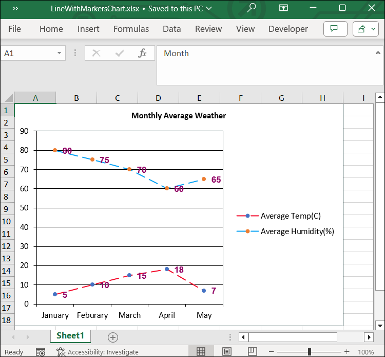

# Adding a Line with Markers Chart to an Excel Worksheet

A line with markers chart is a line chart in which a small symbol (a marker) is placed on each data point to make individual values easier to read. It is most effective for showing trends over a continuous range when the exact data-point values matter. If you do not need markers on every data point, use a regular line chart instead.

For prerequisites and installation steps, see the [Flutter XlsIO Overview](https://help.syncfusion.com/document-processing/excel/excel-library/flutter/overview). For background on charts and the chart package, see [Working with Excel Charts](https://help.syncfusion.com/document-processing/excel/excel-library/flutter/working-with-charts).

N> The code samples in this document use `await workbook.save()`. Always call `workbook.dispose()` after saving to release the XlsIO DOM memory, ideally inside a `try/finally` block.

## Create a line with markers chart

A line with markers chart is created in three steps: build the data, add a `Chart` to the worksheet's `ChartCollection`, and set the `chartType` and `dataRange`. The first column of the data range supplies the category labels, and each remaining column supplies a series of values.


import 'package:syncfusion_flutter_xlsio/xlsio.dart';
import 'package:syncfusion_officechart/officechart.dart';

Future<void> createLineWithMarkersChart() async {
  final Workbook workbook = Workbook();
  final Worksheet sheet = workbook.worksheets[0];

  // Sample data: a list of cities and two temperature series.
  sheet.getRangeByName('A1').setText('City Name');
  sheet.getRangeByName('A2').setText('Chennai');
  sheet.getRangeByName('A3').setText('Mumbai');
  sheet.getRangeByName('A4').setText('Delhi');
  sheet.getRangeByName('A5').setText('Hyderabad');
  sheet.getRangeByName('A6').setText('Kolkata');
  sheet.getRangeByName('B1').setText('Temp in C');
  sheet.getRangeByName('B2').setNumber(34);
  sheet.getRangeByName('B3').setNumber(40);
  sheet.getRangeByName('B4').setNumber(47);
  sheet.getRangeByName('B5').setNumber(20);
  sheet.getRangeByName('B6').setNumber(66);
  sheet.getRangeByName('C1').setText('Temp in F');
  sheet.getRangeByName('C2').setNumber(93);
  sheet.getRangeByName('C3').setNumber(104);
  sheet.getRangeByName('C4').setNumber(120);
  sheet.getRangeByName('C5').setNumber(80);
  sheet.getRangeByName('C6').setNumber(140);

  // Create a chart collection and add a line with markers chart.
  final ChartCollection charts = ChartCollection(sheet);
  final Chart chart = charts.add();
  chart.chartType = ExcelChartType.lineMarkers;
  chart.dataRange = sheet.getRangeByName('A1:C6');
  chart.isSeriesInRows = false;

  // Bind the chart collection to the worksheet.
  sheet.charts = charts;

  final List<int> bytes = await workbook.save();
  workbook.dispose();
}


## Customize a line with markers chart

The `Chart` class exposes properties for the most common chart elements: chart title, data labels, legend, and line patterns. The samples below build on the same data setup.

### Sample data setup


import 'package:syncfusion_flutter_xlsio/xlsio.dart';
import 'package:syncfusion_officechart/officechart.dart';

void populateLineWithMarkersData(Worksheet sheet) {
  // Headers in row 1.
  sheet.getRangeByName('A1').setText('Month');
  sheet.getRangeByName('B1').setText('Average Temp (C)');
  sheet.getRangeByName('C1').setText('Average Humidity (%)');

  // Month labels in column A.
  sheet.getRangeByName('A2').setText('January');
  sheet.getRangeByName('A3').setText('February');
  sheet.getRangeByName('A4').setText('March');
  sheet.getRangeByName('A5').setText('April');
  sheet.getRangeByName('A6').setText('May');

  // Average temperatures in column B.
  sheet.getRangeByName('B2').setNumber(5);
  sheet.getRangeByName('B3').setNumber(10);
  sheet.getRangeByName('B4').setNumber(15);
  sheet.getRangeByName('B5').setNumber(18);
  sheet.getRangeByName('B6').setNumber(7);

  // Average humidity in column C.
  sheet.getRangeByName('C2').setNumber(80);
  sheet.getRangeByName('C3').setNumber(75);
  sheet.getRangeByName('C4').setNumber(70);
  sheet.getRangeByName('C5').setNumber(60);
  sheet.getRangeByName('C6').setNumber(65);
}


### Chart title


Future<void> configureLineWithMarkersTitle() async {
  final Workbook workbook = Workbook();
  final Worksheet sheet = workbook.worksheets[0];

  populateLineWithMarkersData(sheet);

  final ChartCollection charts = ChartCollection(sheet);
  final Chart chart = charts.add();
  chart.chartType = ExcelChartType.lineMarkers;
  chart.dataRange = sheet.getRangeByName('A1:C6');
  chart.isSeriesInRows = false;

  // Set the chart title with formatting.
  chart.chartTitle = 'Monthly Average Weather';
  chart.chartTitleArea.bold = true;
  chart.chartTitleArea.size = 10;
  chart.chartTitleArea.color = '#050505';

  sheet.charts = charts;

  final List<int> bytes = await workbook.save();
  workbook.dispose();
}


### Data labels


Future<void> configureLineWithMarkersDataLabels() async {
  final Workbook workbook = Workbook();
  final Worksheet sheet = workbook.worksheets[0];

  populateLineWithMarkersData(sheet);

  final ChartCollection charts = ChartCollection(sheet);
  final Chart chart = charts.add();
  chart.chartType = ExcelChartType.lineMarkers;
  chart.dataRange = sheet.getRangeByName('A1:C6');
  chart.isSeriesInRows = false;

  // Configure data labels on every series.
  for (final ChartSerie serie in chart.series) {
    serie.dataLabels.isValue = true;
    serie.dataLabels.textArea.bold = true;
    serie.dataLabels.textArea.size = 10;
    serie.dataLabels.textArea.color = '#920467';
    serie.dataLabels.textArea.fontName = 'Arial';
  }

  sheet.charts = charts;

  final List<int> bytes = await workbook.save();
  workbook.dispose();
}


The `dataLabels` flags control which parts of a data point are displayed:

| Flag | Description |
|------|-------------|
| `isValue` | Display the numeric value of the data point. |
| `isCategoryName` | Display the category name (for example, the month). |
| `isSeriesName` | Display the name of the series. |

### Per-series line patterns


Future<void> configureLineWithMarkersSeriesPatterns() async {
  final Workbook workbook = Workbook();
  final Worksheet sheet = workbook.worksheets[0];

  populateLineWithMarkersData(sheet);

  final ChartCollection charts = ChartCollection(sheet);
  final Chart chart = charts.add();
  chart.chartType = ExcelChartType.lineMarkers;
  chart.dataRange = sheet.getRangeByName('A1:C6');
  chart.isSeriesInRows = false;

  // Apply a different line pattern to each series.
  final List<String> colors = <String>['#F40829', '#08A2F4'];
  for (int i = 0; i < chart.series.length; i++) {
    chart.series[i].linePattern = ExcelChartLinePattern.longDash;
    chart.series[i].linePatternColor = colors[i];
  }

  sheet.charts = charts;

  final List<int> bytes = await workbook.save();
  workbook.dispose();
}


### Legend and chart borders


Future<void> configureLineWithMarkersLegendAndBorders() async {
  final Workbook workbook = Workbook();
  final Worksheet sheet = workbook.worksheets[0];

  populateLineWithMarkersData(sheet);

  final ChartCollection charts = ChartCollection(sheet);
  final Chart chart = charts.add();
  chart.chartType = ExcelChartType.lineMarkers;
  chart.dataRange = sheet.getRangeByName('A1:C6');
  chart.isSeriesInRows = false;

  // Set the legend position. The `legend` property is nullable; it is null
  // until a legend is first accessed, after which it is created automatically.
  chart.legend!.position = ExcelLegendPosition.right;

  // Set the chart border (the line around the entire chart).
  chart.linePattern = ExcelChartLinePattern.solid;
  chart.linePatternColor = '#2F4F4F';

  // Set the plot area border (the line around the plot area only).
  chart.plotArea.linePattern = ExcelChartLinePattern.solid;
  chart.plotArea.linePatternColor = '#2F4F4F';

  sheet.charts = charts;

  final List<int> bytes = await workbook.save();
  workbook.dispose();
}


The following Excel document is generated by combining the samples above:

## See also

* [Flutter XlsIO Overview](https://help.syncfusion.com/document-processing/excel/excel-library/flutter/overview)
* [Working with Excel Charts](https://help.syncfusion.com/document-processing/excel/excel-library/flutter/working-with-charts)
* [Add a line chart](https://help.syncfusion.com/document-processing/excel/excel-library/flutter/add-line-chart)
* [Add a stacked line chart](https://help.syncfusion.com/document-processing/excel/excel-library/flutter/add-stacked-line-chart)
* [Chart API reference](https://pub.dev/documentation/syncfusion_officechart/latest/officechart/Chart-class.html)
