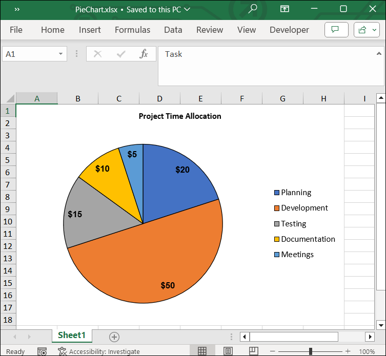

# Adding a Pie Chart to an Excel Worksheet

A pie chart is a circular statistical graphic divided into slices that illustrate numerical proportions. It is most effective with a single series of positive values and a small number of categories (typically fewer than seven).

For prerequisites and installation steps, see the [Flutter XlsIO Overview](https://help.syncfusion.com/document-processing/excel/excel-library/flutter/overview). For background on charts and the chart package, see [Working with Excel Charts](https://help.syncfusion.com/document-processing/excel/excel-library/flutter/working-with-charts).

N> The code samples in this document use `await workbook.save()`. Always call `workbook.dispose()` after saving to release the XlsIO DOM memory, ideally inside a `try/finally` block.

## Create a pie chart

A pie chart is created in three steps: build the data, add a `Chart` to the worksheet's `ChartCollection`, and set the `chartType` and `dataRange`. The first column of the data range supplies the slice labels, and the second column supplies the values.


import 'package:syncfusion_flutter_xlsio/xlsio.dart';
import 'package:syncfusion_officechart/officechart.dart';

Future<void> createPieChart() async {
  final Workbook workbook = Workbook();
  final Worksheet sheet = workbook.worksheets[0];

  // Sample data: a list of cost categories and their amounts.
  sheet.getRangeByName('A11').setText('Venue');
  sheet.getRangeByName('A12').setText('Seating & Decor');
  sheet.getRangeByName('A13').setText('Technical Team');
  sheet.getRangeByName('A14').setText('Performers');
  sheet.getRangeByName('A15').setText("Performer's Transport");

  sheet.getRangeByName('B11:B15').numberFormat = r'$#,##0_)';
  sheet.getRangeByName('B11').setNumber(17500);
  sheet.getRangeByName('B12').setNumber(1828);
  sheet.getRangeByName('B13').setNumber(800);
  sheet.getRangeByName('B14').setNumber(14000);
  sheet.getRangeByName('B15').setNumber(2600);

  // Create a chart collection and add a pie chart.
  final ChartCollection charts = ChartCollection(sheet);
  final Chart chart = charts.add();
  chart.chartType = ExcelChartType.pie;
  chart.dataRange = sheet.getRangeByName('A11:B15');
  chart.isSeriesInRows = false;

  // Bind the chart collection to the worksheet.
  sheet.charts = charts;

  final List<int> bytes = await workbook.save();
  workbook.dispose();
}


## Customize a pie chart

The `Chart` class exposes properties for the most common chart elements: chart title, data labels, and line patterns. The samples below build on the same data setup.

### Sample data setup


import 'package:syncfusion_flutter_xlsio/xlsio.dart';
import 'package:syncfusion_officechart/officechart.dart';

void populatePieChartData(Worksheet sheet) {
  sheet.getRangeByName('A1').setText('Task');
  sheet.getRangeByName('A2').setText('Planning');
  sheet.getRangeByName('A3').setText('Development');
  sheet.getRangeByName('A4').setText('Testing');
  sheet.getRangeByName('A5').setText('Documentation');
  sheet.getRangeByName('A6').setText('Meetings');

  sheet.getRangeByName('B1').setText('Hours');
  sheet.getRangeByName('B2').setNumber(20);
  sheet.getRangeByName('B3').setNumber(50);
  sheet.getRangeByName('B4').setNumber(15);
  sheet.getRangeByName('B5').setNumber(10);
  sheet.getRangeByName('B6').setNumber(5);

  sheet.getRangeByName('B2:B6').numberFormat = r'$#,##0_)';
}


### Chart title


Future<void> configurePieChartTitle() async {
  final Workbook workbook = Workbook();
  final Worksheet sheet = workbook.worksheets[0];

  populatePieChartData(sheet);

  final ChartCollection charts = ChartCollection(sheet);
  final Chart chart = charts.add();
  chart.chartType = ExcelChartType.pie;
  chart.dataRange = sheet.getRangeByName('A1:B6');
  chart.isSeriesInRows = false;

  // Set the chart title with formatting.
  chart.chartTitle = 'Project Time Allocation';
  chart.chartTitleArea.bold = true;
  chart.chartTitleArea.size = 10;
  chart.chartTitleArea.color = '#050505';

  sheet.charts = charts;

  final List<int> bytes = await workbook.save();
  workbook.dispose();
}


### Data labels


Future<void> configurePieChartDataLabels() async {
  final Workbook workbook = Workbook();
  final Worksheet sheet = workbook.worksheets[0];

  populatePieChartData(sheet);

  final ChartCollection charts = ChartCollection(sheet);
  final Chart chart = charts.add();
  chart.chartType = ExcelChartType.pie;
  chart.dataRange = sheet.getRangeByName('A1:B6');
  chart.isSeriesInRows = false;

  // Configure data labels on the first series.
  final ChartSerie serie = chart.series[0];
  serie.dataLabels.isValue = true;
  serie.dataLabels.textArea.bold = true;
  serie.dataLabels.textArea.size = 10;
  serie.dataLabels.textArea.color = '#000000';
  serie.dataLabels.textArea.fontName = 'Arial';

  sheet.charts = charts;

  final List<int> bytes = await workbook.save();
  workbook.dispose();
}


The `dataLabels` flags control which parts of a data point are displayed:

| Flag | Description |
|------|-------------|
| `isValue` | Display the numeric value of the slice. |
| `isPercentage` | Display the slice as a percentage of the total. |
| `isCategoryName` | Display the category name (for example, the task name). |
| `isSeriesName` | Display the name of the series. |

### Data label border


Future<void> configurePieChartLabelBorder() async {
  final Workbook workbook = Workbook();
  final Worksheet sheet = workbook.worksheets[0];

  populatePieChartData(sheet);

  final ChartCollection charts = ChartCollection(sheet);
  final Chart chart = charts.add();
  chart.chartType = ExcelChartType.pie;
  chart.dataRange = sheet.getRangeByName('A1:B6');
  chart.isSeriesInRows = false;

  // Add a border to the data labels of the first series.
  final ChartSerie serie = chart.series[0];
  serie.linePattern = ExcelChartLinePattern.solid;
  serie.linePatternColor = '#000000';

  sheet.charts = charts;

  final List<int> bytes = await workbook.save();
  workbook.dispose();
}


The following Excel document is generated by combining the samples above:

## See also

* [Flutter XlsIO Overview](https://help.syncfusion.com/document-processing/excel/excel-library/flutter/overview)
* [Working with Excel Charts](https://help.syncfusion.com/document-processing/excel/excel-library/flutter/working-with-charts)
* [Add a column chart](https://help.syncfusion.com/document-processing/excel/excel-library/flutter/add-column-chart)
* [Add a bar chart](https://help.syncfusion.com/document-processing/excel/excel-library/flutter/add-bar-chart)
* [Add a line chart](https://help.syncfusion.com/document-processing/excel/excel-library/flutter/add-line-chart)
* [Chart API reference](https://pub.dev/documentation/syncfusion_officechart/latest/officechart/Chart-class.html)
