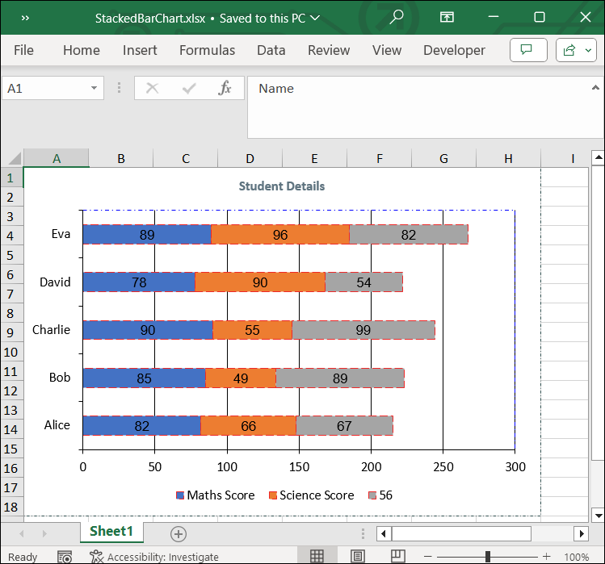

# Adding Stacked Bar Chart to Excel worksheet

A stacked bar chart is a type of bar chart used in excel for the graphical representation of part-to-whole comparison over time. This helps you to represent data in a stacked manner. This type of graph is suitable for data which is represented in different parts and one as a whole.

The following code snippet illustrate how to add Stacked Bar chart to Excel worksheet using Flutter XlsIO.



// Create a new Excel document.
final Workbook workbook = Workbook();

// Accessing worksheet via index.
final Worksheet sheet = workbook.worksheets[0];

// Setting value in the cell.
sheet.getRangeByName('A1').setText('Name');
sheet.getRangeByName('B1').setText('Salary');
sheet.getRangeByName('C1').setText('Working hr');
sheet.getRangeByName('A2').setText('Ben');
sheet.getRangeByName('A3').setText('Mark');
sheet.getRangeByName('A4').setText('Sundar');
sheet.getRangeByName('A5').setText('Geo');
sheet.getRangeByName('A6').setText('Andrew');
sheet.getRangeByName('B2').setNumber(1000);
sheet.getRangeByName('B3').setNumber(2000);
sheet.getRangeByName('B4').setNumber(2392);
sheet.getRangeByName('B5').setNumber(3211);
sheet.getRangeByName('B6').setNumber(4211);
sheet.getRangeByName('C2').setNumber(287);
sheet.getRangeByName('C3').setNumber(355);
sheet.getRangeByName('C4').setNumber(134);
sheet.getRangeByName('C5').setNumber(581);
sheet.getRangeByName('C6').setNumber(426);

// Create an instances of chart collection.
final ChartCollection charts = ChartCollection(sheet);

// Add the chart.
final Chart chart1 = charts.add();

// Set Chart Type.
chart1.chartType = ExcelChartType.barStacked;

// Set data range in the worksheet.
chart1.dataRange = sheet.getRangeByName('A1:C6');
chart1.isSeriesInRows = false;

// set charts to worksheet.
sheet.charts = charts;

//save and dispose workbook.
final List<int> bytes = workbook.saveSync();
workbook.dispose();

File('BarStackedChart.xlsx').writeAsBytes(bytes);



## Customizing Stacked Bar Chart in Excel

The following code illustrates how to customize various elements of a stacked bar chart in Excel using Flutter XlsIO.


// Create a new Excel document.
final Workbook workbook = Workbook();

// Accessing worksheet via index.
final Worksheet sheet = workbook.worksheets[0];

// Setting value in the cell.
sheet.getRangeByName('A1').setText('Name');
sheet.getRangeByName('B1').setText('Maths Score');
sheet.getRangeByName('C1').setText('Science Score');
sheet.getRangeByName('D1').setText('English Score');
sheet.getRangeByName('A2').setText('Alice');
sheet.getRangeByName('A3').setText('Bob');
sheet.getRangeByName('A4').setText('Charlie');
sheet.getRangeByName('A5').setText('David');
sheet.getRangeByName('A6').setText('Eva');
sheet.getRangeByName('B2').setNumber(82);
sheet.getRangeByName('B3').setNumber(85);
sheet.getRangeByName('B4').setNumber(90);
sheet.getRangeByName('B5').setNumber(78);
sheet.getRangeByName('B6').setNumber(89);
sheet.getRangeByName('C2').setNumber(66);
sheet.getRangeByName('C3').setNumber(49);
sheet.getRangeByName('C4').setNumber(55);
sheet.getRangeByName('C5').setNumber(90);
sheet.getRangeByName('C6').setNumber(96);
sheet.getRangeByName('D1').setNumber(56);
sheet.getRangeByName('D2').setNumber(67);
sheet.getRangeByName('D3').setNumber(89);
sheet.getRangeByName('D4').setNumber(99);
sheet.getRangeByName('D5').setNumber(54);
sheet.getRangeByName('D6').setNumber(82);

// Create an instances of chart collection.
final ChartCollection charts = ChartCollection(sheet);

// Add the chart.
final Chart chart = charts.add();

// Set Chart Type.
chart.chartType = ExcelChartType.barStacked;

// Set data range in the worksheet.
chart.dataRange = sheet.getRangeByName('A1:D6');
chart.isSeriesInRows = false;

// Set chart title
chart.chartTitle = "Student Details";
chart.chartTitleArea.bold = true;
chart.chartTitleArea.size = 10;
chart.chartTitleArea.color = "#5F7480";

// Set data labels
final ChartSerie serie1 = chart.series[0];
serie1.dataLabels.isValue = true;
serie1.dataLabels.textArea.bold = false;
serie1.dataLabels.textArea.size = 10;
serie1.dataLabels.textArea.fontName = 'Arial';
serie1.linePattern = ExcelChartLinePattern.longDash;
serie1.linePatternColor = '#EE2828';

final ChartSerie serie2 = chart.series[1];
serie2.dataLabels.isValue = true;
serie2.dataLabels.textArea.bold = false;
serie2.dataLabels.textArea.size = 10;
serie2.dataLabels.textArea.fontName = 'Arial';
serie2.linePattern = ExcelChartLinePattern.longDash;
serie2.linePatternColor = '#EE2828';

final ChartSerie serie3 = chart.series[2];
serie3.dataLabels.isValue = true;
serie3.dataLabels.textArea.bold = false;
serie3.dataLabels.textArea.size = 10;
serie3.dataLabels.textArea.fontName = 'Arial';
serie3.linePattern = ExcelChartLinePattern.longDash;
serie3.linePatternColor = '#EE2828';

// Set legend position
chart.legend!.position = ExcelLegendPosition.bottom;

// Set line pattern for chart border
chart.linePattern = ExcelChartLinePattern.dashDot;
chart.linePatternColor = "#2F4F4F";

// Set line pattern for plot area
chart.plotArea.linePattern = ExcelChartLinePattern.dashDot;
chart.plotArea.linePatternColor = '#0000FF';

// Set charts to worksheet.
sheet.charts = charts;

// save and dispose the workbook.
final List<int> bytes = workbook.saveSync();
workbook.dispose();

File('StackedBarChart.xlsx').writeAsBytes(bytes);



By executing the above code snippet, you will get the Excel document as follows.
