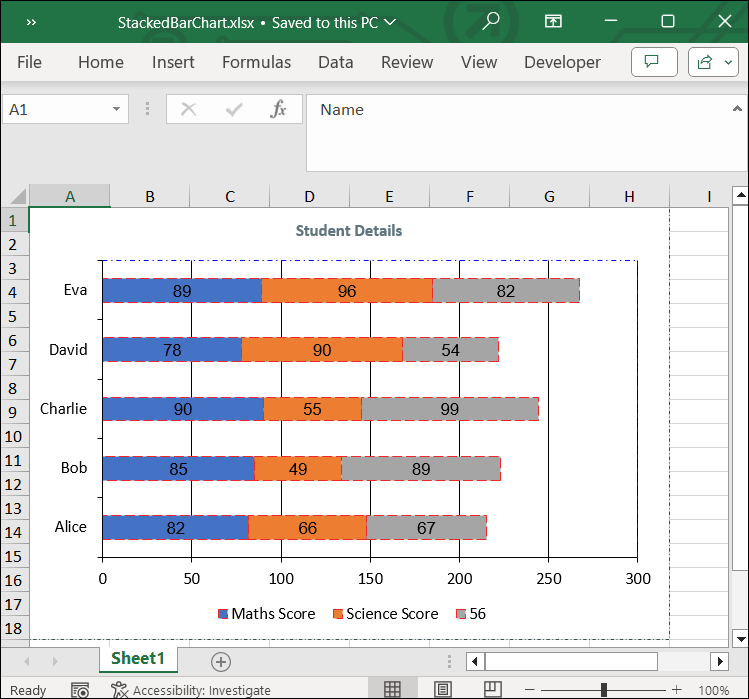

# Adding a Stacked Bar Chart to an Excel Worksheet

A stacked bar chart displays categorical data as horizontal bars where each bar is divided into segments that represent different series. The length of each segment is proportional to the value of the corresponding series, and the total length of the bar represents the sum of all series. It is most effective for part-to-whole comparisons across categories with long labels.

For prerequisites and installation steps, see the [Flutter XlsIO Overview](https://help.syncfusion.com/document-processing/excel/excel-library/flutter/overview). For background on charts and the chart package, see [Working with Excel Charts](https://help.syncfusion.com/document-processing/excel/excel-library/flutter/working-with-charts).

N> The code samples in this document use `await workbook.save()`. Always call `workbook.dispose()` after saving to release the XlsIO DOM memory, ideally inside a `try/finally` block.

## Create a stacked bar chart

A stacked bar chart is created in three steps: build the data, add a `Chart` to the worksheet's `ChartCollection`, and set the `chartType` and `dataRange`. The first column of the data range supplies the category labels, and each remaining column supplies a series of values.


import 'package:syncfusion_flutter_xlsio/xlsio.dart';
import 'package:syncfusion_officechart/officechart.dart';

Future<void> createStackedBarChart() async {
  final Workbook workbook = Workbook();
  final Worksheet sheet = workbook.worksheets[0];

  // Sample data: a list of employees and two value series.
  sheet.getRangeByName('A1').setText('Name');
  sheet.getRangeByName('B1').setText('Salary');
  sheet.getRangeByName('C1').setText('Working hr');
  sheet.getRangeByName('A2').setText('Ben');
  sheet.getRangeByName('A3').setText('Mark');
  sheet.getRangeByName('A4').setText('Sundar');
  sheet.getRangeByName('A5').setText('Geo');
  sheet.getRangeByName('A6').setText('Andrew');
  sheet.getRangeByName('B2').setNumber(1000);
  sheet.getRangeByName('B3').setNumber(2000);
  sheet.getRangeByName('B4').setNumber(2392);
  sheet.getRangeByName('B5').setNumber(3211);
  sheet.getRangeByName('B6').setNumber(4211);
  sheet.getRangeByName('C2').setNumber(287);
  sheet.getRangeByName('C3').setNumber(355);
  sheet.getRangeByName('C4').setNumber(134);
  sheet.getRangeByName('C5').setNumber(581);
  sheet.getRangeByName('C6').setNumber(426);

  // Create a chart collection and add a stacked bar chart.
  final ChartCollection charts = ChartCollection(sheet);
  final Chart chart = charts.add();
  chart.chartType = ExcelChartType.barStacked;
  chart.dataRange = sheet.getRangeByName('A1:C6');
  chart.isSeriesInRows = false;

  // Bind the chart collection to the worksheet.
  sheet.charts = charts;

  final List<int> bytes = await workbook.save();
  workbook.dispose();
}


## Customize a stacked bar chart

The `Chart` class exposes properties for the most common chart elements: chart title, data labels, legend, and line patterns. The samples below build on the same data setup.

### Sample data setup


import 'package:syncfusion_flutter_xlsio/xlsio.dart';
import 'package:syncfusion_officechart/officechart.dart';

void populateStackedBarChartData(Worksheet sheet) {
  // Headers in row 1.
  sheet.getRangeByName('A1').setText('Name');
  sheet.getRangeByName('B1').setText('Maths Score');
  sheet.getRangeByName('C1').setText('Science Score');
  sheet.getRangeByName('D1').setText('English Score');

  // Student names in column A.
  sheet.getRangeByName('A2').setText('Alice');
  sheet.getRangeByName('A3').setText('Bob');
  sheet.getRangeByName('A4').setText('Charlie');
  sheet.getRangeByName('A5').setText('David');
  sheet.getRangeByName('A6').setText('Eva');

  // Maths scores in column B.
  sheet.getRangeByName('B2').setNumber(82);
  sheet.getRangeByName('B3').setNumber(85);
  sheet.getRangeByName('B4').setNumber(90);
  sheet.getRangeByName('B5').setNumber(78);
  sheet.getRangeByName('B6').setNumber(89);

  // Science scores in column C.
  sheet.getRangeByName('C2').setNumber(66);
  sheet.getRangeByName('C3').setNumber(49);
  sheet.getRangeByName('C4').setNumber(55);
  sheet.getRangeByName('C5').setNumber(90);
  sheet.getRangeByName('C6').setNumber(96);

  // English scores in column D.
  sheet.getRangeByName('D2').setNumber(67);
  sheet.getRangeByName('D3').setNumber(89);
  sheet.getRangeByName('D4').setNumber(99);
  sheet.getRangeByName('D5').setNumber(54);
  sheet.getRangeByName('D6').setNumber(82);
}


### Chart title


Future<void> configureStackedBarChartTitle() async {
  final Workbook workbook = Workbook();
  final Worksheet sheet = workbook.worksheets[0];

  populateStackedBarChartData(sheet);

  final ChartCollection charts = ChartCollection(sheet);
  final Chart chart = charts.add();
  chart.chartType = ExcelChartType.barStacked;
  chart.dataRange = sheet.getRangeByName('A1:D6');
  chart.isSeriesInRows = false;

  // Set the chart title with formatting.
  chart.chartTitle = 'Student Details';
  chart.chartTitleArea.bold = true;
  chart.chartTitleArea.size = 10;
  chart.chartTitleArea.color = '#5F7480';

  sheet.charts = charts;

  final List<int> bytes = await workbook.save();
  workbook.dispose();
}


### Data labels


Future<void> configureStackedBarChartDataLabels() async {
  final Workbook workbook = Workbook();
  final Worksheet sheet = workbook.worksheets[0];

  populateStackedBarChartData(sheet);

  final ChartCollection charts = ChartCollection(sheet);
  final Chart chart = charts.add();
  chart.chartType = ExcelChartType.barStacked;
  chart.dataRange = sheet.getRangeByName('A1:D6');
  chart.isSeriesInRows = false;

  // Configure data labels and a border on every series.
  for (final ChartSerie serie in chart.series) {
    serie.dataLabels.isValue = true;
    serie.dataLabels.textArea.bold = false;
    serie.dataLabels.textArea.size = 10;
    serie.dataLabels.textArea.fontName = 'Arial';
    serie.linePattern = ExcelChartLinePattern.longDash;
    serie.linePatternColor = '#EE2828';
  }

  sheet.charts = charts;

  final List<int> bytes = await workbook.save();
  workbook.dispose();
}


The `dataLabels` flags control which parts of a data point are displayed:

| Flag | Description |
|------|-------------|
| `isValue` | Display the numeric value of the segment. |
| `isCategoryName` | Display the category name. |
| `isSeriesName` | Display the name of the series. |

### Legend and chart borders


Future<void> configureStackedBarChartLegendAndBorders() async {
  final Workbook workbook = Workbook();
  final Worksheet sheet = workbook.worksheets[0];

  populateStackedBarChartData(sheet);

  final ChartCollection charts = ChartCollection(sheet);
  final Chart chart = charts.add();
  chart.chartType = ExcelChartType.barStacked;
  chart.dataRange = sheet.getRangeByName('A1:D6');
  chart.isSeriesInRows = false;

  // Set the legend position. The `legend` property is nullable; it is null
  // until a legend is first accessed, after which it is created automatically.
  chart.legend!.position = ExcelLegendPosition.bottom;

  // Set the chart border (the line around the entire chart).
  chart.linePattern = ExcelChartLinePattern.dashDot;
  chart.linePatternColor = '#2F4F4F';

  // Set the plot area border (the line around the plot area only).
  chart.plotArea.linePattern = ExcelChartLinePattern.dashDot;
  chart.plotArea.linePatternColor = '#0000FF';

  sheet.charts = charts;

  final List<int> bytes = await workbook.save();
  workbook.dispose();
}


The following Excel document is generated by combining the samples above:

## See also

* [Flutter XlsIO Overview](https://help.syncfusion.com/document-processing/excel/excel-library/flutter/overview)
* [Working with Excel Charts](https://help.syncfusion.com/document-processing/excel/excel-library/flutter/working-with-charts)
* [Add a bar chart](https://help.syncfusion.com/document-processing/excel/excel-library/flutter/add-bar-chart)
* [Add a stacked column chart](https://help.syncfusion.com/document-processing/excel/excel-library/flutter/add-stacked-column-chart)
* [Chart API reference](https://pub.dev/documentation/syncfusion_officechart/latest/officechart/Chart-class.html)
* [Release notes](https://help.syncfusion.com/document-processing/excel/excel-library/flutter/release-notes)
