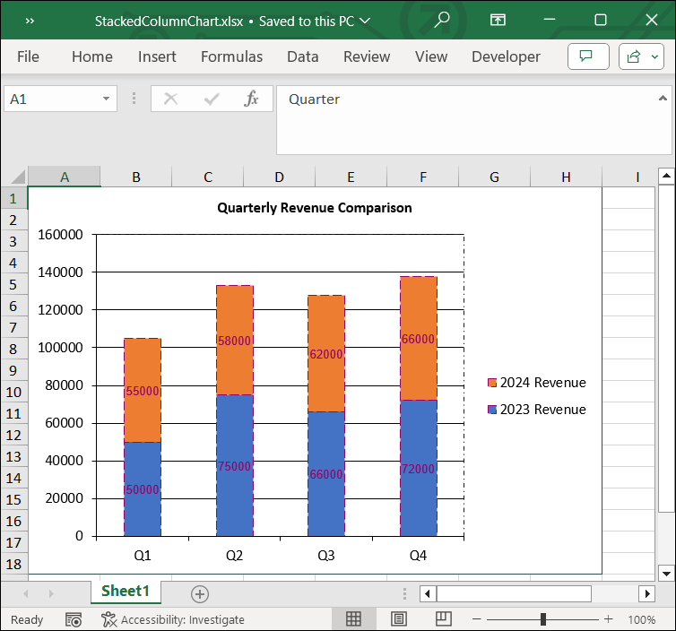

# Adding Stacked Column Chart to Excel worksheet

A stacked column chart is a basic Excel chart type to allow part-to-whole comparisons over time, or across categories and data series are stacked one on top of the other in vertical columns. Stacked column charts can show change over time because it's easy to compare total column lengths.

The following code snippet illustrate how to add Stacked Column chart to Excel worksheet using Flutter XlsIO.



// Create a new Excel document.
final Workbook workbook = Workbook();

// Accessing worksheet via index.
final Worksheet sheet = workbook.worksheets[0];

// Setting value in the cell.
sheet.getRangeByName('A1').setText('Items');
sheet.getRangeByName('B1').setText('Amount(in \$)');
sheet.getRangeByName('C1').setText('Count');
sheet.getRangeByName('A2').setText('Beverages');
sheet.getRangeByName('A3').setText('Condiments');
sheet.getRangeByName('A4').setText('Confections');
sheet.getRangeByName('A5').setText('Dairy Products');
sheet.getRangeByName('A6').setText('Grains / Cereals');
sheet.getRangeByName('B2').setNumber(2776);
sheet.getRangeByName('B3').setNumber(1077);
sheet.getRangeByName('B4').setNumber(2287);
sheet.getRangeByName('B5').setNumber(1368);
sheet.getRangeByName('B6').setNumber(3325);
sheet.getRangeByName('C2').setNumber(925);
sheet.getRangeByName('C3').setNumber(378);
sheet.getRangeByName('C4').setNumber(880);
sheet.getRangeByName('C5').setNumber(581);
sheet.getRangeByName('C6').setNumber(189);

// Create an instances of chart collection.
final ChartCollection charts = ChartCollection(sheet);

// Add the chart.
final Chart chart1 = charts.add();

//Set Chart Type.
chart1.chartType = ExcelChartType.columnStacked;

//Set data range in the worksheet.
chart1.dataRange = sheet.getRangeByName('A1:C6');
chart1.isSeriesInRows = false;

// set charts to worksheet.
sheet.charts = charts;

// save and dispose workbook.
final List<int> bytes = workbook.saveSync();
workbook.dispose();

File('ColunmStackedChart.xlsx').writeAsBytes(bytes);



## Customizing Stacked Column Chart in Excel

The following code illustrates how to customize various elements of a stacked column chart in Excel using Flutter XlsIO.


// Create a new Excel document.
final Workbook workbook = Workbook();

// Accessing worksheet via index.
final Worksheet sheet = workbook.worksheets[0];

// Setting value in the cell.
sheet.getRangeByName('A1').setText('Quarter');
sheet.getRangeByName('B1').setText('2023 Revenue');
sheet.getRangeByName('C1').setText('2024 Revenue');
sheet.getRangeByName('A2').setText('Q1');
sheet.getRangeByName('A3').setText('Q2');
sheet.getRangeByName('A4').setText('Q3');
sheet.getRangeByName('A5').setText('Q4');
sheet.getRangeByName('B2').setNumber(50000);
sheet.getRangeByName('B3').setNumber(75000);
sheet.getRangeByName('B4').setNumber(66000);
sheet.getRangeByName('B5').setNumber(72000);
sheet.getRangeByName('C2').setNumber(55000);
sheet.getRangeByName('C3').setNumber(58000);
sheet.getRangeByName('C4').setNumber(62000);
sheet.getRangeByName('C5').setNumber(66000);

// Create an instances of chart collection.
final ChartCollection charts = ChartCollection(sheet);

// Add the chart.
final Chart chart = charts.add();

//Set Chart Type.
chart.chartType = ExcelChartType.columnStacked;

//Set data range in the worksheet.
chart.dataRange = sheet.getRangeByName('A1:C5');
chart.isSeriesInRows = false;

// Set chart title
chart.chartTitle = 'Quarterly Revenue Comparison';
chart.chartTitleArea.bold = true;
chart.chartTitleArea.size = 10;
chart.chartTitleArea.color = "#050505";

// Set data labels
final ChartSerie serie1 = chart.series[0];
serie1.dataLabels.isValue = true;
serie1.dataLabels.textArea.bold = false;
serie1.dataLabels.textArea.size = 8;
serie1.dataLabels.textArea.color = '#920467';
serie1.dataLabels.textArea.fontName = 'Arial';
serie1.linePattern = ExcelChartLinePattern.longDash;
serie1.linePatternColor = '#920467';

final ChartSerie serie2 = chart.series[1];
serie2.dataLabels.isValue = true;
serie2.dataLabels.textArea.bold = false;
serie2.dataLabels.textArea.size = 8;
serie2.dataLabels.textArea.color = '#920467';
serie2.dataLabels.textArea.fontName = 'Arial';
serie2.linePattern = ExcelChartLinePattern.longDash;
serie2.linePatternColor = '#920467';

// Set legend position
chart.legend!.position = ExcelLegendPosition.right;

// Set line pattern for chart border
chart.linePattern = ExcelChartLinePattern.solid;
chart.linePatternColor = "#2F4F4F";

// Set line pattern for plot area
chart.plotArea.linePattern = ExcelChartLinePattern.dashDot;
chart.plotArea.linePatternColor = '#0000FF';

// Set charts to worksheet.
sheet.charts = charts;

// save and dispose the workbook.
final List<int> bytes = workbook.saveSync();
workbook.dispose();

File('StackedColumnChart.xlsx').writeAsBytes(bytes);



By executing the above code snippet, you will get the Excel document as follows.
