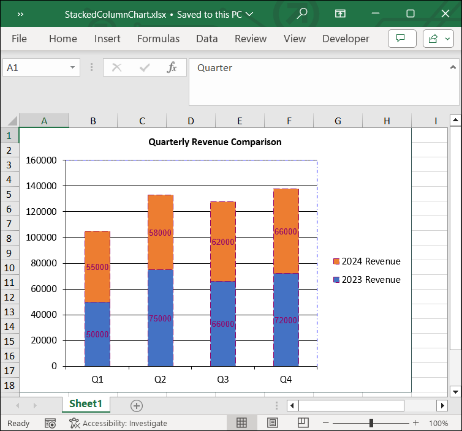

# Adding a Stacked Column Chart to an Excel Worksheet

A stacked column chart displays categorical data as vertical columns where each column is divided into segments that represent different series. The height of each segment is proportional to the value of the corresponding series, and the total height of the column represents the sum of all series. It is most effective for part-to-whole comparisons across a small number of categories with short labels.

For prerequisites and installation steps, see the [Flutter XlsIO Overview](https://help.syncfusion.com/document-processing/excel/excel-library/flutter/overview). For background on charts and the chart package, see [Working with Excel Charts](https://help.syncfusion.com/document-processing/excel/excel-library/flutter/working-with-charts).

N> The code samples in this document use `await workbook.save()`. Always call `workbook.dispose()` after saving to release the XlsIO DOM memory, ideally inside a `try/finally` block.

## Create a stacked column chart

A stacked column chart is created in three steps: build the data, add a `Chart` to the worksheet's `ChartCollection`, and set the `chartType` and `dataRange`. The first column of the data range supplies the category labels, and each remaining column supplies a series of values.


import 'package:syncfusion_flutter_xlsio/xlsio.dart';
import 'package:syncfusion_officechart/officechart.dart';

Future<void> createStackedColumnChart() async {
  final Workbook workbook = Workbook();
  final Worksheet sheet = workbook.worksheets[0];

  // Sample data: a list of grocery categories and two value series.
  sheet.getRangeByName('A1').setText('Items');
  sheet.getRangeByName('B1').setText(r'Amount (in $)');
  sheet.getRangeByName('C1').setText('Count');
  sheet.getRangeByName('A2').setText('Beverages');
  sheet.getRangeByName('A3').setText('Condiments');
  sheet.getRangeByName('A4').setText('Confections');
  sheet.getRangeByName('A5').setText('Dairy Products');
  sheet.getRangeByName('A6').setText('Grains / Cereals');
  sheet.getRangeByName('B2').setNumber(2776);
  sheet.getRangeByName('B3').setNumber(1077);
  sheet.getRangeByName('B4').setNumber(2287);
  sheet.getRangeByName('B5').setNumber(1368);
  sheet.getRangeByName('B6').setNumber(3325);
  sheet.getRangeByName('C2').setNumber(925);
  sheet.getRangeByName('C3').setNumber(378);
  sheet.getRangeByName('C4').setNumber(880);
  sheet.getRangeByName('C5').setNumber(581);
  sheet.getRangeByName('C6').setNumber(189);

  // Create a chart collection and add a stacked column chart.
  final ChartCollection charts = ChartCollection(sheet);
  final Chart chart = charts.add();
  chart.chartType = ExcelChartType.columnStacked;
  chart.dataRange = sheet.getRangeByName('A1:C6');
  chart.isSeriesInRows = false;

  // Bind the chart collection to the worksheet.
  sheet.charts = charts;

  final List<int> bytes = await workbook.save();
  workbook.dispose();
}


## Customize a stacked column chart

The `Chart` class exposes properties for the most common chart elements: chart title, data labels, legend, and line patterns. The samples below build on the same data setup.

### Sample data setup


import 'package:syncfusion_flutter_xlsio/xlsio.dart';
import 'package:syncfusion_officechart/officechart.dart';

void populateStackedColumnChartData(Worksheet sheet) {
  // Headers in row 1.
  sheet.getRangeByName('A1').setText('Quarter');
  sheet.getRangeByName('B1').setText('2023 Revenue');
  sheet.getRangeByName('C1').setText('2024 Revenue');

  // Quarter labels in column A.
  sheet.getRangeByName('A2').setText('Q1');
  sheet.getRangeByName('A3').setText('Q2');
  sheet.getRangeByName('A4').setText('Q3');
  sheet.getRangeByName('A5').setText('Q4');

  // 2023 revenue in column B.
  sheet.getRangeByName('B2').setNumber(50000);
  sheet.getRangeByName('B3').setNumber(75000);
  sheet.getRangeByName('B4').setNumber(66000);
  sheet.getRangeByName('B5').setNumber(72000);

  // 2024 revenue in column C.
  sheet.getRangeByName('C2').setNumber(55000);
  sheet.getRangeByName('C3').setNumber(58000);
  sheet.getRangeByName('C4').setNumber(62000);
  sheet.getRangeByName('C5').setNumber(66000);
}


### Chart title


Future<void> configureStackedColumnChartTitle() async {
  final Workbook workbook = Workbook();
  final Worksheet sheet = workbook.worksheets[0];

  populateStackedColumnChartData(sheet);

  final ChartCollection charts = ChartCollection(sheet);
  final Chart chart = charts.add();
  chart.chartType = ExcelChartType.columnStacked;
  chart.dataRange = sheet.getRangeByName('A1:C5');
  chart.isSeriesInRows = false;

  // Set the chart title with formatting.
  chart.chartTitle = 'Quarterly Revenue Comparison';
  chart.chartTitleArea.bold = true;
  chart.chartTitleArea.size = 10;
  chart.chartTitleArea.color = '#050505';

  sheet.charts = charts;

  final List<int> bytes = await workbook.save();
  workbook.dispose();
}


### Data labels


Future<void> configureStackedColumnChartDataLabels() async {
  final Workbook workbook = Workbook();
  final Worksheet sheet = workbook.worksheets[0];

  populateStackedColumnChartData(sheet);

  final ChartCollection charts = ChartCollection(sheet);
  final Chart chart = charts.add();
  chart.chartType = ExcelChartType.columnStacked;
  chart.dataRange = sheet.getRangeByName('A1:C5');
  chart.isSeriesInRows = false;

  // Configure data labels and a border on every series.
  for (final ChartSerie serie in chart.series) {
    serie.dataLabels.isValue = true;
    serie.dataLabels.textArea.bold = false;
    serie.dataLabels.textArea.size = 8;
    serie.dataLabels.textArea.color = '#920467';
    serie.dataLabels.textArea.fontName = 'Arial';
    serie.linePattern = ExcelChartLinePattern.longDash;
    serie.linePatternColor = '#920467';
  }

  sheet.charts = charts;

  final List<int> bytes = await workbook.save();
  workbook.dispose();
}


The `dataLabels` flags control which parts of a data point are displayed:

| Flag | Description |
|------|-------------|
| `isValue` | Display the numeric value of the segment. |
| `isCategoryName` | Display the category name (for example, the quarter). |
| `isSeriesName` | Display the name of the series. |

### Legend and chart borders


Future<void> configureStackedColumnChartLegendAndBorders() async {
  final Workbook workbook = Workbook();
  final Worksheet sheet = workbook.worksheets[0];

  populateStackedColumnChartData(sheet);

  final ChartCollection charts = ChartCollection(sheet);
  final Chart chart = charts.add();
  chart.chartType = ExcelChartType.columnStacked;
  chart.dataRange = sheet.getRangeByName('A1:C5');
  chart.isSeriesInRows = false;

  // Set the legend position. The `legend` property is nullable; it is null
  // until a legend is first accessed, after which it is created automatically.
  chart.legend!.position = ExcelLegendPosition.right;

  // Set the chart border (the line around the entire chart).
  chart.linePattern = ExcelChartLinePattern.solid;
  chart.linePatternColor = '#2F4F4F';

  // Set the plot area border (the line around the plot area only).
  chart.plotArea.linePattern = ExcelChartLinePattern.dashDot;
  chart.plotArea.linePatternColor = '#0000FF';

  sheet.charts = charts;

  final List<int> bytes = await workbook.save();
  workbook.dispose();
}


The following Excel document is generated by combining the samples above:

## See also

* [Flutter XlsIO Overview](https://help.syncfusion.com/document-processing/excel/excel-library/flutter/overview)
* [Working with Excel Charts](https://help.syncfusion.com/document-processing/excel/excel-library/flutter/working-with-charts)
* [Add a column chart](https://help.syncfusion.com/document-processing/excel/excel-library/flutter/add-column-chart)
* [Add a stacked bar chart](https://help.syncfusion.com/document-processing/excel/excel-library/flutter/add-stacked-bar-chart)
* [Chart API reference](https://pub.dev/documentation/syncfusion_officechart/latest/officechart/Chart-class.html)
