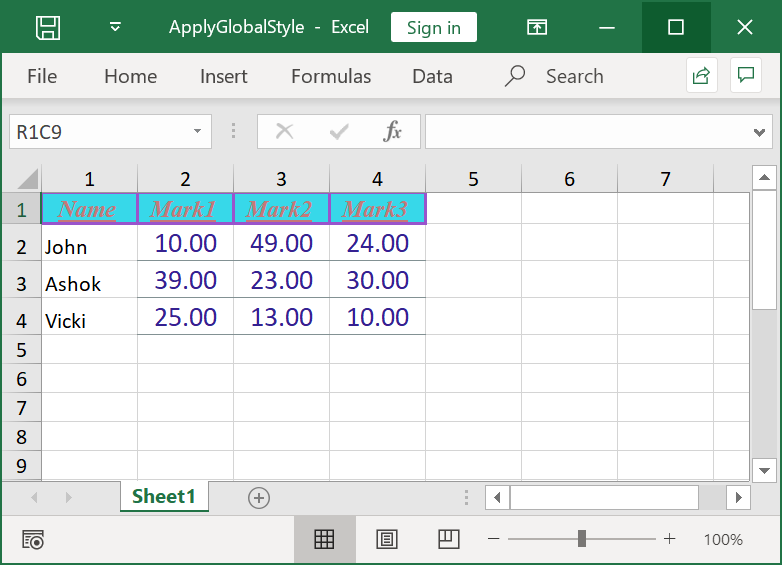
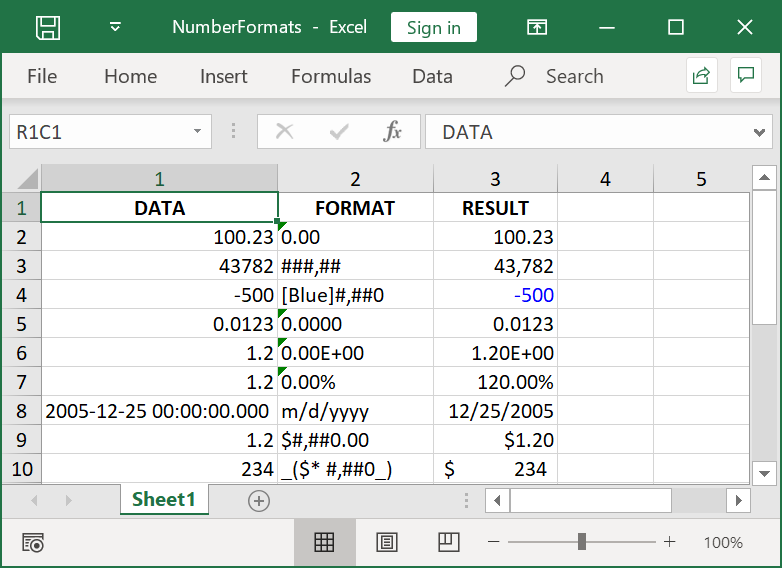

# Working with Cell Formatting

This section covers the various formatting options in a cell or a range.

## Create a Style

The following code shows how to create and apply cell style.



// Create a new Excel document.
final Workbook workbook = Workbook();

//Accessing worksheet via index.
final Worksheet sheet = workbook.worksheets[0];

//Creating a new style with all properties.
final Style style = workbook.styles.add('Style1');
// set back color by hexa decimal.
style.backColor = '#FF5050';
// set back color by RGB values.
style.backColorRgb = Color.fromARGB(255, 34, 244, 0);
// set font name.
style.fontName = 'Aldhabi';
// set font color by hexa decimal.
style.fontColor = '#138939';
// set font color by RGB values.
style.fontColorRgb = Color.fromARGB(255, 244, 0, 34);
// set font size.
style.fontSize = 16;
// set font bold.
style.bold = true;
// set font italic.
style.italic = true;
// set font underline.
style.underline = true;
// set rotation.
style.rotation = 120;
// set horizontal alignment.
style.hAlign = HAlignType.center;
// set veritical alignment.
style.vAlign = VAlignType.bottom;
// set indent value.
style.indent = 1;
// set top bordera line style.
style.borders.top.lineStyle = LineStyle.double;
// set top borders color by hexa decimal.
style.borders.top.color = '#FFFF66';
// set right bordera line style.
style.borders.right.lineStyle = LineStyle.thick;
// set right borders color by RGB values.
style.borders.right.colorRgb = Color.fromARGB(255, 0, 34, 244);
// set wrap text.
style.wrapText = true;
// set number format to cell.
style.numberFormat = '_(\$* #,##0_)';

// Add style.
workbook.styles.addStyle(style);

//Apply cellStyle.
sheet.getRangeByName('A1').cellStyle = style;

// Save and dispose the document.
final List<int> bytes = workbook.saveSync();
workbook.dispose();

File('CreateCellStyle.xlsx').writeAsBytes(bytes);



## Apply Global Style

The Flutter XlsIO adds styles globally that can be applied to one or more cells in a workbook. This is a recommended approach to apply single style in different rows and columns, which improves memory and performance considerably.

The following code snippet illustrates how to apply global style.



// Create a new Excel document.
final Workbook workbook = Workbook();

// Accessing worksheet via index.
final Worksheet sheet = workbook.worksheets[0];

// Set value to cell.
sheet.getRangeByName('A1').setText('Name');
sheet.getRangeByName('A2').setText('John');
sheet.getRangeByName('A3').setText('Ashok');
sheet.getRangeByName('A4').setText('Vicki');
sheet.getRangeByName('B1').setText('Mark1');
sheet.getRangeByName('B2').setNumber(10);
sheet.getRangeByName('B3').setNumber(39);
sheet.getRangeByName('B4').setNumber(25);
sheet.getRangeByName('C1').setText('Mark2');
sheet.getRangeByName('C2').setNumber(49);
sheet.getRangeByName('C3').setNumber(23);
sheet.getRangeByName('C4').setNumber(13);
sheet.getRangeByName('D1').setText('Mark3');
sheet.getRangeByName('D2').setNumber(24);
sheet.getRangeByName('D3').setNumber(30);
sheet.getRangeByName('D4').setNumber(10);

//Defining a global style with properties.
final Style globalStyle = workbook.styles.add('globalStyle');
globalStyle.backColor = '#37D8E9';
globalStyle.fontName = 'Times New Roman';
globalStyle.fontSize = 12;
globalStyle.fontColor = '#C67878';
globalStyle.italic = true;
globalStyle.bold = true;
globalStyle.underline = true;
globalStyle.wrapText = true;
globalStyle.hAlign = HAlignType.center;
globalStyle.vAlign = VAlignType.center;
globalStyle.borders.all.lineStyle = LineStyle.thick;
globalStyle.borders.all.color = '#9954CC';

final Style globalStyle1 = workbook.styles.add('globalStyle1');
globalStyle1.fontSize = 14;
globalStyle1.fontColor = '#362191';
globalStyle1.hAlign = HAlignType.center;
globalStyle1.vAlign = VAlignType.center;
globalStyle1.borders.bottom.lineStyle = LineStyle.thin;
globalStyle1.borders.bottom.color = '#829193';
globalStyle1.numberFormat = '0.00';

//Apply GlobalStyle
sheet.getRangeByName('A1:D1').cellStyle = globalStyle;

//Apply GlobalStyle1
sheet.getRangeByName('B2:D4').cellStyle = globalStyle1;

// Save and dispose the document.
final List<int> bytes = workbook.saveSync();
workbook.dispose();

File('ApplyGlobalStyle.xlsx').writeAsBytes(bytes);



## Apply Number Formats 

Number Formats are codes that helps to control the appearance of cell values especially numbers in an Excel document. Excel recognizes the numbers in various formats like:

* Number
* Currency
* Percentage
* DateTime
* Accounting
* Scientific
* Fraction and
* Text

This number format can be of maximum 4 parts, separated by semicolons. They are:
* Positive Numbers
* Negative Numbers
* Zeros
* Text

Each part is an individual number format. Default format is “General”, it means anything that will fit.

The following table shows various custom formatting codes:

<table>
<tr>
<td>
Number Code 
</td>
<td>
Description
</td>
</tr>
<tr>
<td>
General
</td>
<td>
General number format.
</td>
</tr>
<tr>
<td>
0 (zero)
</td>
<td>
Digit placeholder. This code pads the value with zeros to fill the format.
</td>
</tr>
<tr>
<td>
#
</td>
<td>
Digit placeholder. This code does not display extra zeros.
</td>
</tr>
<tr>
<td>
?
</td>
<td>
Digit placeholder. This code leaves a space for insignificant zeros but does not display them.
</td>
</tr>
<tr>
<td>
. (period)
</td>
<td>
Decimal placeholder. The decimal placeholder determines how many digits are displayed to the left and right of the decimal separator.
</td>
</tr>
<tr>
<td>
%
</td>
<td>
Percentage placeholder. Multiplies by 100 and adds the % character.
</td>
</tr>
<tr>
<td>
, (comma)
</td>
<td>
Thousands separator. A comma followed by a placeholder (0 or #) scales the number by a thousand.
</td>
</tr>
<tr>
<td>
E+ E- e+ e-
</td>
<td>
Scientific notation.
</td>
</tr>
<tr>
<td>
Text Code
</td>
<td>
Description
</td>
</tr>
<tr>
<td>
$ - + / ( ) : space
</td>
<td>
These characters are displayed in the number. To display any other character, enclose the character in quotation marks or precede it with a backslash.
</td>
</tr>
<tr>
<td>
\character
</td>
<td>
This code displays the succeeding character you specify.  Note Typing !, ^, &, ', ~, {, }, =, &lt;, or &gt; automatically places a backslash in front of the character. </td>
</tr>
<tr>
<td>
"text"
</td>
<td>
This code displays the text.
</td>
</tr>
<tr>
<td>
*
</td>
<td>
This code repeats the next character in the format to fill the column width.  Note: Only one asterisk per section of a format is allowed. </td>
</tr>
<tr>
<td>
_ (underscore)
</td>
<td>
This code skips the width of the next character. This code is commonly used as "_)" (without the quotation marks) to leave space for a closing parenthesis in a positive number format when the negative number format includes parentheses.   This allows the values to line up at the decimal point. </td>
</tr>
<tr>
<td>
@
</td>
<td>
Text placeholder.
</td>
</tr>
<tr>
<td>
Date Code
</td>
<td>
Description
</td>
</tr>
<tr>
<td>
m
</td>
<td>
Month as a number without leading zeros (1-12).
</td>
</tr>
<tr>
<td>
mm
</td>
<td>
Month as a number with leading zeros (01-12).
</td>
</tr>
<tr>
<td>
mmm
</td>
<td>
Month as an abbreviation (Jan - Dec).
</td>
</tr>
<tr>
<td>
mmmm
</td>
<td>
Unabbreviated Month (January - December).
</td>
</tr>
<tr>
<td>
d
</td>
<td>
Day without leading zeros (1-31).
</td>
</tr>
<tr>
<td>
dd
</td>
<td>
Day with leading zeros (01-31).
</td>
</tr>
<tr>
<td>
ddd
</td>
<td>
Week day as an abbreviation (Sun - Sat).
</td>
</tr>
<tr>
<td>
dddd
</td>
<td>
Unabbreviated week day (Sunday - Saturday).
</td>
</tr>
<tr>
<td>
yy
</td>
<td>
Year as a two-digit number (for example, 96).
</td>
</tr>
<tr>
<td>
yyyy
</td>
<td>
Year as a four-digit number (for example, 1996).
</td>
</tr>
<tr>
<td>
Time Code
</td>
<td>
Description 
</td>
</tr>
<tr>
<td>
h
</td>
<td>
Hours as a number without leading zeros (0-23).
</td>
</tr>
<tr>
<td>
hh
</td>
<td>
Hours as a number with leading zeros (00-23).
</td>
</tr>
<tr>
<td>
m
</td>
<td>
Minutes as a number without leading zeros (0-59).
</td>
</tr>
<tr>
<td>
mm
</td>
<td>
Minutes as a number with leading zeros (00-59).
</td>
</tr>
<tr>
<td>
s
</td>
<td>
Seconds as a number without leading zeros (0-59).
</td>
</tr>
<tr>
<td>
ss
</td>
<td>
Seconds as a number with leading zeros (00-59).
</td>
</tr>
<tr>
<td>
AM/PM am/pm
</td>
<td>
Time based on the twelve-hour clock.
</td>
</tr>
<tr>
<td>
Miscellaneous Code
</td>
<td>
Description
</td>
</tr>
<tr>
<td>
[BLACK], [BLUE], [CYAN], [GREEN], [MAGENTA], [RED], [WHITE], [YELLOW], [COLOR n]
</td>
<td>
These codes display the characters in the specified colors.   Note: n is a value from 1 to 56 and refers to the nth color in the color palette. </td>
</tr>
<tr>
<td>
[Condition value]
</td>
<td>
Condition may be &lt;, &gt;, =, >=, &lt;=, &lt;&gt; and value may be any number.  Note: A number format may contain up to two conditions. </td>
</tr>
</table>

XlsIO provides support for reading and writing various built-in and custom number formats in a cell by using the NumberFormat property of Range class.

The following code snippet illustrates how to set different number formats in a worksheet range.



// Create a new Excel document.
final Workbook workbook = Workbook();

// Accessing worksheet via index.
final Worksheet sheet = workbook.worksheets[0];

sheet.getRangeByName('A1').setText('DATA');
sheet.getRangeByName('B1').setText('FORMAT');
sheet.getRangeByName('C1').setText('RESULT');

final Style headingStyle = workbook.styles.add('HeadingStyle');
headingStyle.bold = true;
headingStyle.hAlign = HAlignType.center;
headingStyle.wrapText = true;
sheet.getRangeByName('A1:C1').cellStyle = headingStyle;

// Applying different number formats.
sheet.getRangeByName('A2').setNumber(100.23);
sheet.getRangeByName('B2').setText('0.00');
sheet.getRangeByName('C2').numberFormat = ('0.00');
sheet.getRangeByName('C2').setNumber(100.23);
sheet.getRangeByName('A3').setNumber(43782);
sheet.getRangeByName('B3').setText('###,##');
sheet.getRangeByName('C3').numberFormat = '###,##';
sheet.getRangeByName('C3').setNumber(43782);
sheet.getRangeByName('A4').setNumber(-500);
sheet.getRangeByName('B4').setText('[Blue]#,##0');
sheet.getRangeByName('C4').numberFormat = '[Blue]#,##0';
sheet.getRangeByName('C4').setNumber(-500);
sheet.getRangeByName('A5').setNumber(0.0123);
sheet.getRangeByName('B5').setText('0.0000');
sheet.getRangeByName('C5').numberFormat = '0.0000';
sheet.getRangeByName('C5').setNumber(0.0123);
sheet.getRangeByName('A6').setNumber(1.20);
sheet.getRangeByName('B6').setText('0.00E+00');
sheet.getRangeByName('C6').numberFormat = '0.00E+00';
sheet.getRangeByName('C6').setNumber(1.20);

// Applying percentage format.
sheet.getRangeByName('A7').setNumber(1.20);
sheet.getRangeByName('B7').setText('0.00%');
sheet.getRangeByName('C7').numberFormat = '0.00%';
sheet.getRangeByName('C7').setNumber(1.20);

// Applying date format.
sheet.getRangeByName('A8').setText(DateTime(2005, 12, 25).toString());
sheet.getRangeByName('B8').setText('m/d/yyyy');
sheet.getRangeByName('C8').numberFormat = 'm/d/yyyy';
sheet.getRangeByName('C8').setDateTime(DateTime(2005, 12, 25));

// Applying currency format.
sheet.getRangeByName('A9').setNumber(1.20);
sheet.getRangeByName('B9').setText('\$#,##0.00');
sheet.getRangeByName('C9').numberFormat = '\$#,##0.00';
sheet.getRangeByName('C9').setNumber(1.20);

// Applying accounting format.
sheet.getRangeByName('A10').setNumber(234);
sheet.getRangeByName('B10').setText('_(\$* #,##0_)');
sheet.getRangeByName('C10').numberFormat = '_(\$* #,##0_)';
sheet.getRangeByName('C10').setNumber(234);

sheet.getRangeByName('A1').columnWidth = 21;
sheet.getRangeByName('B1:C1').columnWidth = 13;

// save and dispose workbook.
final List<int> bytes = workbook.saveSync();
workbook.dispose();

File('NumberFormats.xlsx').writeAsBytes(bytes);



## Access display text

Cell values can be accessed as **text**, **number**, **dateTime** and **formula** of **Range** class. In addition to this, there is another property **DisplayText** in **Range**, which returns a resultant value of a cell with its number format applied.

The following code example illustrates how to display the text of a cell.



// Create a new Excel document.
final Workbook workbook = Workbook();

// Accessing worksheet via index.
final Worksheet sheet = workbook.worksheets[0];

final Range range1 = sheet.getRangeByIndex(1, 1);
range1.numberFormat = '0%';

// Set value to the cell.
range1.setNumber(10);

// Get display text of the cell.
range1.displayText;

// Save and dispose workbook.
final List<int> bytes = workbook.saveSync();
workbook.dispose();

File('DisplayText.xlsx').writeAsBytes(bytes);



## Merging and Un-Merging Cells

The cells can be merged using the merge() method in Range as shown as follows.



// Merging Cells from A1 to A6 
sheet.getRangeByName('A1:A6').merge();



Merged cells can be unmerged using the **unmerge()** method in **Range** as shown below.



// UnMerging Cells from A1 to A6 
sheet.getRangeByName('A1:A6').unmerge();



The below code shows merging and unmerging worksheet cells.



// Create a new Excel document.
final Workbook workbook = Workbook();

// Accessing worksheet via index.
final Worksheet sheet = workbook.worksheets[0];

//Merging Cells from A16 to C16. 
sheet.getRangeByName('A1:C16').merge();

//UnMerging Cells from A1 to C16. 
sheet.getRangeByName('A1:C16').unmerge();

// Save and dispose workbook.
final List<int> bytes = workbook.saveSync();
workbook.dispose();

File('MergeUnMerge.xlsx').writeAsBytes(bytes);



## Apply Built-in Style

The following code snippet explains how to add **builtInStyle** for a worksheet range.



// Create a new Excel document.
final Workbook workbook = Workbook();

// Accessing worksheet via index.
final Worksheet sheet = workbook.worksheets[0];

// Set text worksheet.
sheet.getRangeByName('A2').setText('Sample');

// Set built in style.
sheet.getRangeByName('A2').builtInStyle = BuiltInStyles.checkCell;

// save and dispose workbook.
final List<int> bytes = workbook.saveSync();
workbook.dispose();

File('BuiltInStyle.xlsx').writeAsBytes(bytes);



