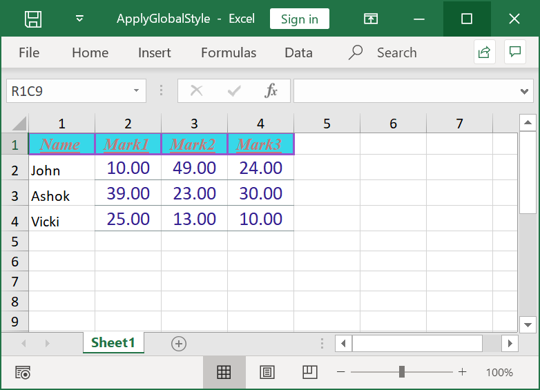
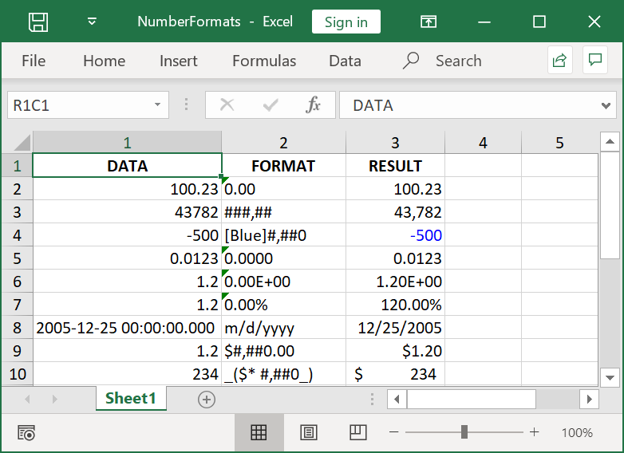

# Working with Cell Formatting

Syncfusion Flutter XlsIO provides a rich set of formatting options for cells and ranges, including font properties, alignment, borders, fill colors, number formats, merged cells, and built-in styles. The recommended approach is to create a `Style` object once, register it with the `Styles` collection, and then apply the style to one or more cells. Reusing a style reduces memory usage and improves performance, especially for large workbooks.

For prerequisites and installation steps, see the [Flutter XlsIO Overview](https://help.syncfusion.com/document-processing/excel/excel-library/flutter/overview). For information on saving and disposing of a workbook, see [Working with Workbook](https://help.syncfusion.com/document-processing/excel/excel-library/flutter/working-with-workbook).

N> The code samples in this document use `await workbook.save()`. Always call `workbook.dispose()` after saving to release the XlsIO DOM memory, ideally inside a `try/finally` block.

## Create a style

A `Style` is created and registered with `workbook.styles.add(name)`. The method returns the new `Style` object, which you can then customize. When a hex color is set through `backColor` / `fontColor` and an `Color` value is set through `backColorRgb` / `fontColorRgb`, the `*Rgb` value takes precedence; use only one of the two for a given style.


import 'package:syncfusion_flutter_xlsio/xlsio.dart';

Future<void> createStyle() async {
  final Workbook workbook = Workbook();
  final Worksheet sheet = workbook.worksheets[0];

  // Create and register a new style.
  final Style style = workbook.styles.add('Style1');

  // Background color.
  style.backColor = '#FF5050';

  // Font.
  style.fontName = 'Aldhabi';
  style.fontColor = '#138939';
  style.fontSize = 16;
  style.bold = true;
  style.italic = true;
  style.underline = true;

  // Rotation (0–180 degrees).
  style.rotation = 120;

  // Alignment.
  style.hAlign = HAlignType.center;
  style.vAlign = VAlignType.bottom;
  style.indent = 1;

  // Borders.
  style.borders.top.lineStyle = LineStyle.double;
  style.borders.top.color = '#FFFF66';
  style.borders.right.lineStyle = LineStyle.thick;
  style.borders.right.colorRgb = const Color.fromARGB(255, 0, 34, 244);

  // Cell behavior.
  style.wrapText = true;

  // Number format.
  style.numberFormat = r'_($* #,##0_)';

  // Apply the style to a range.
  sheet.getRangeByName('A1').cellStyle = style;

  final List<int> bytes = await workbook.save();
  workbook.dispose();
}

## Apply a global style

A global style is one that is created once and reused across multiple ranges. This approach is more memory-efficient than assigning a fresh `Style` to every cell. The example below creates two styles and applies each to a different range.


import 'package:syncfusion_flutter_xlsio/xlsio.dart';

Future<void> applyGlobalStyle() async {
  final Workbook workbook = Workbook();
  final Worksheet sheet = workbook.worksheets[0];

  // Populate cells with sample data.
  sheet.getRangeByName('A1').setText('Name');
  sheet.getRangeByName('A2').setText('John');
  sheet.getRangeByName('A3').setText('Ashok');
  sheet.getRangeByName('A4').setText('Vicki');
  sheet.getRangeByName('B1').setText('Mark1');
  sheet.getRangeByName('B2').setNumber(10);
  sheet.getRangeByName('B3').setNumber(39);
  sheet.getRangeByName('B4').setNumber(25);
  sheet.getRangeByName('C1').setText('Mark2');
  sheet.getRangeByName('C2').setNumber(49);
  sheet.getRangeByName('C3').setNumber(23);
  sheet.getRangeByName('C4').setNumber(13);
  sheet.getRangeByName('D1').setText('Mark3');
  sheet.getRangeByName('D2').setNumber(24);
  sheet.getRangeByName('D3').setNumber(30);
  sheet.getRangeByName('D4').setNumber(10);

  // Define a global header style.
  final Style globalStyle = workbook.styles.add('globalStyle');
  globalStyle.backColor = '#37D8E9';
  globalStyle.fontName = 'Times New Roman';
  globalStyle.fontSize = 12;
  globalStyle.fontColor = '#C67878';
  globalStyle.italic = true;
  globalStyle.bold = true;
  globalStyle.underline = true;
  globalStyle.wrapText = true;
  globalStyle.hAlign = HAlignType.center;
  globalStyle.vAlign = VAlignType.center;
  globalStyle.borders.all.lineStyle = LineStyle.thick;
  globalStyle.borders.all.color = '#9954CC';

  // Define a global body style.
  final Style globalStyle1 = workbook.styles.add('globalStyle1');
  globalStyle1.fontSize = 14;
  globalStyle1.fontColor = '#362191';
  globalStyle1.hAlign = HAlignType.center;
  globalStyle1.vAlign = VAlignType.center;
  globalStyle1.borders.bottom.lineStyle = LineStyle.thin;
  globalStyle1.borders.bottom.color = '#829193';
  globalStyle1.numberFormat = '0.00';

  // Apply each global style to a different range.
  sheet.getRangeByName('A1:D1').cellStyle = globalStyle;
  sheet.getRangeByName('B2:D4').cellStyle = globalStyle1;

  final List<int> bytes = await workbook.save();
  workbook.dispose();
}


N> The `Borders` class exposes a single border for each side (`top`, `bottom`, `left`, `right`) plus an `all` shortcut that applies the same line style and color to all four sides.

## Apply number formats

A number format controls the appearance of cell values without changing the underlying data. Syncfusion Flutter XlsIO supports reading and writing both built-in and custom number formats through the `numberFormat` property of a `Range` or `Style`.

### Number format sections

A number format can have up to four sections, separated by semicolons. Each section defines the format applied to a specific kind of value:

| Section | Applies to |
|---------|-----------|
| 1 | Positive numbers |
| 2 | Negative numbers |
| 3 | Zero values |
| 4 | Text values |

If only one section is provided, it applies to every value. The default format is `General`, which displays the value as-is.

### Built-in number format codes

| Code | Description |
|------|-------------|
| `General` | General number format. |
| `0` (zero) | Digit placeholder. Pads the value with zeros to fill the format. |
| `#` | Digit placeholder. Does not display extra zeros. |
| `?` | Digit placeholder. Leaves a space for insignificant zeros but does not display them. |
| `.` (period) | Decimal placeholder. Controls the number of digits on each side of the decimal separator. |
| `%` | Percentage placeholder. Multiplies by 100 and adds the `%` character. |
| `,` (comma) | Thousands separator. A comma followed by a placeholder scales the number by a thousand. |
| `E+`, `E-`, `e+`, `e-` | Scientific notation. |

### Text format codes

| Code | Description |
|------|-------------|
| `$`, `-`, `+`, `/`, `(`, `)`, `:`, space | Displayed as-is in the formatted value. To display any other character, enclose it in quotation marks or precede it with a backslash. |
| `\character` | Displays the succeeding character as a literal. The characters `!`, `^`, `&`, `'`, `~`, `{`, `}`, `=`, `<`, and `>` are automatically escaped. |
| `"text"` | Displays the text inside the quotation marks. |
| `*` | Repeats the next character in the format to fill the column width. Only one asterisk per section is allowed. |
| `_` (underscore) | Skips the width of the next character. Commonly used as `_)` to leave space for a closing parenthesis so that positive and negative values line up at the decimal point. |
| `@` | Text placeholder. |

### Date format codes

| Code | Description |
|------|-------------|
| `m` | Month as a number without leading zeros (1–12). |
| `mm` | Month as a number with leading zeros (01–12). |
| `mmm` | Month as an abbreviation (Jan–Dec). |
| `mmmm` | Unabbreviated month (January–December). |
| `d` | Day without leading zeros (1–31). |
| `dd` | Day with leading zeros (01–31). |
| `ddd` | Week day as an abbreviation (Sun–Sat). |
| `dddd` | Unabbreviated week day (Sunday–Saturday). |
| `yy` | Year as a two-digit number (for example, 96). |
| `yyyy` | Year as a four-digit number (for example, 1996). |

### Time format codes

| Code | Description |
|------|-------------|
| `h` | Hours as a number without leading zeros (0–23). |
| `hh` | Hours as a number with leading zeros (00–23). |
| `m` | Minutes as a number without leading zeros (0–59). |
| `mm` | Minutes as a number with leading zeros (00–59). |
| `s` | Seconds as a number without leading zeros (0–59). |
| `ss` | Seconds as a number with leading zeros (00–59). |
| `AM/PM`, `am/pm` | Time based on the twelve-hour clock. |

### Miscellaneous format codes

| Code | Description |
|------|-------------|
| `[BLACK]`, `[BLUE]`, `[CYAN]`, `[GREEN]`, `[MAGENTA]`, `[RED]`, `[WHITE]`, `[YELLOW]`, `[COLOR n]` | Displays the characters in the specified color. `n` is a value from 1 to 56 and refers to the nth color in the color palette. |
| `[Condition value]` | Applies the format when the supplied condition is met. Supported operators are `<`, `>`, `=`, `>=`, `<=`, and `<>`. A format may contain up to two conditions. |

### Example

The following sample demonstrates several common number formats. Column A holds the raw value, column B holds the format code as a string for reference, and column C holds the same raw value with the number format applied.


import 'package:syncfusion_flutter_xlsio/xlsio.dart';

Future<void> applyNumberFormats() async {
  final Workbook workbook = Workbook();
  final Worksheet sheet = workbook.worksheets[0];

  // Header row.
  sheet.getRangeByName('A1').setText('DATA');
  sheet.getRangeByName('B1').setText('FORMAT');
  sheet.getRangeByName('C1').setText('RESULT');

  final Style headingStyle = workbook.styles.add('HeadingStyle');
  headingStyle.bold = true;
  headingStyle.hAlign = HAlignType.center;
  headingStyle.wrapText = true;
  sheet.getRangeByName('A1:C1').cellStyle = headingStyle;

  // Two-decimal number.
  sheet.getRangeByName('A2').setNumber(100.23);
  sheet.getRangeByName('B2').setText('0.00');
  sheet.getRangeByName('C2').numberFormat = '0.00';
  sheet.getRangeByName('C2').setNumber(100.23);

  // Thousands separator.
  sheet.getRangeByName('A3').setNumber(43782);
  sheet.getRangeByName('B3').setText('###,##');
  sheet.getRangeByName('C3').numberFormat = '###,##';
  sheet.getRangeByName('C3').setNumber(43782);

  // Negative number with color.
  sheet.getRangeByName('A4').setNumber(-500);
  sheet.getRangeByName('B4').setText('[Blue]#,##0');
  sheet.getRangeByName('C4').numberFormat = '[Blue]#,##0';
  sheet.getRangeByName('C4').setNumber(-500);

  // Four-decimal number.
  sheet.getRangeByName('A5').setNumber(0.0123);
  sheet.getRangeByName('B5').setText('0.0000');
  sheet.getRangeByName('C5').numberFormat = '0.0000';
  sheet.getRangeByName('C5').setNumber(0.0123);

  // Scientific notation.
  sheet.getRangeByName('A6').setNumber(1.20);
  sheet.getRangeByName('B6').setText('0.00E+00');
  sheet.getRangeByName('C6').numberFormat = '0.00E+00';
  sheet.getRangeByName('C6').setNumber(1.20);

  // Percentage.
  sheet.getRangeByName('A7').setNumber(1.20);
  sheet.getRangeByName('B7').setText('0.00%');
  sheet.getRangeByName('C7').numberFormat = '0.00%';
  sheet.getRangeByName('C7').setNumber(1.20);

  // Date.
  sheet.getRangeByName('A8').setDateTime(DateTime(2005, 12, 25));
  sheet.getRangeByName('B8').setText('m/d/yyyy');
  sheet.getRangeByName('C8').numberFormat = 'm/d/yyyy';
  sheet.getRangeByName('C8').setDateTime(DateTime(2005, 12, 25));

  // Currency.
  sheet.getRangeByName('A9').setNumber(1.20);
  sheet.getRangeByName('B9').setText(r'$#,##0.00');
  sheet.getRangeByName('C9').numberFormat = r'$#,##0.00';
  sheet.getRangeByName('C9').setNumber(1.20);

  // Accounting.
  sheet.getRangeByName('A10').setNumber(234);
  sheet.getRangeByName('B10').setText(r'_($* #,##0_)');
  sheet.getRangeByName('C10').numberFormat = r'_($* #,##0_)';
  sheet.getRangeByName('C10').setNumber(234);

  // Column widths.
  sheet.getRangeByName('A1').columnWidth = 21;
  sheet.getRangeByName('B1:C1').columnWidth = 13;

  final List<int> bytes = await workbook.save();
  workbook.dispose();
}


N> The decimal and thousands separators used in formatted values are taken from the culture of the application. The format codes in this section use `.` and `,` as separators, but the same code with different culture settings will produce different output.

## Access display text

A `Range` exposes the raw value of a cell through the `text`, `number`, `dateTime`, and `formula` properties. In addition, the `displayText` property returns the value of the cell with its number format applied. This is the value that is shown in the cell.


import 'package:syncfusion_flutter_xlsio/xlsio.dart';

Future<void> readDisplayText() async {
  final Workbook workbook = Workbook();
  final Worksheet sheet = workbook.worksheets[0];

  final Range range1 = sheet.getRangeByIndex(1, 1);
  range1.numberFormat = '0%';
  range1.setNumber(10);

  // The displayText is the formatted value, not the raw value.
  final String formatted = range1.displayText;

  // Use the formatted value (for example, log it or pass it to another API).
  // ignore: avoid_print
  print(formatted);

  final List<int> bytes = await workbook.save();
  workbook.dispose();
}


## Merge and unmerge cells

Cells in a range can be merged into a single cell with the `merge()` method and unmerged back into individual cells with the `unmerge()` method. Only the value of the top-left cell of the merged range is preserved; values in the other cells of the range are discarded.


import 'package:syncfusion_flutter_xlsio/xlsio.dart';

Future<void> mergeAndUnmerge() async {
  final Workbook workbook = Workbook();
  final Worksheet sheet = workbook.worksheets[0];

  // Merge cells from A1 to C16.
  sheet.getRangeByName('A1:C16').merge();

  // Write a value while the cells are merged.
  sheet.getRangeByName('A1').setText('Merged header');

  // Unmerge the cells to restore the original layout.
  sheet.getRangeByName('A1:C16').unmerge();

  final List<int> bytes = await workbook.save();
  workbook.dispose();
}


## Apply a built-in style

Syncfusion Flutter XlsIO ships with a set of built-in styles that match the styles available in Microsoft Excel. A built-in style can be applied to a range through the `builtInStyle` property.


import 'package:syncfusion_flutter_xlsio/xlsio.dart';

Future<void> applyBuiltInStyle() async {
  final Workbook workbook = Workbook();
  final Worksheet sheet = workbook.worksheets[0];

  sheet.getRangeByName('A2').setText('Sample');
  sheet.getRangeByName('A2').builtInStyle = BuiltInStyles.checkCell;

  final List<int> bytes = await workbook.save();
  workbook.dispose();
}


The `BuiltInStyles` enum includes a wide range of values such as `good`, `bad`, `neutral`, `checkCell`, `calculation`, `linkedCell`, `warningText`, and the various Excel cell-style presets (`accent1`, `accent2`, `percent`, `currency`, etc.). See the [BuiltInStyles API reference](https://pub.dev/documentation/syncfusion_flutter_xlsio/latest/xlsio/BuiltInStyles.html) for the full list.

## See also

* [Flutter XlsIO Overview](https://help.syncfusion.com/document-processing/excel/excel-library/flutter/overview)
* [Working with Workbook](https://help.syncfusion.com/document-processing/excel/excel-library/flutter/working-with-workbook)
* [Working with Cells](https://help.syncfusion.com/document-processing/excel/excel-library/flutter/working-with-cells)
* [Working with Conditional Formatting](https://help.syncfusion.com/document-processing/excel/excel-library/flutter/working-with-conditional-formatting)
* [Style API reference](https://pub.dev/documentation/syncfusion_flutter_xlsio/latest/xlsio/Style-class.html)
* [Borders API reference](https://pub.dev/documentation/syncfusion_flutter_xlsio/latest/xlsio/Borders-class.html)
* [BuiltInStyles API reference](https://pub.dev/documentation/syncfusion_flutter_xlsio/latest/xlsio/BuiltInStyles.html)
