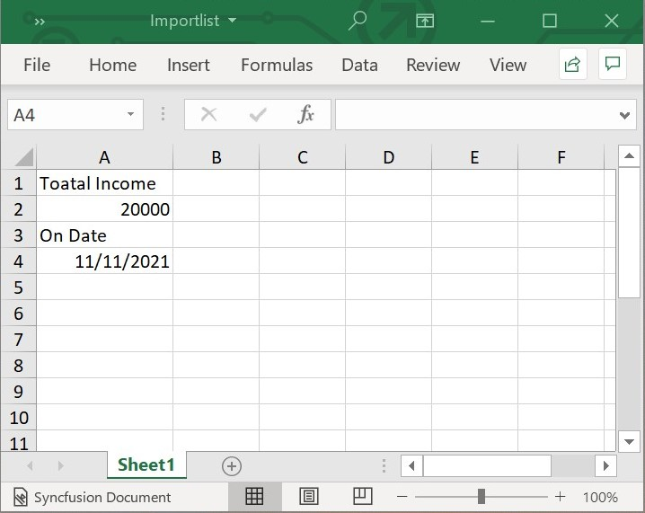
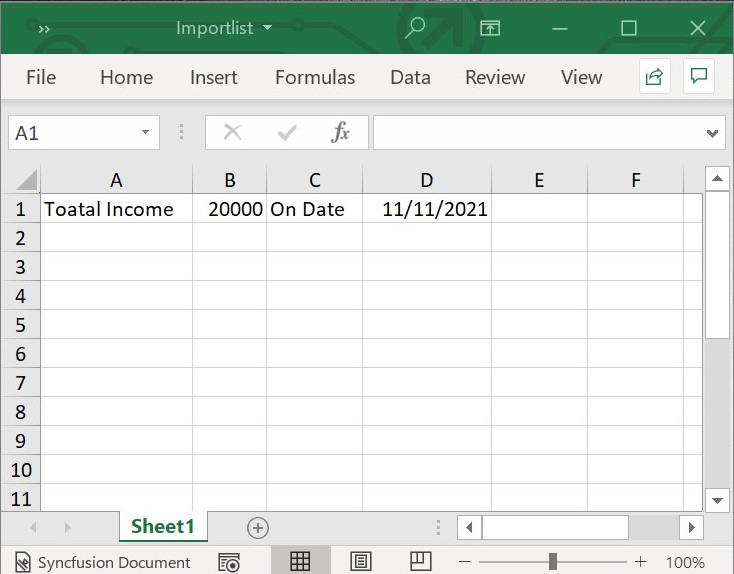

# Working with Excel Data

## Importing Data to Worksheets

Flutter XlsIO provides the ability to import data into a worksheet from the following data.

* [Import Data from Array](#import-data-from-array)
* [Import Data from List<T>](#import-data-from-List<T>)

### Import Data from Array

Using **importList** method, we can import list of data with different data types.

The following code snippet shows how to import a list of data vertically into the worksheet using **importList()** method.



// Create a new Excel Document.
final Workbook workbook = Workbook();

// Accessing sheet via index.
final Worksheet sheet = workbook.worksheets[0];

//Initialize the List\<Object>
final List<Object> list = [
  'Toatal Income',
  20000,
  'On Date',
  DateTime(2021, 11, 11)
];

// Represent the starting row.
final int firstRow = 1;

// Represent the starting column.
final int firstColumn = 1;

// Represents that the data should be imported vertically.
final bool isVertical = true;

//Import the Object list to Sheet
sheet.importList(list, firstRow, firstColumn, isVertical);

sheet.autoFitColumn(1);

// Save and dispose workbook.
final List<int>? bytes = workbook.saveSync();
File('Importlist.xlsx').writeAsBytes(bytes!);
workbook.dispose();



The following screenshot represents the Excel file generated by vertically importing data from 
list into the Excel worksheet using the Flutter XlsIO.

The following code snippet shows how to import a list of data horizontally into the worksheet using **importList()** method.



// Create a new Excel Document.
final Workbook workbook = Workbook();

// Accessing sheet via index.
final Worksheet sheet = workbook.worksheets[0];

//Initialize the List\<Object>
final List<Object> list = [
  'Toatal Income',
  20000,
  'On Date',
  DateTime(2021, 11, 11)
];

// Represent the starting row.
final int firstRow = 1;

// Represent the starting column.
final int firstColumn = 1;

// Represents that the data should be imported horizontally.
final bool isVertical = false;

//Import the Object list to Sheet
sheet.importList(list, firstRow, firstColumn, isVertical);

sheet.getRangeByIndex(1, 1, 1, 4).autoFitColumns();

// Save and dispose workbook.
final List<int>? bytes = workbook.saveSync();
File('Importlist.xlsx').writeAsBytes(bytes!);
workbook.dispose();



The following screenshot represents the Excel file generated by horizontally importing data from array into the Excel worksheet using the Flutter XlsIO.

### Import Data from List\<T>

Flutter XlsIO allows you to import data directly from List\<T> using the **importData** method and **ExcelDataRow** class.



// Create a new Excel Document.
final Workbook workbook = Workbook();

// Accessing sheet via index.
final Worksheet sheet = workbook.worksheets[0];

// Create Data Rows for importing.
final List<ExcelDataRow> dataRows = _buildReportDataRows();

// Import the Data Rows in to Worksheet.
sheet.importData(dataRows, 1, 1);

// Save and dispose workbook.
final List<int>? bytes = workbook.saveSync();
File('Importlist.xlsx').writeAsBytes(bytes!);
workbook.dispose();



The following code snippet provides supporting class for the above code.



// Create Data Rows with List objects of Report class.
List<ExcelDataRow> _buildReportDataRows() {
  List<ExcelDataRow> excelDataRows = <ExcelDataRow>[];
  final List<_Report> reports = _getSalesReports();

  excelDataRows = reports.map<ExcelDataRow>((_Report dataRow) {
    return ExcelDataRow(cells: <ExcelDataCell>[
      ExcelDataCell(columnName: 'Sales Person', value: dataRow.salesPerson),
      ExcelDataCell(
          columnName: 'Sales Jan to June', value: dataRow.salesJanJune),
      ExcelDataCell(
          columnName: 'Sales July to Dec', value: dataRow.salesJulyDec),
    ]);
  }).toList();

  return excelDataRows;
}

// Create List objects for Report class.
List<_Report> _getSalesReports() {
  final List<_Report> reports = <_Report>[];
  reports.add(_Report('Andy Bernard', 45000, 58000));
  reports.add(_Report('Jim Halpert', 34000, 65000));
  reports.add(_Report('Karen Fillippelli', 75000, 64000));
  reports.add(_Report('Phyllis Lapin', 56500, 33600));
  reports.add(_Report('Stanley Hudson', 46500, 52000));
  return reports;
}

// Custom Report class.
class _Report {
  _Report(this.salesPerson, this.salesJanJune, this.salesJulyDec);
  late String salesPerson;
  late int salesJanJune;
  late int salesJulyDec;
}



#### Import Data from List\<T> with hyperlink and Image

Flutter XlsIO allows you to import images, data with URLs, and data with mail IDs as hyperlinks from various data sources binded in List</T> using the following code snippet,



// Create a new Excel Document.
final Workbook workbook = Workbook();

// Accessing sheet via index.
final Worksheet sheet = workbook.worksheets[0];

// Create Data Rows for importing.
 final List<ExcelDataRow> dataRows = _buildCustomersDataRows();

// Import the Data Rows in to Worksheet.
sheet.importData(dataRows, 1, 1);

// Save and dispose workbook.
final List<int>? bytes = workbook.saveSync();
File('ImportDataHyperlinkAndImage.xlsx').writeAsBytes(bytes!);
workbook.dispose();



The following code snippet provides supporting class for the above code.



// Create Data Rows with List objects of Customers class.
List<ExcelDataRow> _buildCustomersDataRows() {
  List<ExcelDataRow> excelDataRows = <ExcelDataRow>[];
  final List<_Customers> reports = _getCustomersHyperlink();

  excelDataRows = reports.map<ExcelDataRow>((_Customers dataRow) {
    return ExcelDataRow(cells: <ExcelDataCell>[
      ExcelDataCell(columnName: 'Sales Person', value: dataRow.salesPerson),
      ExcelDataCell(
          columnName: 'Sales Jan to June', value: dataRow.salesJanJune),
      ExcelDataCell(
          columnName: 'Sales July to Dec', value: dataRow.salesJulyDec),
      ExcelDataCell(columnName: 'Change', value: dataRow.change),
      ExcelDataCell(columnName: 'Hyperlinks', value: dataRow.hyperlink),
      ExcelDataCell(columnName: 'Images', value: dataRow.image)
    ]);
  }).toList();

  return excelDataRows;
}

// Create List objects for Customers class.
List<_Customers> _getCustomersHyperlink() {
  final List<_Customers> reports = <_Customers>[];
  _Customers customer = _Customers('Andy Bernard', 45000, 58000, 29);
  final Hyperlink link = Hyperlink.add(
      'https://www.google.com', 'Hyperlink', 'Google', HyperlinkType.url);
  Picture pic = Picture(base64.decode(_man1jpg));
  pic.width = 200;
  pic.height = 200;
  customer.image = pic;
  customer.hyperlink = link;
  reports.add(customer);

  customer = _Customers('Jim Halpert', 34000, 65000, 91);
  pic = Picture(base64.decode(_man2png));
  pic.width = 200;
  pic.height = 200;
  customer.image = pic;
  customer.hyperlink = link;
  reports.add(customer);

  customer = _Customers('Karen Fillippelli', 75000, 64000, -15);
  pic = Picture(base64.decode(_man3jpg));
  pic.width = 200;
  pic.height = 200;
  customer.image = pic;
  customer.hyperlink = link;
  reports.add(customer);

  customer = _Customers('Phyllis Lapin', 56500, 33600, -40);
  pic = Picture(base64.decode(_man4png));
  pic.width = 200;
  pic.height = 200;
  customer.image = pic;
  customer.hyperlink = link;
  reports.add(customer);

  customer = _Customers('Stanley Hudson', 46500, 52000, 12);
  pic = Picture(base64.decode(_man5jpg));
  pic.width = 200;
  pic.height = 200;
  customer.image = pic;
  customer.hyperlink = link;
  reports.add(customer);

  return reports;
}

// Custom Customers class.
class _Customers {
  _Customers(
      this.salesPerson, this.salesJanJune, this.salesJulyDec, this.change);
  late String salesPerson;
  late int salesJanJune;
  late int salesJulyDec;
  late int change;
  Hyperlink? hyperlink;
  Picture? image;
}



#### Import Data from List\<T> with hyperlink on Image

Use the following code snippet to import data from List</T> with hyperlink on Image.



// Create a new Excel Document.
final Workbook workbook = Workbook();

// Accessing sheet via index.
final Worksheet sheet = workbook.worksheets[0];

// Create Data Rows for importing.
 final List<ExcelDataRow> dataRows = _buildCustomersDataRowsIH();

// Import the Data Rows in to Worksheet.
sheet.importData(dataRows, 1, 1);

// Save and dispose workbook.
final List<int>? bytes = workbook.saveSync();
File('ImportDataImageHyperlink.xlsx').writeAsBytes(bytes!);
workbook.dispose();



The following code snippet provides supporting class for the above code.



// Create Data Rows with List objects of Customers class.
List<ExcelDataRow> _buildCustomersDataRowsIH() {
  List<ExcelDataRow> excelDataRows = <ExcelDataRow>[];
  final List<_Customers> reports = _getCustomersImageHyperlink();

  excelDataRows = reports.map<ExcelDataRow>((_Customers dataRow) {
    return ExcelDataRow(cells: <ExcelDataCell>[
      ExcelDataCell(columnName: 'Sales Person', value: dataRow.salesPerson),
      ExcelDataCell(
          columnName: 'Sales Jan to June', value: dataRow.salesJanJune),
      ExcelDataCell(
          columnName: 'Sales July to Dec', value: dataRow.salesJulyDec),
      ExcelDataCell(columnName: 'Change', value: dataRow.change),
      ExcelDataCell(columnName: 'Hyperlink', value: dataRow.hyperlink),
      ExcelDataCell(columnName: 'Images Hyperlinks', value: dataRow.image)
    ]);
  }).toList();

  return excelDataRows;
}

// Create List objects for Customers class.
List<_Customers> _getCustomersImageHyperlink() {
  final List<_Customers> reports = <_Customers>[];

  final Hyperlink link = Hyperlink.add('https://www.syncfusion.com',
      'Hyperlink', 'Syncfusion', HyperlinkType.url);

  Picture pic = Picture(base64.decode(_man6png));
  pic.width = 200;
  pic.height = 200;
  pic.hyperlink = link;
  _Customers customer = _Customers('BernardShah', 45000, 58000, 29);
  customer.hyperlink = link;
  customer.image = pic;
  reports.add(customer);

  pic = Picture(base64.decode(_man7jpg));
  pic.width = 200;
  pic.height = 200;
  pic.hyperlink = link;
  customer = _Customers('Patricia McKenna', 34000, 65000, 91);
  customer.hyperlink = link;
  customer.image = pic;
  reports.add(customer);

  pic = Picture(base64.decode(_man8png));
  pic.width = 200;
  pic.height = 200;
  pic.hyperlink = link;
  customer = _Customers('Antonio Moreno Taquería', 75000, 64000, -15);
  customer.hyperlink = link;
  customer.image = pic;
  reports.add(customer);

  pic = Picture(base64.decode(_man9jpg));
  pic.width = 200;
  pic.height = 200;
  pic.hyperlink = link;
  customer = _Customers('Thomas Hardy', 56500, 33600, -40);
  customer.hyperlink = link;
  customer.image = pic;
  reports.add(customer);

  pic = Picture(base64.decode(_man10png));
  pic.width = 200;
  pic.height = 200;
  pic.hyperlink = link;
  customer = _Customers('Christina Berglund', 46500, 52000, 12);
  customer.hyperlink = link;
  customer.image = pic;
  reports.add(customer);

  return reports;
}

// Custom Customers class.
class _Customers {
  _Customers(
      this.salesPerson, this.salesJanJune, this.salesJulyDec, this.change);
  late String salesPerson;
  late int salesJanJune;
  late int salesJulyDec;
  late int change;
  Hyperlink? hyperlink;
  Picture? image;
}

