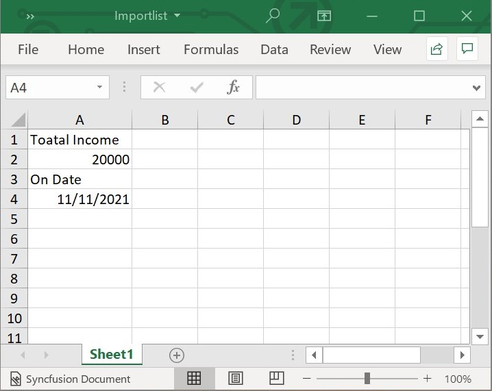
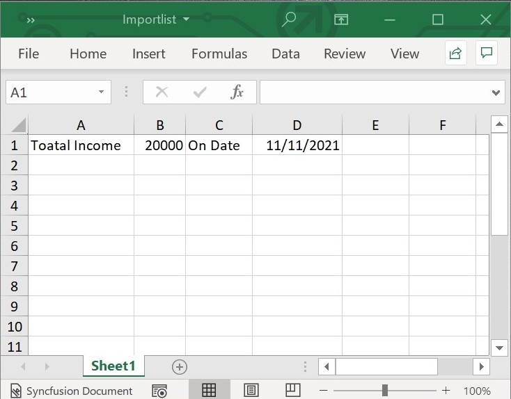

# Working with Excel Data

## Importing Data to Worksheets

Flutter XlsIO provides the ability to import data into a worksheet from collections, including `List<Object>` and `List<T>`. The available approaches are:

* [Import Data from List](#import-data-from-list)
* [Import Data from List<T>](#import-data-from-list-t)

N> Before you begin, complete the [Getting Started with Flutter XlsIO](https://help.syncfusion.com/document-processing/excel/excel-library/flutter/getting-started) steps, then import the package and required helpers in your Dart file:


import 'dart:convert'; // for base64.decode (image samples)
import 'dart:io'; // for File
import 'package:syncfusion_flutter_xlsio/xlsio.dart';


N> In production code, use `await workbook.save()` and wrap workbook usage in a `try/finally` block to guarantee `workbook.dispose()`. The samples below use `saveSync()` for brevity.

### Import Data from List

Use the `importList` method to import a list of data with different data types (for example, `String`, `int`, `double`, `num`, `bool`, and `DateTime`) into a worksheet.

The `importList` method accepts the following parameters:

* `list` – The `List<Object>` to import. Each element becomes a cell.
* `firstRow` – The 1-based row index where the import starts.
* `firstColumn` – The 1-based column index where the import starts.
* `isVertical` – When `true`, values are written top-to-bottom; when `false`, left-to-right.

The following code snippet shows how to import a list of data vertically into the worksheet using the `importList` method.



// Create a new Excel document.
final Workbook workbook = Workbook();

// Accessing the first sheet via index.
final Worksheet sheet = workbook.worksheets[0];

// Initialize the List<Object>.
final List<Object> list = [
  'Total Income',
  20000,
  'On Date',
  DateTime(2021, 11, 11)
];

// Starting row (1-based).
final int firstRow = 1;

// Starting column (1-based).
final int firstColumn = 1;

// Import the data vertically.
final bool isVertical = true;

// Import the list into the sheet.
sheet.importList(list, firstRow, firstColumn, isVertical);

sheet.autoFitColumn(1);

// Save and dispose the workbook.
final List<int> bytes = workbook.saveSync();
File('Importlist.xlsx').writeAsBytes(bytes);
workbook.dispose();



The following screenshot represents the Excel file generated by vertically importing data from the list into the Excel worksheet using Flutter XlsIO.

The following code snippet shows how to import a list of data horizontally into the worksheet using the `importList` method. This differs from the previous sample only in the `isVertical` value and the post-import `autoFitColumns` call.



// Create a new Excel document.
final Workbook workbook = Workbook();

// Accessing the first sheet via index.
final Worksheet sheet = workbook.worksheets[0];

// Initialize the List<Object>.
final List<Object> list = [
  'Total Income',
  20000,
  'On Date',
  DateTime(2021, 11, 11)
];

// Starting row (1-based).
final int firstRow = 1;

// Starting column (1-based).
final int firstColumn = 1;

// Import the data horizontally.
final bool isVertical = false;

// Import the list into the sheet.
sheet.importList(list, firstRow, firstColumn, isVertical);

sheet.getRangeByIndex(1, 1, 1, 4).autoFitColumns();

// Save and dispose the workbook.
final List<int> bytes = workbook.saveSync();
File('Importlist.xlsx').writeAsBytes(bytes);
workbook.dispose();



The following screenshot represents the Excel file generated by horizontally importing data from the list into the Excel worksheet using Flutter XlsIO.

### Import Data from List<T>

Flutter XlsIO allows you to import data directly from `List<T>` using the `importData` method and the `ExcelDataRow` class. The `importData` method takes the data rows, the 1-based starting row, the 1-based starting column, and an optional `bool` indicating whether the first row of each `ExcelDataRow` should be treated as a column header. Each `ExcelDataCell` has a `value` (the cell data) and an optional `columnHeader` (the text used for the header row when one is rendered).



// Create a new Excel document.
final Workbook workbook = Workbook();

// Accessing the first sheet via index.
final Worksheet sheet = workbook.worksheets[0];

// Create data rows for importing.
final List<ExcelDataRow> dataRows = _buildReportDataRows();

// Import the data rows into the worksheet.
sheet.importData(dataRows, 1, 1);

// Save and dispose the workbook.
final List<int> bytes = workbook.saveSync();
File('Importlist.xlsx').writeAsBytes(bytes);
workbook.dispose();



The following code snippet provides the supporting class for the code above.



// Create data rows from a List of Report objects.
List<ExcelDataRow> _buildReportDataRows() {
  List<ExcelDataRow> excelDataRows = <ExcelDataRow>[];
  final List<_Report> reports = _getSalesReports();

  excelDataRows = reports.map<ExcelDataRow>((_Report dataRow) {
    return ExcelDataRow(cells: <ExcelDataCell>[
      ExcelDataCell(columnHeader: 'Sales Person', value: dataRow.salesPerson),
      ExcelDataCell(
          columnHeader: 'Sales Jan to June', value: dataRow.salesJanJune),
      ExcelDataCell(
          columnHeader: 'Sales July to Dec', value: dataRow.salesJulyDec),
    ]);
  }).toList();

  return excelDataRows;
}

// Create a List of Report objects.
List<_Report> _getSalesReports() {
  final List<_Report> reports = <_Report>[];
  reports.add(_Report('Andy Bernard', 45000, 58000));
  reports.add(_Report('Jim Halpert', 34000, 65000));
  reports.add(_Report('Karen Fillippelli', 75000, 64000));
  reports.add(_Report('Phyllis Lapin', 56500, 33600));
  reports.add(_Report('Stanley Hudson', 46500, 52000));
  return reports;
}

// Custom Report class.
class _Report {
  _Report(this.salesPerson, this.salesJanJune, this.salesJulyDec);
  late String salesPerson;
  late int salesJanJune;
  late int salesJulyDec;
}



#### Import Data from List<T> with hyperlink and image

Flutter XlsIO allows you to import images, URLs, and email addresses as hyperlinks from data sources bound in `List<T>`. The `Hyperlink.add` method creates a hyperlink from a URL, display text, tooltip, and `HyperlinkType` (for example, `HyperlinkType.url`); the `Picture` class accepts the raw bytes of a PNG, JPEG, or BMP image.



// Create a new Excel document.
final Workbook workbook = Workbook();

// Accessing the first sheet via index.
final Worksheet sheet = workbook.worksheets[0];

// Create data rows for importing.
final List<ExcelDataRow> dataRows = _buildCustomersDataRows();

// Import the data rows into the worksheet.
sheet.importData(dataRows, 1, 1);

// Save and dispose the workbook.
final List<int> bytes = workbook.saveSync();
File('ImportDataHyperlinkAndImage.xlsx').writeAsBytes(bytes);
workbook.dispose();



The following code snippet provides the supporting class for the code above. The base64 string constants (`_man1jpg`, `_man2png`, …) are placeholders for sample image assets bundled with the sample; replace them with the bytes of your own images (or load them with `File('image.png').readAsBytesSync()`).



// Create data rows from a List of Customers objects.
List<ExcelDataRow> _buildCustomersDataRows() {
  List<ExcelDataRow> excelDataRows = <ExcelDataRow>[];
  final List<_Customers> reports = _getCustomersHyperlink();

  excelDataRows = reports.map<ExcelDataRow>((_Customers dataRow) {
    return ExcelDataRow(cells: <ExcelDataCell>[
      ExcelDataCell(columnHeader: 'Sales Person', value: dataRow.salesPerson),
      ExcelDataCell(
          columnHeader: 'Sales Jan to June', value: dataRow.salesJanJune),
      ExcelDataCell(
          columnHeader: 'Sales July to Dec', value: dataRow.salesJulyDec),
      ExcelDataCell(columnHeader: 'Change', value: dataRow.change),
      ExcelDataCell(columnHeader: 'Hyperlinks', value: dataRow.hyperlink),
      ExcelDataCell(columnHeader: 'Images', value: dataRow.image)
    ]);
  }).toList();

  return excelDataRows;
}

// Create a List of Customers objects.
List<_Customers> _getCustomersHyperlink() {
  final List<_Customers> reports = <_Customers>[];
  _Customers customer = _Customers('Andy Bernard', 45000, 58000, 29);
  final Hyperlink link = Hyperlink.add(
      'https://www.google.com', 'Hyperlink', 'Google', HyperlinkType.url);
  Picture pic = Picture(base64.decode(_man1jpg));
  pic.width = 200;
  pic.height = 200;
  customer.image = pic;
  customer.hyperlink = link;
  reports.add(customer);

  customer = _Customers('Jim Halpert', 34000, 65000, 91);
  pic = Picture(base64.decode(_man2png));
  pic.width = 200;
  pic.height = 200;
  customer.image = pic;
  customer.hyperlink = link;
  reports.add(customer);

  customer = _Customers('Karen Fillippelli', 75000, 64000, -15);
  pic = Picture(base64.decode(_man3jpg));
  pic.width = 200;
  pic.height = 200;
  customer.image = pic;
  customer.hyperlink = link;
  reports.add(customer);

  customer = _Customers('Phyllis Lapin', 56500, 33600, -40);
  pic = Picture(base64.decode(_man4png));
  pic.width = 200;
  pic.height = 200;
  customer.image = pic;
  customer.hyperlink = link;
  reports.add(customer);

  customer = _Customers('Stanley Hudson', 46500, 52000, 12);
  pic = Picture(base64.decode(_man5jpg));
  pic.width = 200;
  pic.height = 200;
  customer.image = pic;
  customer.hyperlink = link;
  reports.add(customer);

  return reports;
}

// Custom Customers class.
class _Customers {
  _Customers(
      this.salesPerson, this.salesJanJune, this.salesJulyDec, this.change);
  late String salesPerson;
  late int salesJanJune;
  late int salesJulyDec;
  late int change;
  Hyperlink? hyperlink;
  Picture? image;
}



#### Import Data from List<T> with hyperlink on image

Use the following code snippet to import data from `List<T>` with a hyperlink placed on the image itself (rather than on a separate cell). The supporting class is the same `_Customers` class used above.



// Create a new Excel document.
final Workbook workbook = Workbook();

// Accessing the first sheet via index.
final Worksheet sheet = workbook.worksheets[0];

// Create data rows for importing.
final List<ExcelDataRow> dataRows = _buildCustomersDataRowsIH();

// Import the data rows into the worksheet.
sheet.importData(dataRows, 1, 1);

// Save and dispose the workbook.
final List<int> bytes = workbook.saveSync();
File('ImportDataImageHyperlink.xlsx').writeAsBytes(bytes);
workbook.dispose();



The following code snippet provides the supporting class for the code above.



// Create data rows from a List of Customers objects.
List<ExcelDataRow> _buildCustomersDataRowsIH() {
  List<ExcelDataRow> excelDataRows = <ExcelDataRow>[];
  final List<_Customers> reports = _getCustomersImageHyperlink();

  excelDataRows = reports.map<ExcelDataRow>((_Customers dataRow) {
    return ExcelDataRow(cells: <ExcelDataCell>[
      ExcelDataCell(columnHeader: 'Sales Person', value: dataRow.salesPerson),
      ExcelDataCell(
          columnHeader: 'Sales Jan to June', value: dataRow.salesJanJune),
      ExcelDataCell(
          columnHeader: 'Sales July to Dec', value: dataRow.salesJulyDec),
      ExcelDataCell(columnHeader: 'Change', value: dataRow.change),
      ExcelDataCell(columnHeader: 'Hyperlink', value: dataRow.hyperlink),
      ExcelDataCell(columnHeader: 'Images Hyperlinks', value: dataRow.image)
    ]);
  }).toList();

  return excelDataRows;
}

// Create a List of Customers objects.
List<_Customers> _getCustomersImageHyperlink() {
  final List<_Customers> reports = <_Customers>[];

  final Hyperlink link = Hyperlink.add('https://www.syncfusion.com',
      'Hyperlink', 'Syncfusion', HyperlinkType.url);

  Picture pic = Picture(base64.decode(_man6png));
  pic.width = 200;
  pic.height = 200;
  pic.hyperlink = link;
  _Customers customer = _Customers('BernardShah', 45000, 58000, 29);
  customer.hyperlink = link;
  customer.image = pic;
  reports.add(customer);

  pic = Picture(base64.decode(_man7jpg));
  pic.width = 200;
  pic.height = 200;
  pic.hyperlink = link;
  customer = _Customers('Patricia McKenna', 34000, 65000, 91);
  customer.hyperlink = link;
  customer.image = pic;
  reports.add(customer);

  pic = Picture(base64.decode(_man8png));
  pic.width = 200;
  pic.height = 200;
  pic.hyperlink = link;
  customer = _Customers('Antonio Moreno Taquería', 75000, 64000, -15);
  customer.hyperlink = link;
  customer.image = pic;
  reports.add(customer);

  pic = Picture(base64.decode(_man9jpg));
  pic.width = 200;
  pic.height = 200;
  pic.hyperlink = link;
  customer = _Customers('Thomas Hardy', 56500, 33600, -40);
  customer.hyperlink = link;
  customer.image = pic;
  reports.add(customer);

  pic = Picture(base64.decode(_man10png));
  pic.width = 200;
  pic.height = 200;
  pic.hyperlink = link;
  customer = _Customers('Christina Berglund', 46500, 52000, 12);
  customer.hyperlink = link;
  customer.image = pic;
  reports.add(customer);

  return reports;
}

// Custom Customers class.
class _Customers {
  _Customers(
      this.salesPerson, this.salesJanJune, this.salesJulyDec, this.change);
  late String salesPerson;
  late int salesJanJune;
  late int salesJulyDec;
  late int change;
  Hyperlink? hyperlink;
  Picture? image;
}



## See also

* [Getting Started with Flutter XlsIO](https://help.syncfusion.com/document-processing/excel/excel-library/flutter/getting-started)
* [Working with Workbook](https://help.syncfusion.com/document-processing/excel/excel-library/flutter/working-with-workbook)
* [Working with Images](https://help.syncfusion.com/document-processing/excel/excel-library/flutter/working-with-image)
* [Working with Cells](https://help.syncfusion.com/document-processing/excel/excel-library/flutter/working-with-cells)